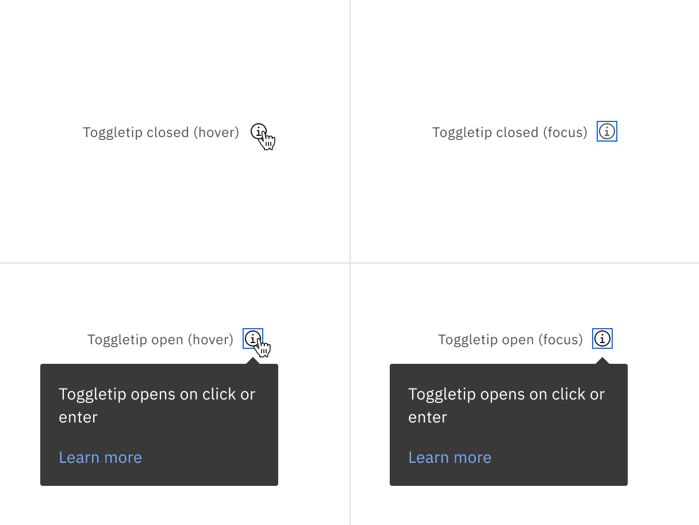

<PageDescription>

The following page documents visual specifications such as color, typography,
structure, and size.

</PageDescription>

<AnchorLinks>

<AnchorLink>Color</AnchorLink> <AnchorLink>Typography</AnchorLink>
<AnchorLink>Structure</AnchorLink> <AnchorLink>Feedback</AnchorLink>

</AnchorLinks>

## Color

A toggletip has two states: **open** and **closed**. The open state occurs when
a user clicks on or enter the trigger button, while the closed state means the
toggletip is hidden.

| Element        | Property         | Color token           |
| -------------- | ---------------- | --------------------- |
| Trigger button | svg              | `$icon-secondary`     |
| Container      | background-color | `$background-inverse` |
| Text           | color            | `$text-inverse`       |

### Interactive state color

| State         | Element        | Property | Color token       |
| ------------- | -------------- | -------- | ----------------- |
| Closed: Hover | Trigger button | svg      | `$icon-primary`   |
| Closed: Focus | Trigger button | svg      | `$icon-secondary` |
|               | Border         | border   | `$focus`          |
| Open: Hover   | Trigger button | svg      | `$icon-primary`   |
|               | Border         | border   | `$focus`          |
| Open: Focus   | Border         | border   | `$focus`          |

<Row>
<Column colLg={8}>

</Column>
</Row>

<Caption>
  Toggletip in the closed and open states with mouse and keyboard interactions
</Caption>

## Typography

| Element   | Font-size (px/rem) | Font-weight   | Type token |
| --------- | ------------------ | ------------- | ---------- |
| Body text | 14px / 0.875rem    | Regular / 400 | `$body-01` |

## Structure

All toggletips have a varying height based on the amount of content they
contain.

| Element      | Property      | px / rem | Spacing token |
| ------------ | ------------- | -------- | ------------- |
| Container    | max-width     | 288 / 18 | —             |
|              | padding       | 16 / 1   | `$spacing-05` |
|              | margin-top    | 8 / 0.5  | `$spacing-03` |
| Trigger icon | height, width | 16 / 1   | —             |
|              | margin-left   | 8 / 0.5  | `$spacing-03` |

<Caption>Structure and spacing measurements for toggletip | px / rem</Caption>

### Placement

Toggletip directions by default are set to auto. Upon opening, toggletips can
detect the edges of the browser to properly be placed in view so the container
does not get cutoff. Toggletips can instead use specific directions and may be
positioned **top**, **right**, **bottom**, or **left** to the trigger item.
Toggletips should be placed at least 16px / 1rem off of the bottom of the page
and not bleed off page or behind other content. On mobile, toggletips can only
appear below the toggletip UI trigger.

<Caption>Placement examples for toggletip</Caption>

## Feedback

Help us improve this component by providing feedback, asking questions, and
leaving any other comments on
[GitHub](https://github.com/carbon-design-system/carbon-website/issues/new?assignees=&labels=feedback&template=feedback.md).
