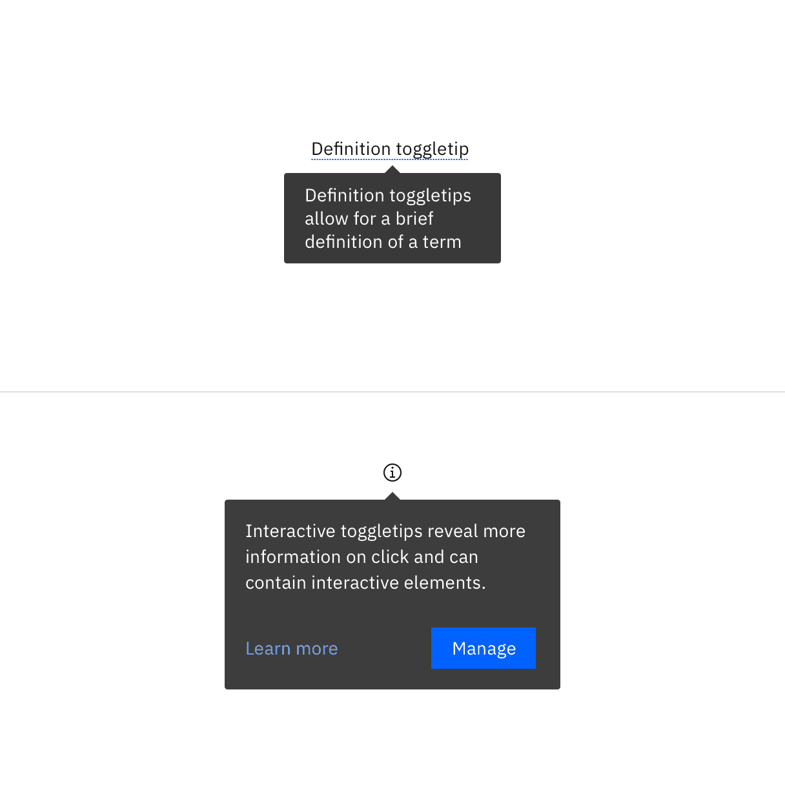
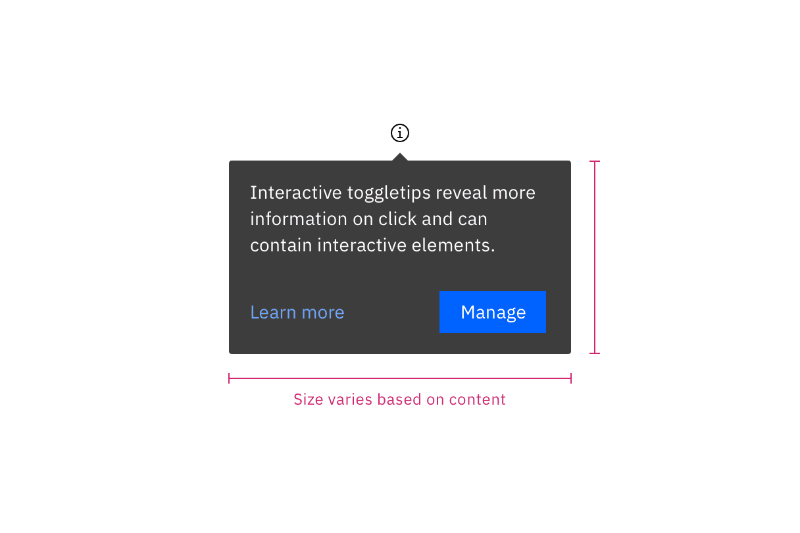
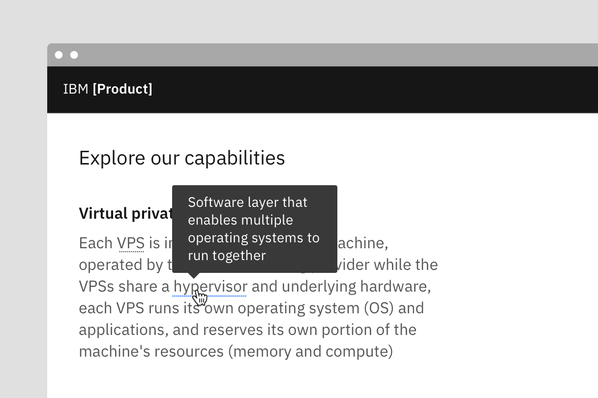
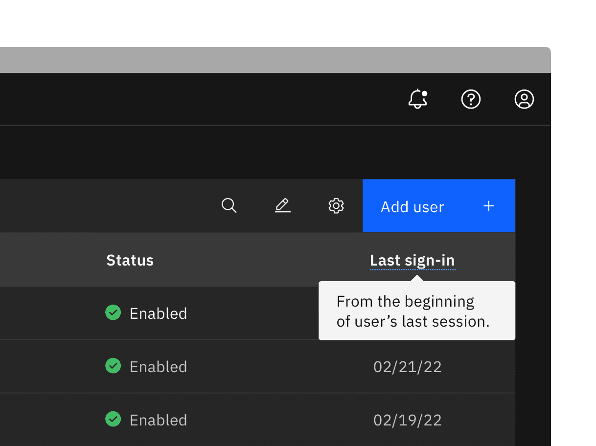
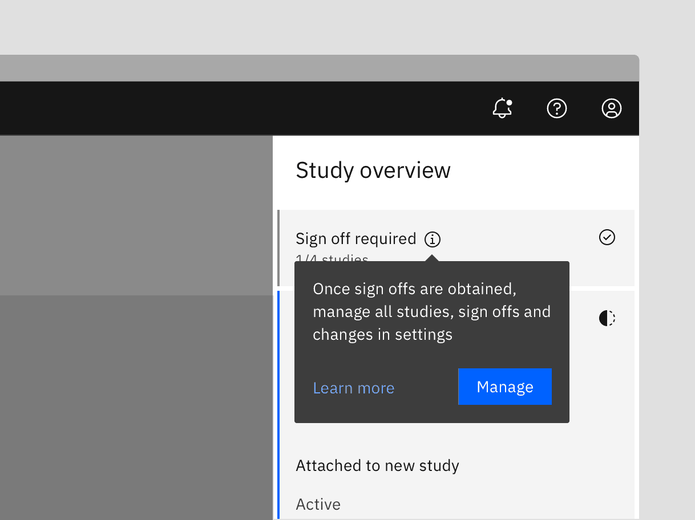

<PageDescription>

Toggletips use the disclosure pattern to toggle the visibility of a popover.
They display additional, hidden information upon the click of a UI trigger
element.

</PageDescription>

<AnchorLinks>

<AnchorLink>Overview</AnchorLink>
<AnchorLink>Live demo</AnchorLink>
<AnchorLink>Formatting</AnchorLink>
<AnchorLink>Content</AnchorLink>
<AnchorLink>Universal behaviors</AnchorLink>
<AnchorLink>Definition toggletip</AnchorLink>
<AnchorLink>Interactive toggletip</AnchorLink>
<AnchorLink>Related</AnchorLink>
<AnchorLink>References</AnchorLink>
<AnchorLink>Feedback</AnchorLink>

</AnchorLinks>

## Overview

Toggletips reveal supplemental content when a user clicks a button or another UI
element and remains actively open until a user dismiss it. A toggletip is
comprised of a UI trigger and the
[popover component](http://carbondesignsystem.com/components/popover/usage/).
Use the disclosure pattern to design supplemental content within the component.
Toggletips can include a wide variety of information and interactive elements as
long
as[accessibility requirements](https://www.ibm.com/able/requirements/requirements/)
are maintained including focus order and ensure all functionality is operable
through a keyboard interface.

<Row>
<Column
colMd={6} colLg={6}
caption="Example of toggletip used as help menu">

</Column>

<Column colMd={6} colLg={6}
caption="Example of toggletip used within a data table">

</Column>
</Row>

#### Toggletips verses Tooltips

Toggletips and tooltips are similar visually and both contain a popover and
interactive trigger element. The two components differ in the way they are
invoked and dismissed and if the user must interact with the contents. A tooltip
is exposed on `Hover` or `Focus` when you need to expose brief, supplemental
information that is not interactive. A toggletip is used on `Click` and `Enter`
when you need to expose information that a user needs to interact with.

### When to use

- Use when defining a term or inline item
- Use for quick, in context editing
- Use for filter panels that overlay content

<Row>
<Column colLg={8}>

</Column>
</Row>

### When to not use

Don't use to present critical information or request required input needed to
complete a workflow. Use the
[modal component](https://carbondesignsystem.com/components/modal/usage/)
instead.

### Variants

Toggletips can be used in many different ways and are not limited to the
variants listed below.

| Variant                                         | Purpose                                                                                                                                                          |
| ----------------------------------------------- | ---------------------------------------------------------------------------------------------------------------------------------------------------------------- |
| [Definition toggletip](#definition-toggletip)   | The definition toggletip provides additional help or defines an item or term. It may be used on the label of a UI element, or on a word embedded in a paragraph. |
| [Interactive toggletip](#interactive-toggletip) | Interactive toggletip allows for interactive elements within the toggletip such as checkboxes, radio buttons, buttons, and links.                                |

<Row>
<Column colLg={8}>

</Column>
</Row>

## Live demo

## Formatting

### Anatomy

<Row>
<Column colLg={8}>

</Column>
</Row>

1. **UI trigger button:** Usually a button but as long as trigger is
   interactive, it can visually change its shape and size depending on the use
   case.
2. **Tip:** An indicator that is added to a popover container to help show the
   relationship between the popover and where it was triggered from. Can utilize
   no tip, caret tip, or tab tip types.
3. **Content area:** Varies based on use case and follows disclosure guidelines.
4. **Popover container:** Area that contains text and interactive elements.

### Sizing

The width and height of a popover container can vary depending on the amount of
content placed within it. We recommend to not exceed a popover width size of
four columns. Refer to the popover component for more specifications.

<Row>
<Column colLg={8}>

</Column>
</Row>

### Placement

Toggletips can be used on various part of the UI including, but not limited to,
headers, data tables, side panels, modals, and read only cards. When active, the
toggletip popover may be positioned **top, bottom, left,** or **right** to the
UI trigger.

<Row>
<Column colLg={8}>

</Column>
</Row>

For toggletips that are inline with other text, like a definition toggletip, do
not obstruct words to the left and right of the trigger word. When the toggletip
is active, ensure popover overlays other content and is not cut off by other
surrounding components or bleeds off the page where some content is not visible.

<Row>
<Column colLg={8}>

</Column>
</Row>

<Caption>
  Definition toggletips should display above or below interactive element
</Caption>

Placement of a popover in relation to the trigger depends on the type of popover
used. Visit the popover component for specific guidelines for no tip, caret tip,
and tab tip types.

## Content

### Main elements

Heading, body, and footer content can vary based on your use case. To see
examples of content used within toggletips, visit the disclosure pattern.

### Overflow content

Since the toggletip uses the flexible popover component and disclosure pattern,
scrolling is usually not needed. If scrolling is needed, in a dropdown like
situation for instance, then the body section should scroll vertically with the
header and footer remaining fixed in place if those elements are present. Do not
scroll horizontally or let content bleed off the page.

<Row>
<Column colLg={8}>

</Column>
</Row>

<Caption>Example of when to scroll within a toggletip</Caption>

### Further guidance

For further content guidance, see Carbon's
[content guidelines](<[https://www.carbondesignsystem.com/guidelines/content/general](https://www.carbondesignsystem.com/guidelines/content/general)>).

## Universal behaviors

### States

The toggletip component has two states—active and inactive. By default, the
toggletip is hidden and inactive. Toggletips are displayed on `Click` and
`Enter`.

### Interactions

#### Mouse

Toggletips are triggered when a user clicks the interactive trigger and is
dismissed by clicking anywhere outside the toggletip's active popover.

#### Keyboard

Users can trigger a toggletip by pressing `Enter` or `Space` while the trigger
element has focus. Users can dismiss a toggletip by pressing `Escape`. For
additional keyboard interactions, see the accessibility tab.

#### Screen readers

VoiceOver: Users can trigger a toggletip by pressing `Enter` or `Space` while
the trigger element has focus.

JAWS: Users can trigger a toggletip by pressing `Enter` or `Space` while the
trigger element has focus.

NVDA: Users can trigger a toggletip by pressing `Enter` or `Space` while the
trigger element has focus.

## Definition toggletip

The definition toggletip provides inline additional help or defines a term. It
may be used on the label of a UI element, on a word embedded in a paragraph, or
in compact spaces such as data tables where icons clutter the UI. You can use
definition tooltips on headers, body copy, or labels.

### Best practices

- Should contain brief, read-only text
- Use on proper nouns, technical terms, or acronyms with two letters or more
- Do not use a definition tooltip on words with fewer than two letters

<Row>
<Column colLg={8}>

</Column>
</Row>

<Caption>Example of a defintion toggletip</Caption>

## Interactive toggletip

Interactive tooltips may contain rich text and other interactive elements like
buttons or links and must remain actively open until a user dismisses the
toggletip.

### Best practices

- Maintain
  [accessibility requirements](https://www.ibm.com/able/requirements/requirements/)
  including focus order and ensure all functionality is operable through a
  keyboard interface.
- Follow disclosure patterns when designing content within a toggletip

<Row>
<Column colLg={8}>

</Column>
</Row>

<Caption>Example of an interactive toggletip</Caption>

## Related

#### Popover

Popovers are used as a base layer in some of our components like tooltips,
overflow menus, and dropdown menus. For further guidance, see Carbon’s popover
component.

#### Disclosure

Disclosures use popovers as a base layer. Disclosures are comprised of a popover
container, text, and interactive elements. Interactive elements are kept in the
tab order of the page. Further guidance on the disclosure pattern coming soon.

#### Tooltip

[Tooltips](https://www.carbondesignsystem.com/components/tooltip/usage/) display
additional information upon hover or focus. The information included should be
contextual, helpful, and nonessential while providing that extra ability to
communicate and give clarity to a user.

## Feedback

Help us improve this component by providing feedback, asking questions, and
leaving any other comments on
[GitHub](https://github.com/carbon-design-system/carbon-website/issues/new?assignees=&labels=feedback&template=feedback.md).
