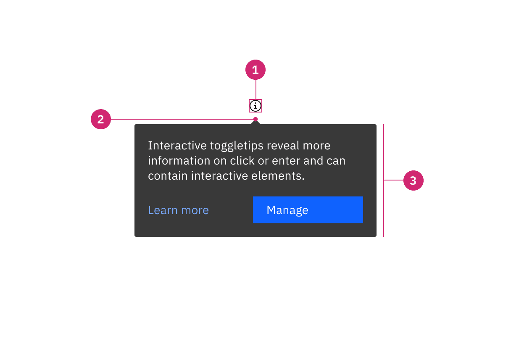
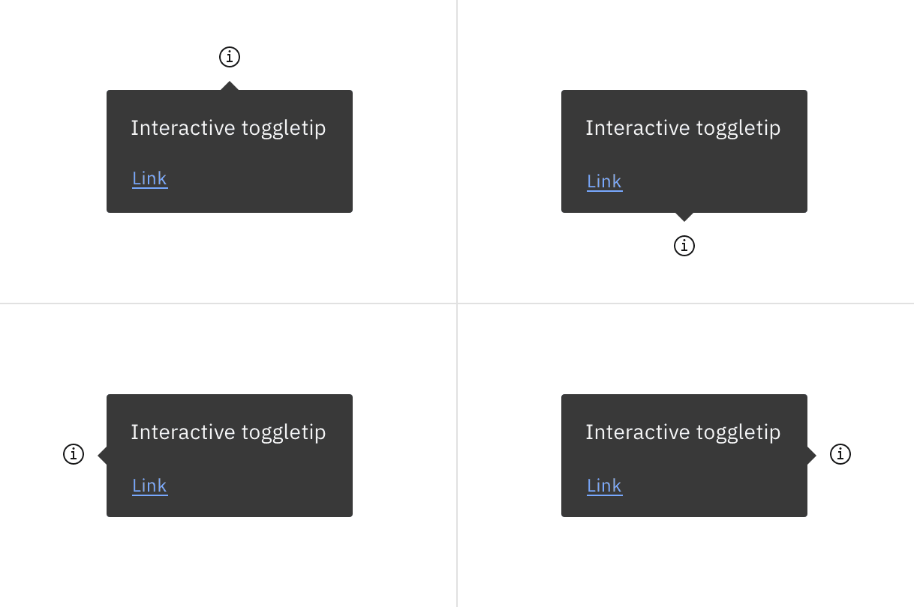

import A11yStatus from 'components/A11yStatus';
import { Toggletip } from '@carbon/react';

<PageDescription>

Toggletips display and hide additional information upon the click of a UI
trigger element. Toggletips can contain interactive elements.

</PageDescription>

<AnchorLinks>

<AnchorLink>Live demo</AnchorLink>
<AnchorLink>Overview</AnchorLink>
<AnchorLink>Formatting</AnchorLink>
<AnchorLink>Content</AnchorLink>
<AnchorLink>Behaviors</AnchorLink>
<AnchorLink>Related</AnchorLink>
<AnchorLink>References</AnchorLink>
<AnchorLink>Feedback</AnchorLink>

</AnchorLinks>

## Live demo

<StorybookDemo
  themeSelector
  url="https://react.carbondesignsystem.com"
  variants={[
    {
      label: 'Default',
      variant: 'components-toggletip--default',
    },
  ]}
/>

<A11yStatus layout="cards" components="Toggletip" />

## Overview

Toggletips reveal supplemental content when a user clicks a button and remains
actively open until a user dismisses it. A toggletip is comprised of a UI
trigger and toggletip content (based on the popover component). Toggletips can
include a wide variety of information and interactive elements as long as
accessibility requirements are maintained, including focus order and ensuring
all functionality is operable through a keyboard interface.

<Row>
<Column colLg={8}>

</Column>
</Row>

#### Toggletips versus tooltips

Tooltips and toggletips look similar and both have interactive triggers, but
they differ in how they are activated and what they can contain. A tooltip is
exposed on hover or focus when you need to disclose brief, supplemental
information that is not interactive. A toggletip is used on click or enter when
you must expose interactive elements, such as a button, that a user needs to
interact with.

### When to use

- Use when an interactive element must be placed within the open toggletip
- Use for quick, in-context editing
- Use for filter panels that overlay content

### When to not use

Don't use to present critical information or request required input needed to
complete a workflow. Use the [modal component](/components/modal/usage/)
instead.

## Formatting

### Anatomy

<Row>
<Column colLg={8}>

</Column>
</Row>

1. **UI trigger:** UI elements that triggers a toggletip on click or enter
2. **Caret tip:** Closely associates the container of the content area.
3. **Container** Contains text and interactive elements

### Sizing

The toggletip container has a maximum width of 288px, and its height varies
depending on the content inside. We recommend keeping the width within four
columns. See details in [Style](/components/toggletip/style/#structure) tab.

### Placement

Toggletips can be used on various part of the UI including, but not limited to,
headers, data tables, side panels, modals, and read only cards. When active, the
toggletip popover may be positioned **top, bottom, left,** or **right** to the
UI trigger.

<Row>
<Column colLg={8}>

</Column>
</Row>

Placement of a popover in relation to the trigger depends on the type of popover
used.

## Content

### Main elements

Heading, body, and footer content can vary based on your use case. To see
examples of content used within toggletips, visit the
[disclosure pattern](/patterns/disclosures-pattern/).

### Overflow content

Since the toggletip uses the flexible popover component and disclosure pattern,
scrolling is usually not needed. If scrolling is needed, in a dropdown like
situation for instance, then the body section should scroll vertically with the
header and footer remaining fixed in place if those elements are present. Do not
scroll horizontally or let content bleed off the page.

<Row>
<Column colLg={8}>

</Column>
</Row>

<Caption>
  Example of when to scroll within a toggletip. This example is a pattern and is
  currently not offered as a component.
</Caption>

### Further guidance

For further content guidance, see Carbon's
[content guidelines](/guidelines/content/general).

## Behaviors

### States

The toggletip component has two states: open (click or enter) and closed. By
default, the toggletip is hidden and inactive. See details in
[Style](/components/toggletip/style/#color) tab.

### Interactions

#### Mouse

Toggletips are triggered on click and are dismissed by clicking again on the
trigger or anywhere outside the active popover or UI trigger.

#### Keyboard

Toggletips are triggered by pressing `Enter` or `Space` while the trigger
element has focus. Users can dismiss a toggletip by pressing `Escape`. For
additional keyboard interactions, see the accessibility tab.

## Related

#### Popover

[Popovers](/components/popover/usage/) are used as a base layer in some of our
components like tooltips, overflow menus, and dropdown menus. For further
guidance, see Carbon’s popover component.

#### Disclosure

[Disclosures](/patterns/disclosures-pattern/) use popovers as a base layer.
Disclosures are comprised of a popover container, text, and interactive
elements. Interactive elements are kept in the tab order of the page. Further
guidance on the disclosure pattern coming soon.

#### Tooltip

[Tooltips](/components/tooltip/usage/) display additional information upon hover
or focus. The information included should be contextual, helpful, and
nonessential while providing that extra ability to communicate and give clarity
to a user.

## Feedback

Help us improve this component by providing feedback, asking questions, and
leaving any other comments on
[GitHub](https://github.com/carbon-design-system/carbon-website/issues/new?assignees=&labels=feedback&template=feedback.md).
