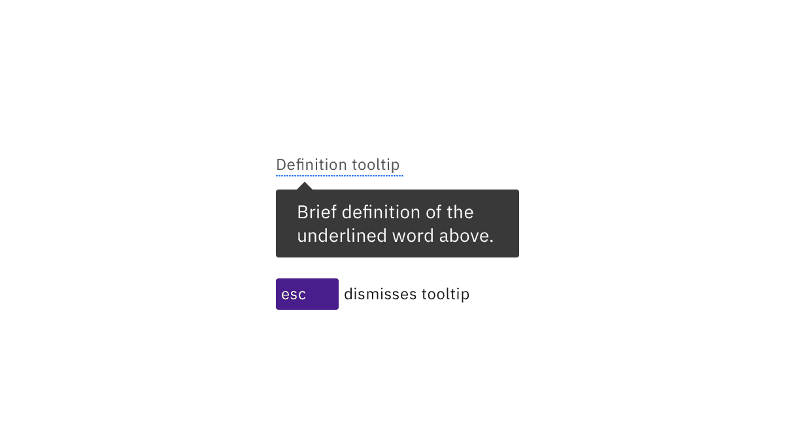
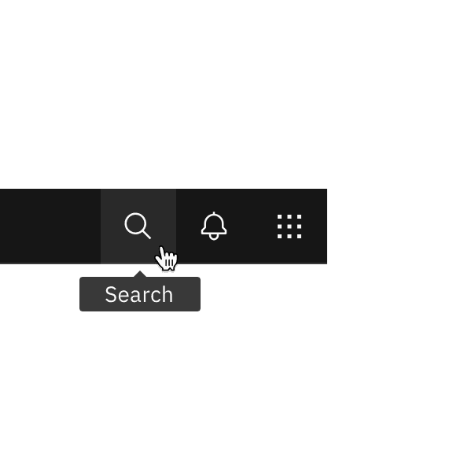
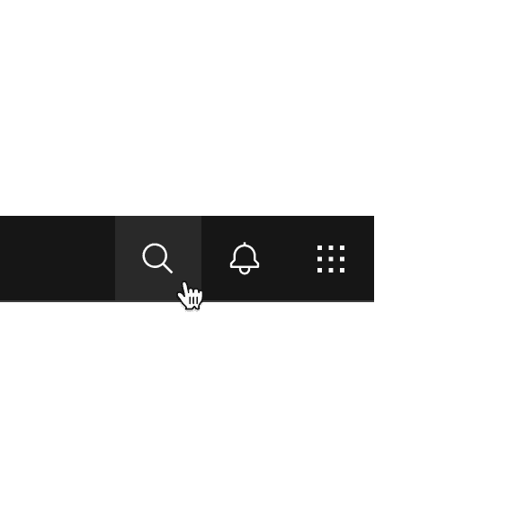

import A11yStatus from 'components/A11yStatus';

<PageDescription>

Carbon’s tooltips are accessible on hover and focus. Designers only need to
annotate the tooltip’s text content.

</PageDescription>

<AnchorLinks>

<AnchorLink>What Carbon provides</AnchorLink>
<AnchorLink>Design recommendations</AnchorLink>
<AnchorLink>Development considerations</AnchorLink>

</AnchorLinks>

<A11yStatus layout="table" components="Tooltip" />

## What Carbon provides

No annotations are needed for keyboard operation, since Carbon bakes in the
interaction.

### Keyboard interactions

The primary use of tooltips is to display the text labels of icon-only buttons.
Since each button is in the page’s tab order, the tooltip appears automatically
when the button receives focus. Tooltips disappear when the user moves focus
away from the button or by pressing `Esc`. The tooltips contain only text and
are not interactive, so they do not have any other keyboard operations.

The definition tooltip provides information about a term or text phrase. The
text that serves as the trigger has a dotted underline. When the trigger
receives focus, the definition tooltip is displayed. Like the button tooltip,
the definition can be dismissed by pressing `Esc` or navigating away from the
trigger. Icon-only buttons retain their regular interaction. Icon-only buttons
maintain their normal interaction and can be activated by clicking or pressing
`Enter` or `Space`. A definition tooltip trigger only exists to take focus or
hover and is otherwise not interactive.

<Row>
<Column colLg={8}>

<Caption>

Tooltips appear when the trigger receives focus and disappear when tabbing away
from the trigger.

</Caption>

</Column>
</Row>

<Row>
<Column colLg={8}>

<Caption>
  Both definition and icon-only button tooltips can be dismissed by pressing
  Esc.
</Caption>

</Column>
</Row>

## Design recommendations

### Annotate the text for the tooltip

If designers do not specify the text, developers are less likely to implement
tooltips. Every icon-only button needs a tooltip, except for icons with clearly
established names or functions (such as Bold and Italics). Designers can provide
the text by using a tooltip in their designs or simply annotating the
[icon-only button](https://carbondesignsystem.com/components/button/accessibility#labeling).
For definition tooltips, see the
[usage guidance](https://carbondesignsystem.com/components/tooltip/usage) for
information on the length and styling of tooltip content.

<DoDontRow>
  <DoDont type="do" caption=" Do specify the text that will appear in the tooltip.">

  </DoDont>

  <DoDont type="dont" caption="Do not use icon-only buttons with no tooltip or name annotated.">

  </DoDont>
</DoDontRow>

## Development considerations

Keep these considerations in mind if you are modifying Carbon or creating a
custom component.

- The span containing the tooltip has a role of `tooltip` with
  `aria-hidden="true"`.
- The trigger uses `aria-labelledby` to announce the tooltip text.
- See the tooltip pattern in the
  [ARIA authoring practices](https://w3c.github.io/aria-practices/#tooltip) for
  more considerations.
