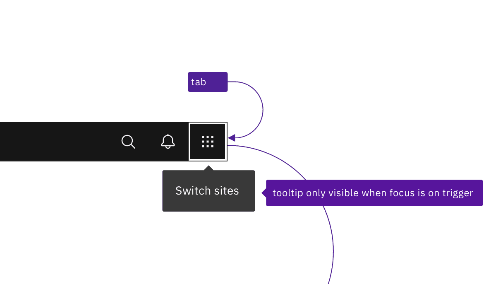
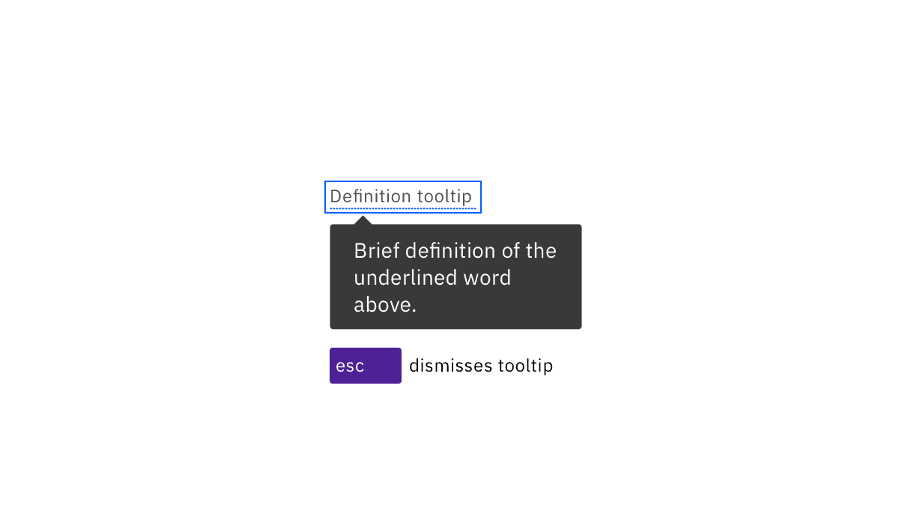

<PageDescription>

Carbon’s tooltips appear accessibly on both hover and focus. Designers need only annotate the tooltip’s text content.

</PageDescription>

<AnchorLinks>

  <AnchorLink>What Carbon provides</AnchorLink>
  <AnchorLink>Design recommendations</AnchorLink>
  <AnchorLink>Development considerations</AnchorLink>

</AnchorLinks>

## What Carbon provides

No annotations are needed for keyboard operation, since Carbon bakes in the interaction.

### Keyboard interactions

The primary use of tooltips is to display the text labels of icon-only buttons. Since each button is in the page’s tab order, the tooltip appears automatically when the button receives focus. Tooltips disappear when the user moves focus away from the button. The tips can also be dismissed by pressing `Esc`. The tooltips themselves only contain text and are not interactive, so do not have any other keyboard operations.

The definition tooltip provides information about a term or text phrase. The text that serves as the trigger has a dotted underline. When the trigger receives focus, the definition tooltip is displayed. Like the button tooltip, the definition can be dismissed by pressing Esc or by navigating away from the trigger.

Note: icon-only buttons retain their regular interaction. (They can be activated by pointer click or by pressing Enter or Space.)  A definition tooltip is unusual in that its trigger only exists to take focus or hover, and is not otherwise interactive (it can’t be clicked or acted upon).

<Row>
<Column colLg={8}>

<Caption>
  Tooltips appear when the trigger receives focus and disappear when tabbing away from the trigger.
</Caption>

</Column>
</Row>

<Row>
<Column colLg={8}>

<Caption>
  Both definition and icon-button tooltips can be dismissed by pressing Esc.
</Caption>

</Column>
</Row>

## Design recommendations

### Annotate the text for the tooltip

Except for icon buttons with clearly pre-established names or functions (such as Bold and Italics), every tooltip should be annotated by the designer so the developer knows what text to use. See [Usage](https://carbondesignsystem.com/components/tooltip/usage) for information on the length and styling of tooltip content, whether for icon-buttons or for definitions.

<Row>
<Column colLg={8}>

<Caption>
  Specify the text that will appear in the tooltip.
</Caption>

</Column>
</Row>

## Development considerations

Keep these considerations in mind if you are modifying Carbon or creating a
custom component.

- The span containing the tooltip has a role of `tooltip` with `aria-hidden="true"`.
- the trigger uses `aria-labelledby` to announce the tooltip text.
- See the tooltip pattern in the [ARIA authoring practices](https://w3c.github.io/aria-practices/#tooltip) for more considerations.