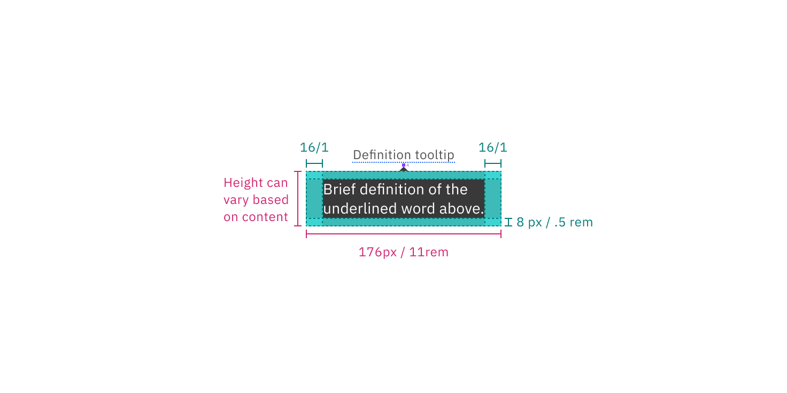

## Color

### Standard tooltip

| Element        | Property         | Color token           |
| -------------- | ---------------- | --------------------- |
| Label          | text color       | `$text-secondary`     |
| Trigger button | svg              | `$icon-secondary`     |
| Container      | background-color | `$background-inverse` |
| Text           | color            | `$text-inverse`       |

#### Interactive states

| State  | Element | Property | Color token     |
| ------ | ------- | -------- | --------------- |
| Hover  | trigger | svg      | `$icon-primary` |
| Active | trigger | svg      | `$icon-primary` |
| Focus  | trigger | border   | `$focus`        |

<Row>
<Column colLg={8}>

</Column>
</Row>

<Caption>
  Example of closed (top), hover (middle), and focus (bottom) states for a
  standard tooltip
</Caption>

### Icon button tooltip

| Element   | Property         | Color token           |
| --------- | ---------------- | --------------------- |
| Container | background-color | `$background-inverse` |
| Text      | color            | `$text-inverse`       |

#### Interactive states

Icon button tooltip states rely on what kind of button is being used. Refer to
button styles for specific hover and focus states.

<Row>
<Column colLg={8}>

</Column>
</Row>

<Caption>
  Example of closed (top), hover (middle), and focus (bottom) states for an icon
  button tooltip
</Caption>

### Definition toggletip

| element   | property         | color token           |
| --------- | ---------------- | --------------------- |
| Label     | text color       | `$text-secondary`     |
| Trigger   | border           | `$border-strong`      |
| Container | background-color | `$background-inverse` |
| Text      | color            | `$text-inverse`       |

#### Interactive states

| State  | Element          | Property | Color token           |
| ------ | ---------------- | -------- | --------------------- |
| Hover  | trigger          | border   | `$border-interactive` |
| Active | trigger          | border   | `$border-interactive` |
| Focus  | label and border | border   | `$focus`              |

<Row>
<Column colLg={8}>

</Column>
</Row>

<Caption>
  Example of closed (top-left), hover (top-right), active (bottom-left) and
  focus (bottom-right) states for definition button tooltip
</Caption>

## Typography

Tooltip labels and text should be set in sentence case.

| Element   | Font-size (px/rem) | Font-weight   | Type token         |
| --------- | ------------------ | ------------- | ------------------ |
| Label     | 12 / 0.75          | Regular / 400 | `$label-01`        |
| Body text | 14 / 0.875         | Regular / 400 | `$body-compact-01` |

## Structure

All tooltip types have a varying height based on the amount of content they
contain.

### Standard tooltip

| Element      | Property      | px / rem | Spacing token |
| ------------ | ------------- | -------- | ------------- |
| Container    | max-width     | 288 / 18 | –             |
|              | padding       | 16 / 1   | `$spacing-05` |
|              | margin-top    | 8 / 0.5  | `$spacing-03` |
| Trigger icon | height, width | 16 / 1   | –             |
|              | margin-left   | 8 / 0.5  | `$spacing-03` |

<Caption>
  Structure and spacing measurements for a standard tooltip | px / rem
</Caption>

### Icon button tooltip

| Class     | Property                    | px / rem  | Spacing token |
| --------- | --------------------------- | --------- | ------------- |
| Container | max-width                   | 208 / 13  | –             |
|           | padding-left, padding-right | 16 / 1    | `$spacing-05` |
|           | padding-top, padding-bottom | 2 / 0.125 | `$spacing-01` |
| Caret     | margin-top                  | 4 / 0.25  | `$spacing-02` |

<Caption>
  Structure and spacing measurements for an icon button tooltip | px / rem
</Caption>

### Definition tooltip

| Element   | Property                    | px / rem | Spacing token |
| --------- | --------------------------- | -------- | ------------- |
| Container | max-width                   | 176 / 11 | —             |
|           | padding-top, padding-bottom | 8 / .5   | `$spacing-04` |
|           | padding-left, padding-right | 8 / .5   | `$spacing-04` |
|           | margin-top                  | 4 / 0.25 | `$spacing-02` |
| Trigger   | border-bottom               | 1 px     | —             |

<Caption>
  Structure and spacing measurements for definition tooltip | px / rem
</Caption>

### Placement

Tooltip directions by default are set to auto. Upon opening, tooltips can detect
the edges of the browser to properly be placed in view so the container does not
get cutoff. Tooltips can instead use specific directions and may be
positioned **top**, **right**, **bottom**, or **left** to the trigger item.
Tooltips should be placed at least 16px / 1rem off of the bottom of the page and
not bleed off page or behind other content. On mobile, tooltips can only appear
below the tooltip icon.

<Caption>Placement examples for a tooltip</Caption>
