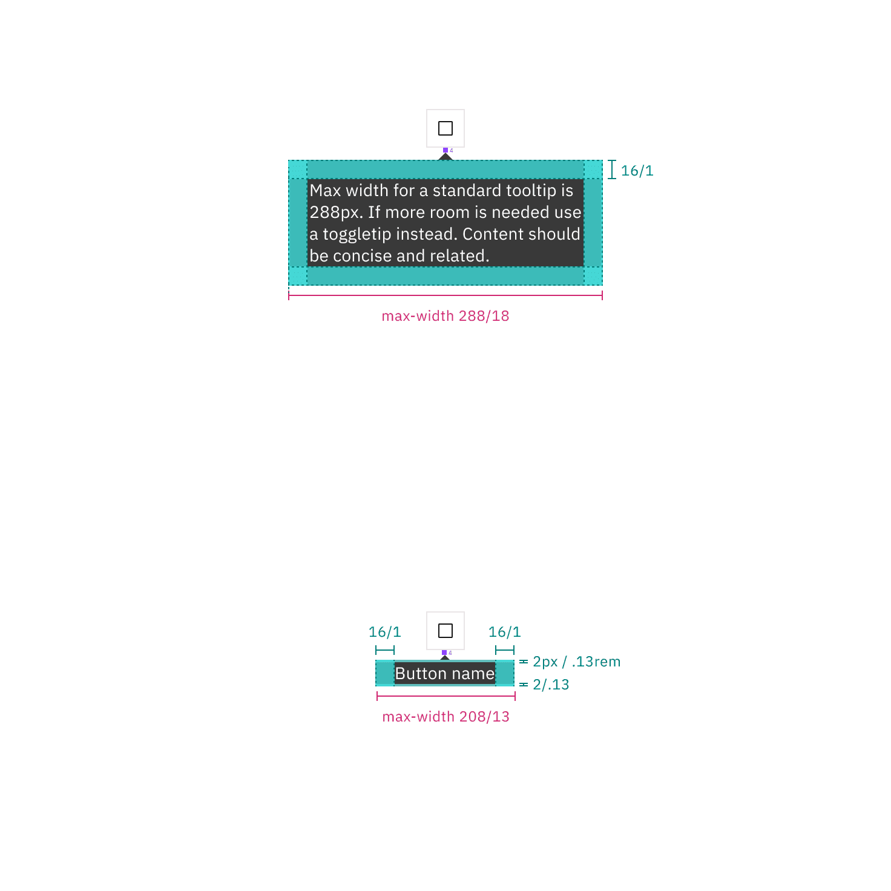

<PageDescription>

The following page documents visual specifications such as color, typography,
structure, and size.

</PageDescription>

<AnchorLinks>

<AnchorLink>Color</AnchorLink>
<AnchorLink>Typography</AnchorLink>
<AnchorLink>Structure</AnchorLink>
<AnchorLink>Feedback</AnchorLink>

</AnchorLinks>

## Color

### Icon button tooltip color

| Element   | Property         | Color token           |
| --------- | ---------------- | --------------------- |
| Container | background-color | `$background-inverse` |
| Text      | text-color       | `$text-inverse`       |

#### Icon button tooltip interactive states

Icon button tooltip states rely on what kind of button is being used. Refer to
button styles for specific hover and focus states.

<Row>
<Column colLg={8}>

</Column>
</Row>

<Caption>
  Example of closed (top), hover (middle), and focus (bottom) states for an icon
  button tooltip
</Caption>

### Definition tooltip color

| Element   | Property         | Color token           |
| --------- | ---------------- | --------------------- |
| Label     | text-color       | `$text-secondary`     |
| Trigger   | border           | `$border-strong`      |
| Container | background-color | `$background-inverse` |
| Text      | text-color       | `$text-inverse`       |

#### Definition tooltip interactive states

 

| State  | Element          | Property | Color token           |
| ------ | ---------------- | -------- | --------------------- |
| Hover  | trigger          | border   | `$border-interactive` |
| Active | trigger          | border   | `$border-interactive` |
| Focus  | label and border | border   | `$focus`              |

<Row>
<Column colLg={8}>

</Column>
</Row>

<Caption>
  Example of closed (top-left), hover (top-right), active (bottom-left) and
  focus (bottom-right) states for definition tooltip
</Caption>

## Typography

Tooltip labels and text should be set in sentence case.

| Element   | Font size (px/rem) | Font weight   | Type token  |
| --------- | ------------------ | ------------- | ----------- |
| Label     | 12 / 0.75          | Regular / 400 | `$label-01` |
| Body text | 14 / 0.875         | Regular / 400 | `$body-01`  |

## Structure

All tooltip types have a varying height based on the amount of content they
contain.

### Icon button tooltip structure

| Class     | Property                    | px / rem  | Spacing token |
| --------- | --------------------------- | --------- | ------------- |
| Container | max-width                   | 208 / 13  | –             |
|           | padding-left, padding-right | 16 / 1    | `$spacing-05` |
|           | padding-top, padding-bottom | 2 / 0.125 | `$spacing-01` |
| Caret     | margin-top                  | 4 / 0.25  | `$spacing-02` |

<Caption>
  Structure and spacing measurements for an icon button tooltip | px / rem
</Caption>

### Definition tooltip structure

| Element   | Property                    | px / rem | Spacing token |
| --------- | --------------------------- | -------- | ------------- |
| Container | max-width                   | 176 / 11 | —             |
|           | padding-top, padding-bottom | 8 / .5   | `$spacing-04` |
|           | padding-left, padding-right | 8 / .5   | `$spacing-04` |
|           | margin-top                  | 4 / 0.25 | `$spacing-02` |
| Trigger   | border-bottom               | 1 px     | —             |

<Caption>
  Structure and spacing measurements for definition tooltip | px / rem
</Caption>

### Default placement

Tooltip directions, by default, are set to auto. Upon opening, tooltips can
detect the edges of the browser to be placed in view so the container does not
get cutoff. Tooltips can instead use specific directions and may be
positioned **top**, **right**, **bottom**, or **left** of the trigger item.
Tooltips should be placed at least 16px / 1rem off of the bottom of the page and
not bleed off page or behind other content. On mobile, tooltips can only appear
below the tooltip icon.

<Caption>Placement examples for a tooltip</Caption>

## Feedback

Help us improve this component by providing feedback, asking questions, and
leaving any other comments on
[GitHub](https://github.com/carbon-design-system/carbon-website/issues/new?assignees=&labels=feedback&template=feedback.md).
