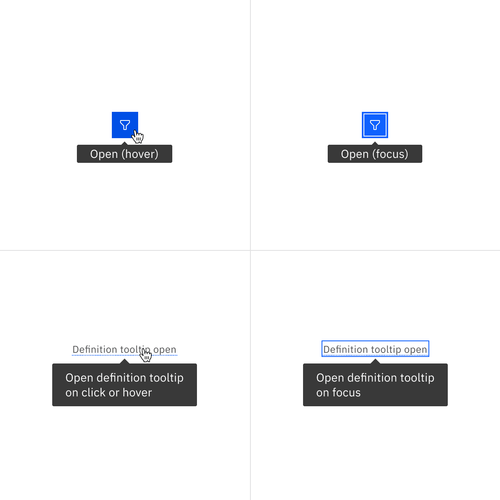

## Color

### Interactive tooltip

| Class                   | Property         | Color token   |
| ----------------------- | ---------------- | ------------- |
| Label                   | text color       | `$text-secondary`    |
| Trigger icon            | svg              | `$icon-primary`    |
| Container               | background-color | `$background-inverse` |
| Text                    | color       | `$text-inverse` |

<Caption>Example of closed and open states for a tooltip</Caption>

### Icon tooltip

| Class                       | Property         | Color token   |
| --------------------------- | ---------------- | ------------- |
| Trigger icon                | background-color | `$icon-primary` |
| Container                   | background-color | `$background-inverse` |
| Text                        | color       | `$text-inverse` |

### Definition tooltip

| Class                      | Property         | Color token       |
| -------------------------- | ---------------- | ----------------- |
| Label                      | color       | `$text-secondary`        |
| Dotted underline           | border-bottom    | `$interactive` |
| Container                  | background-color | `$background-inverse`     |
| Text                       | color       | `$text-inverse`     |

## Typography

Tooltip labels and text should be set in sentence case.

| Property              | Font-size (px/rem) | Font-weight   | Type token       |
| --------------------- | ------------------ | ------------- | ---------------- |
| Label                 | 12 / 0.75          | Regular / 400 | `$label-01`      |
| Body copy             | 14 / 0.875         | Regular / 400 | `$body-short-01` |

## Structure

All tooltip types have a varying height based on the amount of content they
contain.

### Interactive tooltip

| Element                     | Property      | px / rem | Spacing token |
| --------------------------- | ------------- | -------- | ------------- |
| Container                   | max-width     | 240 / 15 | –             |
|                             | padding       | 16 / 1   | `$spacing-05` |
|                             | margin-top    | 8 / 0.5  | `$spacing-03` |
| Trigger icon                | height, width | 16 / 1   | –             |
|                             | margin-left   | 8 / 0.5  | `$spacing-03` |

<Caption>
  Structure and spacing measurements for an interactive tooltip | px / rem
</Caption>

### Definition tooltip

| Class        | Property                    | px / rem | Spacing token |
| ------------ | --------------------------- | -------- | ------------- |
| Container    | max-width                   | 176 / 11 | –             |
|              | padding-top, padding bottom | 8 / 0.5  | `$spacing-03` |
|              | padding-left, padding-right | 16 / 1   | `$spacing-05` |
| Underline    | border-bottom               | 1px      | –             |
| Caret        | margin-top                  | 4px      | `$spacing-02` |

<Caption>
  Structure and spacing measurements for a definition tooltip | px / rem
</Caption>

### Icon tooltip

| Class      | Property                    | px / rem  | Spacing token |
| ---------- | --------------------------- | --------- | ------------- |
| Container  | max-width                   | 176 / 11  | –             |
|            | padding-left, padding-right | 16 / 1    | `$spacing-05` |
|            | padding-top, padding-bottom | 2 / 0.125 | `$spacing-01` |
| Caret      | margin-top                  | 8 / 0.5   | `$spacing-03` |

<Caption>
  Structure and spacing measurements for an icon tooltip | px / rem
</Caption>

### Placement

Tooltips should be placed below the tooltip icon unless it is within the height
of the tooltip box plus 16px / 1rem of the bottom of the page. In that instance,
the tooltip should appear above the icon or defined word. On mobile, tooltips
can only appear below the tooltip icon.

<Caption>Placement examples for a tooltip</Caption>
