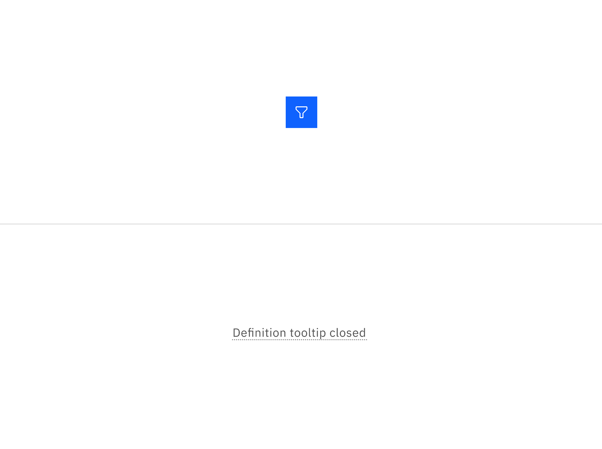

<PageDescription>

The following page documents visual specifications such as color, typography,
structure, and size.

</PageDescription>

<AnchorLinks>

<AnchorLink>Color</AnchorLink>
<AnchorLink>Typography</AnchorLink>
<AnchorLink>Structure</AnchorLink>
<AnchorLink>Feedback</AnchorLink>

</AnchorLinks>

## Color

A tooltip has two states: open and closed. The open state occurs when a user
hovers or focuses on the UI elements, while the closed state means the tooltip
is hidden. By default, the tooltip is hidden and inactive.

| Element                     | Property | Color token      |
| --------------------------- | -------- | ---------------- |
| Trigger (other UI elements) | –        | –                |
| Trigger (definition label)  | border   | `$border-strong` |

<Row>
<Column colLg={8}>

</Column>
</Row>

<Caption>
  Example of an icon button and definition tooltip in the closed state.
</Caption>

### Interactive state color

The color table applies to the tooltip when the UI elements or definition label
are triggered and in the open state.

 

| State                             | Element       | Property         | Color token           |
| --------------------------------- | ------------- | ---------------- | --------------------- |
| All components with tooltip: Open | Container     | background-color | `$background-inverse` |
|                                   | Text          | text-color       | `$text-inverse`       |
| Definition tooltip: Open (hover)  | Border-bottom | border           | `$border-interactive` |
| Definition tooltip: Open (focus)  | Border        | border           | `$focus`              |
|                                   | Border-bottom | border           | `$border-interactive` |

<Row>
<Column colLg={8}>

</Column>
</Row>

<Caption>
  Example of an icon button and a definition tooltip in the open state with
  mouse and keyboard interactions
</Caption>

## Typography

Tooltip labels and text should be set in sentence case.

| Element   | Font size (px/rem) | Font weight   | Type token  |
| --------- | ------------------ | ------------- | ----------- |
| Label     | 12 / 0.75          | Regular / 400 | `$label-01` |
| Body text | 14 / 0.875         | Regular / 400 | `$body-01`  |

## Structure

Tooltip containers vary in height based on their content. Tooltips are designed
for both multi-line text, with 16px padding on all sides for better spacing, and
single-line text, which is more compact since it typically contains only a few
words and the text doesn’t wrap to a second line.

| Element                 | Property                    | px / rem  | Spacing token |
| ----------------------- | --------------------------- | --------- | ------------- |
| Container (multi-line)  | max-width                   | 288 / 18  | —             |
|                         | padding                     | 16 / 1    | `$spacing-05` |
|                         | margin-top                  | 4 / 0.25  | `$spacing-02` |
| Container (single-line) | max-width                   | 208 / 13  | —             |
|                         | padding-left, padding-right | 16 / 1    | `$spacing-05` |
|                         | padding-top, padding-bottom | 2 / 0.125 | `$spacing-01` |
|                         | margin-top                  | 4 / 0.25  | `$spacing-02` |
| Caret                   | popover-caret               | 6 / 0.375 | —             |

<Caption fullwidth>
  Structure and spacing measurements for multi-line and single-line text | px /
  rem
</Caption>

### Definition tooltip structure

| Element   | Property                    | px / rem     | Spacing token |
| --------- | --------------------------- | ------------ | ------------- |
| Container | max-width                   | 176 / 11     | —             |
|           | padding-left, padding-right | 16 / 1       | `$spacing-05` |
|           | padding-top, padding-bottom | 8 / 0.5      | `$spacing-03` |
|           | margin-top                  | 4 / 0.25     | `$spacing-02` |
| Caret     | popover-caret               | 6 / 0.375    | –             |
| Trigger   | border-bottom               | 1 px, dotted | –             |

<Caption fullwidth>
  Structure and spacing measurements for a definition tooltip | px / rem
</Caption>

### Default placement

Tooltip directions, by default, are set to auto. Upon opening, tooltips can
detect the edges of the browser to be placed in view so the container does not
get cutoff. Tooltips can instead use specific directions and may be
positioned **top**, **right**, **bottom**, or **left** of the trigger item.
Tooltips should be placed at least 16px / 1rem off of the bottom of the page and
not bleed off page or behind other content. On mobile, tooltips can only appear
below the tooltip icon.

<Caption>Placement examples for a tooltip</Caption>

## Feedback

Help us improve this component by providing feedback, asking questions, and
leaving any other comments on
[GitHub](https://github.com/carbon-design-system/carbon-website/issues/new?assignees=&labels=feedback&template=feedback.md).
