import A11yStatus from 'components/A11yStatus';

<PageDescription>

Tooltips display additional information upon hover or focus that is contextual,
helpful, and nonessential while providing the ability to communicate and give
clarity to a user.

</PageDescription>

<AnchorLinks>

<AnchorLink>Live demo</AnchorLink>
<AnchorLink>Overview</AnchorLink>
<AnchorLink>Formatting</AnchorLink>
<AnchorLink>Content</AnchorLink>
<AnchorLink>Behaviors</AnchorLink>
<AnchorLink>Related</AnchorLink>
<AnchorLink>References</AnchorLink>
<AnchorLink>Feedback</AnchorLink>

</AnchorLinks>

## Live demo

<StorybookDemo
  themeSelector
  url="https://react.carbondesignsystem.com"
  variants={[
    {
      label: 'Default',
      variant: 'components-tooltip--default',
    },
    {
      label: 'Alignment',
      variant: 'components-tooltip--alignment',
    },
    {
      label: 'Duration',
      variant: 'components-tooltip--duration',
    },
  ]}
/>

<A11yStatus layout="cards" components="Tooltip" />

## Overview

A tooltip displays a popup with text that provides additional information when a
user hovers over or focuses on a UI element. It should be used only when
necessary to offer quick context without cluttering the interface.

<Row>
<Column colLg={8}>

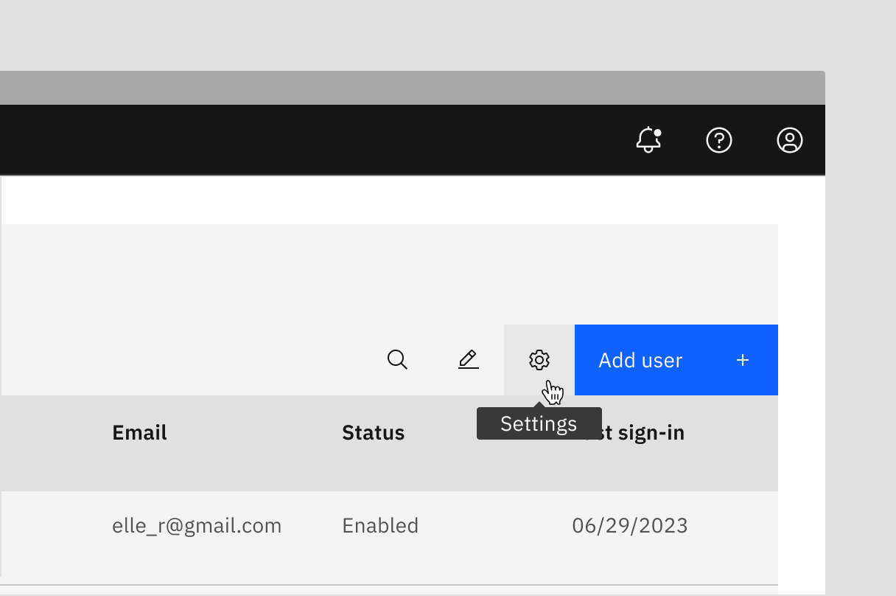

</Column>
</Row>

### When to use

By default, components like icon buttons, icon tabs, icon content switchers, and
copy buttons should come with integrated tooltips. Therefore, there’s no need to
include a separate tooltip control within the component. Tooltips can be exposed
for the following reasons:

- To expose names of controls, like icon buttons, that lack visual labels
- To supply additional information for focusable elements, helping users make
  informed decisions
- To offer more context or explanation for specific elements
- To define a term or provide details for an inline item

#### Definition tooltip

A definition tooltip provides extra help or defines a term inline. It’s similar
to a regular tooltip but offers more alignment options and slightly different
interaction patterns. Definition tooltips can be used on UI labels, words in
paragraphs, or in compact spaces like data tables where icons can clutter the
UI. They work well on headers, body copy, or labels.

### When not to use

Since a tooltip disappears when a user hovers away, do not include pertinent
information for the user to complete their task. Use helper text that is always
visible and accessible for vital information, such as required fields.

Do not include interactive elements within a tooltip. Interactive elements in
tooltips are inaccessible for some users and are hard to use for all users since
tooltips do not receive focus. If images, buttons, or links need to be included
in supplemental information, use the
[toggletip](https://carbondesignsystem.com/components/toggletip/usage/)
component and the disclosure pattern that allows for better tabbing and focus
structure, improving the experience for all users.

<DoDontRow>
<DoDont
type="do"
colMd={6} colLg={6}
caption="Do use helper text for pertinent information.">

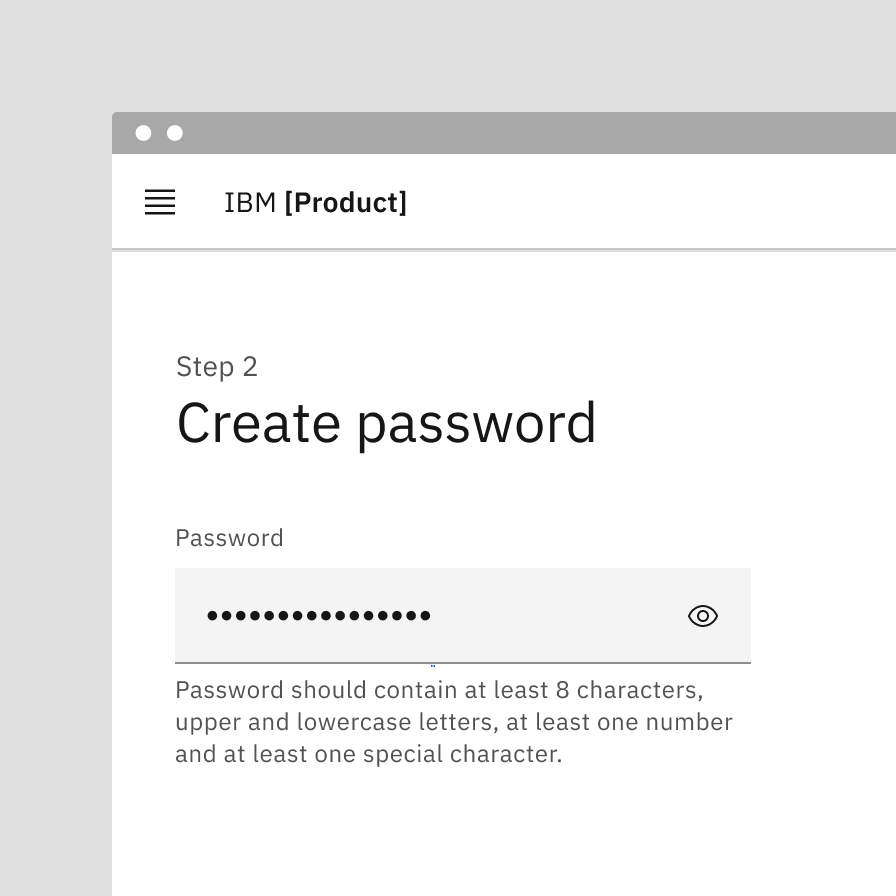

</DoDont>
<DoDont
colMd={6} colLg={6}
type="dont"
caption="Do not use tooltips for information for a user to complete their task.">

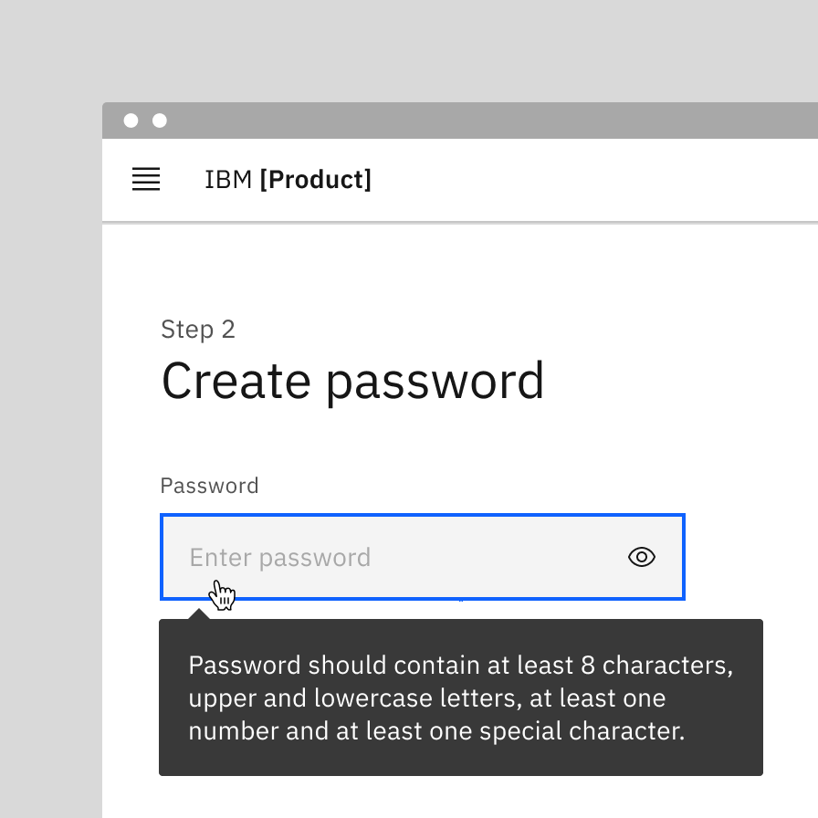

</DoDont>
</DoDontRow>

<DoDontRow>
<DoDont
type="do"
colMd={6} colLg={6}
caption="Use succinct, directive text.">

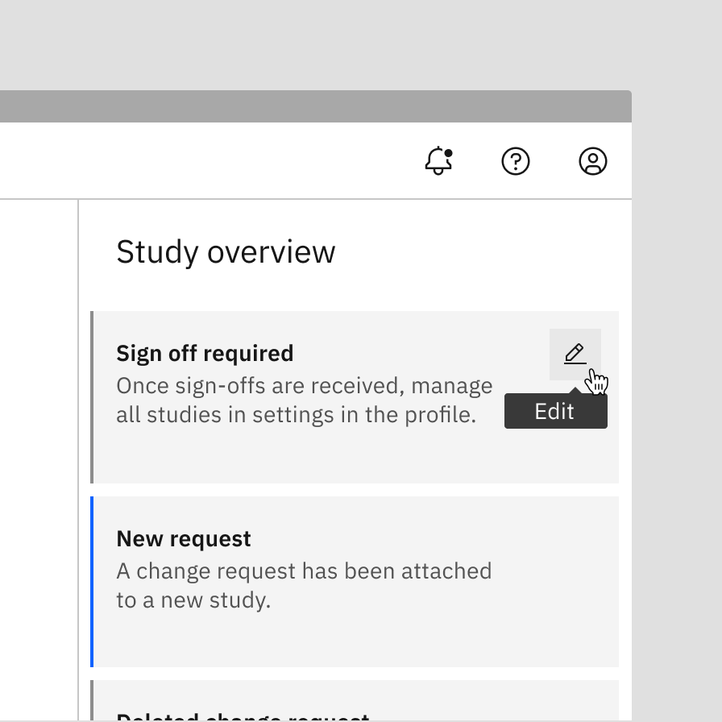

</DoDont>
<DoDont
colMd={6} colLg={6}
type="dont"
caption="Do not use interactive elements within a tooltip.">

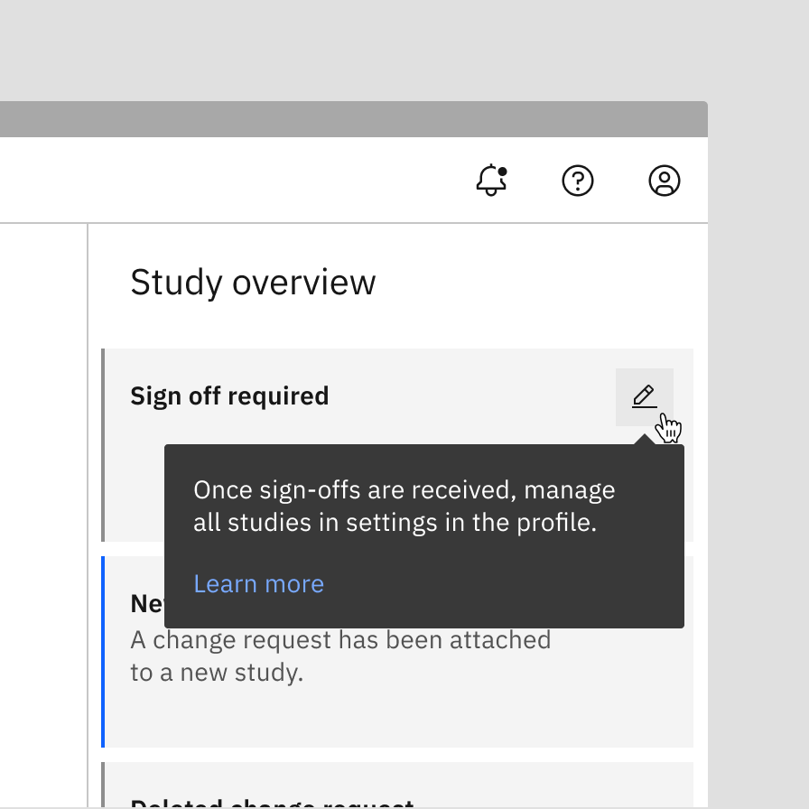

</DoDont>
</DoDontRow>

#### Tooltips versus toggletips

Tooltips and toggletips look visually similar, and both have an interactive
trigger. The two components differ of how they are invoked and dismissed and if
the user is required to interact with the contents. A tooltip is exposed on
hover or focus when you need to disclose brief, supplemental information that is
not interactive. A toggletip is used on click or enter when you must expose
interactive elements, such as a button, that a user needs to interact with.

<Row>
<Column colLg={8}>

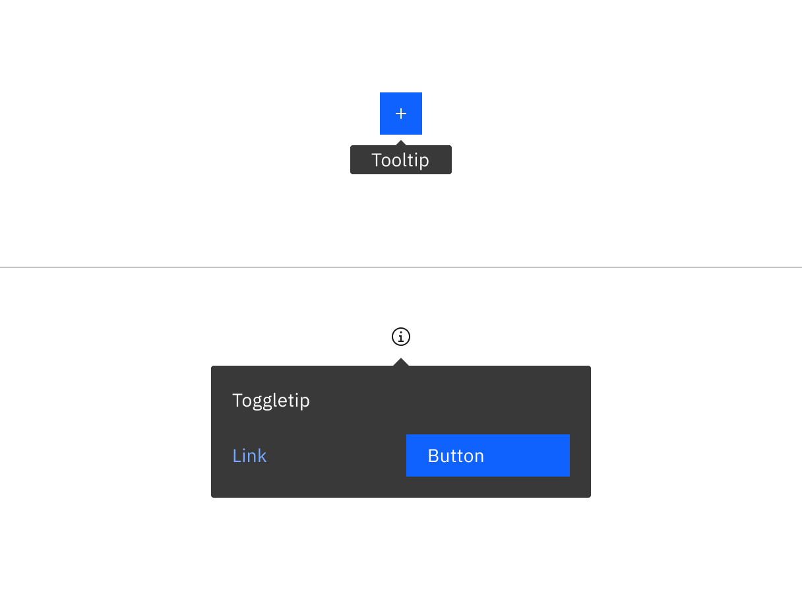

</Column>
</Row>

<Caption>Example of a tooltip versus a toggletip</Caption>

## Formatting

### Anatomy

<Row>
<Column colLg={8}>

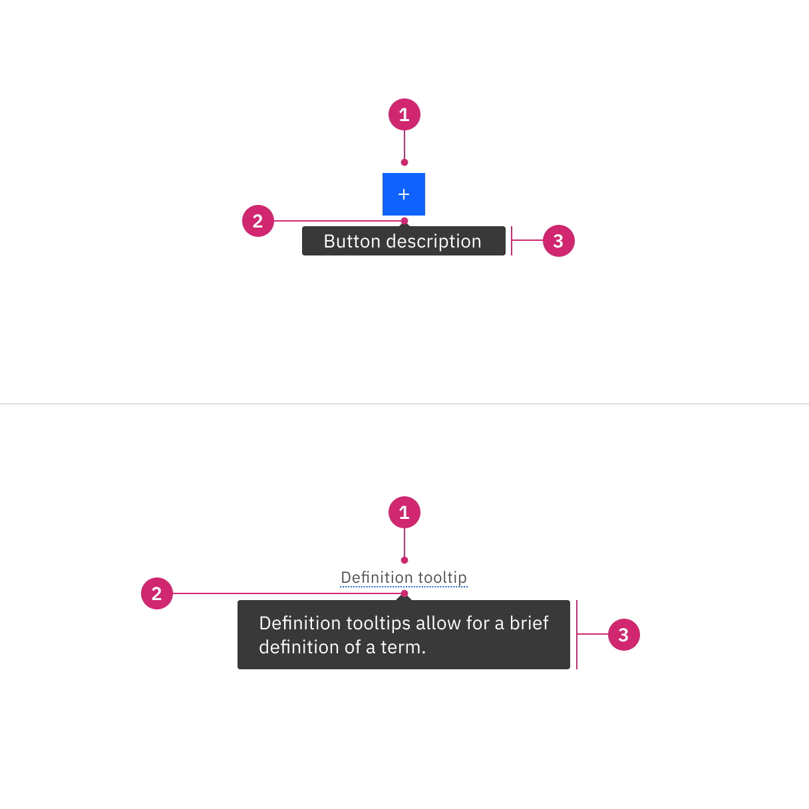

</Column>
</Row>

1. **UI trigger:** UI trigger includes any component with integrated tooltips or
   definition terms with dotted underlines
2. **Caret tip:** Closely associates the container with the related trigger
   element
3. **Container:** Contains short or brief text

### Alignment

The container of the tooltip may be aligned to **start**, **center** or **end**
to keep the container from bleeding off the page or covering important
information. The UI trigger button and caret tip should be vertically centered
with each other to associate the tooltip and the trigger. This is especially
helpful when multiple elements are close to each other.

<Row>
<Column colLg={8}>

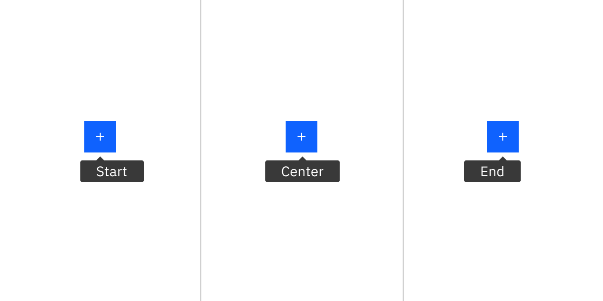

</Column>
</Row>

<Caption>
  Tooltip containers can be automatically or manually positioned to the start,
  center, or end
</Caption>

### Placement

Tooltip directions, by default, are set to auto. Upon opening, tooltips can
detect the edges of the browser to be placed in view so the container does not
get cutoff. Tooltips can instead use specific directions and may be
positioned **right**, **left**, **bottom**, or **top** of the trigger item. Do
not cover related content that is essential to the user's tasks. Tooltips should
not bleed off page or behind other content.

<Row>
<Column colLg={8}>

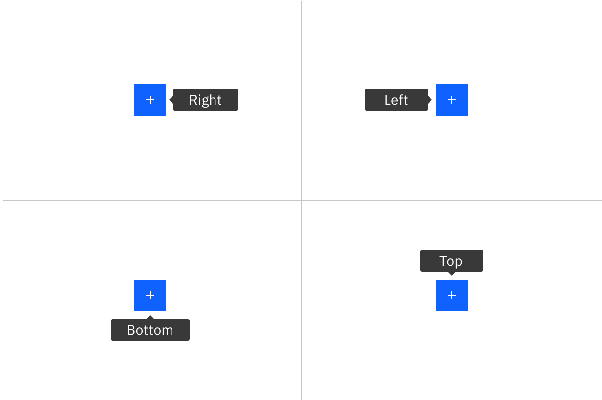

</Column>
</Row>

<Caption>
  Tooltip containers can be automatically or manually positioned to the right,
  left, bottom, or top
</Caption>

For definition tooltip, do not obstruct words to the left and right of the
trigger word. When the tooltip is active, ensure it overlays other content and
is not cut off by other surrounding components or bleeds off the page where some
content is not visible.

<Row>
<Column colLg={8}>

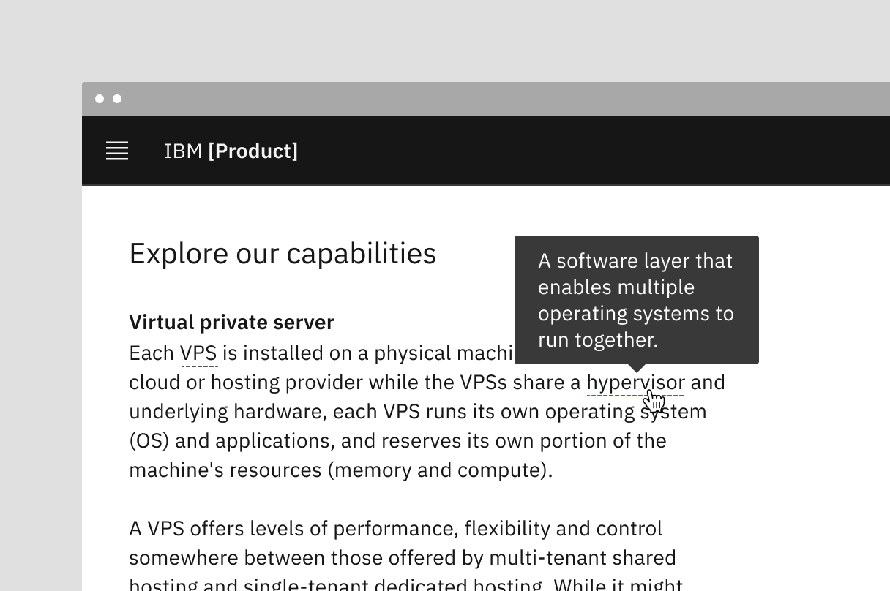

</Column>
</Row>

<Caption>
  Example of definition tooltip with the popover overlays the text
</Caption>

## Content

### Main elements

#### Text

- Should contain relevant, specific content.
- Should not contain essential task instructions since a tooltip is not
  persistent.
- Tooltips for icon-only components, like icon buttons, should provide a concise
  one- or two-word description of the button’s function.
- For definitions and instructive tooltips, use sentence-style capitalization
  and write the text as complete sentences with punctuation unless space is
  limited.

### Further guidance

For further content guidance, see Carbon’s
[content guidelines](/guidelines/content/overview/).

## Behaviors

### States

The tooltip component has two states: active (hover and focus) and inactive. By
default, tooltip is hidden and inactive.

### Interactions

#### Mouse

Tooltips are triggered when the mouse hovers over the UI trigger. The tooltip
persists if the mouse remains over the active container or the UI trigger. The
tooltip is dismissed by hovering away to another element.

Definition tooltips can use either hover or click interactions, depending on the
situation. Users can hover if they need a quick glance at the information. Users
can click if they need more time or if the tooltip might be unintentionally
triggered.

#### Keyboard

Users can navigate to the UI trigger and display the tooltip by pressing `Tab`.
The tooltip can be dismissed by pressing the `Esc` key. For tooltips that reveal
containers on focus, the container disappears when focus moves away.

## Related

#### Popover

Popovers are used as a base layer in some of our components like tooltips,
overflow menus, and dropdown menus. For further guidance, see Carbon's
[popover](https://carbondesignsystem.com/components/popover/usage/) component.

#### Disclosure

Disclosures use popovers as a base layer. Disclosures are comprised of a
container, text, and interactive elements. Interactive elements are kept in the
tab order of the page. For further guidance, see Carbon's
[disclosures](https://carbondesignsystem.com/patterns/disclosures-pattern/)
pattern.

#### Toggletip

Toggletip uses the disclosure pattern to toggle the visibility of a popover and
can contain a variety of information, from descriptive text to interactive
elements. For further guidance, see Carbon's
[toggletip](https://carbondesignsystem.com/components/toggletip/usage/)
component.

#### Chart tooltip

Chart tooltips appears when a cursor is positioned over an element on Carbon's
data viz charts, such as a data point, icon button, or truncated text. These are
inherent behaviors built into our chart components. Refer to
[chart anatomy](/data-visualization/chart-anatomy/#rectangular-charts) to learn
more about using tooltips in charts.

<Row>
<Column colLg={8}>

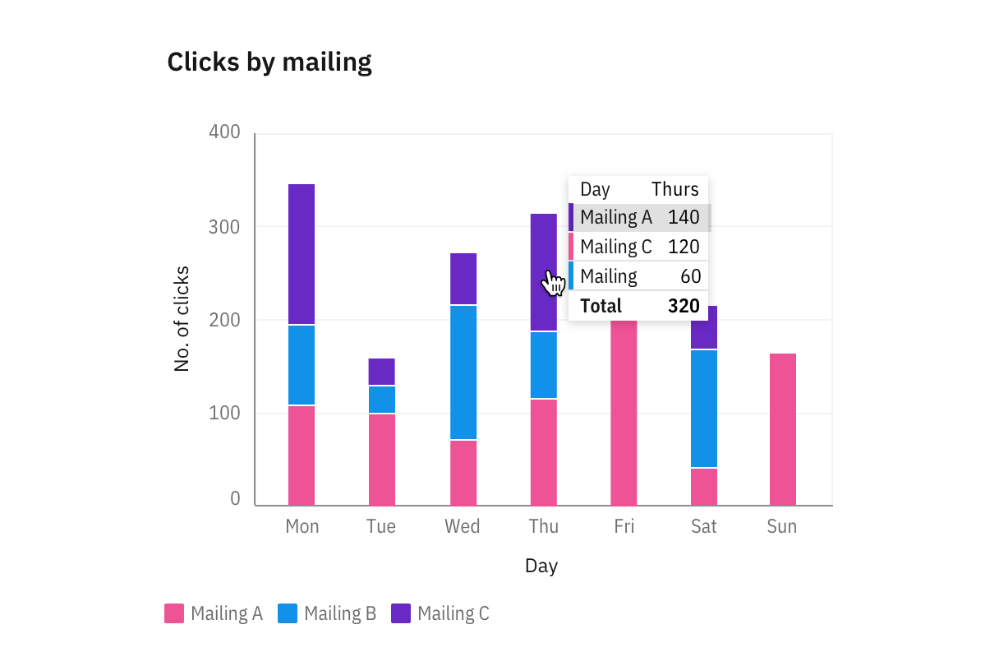

</Column>
</Row>

<Caption>Image of chart tooltips on a line graph</Caption>

## References

Alita Joyce,
[Tooltip Guidelines](https://www.nngroup.com/articles/tooltip-guidelines/)
(Nielsen Norman Group, 2019)

MDN Web Docs,
[ARIA: tooltip role](https://developer.mozilla.org/en-US/docs/Web/Accessibility/ARIA/Roles/tooltip_role)
(Mozilla: Developer contributors, 2023)

## Feedback

Help us improve this component by providing feedback, asking questions, and
leaving any other comments on
[GitHub](https://github.com/carbon-design-system/carbon-website/issues/new?assignees=&labels=feedback&template=feedback.md).
