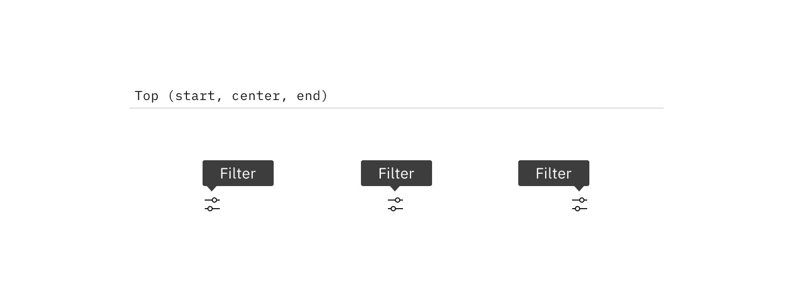
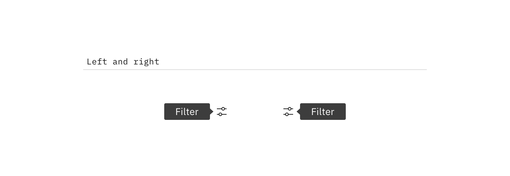
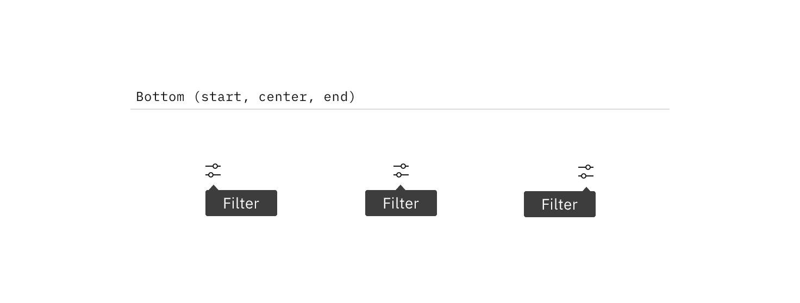
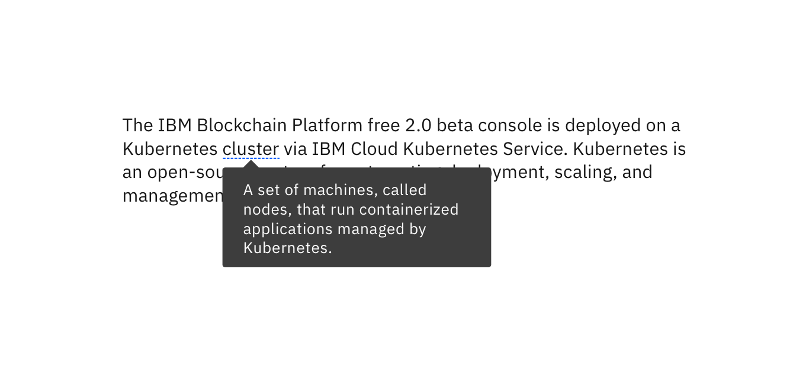
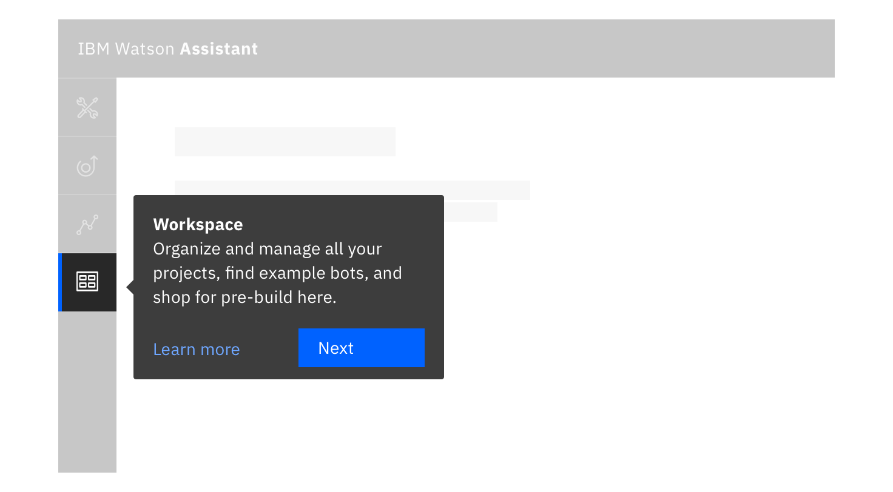

<PageDescription>

Tooltips display additional information upon click, hover, or focus. The
information should be contextual, useful, and nonessential.

</PageDescription>

<AnchorLinks>

<AnchorLink>Overview</AnchorLink>
<AnchorLink>Live demo</AnchorLink>
<AnchorLink>Placement</AnchorLink>
<AnchorLink>Variants</AnchorLink>
<AnchorLink>Feedback</AnchorLink>

</AnchorLinks>

## Overview

A tooltip is a message box that is displayed when a user hovers over, clicks or
gives focus to a UI element such as an icon, a highlighted word, or a button.

There are three variants of tooltips:

- Icon tooltip
- Definition tooltip
- Interactive tooltip

## Live demo

import { Filter16 } from '@carbon/icons-react';

<ComponentDemo
  components={[
    {
      id: 'tooltip',
      label: 'Tooltip',
    },
    {
      id: 'icon-tooltip',
      label: 'Icon tooltip',
    },
    {
      id: 'definition-tooltip',
      label: 'Definition tooltip',
    },
  ]}
  scope={{ Filter16 }}>
  <ComponentVariant
    id="tooltip"
    links={{
      React:
        'https://react.carbondesignsystem.com/?path=/story/components-tooltip--default-bottom',
      Angular:
        'https://angular.carbondesignsystem.com/?path=/story/components-tooltip--basic',
      Vue:
        'http://vue.carbondesignsystem.com/?path=/story/components-cvtooltip--default-interactive-tootlip',
      Vanilla: 'https://the-carbon-components.netlify.com/?nav=tooltip',
    }}>{`
    <Tooltip
      direction="bottom"
      tabIndex={0}
      triggerText="Tooltip label"
    >
      

        This is some tooltip text. This box shows the maximum amount of text that should be displayed inside. If more room is needed, use a modal instead.
      

      

        <Link href="#">Learn more</Link>
        <Button size="small">
          Create
        </Button>
      

    </Tooltip>
  `}</ComponentVariant>
  <ComponentVariant
    id="icon-tooltip"
    knobs={{
      TooltipIcon: ['direction', 'align'],
    }}
    links={{
      React:
        'https://react.carbondesignsystem.com/?path=/story/components-tooltipicon--default',
      Angular:
        'https://angular.carbondesignsystem.com/?path=/story/components-tooltip-icon--basic',
      Vue:
        'http://vue.carbondesignsystem.com/?path=/story/components-cvtooltip--default-tootlip',
      Vanilla: 'https://the-carbon-components.netlify.com/?nav=tooltip',
    }}>{`
    <TooltipIcon
      tooltipText="Filter"
    >
      <Filter16/>
    </TooltipIcon>
  `}</ComponentVariant>
  <ComponentVariant
    id="definition-tooltip"
    knobs={{
      TooltipDefinition: ['direction', 'align'],
    }}
    links={{
      React:
        'https://react.carbondesignsystem.com/?path=/story/components-tooltipdefinition--default',
      Angular:
        'https://angular.carbondesignsystem.com/?path=/story/components-tooltip-definition--basic',
      Vue:
        'http://vue.carbondesignsystem.com/?path=/story/components-cvtooltip--default-definition-tootlip',
      Vanilla: 'https://the-carbon-components.netlify.com/?nav=tooltip',
    }}>{`
    <TooltipDefinition
      tooltipText="Brief description of the dotted, underlined word above."
    >
      Definition Tooltip
    </TooltipDefinition>
  `}</ComponentVariant>
</ComponentDemo>

## Placement

Icon tooltips and interactive tooltips may be positioned **top**, **bottom**,
**left**, or **right** to the trigger item. The container of the tooltip text
may be aligned to **start**, **center** or **end**.

Note that left and right positioning is not available for
[definition tooltip](#definition-tooltip). This ensures the tooltip does not
obstruct important information to the left or right of the trigger word.

<Row>
<Column colLg={8}>

</Column>
</Row>

<Row>
<Column colLg={8}>

</Column>
</Row>

<Row>
<Column colLg={8}>

</Column>
</Row>

## Variants

Tooltips provide additional, contextual information. Each variant achieves this
for different design needs.

### Icon tooltip

An icon tooltip is used to clarify the action or name of an interactive icon
button.

<Row>
<Column colLg={8}>

</Column>
</Row>

#### Guidance

- The tooltip content should only contain one or two words.

#### Behavior

- Icon tooltips are displayed on `hover` and `focus`.

### Definition tooltip

The definition tooltip provides additional help or defines an item or term. It
may be used on the label of a UI element, or on a word embedded in a paragraph.

<Row>
<Column colLg={8}>

</Column>
</Row>

#### Guidance

- Should contain brief, read-only text
- Use on proper nouns, technical terms, or acronyms with two letters or more
- Do not use a definition tooltip on words with fewer than two letters

#### Behavior

- Definition tooltips are displayed on `hover` and `focus`

### Interactive tooltip

Interactive tooltips may contain rich text and other interactive elements like
buttons or links. In general, hiding interactive content in a tooltip is
discouraged. Interactive tooltips are best used for onboarding experiences and
product tours.

<Row>
<Column colLg={8}>

</Column>
</Row>

#### Guidance

- If a user may need to visit an external resource, like while using a form,
  include a link in your interactive tooltip
- Don't use without a label. Consider the context a user needs before clicking a
  link

#### Behavior

- Interactive tooltips are displayed when the user clicks on an info icon
- They persist until intentionally dismissed by clicking outside of the tooltip

## Feedback

Help us improve this component by providing feedback, asking questions, and
leaving any other comments on
[GitHub](https://github.com/carbon-design-system/carbon-website/issues/new?assignees=&labels=feedback&template=feedback.md).
