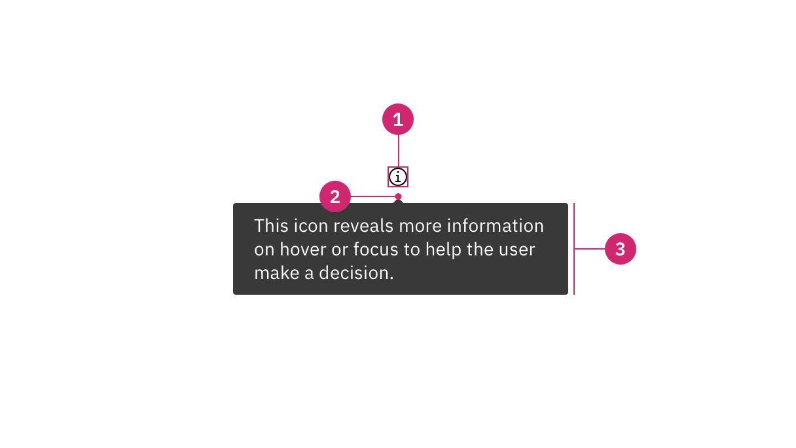
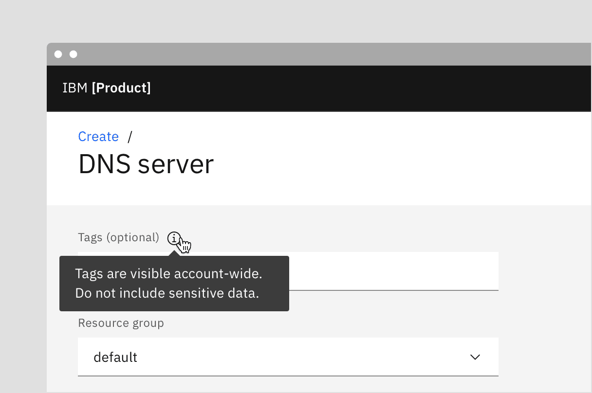

<PageDescription>

Tooltips display additional information upon hover or focus. The information
included should be contextual, helpful, and nonessential while providing that
extra ability to communicate and give clarity to a user.

</PageDescription>

<AnchorLinks>

<AnchorLink>Overview</AnchorLink>
<AnchorLink>Live demo</AnchorLink>
<AnchorLink>Formatting</AnchorLink>
<AnchorLink>Content</AnchorLink>
<AnchorLink>Behaviors</AnchorLink>
<AnchorLink>Related</AnchorLink>
<AnchorLink>References</AnchorLink>
<AnchorLink>Feedback</AnchorLink>

</AnchorLinks>

## Overview

A tooltip is a message box that is displayed when a user hovers over or gives
focus to a UI element. The tool tip should be paired with an interactive UI
element like a button. Tooltips should be used sparingly and contain succinct,
supplementary information. Although Carbon tooltips used to allow for
interactive elements such as buttons and links, do not include these elements in
tooltips and use toggle tip instead.

<Row>
<Column colLg={8}>

</Column>
</Row>

<Caption>Example of when to use icon tooltip</Caption>

### When to use

- Describe icon buttons
- When more information is useful in helping a user make decisions
- When an element needs more context or explanation

<Row>
<Column colLg={8}>

</Column>
</Row>

<Caption>Example of when to use tooltip to describe an icon button</Caption>

### When not to use

- Since a tooltip disappears when a user hovers away, do include information
  that is pertinent for the user to complete their task. Use helper text that is
  always visible and accessible for vital information such as required fields.
- Do not include interactive elements within a tooltip. Interactive elements in
  tooltips are inaccessible for some users and are hard to use for all users
  since tooltips do not receive focus. If images, buttons, or links need to be
  included in supplemental information, use the toggle tip component and the
  disclosure pattern that allows for better tabbing and focus structure,
  improving the experience for all users.

<DoDontRow>
<DoDont
colMd={6} colLg={6}
caption="Do use helper text for pertinent information.">

</DoDont>
<DoDont
colMd={6} colLg={6}
type="dont"
caption="Do not use tooltips for information for a user to complete their task.">

</DoDont>
</DoDontRow>

<DoDontRow>
<DoDont
colMd={6} colLg={6}
caption="Use succinct, directive text.">

</DoDont>
<DoDont
colMd={6} colLg={6}
type="dont"
caption="Do not use interactive elements within a tooltip.">

</DoDont>
</DoDontRow>

## Live demo

import { Filter16 } from '@carbon/icons-react';

<ComponentDemo
  components={[
    {
      id: 'tooltip',
      label: 'Tooltip',
    },
    {
      id: 'icon-tooltip',
      label: 'Icon tooltip',
    },
    {
      id: 'definition-tooltip',
      label: 'Definition tooltip',
    },
  ]}
  scope={{ Filter16 }}>
  <ComponentVariant
    id="tooltip"
    links={{
      React:
        'https://react.carbondesignsystem.com/?path=/story/components-tooltip--default-bottom',
      Angular:
        'https://angular.carbondesignsystem.com/?path=/story/components-tooltip--basic',
      Vue:
        'http://vue.carbondesignsystem.com/?path=/story/components-cvtooltip--default-interactive-tootlip',
      Vanilla: 'https://the-carbon-components.netlify.com/?nav=tooltip',
    }}>{`
    <Tooltip
      direction="bottom"
      tabIndex={0}
      triggerText="Tooltip label"
    >
      

        This is some tooltip text. This box shows the maximum amount of text that should be displayed inside. If more room is needed, use a modal instead.
      

      

        <Link href="#">Learn more</Link>
        <Button size="small">
          Create
        </Button>
      

    </Tooltip>
  `}</ComponentVariant>
  <ComponentVariant
    id="icon-tooltip"
    knobs={{
      TooltipIcon: ['direction', 'align'],
    }}
    links={{
      React:
        'https://react.carbondesignsystem.com/?path=/story/components-tooltipicon--default',
      Angular:
        'https://angular.carbondesignsystem.com/?path=/story/components-tooltip-icon--basic',
      Vue:
        'http://vue.carbondesignsystem.com/?path=/story/components-cvtooltip--default-tootlip',
      Vanilla: 'https://the-carbon-components.netlify.com/?nav=tooltip',
    }}>{`
    <TooltipIcon
      tooltipText="Filter"
    >
      <Filter16/>
    </TooltipIcon>
  `}</ComponentVariant>
  <ComponentVariant
    id="definition-tooltip"
    knobs={{
      TooltipDefinition: ['direction', 'align'],
    }}
    links={{
      React:
        'https://react.carbondesignsystem.com/?path=/story/components-tooltipdefinition--default',
      Angular:
        'https://angular.carbondesignsystem.com/?path=/story/components-tooltip-definition--basic',
      Vue:
        'http://vue.carbondesignsystem.com/?path=/story/components-cvtooltip--default-definition-tootlip',
      Vanilla: 'https://the-carbon-components.netlify.com/?nav=tooltip',
    }}>{`
    <TooltipDefinition
      tooltipText="Brief description of the dotted, underlined word above."
    >
      Definition Tooltip
    </TooltipDefinition>
  `}</ComponentVariant>
</ComponentDemo>

## Formatting

### Tooltip anatomy

<Row>
<Column colLg={8}>

</Column>
</Row>

1. **UI trigger button:** Element that triggers a tooltip on hover or focus
2. **Caret tip:** Closely associates container to specific trigger element
3. **Container:** Contains helper text

### Alignment

The container of the tooltip may be aligned to **start**, **center** or **end**
to keep the container from bleeding off the page or covering important
information. The UI trigger button and caret tip should be vertically center
with each other to clearly associate the tooltip and the trigger. This is
especially helpful when multiple elements are close to each other.

<Row>
<Column colLg={8}>

</Column>
</Row>

<Caption>Tooltip containers may be aligned to start, center or end</Caption>

### Placement

Tooltip directions by default are set to auto. Upon opening, tooltips can detect
the edges of the browser to properly be placed in view so the container does not
get cutoff. Tooltips can instead use specific directions and may be
positioned **right**, **left**, **bottom**, or **top** to the trigger item. Do
not cover related content that is essential to the user's tasks. Tooltips should
not bleed off page or behind other content.

<Row>
<Column colLg={8}>

</Column>
</Row>

<Caption>
  Tooltip containers can be positioned to the right, left, bottom, or top.
</Caption>

## Content

### Main elements

#### Text

- Should contain relevant, specific content
- Keep tooltips short and concise, no longer than a sentence or two
- Should not contain required information essential for a user to complete their
  task since a tooltip is not persistent
- Use sentence-style capitalization and write the text as full sentences with
  punctuation, unless space is limited.
- Icon button tooltips that describe a button's function should only contain one
  or two words.

### Further guidance

For further content guidance, see Carbon’s
[content guidelines](https://carbondesignsystem.com/guidelines/content/overview/).

## Behaviors

### States

The tooltip component has two states: active and inactive. By default, the
tooltip is hidden and inactive. Tooltips are displayed on `hover` and `focus`.

### Interactions

#### Mouse

Tooltips are triggered when the mouse hovers over or focuses on the active
element. The tooltip persists as long as the mouse remains over the active
container or the UI element. The tooltip is dismissed by hovering away or moving
focus to another element.

#### Keyboard

Users can trigger a tooltip by pressing `enter` when the UI element has focus. A
tooltip dismissible by use of the Escape key.

#### Screen readers

VoiceOver: Users can trigger a button to open a popover by pressing `enter` or
`space` while the button has focus.

JAWS: Users can trigger a button to open a popover by pressing `enter` or
`space` while the button has focus.

NVDA: Users can trigger a button to open a popover by pressing `enter` or
`space` while the button has focus.

## Related

#### Popover

Popovers are used as a base layer in some of our components like tooltips,
overflow menus, and dropdown menus. For further guidance, see Carbon's popver
component.

#### Disclosure

Disclosures use popovers as a base layer. Disclosures are comprised of a popover
container, text, and interactive elements. Interactive elements are kept in the
tab order of the page. For further guidance on the disclosure pattern coming
soon.

#### Toggle tip

Definition tootips now use the toggletip component to achieve accessibility
standards. Toggle tip uses the disclosure pattern to toggle the visibility of a
popover. This popover may contain a variety of information, from descriptive
text to interactive elements. For further guidance on the toggle tip component
coming soon.

#### Chart tooltip

Chart tooltips appears when a cursor is positioned over an element on Carbon's
data viz charts, such as a data point, icon button, or truncated text. These are
inherent behaviors built into our chart components. Refer to
[chart anatomy](https://carbondesignsystem.com/data-visualization/chart-anatomy/#rectangular-charts)
to learn more about using tooltips in charts.

<Row>
<Column colLg={8}>

</Column>
</Row>

## References

Alita Joyce,
[Tooltip Guidelines](https://www.nngroup.com/articles/tooltip-guidelines/)
(Nielsen Norman Group, 2019)

## Feedback

Help us improve this component by providing feedback, asking questions, and
leaving any other comments on
[GitHub](https://github.com/carbon-design-system/carbon-website/issues/new?assignees=&labels=feedback&template=feedback.md).
