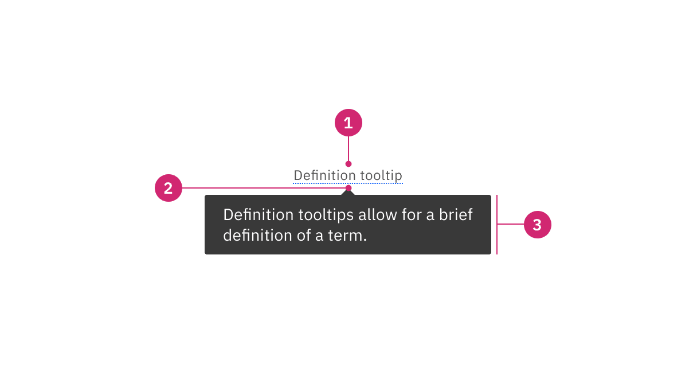
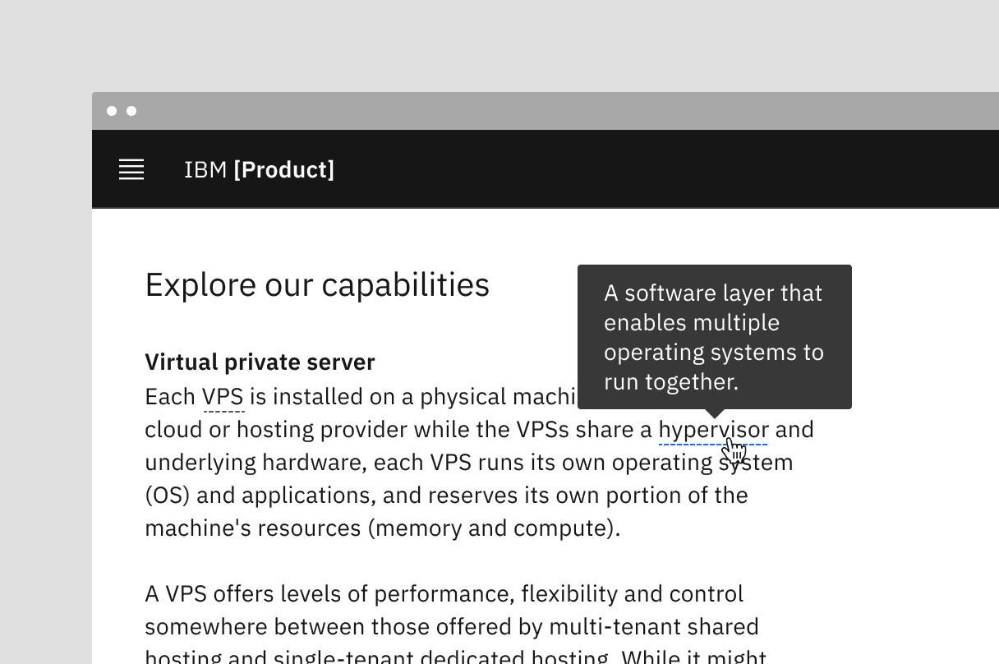

<PageDescription>

Tooltips display additional information upon hover or focus that is contextual,
helpful, and nonessential while providing the ability to communicate and give
clarity to a user.

</PageDescription>

<InlineNotification>

**v11 update:** The tooltip component has been refactored to use the
[popover](/components/popover/usage/) component under the hood to improve
accessibility. Interactive tootips now use the
[toggletip](/components/toggletip/usage/) component to achieve accessibility
standards. For v10 implementation guidance, go to
[v10 Tooltip](https://v10.carbondesignsystem.com/components/tooltip/usage/).

</InlineNotification>

<AnchorLinks>

<AnchorLink>Overview</AnchorLink>
<AnchorLink>Live demo</AnchorLink>
<AnchorLink>Formatting</AnchorLink>
<AnchorLink>Content</AnchorLink>
<AnchorLink>Universal behaviors</AnchorLink>
<AnchorLink>Icon button tooltip</AnchorLink>
<AnchorLink>Definition tooltip</AnchorLink>
<AnchorLink>Related</AnchorLink>
<AnchorLink>References</AnchorLink>
<AnchorLink>Feedback</AnchorLink>

</AnchorLinks>

## Overview

A tooltip is a message box displayed when a user hovers over or focuses on a UI
element. A tooltip is used to provide more information and should be paired with
an interactive UI element like a button. Tooltips should be used sparingly and
contain succinct supplementary information. Do not include interactive elements
in tooltips; use the toggletip component instead.

<Row>
<Column colLg={8}>

</Column>
</Row>

<Caption>Image of a tooltip</Caption>

### When to use

- To expose names of controls, like icon buttons, that lack visual labels
- When an element can take focus and supplying additional information is useful
  in helping a user make decisions
- When an element needs more context or explanation
- Use when defining a term or inline item

### When not to use

- Since a tooltip disappears when a user hovers away, do not include information
  for the user to complete their task. Use helper text that is always visible
  and accessible for vital information such as required fields.
- Do not include interactive elements within a tooltip. Interactive elements in
  tooltips are inaccessible for some users and are hard to use for all users
  since tooltips do not receive focus. If images, buttons, or links need to be
  included in supplemental information, use the toggletip component and the
  disclosure pattern that allows for better tabbing and focus structure,
  improving the experience for all users.

<DoDontRow>
<DoDont
type="do"
colMd={6} colLg={6}
caption="Do use helper text for pertinent information.">

</DoDont>
<DoDont
colMd={6} colLg={6}
type="dont"
caption="Do not use tooltips for information for a user to complete their task.">

</DoDont>
</DoDontRow>

<DoDontRow>
<DoDont
type="do"
colMd={6} colLg={6}
caption="Use succinct, directive text.">

</DoDont>
<DoDont
colMd={6} colLg={6}
type="dont"
caption="Do not use interactive elements within a tooltip.">

</DoDont>
</DoDontRow>

#### Tooltips versus Toggletips

Tooltips and toggletips look visually similar and have an interactive trigger.
The two components differ of how they are invoked and dismissed and if the user
is required to interact with the contents. A tooltip is exposed on hover or
focuses when you need to expose brief, supplemental information that is not
interactive. A toggletip is used on click or enter when you must expose
interactive elements, such as a button, that a user needs to interact with.

<Row>
<Column colLg={8}>

</Column>
</Row>

<Caption>Example of a tooltip versus a toggletip</Caption>

### Variants

| Variant                                     | Purpose                                                                                                                                 |
| ------------------------------------------- | --------------------------------------------------------------------------------------------------------------------------------------- |
| [Icon button tooltip](#icon-button-tooltip) | Describes a button's function or action.                                                                                                |
| [Definition tooltip](#definition-tooltip)   | Provides additional help or defines an item or term. It may be used on the label of a UI element, or on a word embedded in a paragraph. |

<Row>
<Column colLg={8}>

</Column>
</Row>

## Live demo

import { Information } from '@carbon/react/icons';

<ComponentDemo
  components={[
    {
      id: 'tooltip',
      label: 'Tooltip',
    },
    {
      id: 'definition-tooltip',
      label: 'Definition tooltip',
    },
  ]}
  scope={{ Information }}
>
  <ComponentVariant
    id="tooltip"
    links={{
      React:
        'https://react.carbondesignsystem.com/?path=/story/components-tooltip--default-bottom',
      'Web Components':
        'https://web-components.carbondesignsystem.com/?path=/story/components-tooltip--default',
      Angular:
        'https://angular.carbondesignsystem.com/?path=/story/components-tooltip--basic',
      Vue: 'http://vue.carbondesignsystem.com/?path=/story/components-cvtooltip--default-interactive-tootlip',
    }}
  >
    {`
    <Tooltip
      align="bottom"
      label="This is some tooltip text. This box shows the maximum amount of text that should appear inside. If more room is needed please use a modal instead."
      tabIndex={0}
      triggerText="Tooltip label"
    >
      <button className="tooltip-trigger" type="button">
        <Information />
      </button>
    </Tooltip>
  `}
  </ComponentVariant>
  <ComponentVariant
    id="definition-tooltip"
    knobs={{
      TooltipDefinition: ['align'],
    }}
    links={{
      React:
        'https://react.carbondesignsystem.com/?path=/story/components-tooltipdefinition--default',
      'Web Components':
        'https://web-components.carbondesignsystem.com/?path=/story/components-tooltip--definition',
      Angular:
        'https://angular.carbondesignsystem.com/?path=/story/components-tooltip-definition--basic',
      Vue: 'http://vue.carbondesignsystem.com/?path=/story/components-cvtooltip--default-definition-tootlip',
    }}
  >
    {`
    <DefinitionTooltip
      definition="Brief description of the dotted, underlined word above."
    >
      Definition Tooltip
    </DefinitionTooltip>
  `}
  </ComponentVariant>
</ComponentDemo>

## Formatting

### Icon button tooltip anatomy

<Row>
<Column colLg={8}>

</Column>
</Row>

1. **Icon button:** Button that triggers a tooltip on hover or focus.
2. **Caret tip:** Closely associates the container with the related trigger
   element.
3. **Container:** Contains helper text.

### Definition tooltip anatomy

<Row>
<Column colLg={8}>

</Column>
</Row>

1. **UI trigger button:** The definition indicator and underline that is dotted
   and can be activated on hover or focus.
2. **Caret tip:** Closely associates the container to term to be defined.
3. **Container:** Contains helper text.

### Alignment

The container of the tooltip may be aligned to **start**, **center** or **end**
to keep the container from bleeding off the page or covering important
information. The UI trigger button and caret tip should be vertically centered
with each other to associate the tooltip and the trigger. This is especially
helpful when multiple elements are close to each other.

<Row>
<Column colLg={8}>

</Column>
</Row>

<Caption>
  Tooltip containers can be automatically or manually positioned to the right,
  left, bottom, or top.
</Caption>

### Placement

Tooltip directions, by default, are set to auto. Upon opening, tooltips can
detect the edges of the browser to be placed in view so the container does not
get cutoff. Tooltips can instead use specific directions and may be
positioned **right**, **left**, **bottom**, or **top** of the trigger item. Do
not cover related content that is essential to the user's tasks. Tooltips should
not bleed off page or behind other content.

<Row>
<Column colLg={8}>

</Column>
</Row>

<Caption>
  Tooltip containers can be automatically or manually positioned to the right,
  left, bottom, or top
</Caption>

For tooltips that are inline with other text, like a definition tooltip, do not
obstruct words to the left and right of the trigger word. When the tooltip is
active, ensure it overlays other content and is not cut off by other surrounding
components or bleeds off the page where some content is not visible.

<Row>
<Column colLg={8}>

</Column>
</Row>

<Caption>Example of a definition tooltip positioned to the top</Caption>

## Content

### Main elements

#### Text

— Should contain only relevant, specific content.

- Should contain relevant, specific content.
- Should not contain essential task instructions since a tooltip is not
  persistent.
- Icon button tooltips should only contain one or two-word descriptions of a
  button's function.
- For definitions and instructive tooltips, use sentence-style capitalization
  and write the text as complete sentences with punctuation unless space is
  limited.

### Further guidance

For further content guidance, see Carbon’s
[content guidelines](/guidelines/content/overview/).

## Universal behaviors

### States

The tooltip component has two states: active and inactive. By default, the
tooltip is hidden and inactive. Tooltips are displayed on `hover` and `focus`.
Definition tooltips can be displayed either on `hover` and `focus` or on `click`
and `enter`.

### Interactions

#### Mouse

Tooltips are triggered when the mouse hovers over or focuses on the UI trigger.
The tooltip persists if the mouse remains over the active container or the UI
trigger. The tooltip is dismissed by hovering away or moving focus to another
element. The definition tooltip can be activated on click or and dismissed by
clicking outside the active container or UI element.

#### Keyboard

Users can trigger a tooltip by focusing on the element. Addtionally, a
definition tooltip can be triggered by using the `enter` key. A tooltip is
dismissible by the use of the `escape` key. For tooltips that reveal containers
on focus, the container dissapears when focus moves away.

## Icon button tooltip

An icon button tooltip is used to describe the function or action of an icon
button that has no label to provide clarity on what the button will do.

### Best practices

- Tooltip content should only contain one or two words.
- Use the icon button tooltip instead of the title attribute. Do not use both. —
  It is required to not include interactive elements within a tooltip. If
  interactive elements are needed use a toggletip instead.

<Row>
<Column colLg={8}>

</Column>
</Row>

<Caption>Image of an icon button tooltip</Caption>

## Definition tooltip

The definition tooltip provides inline additional help or defines a term. It may
be used on the label of a UI element, on a word embedded in a paragraph, or in
compact spaces such as data tables where icons clutter the UI. You can use
definition tooltips on headers, body copy, or labels.

The definition tooltip is unique in that if offers both a hover or click
interaction depending on specific use cases. If a user needs only a few seconds
to gather their information and go, use a hover interaction. If a user needs
time to think about the content or the tooltip is placed so that a user can
unintentionally trigger the tooltip, then a click interaction would be more
appropriate.

### Best practices

- Tooltip content should contain brief, read-only text.
- Use on proper nouns, technical terms, or acronyms with two letters or more.

<Row>
<Column colLg={8}>

</Column>
</Row>

<Caption>Image of a definition tooltip</Caption>

## Related

#### Popover

Popovers are used as a base layer in some of our components like tooltips,
overflow menus, and dropdown menus. For further guidance, see Carbon's popover
component.

#### Disclosure

Disclosures use popovers as a base layer. Disclosures are comprised of a
container, text, and interactive elements. Interactive elements are kept in the
tab order of the page. For further guidance, see Carbon's disclosure pattern.

#### Toggletip

Toggletip uses the disclosure pattern to toggle the visibility of a popover and
can contain a variety of information, from descriptive text to interactive
elements. For further guidance, see Carbon's toggletip component.

#### Chart tooltip

Chart tooltips appears when a cursor is positioned over an element on Carbon's
data viz charts, such as a data point, icon button, or truncated text. These are
inherent behaviors built into our chart components. Refer to
[chart anatomy](/data-visualization/chart-anatomy/#rectangular-charts) to learn
more about using tooltips in charts.

<Row>
<Column colLg={8}>

</Column>
</Row>

<Caption>Image of chart tooltips on a line graph</Caption>

## References

Alita Joyce,
[Tooltip Guidelines](https://www.nngroup.com/articles/tooltip-guidelines/)
(Nielsen Norman Group, 2019)

## Feedback

Help us improve this component by providing feedback, asking questions, and
leaving any other comments on
[GitHub](https://github.com/carbon-design-system/carbon-website/issues/new?assignees=&labels=feedback&template=feedback.md).
