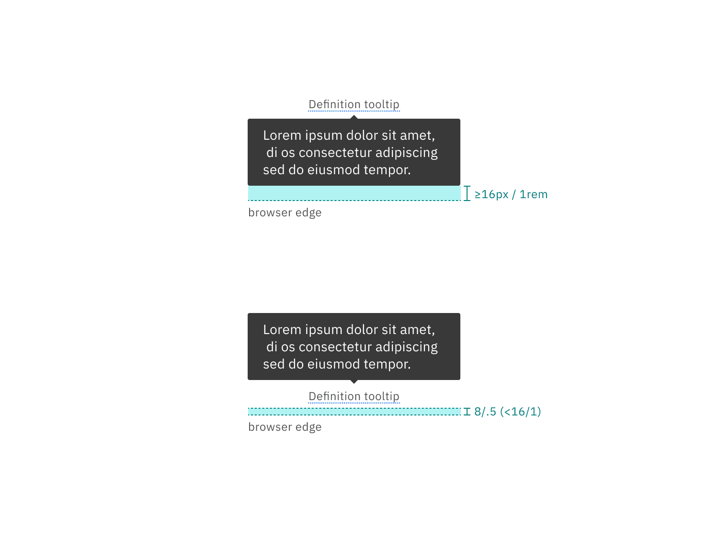

<AnchorLinks>

<AnchorLink>General guidance</AnchorLink>
<AnchorLink>Formatting</AnchorLink>
<AnchorLink>Content</AnchorLink>
<AnchorLink>Behavior</AnchorLink>
<AnchorLink>Accessibility</AnchorLink>
<AnchorLink>Variations</AnchorLink>
<AnchorLink>Style</AnchorLink>
<AnchorLink>Code</AnchorLink>
<AnchorLink>Feedback</AnchorLink>

</AnchorLinks>

## General guidance

Tooltips provide additional information upon hover or focus. The information should be contextual, useful, and nonessential information. Keep tooltips short.

<ComponentCode
  name="Tooltip"
  component="tooltip"
  variation="tooltip"
  hasReactVersion="tooltip--default-bottom"
  hasVueVersion="tooltip--default-interactive-tootlip"
  hasAngularVersion="?path=/story/tooltip--basic"
  codepen="OGNWpy"></ComponentCode>

## Formatting

**Icon tooltips and interactive tooltips may be positioned top, bottom, left, or right to the trigger item.** The container of the tooltip text may be aligned to **start**, **center** or **end**.

**Note that left and right positioning is not available for [definition tooltip](#definition-tooltip).** This ensures the tooltip does not obstruct important information to the left or right of the trigger word.

<Row>
<Column colLg={8}>

</Column>
</Row>

<Row>
<Column colLg={8}>

</Column>
</Row>

<Row>
<Column colLg={8}>

</Column>
</Row>

## Content 

## Behavior

## Accessibility

## Variations 

| Tooltip types         | Purpose                |
| --------------------- | ---------------------- |
| _Icon tooltip_        | Description of purpose |
| _Definition tooltip_  | Description of purpose |
| _Interactive tooltip_ | Description of purpose |

### Icon tooltip

An icon tooltip is used to clarify the action or name of an interactive icon button.

<Row>
<Column colLg={8}>

</Column>
</Row>

#### Guidance:

- The tooltip content should only contain one or two words.

#### Behavior:

- Icon tooltips appear on `hover` and `focus`.

### Definition tooltip

The definition tooltip provides additional help or defines an item or term. It may be used on the label of a UI element, or on a word embedded in a paragraph.

<Row>
<Column colLg={8}>

</Column>
</Row>

#### Guidance:

- Should contain brief, read-only text
- Use on proper nouns, technical terms, or acronyms with two letters or more
- Do not use a definition tooltip on words with fewer than two letters

#### Behavior:

- Definition tooltips appear on `hover` and `focus`

### Interactive tooltips

Interactive tooltips may contain rich text and other interactive elements like buttons or links. In general, hiding interactive content in a tooltip is discouraged. Interactive tooltips are best used for onboarding experiences and product tours.

<Row>
<Column colLg={8}>

</Column>
</Row>

#### Guidance:

- If a user may need to visit an external resource, like while using a form, include a link in your interactive tooltip
- Don't use without a label. Consider the context a user needs before clicking a link

#### Behavior:

- Interactive tooltips appear when the user clicks on an info icon
- They persistent until intentionally dismissed by clicking outside of the tooltip

## Style

### Color

#### Interactive tooltip

| Class                   | Property         | Color token   |
| ----------------------- | ---------------- | ------------- |
| `.bx--tooltip__label`   | text color       | `$text-02`    |
| `.bx--tooltip__trigger` | svg              | `$icon-01`    |
| `.bx--tooltip--shown`   | background-color | `$inverse-02` |
| `.bx--tooltip__caret`   | background-color | `$inverse-02` |
| `p`                     | text color       | `$inverse-01` |

<Caption>Example of closed and open states for a tooltip</Caption>

#### Icon tooltip

| Class                       | Property         | Color token   |
| --------------------------- | ---------------- | ------------- |
| `.bx--tooltip__trigger svg` | background-color | `$inverse-02` |
| `.bx--tooltip--icon`        | background-color | `$inverse-02` |
| `p`                         | text color       | `$inverse-01` |

#### Defintion tooltip

| Class                      | Property         | Color token       |
| -------------------------- | ---------------- | ----------------- |
| `.bx--tooltip__label`      | text color       | `$text-02`        |
| `.bx--tooltip__trigger`    | border-bottom    | `$interactive-04` |
| `.bx--tooltip--definition` | background-color | `$inverse-02`     |
| `p`                        | text color       | `$inverse-01`     |

### Typography

Tooltip labels and text should be set in sentence case.

| Property              | Font-size (px/rem) | Font-weight   | Type token       |
| --------------------- | ------------------ | ------------- | ---------------- |
| `.bx--tooltip__label` | 12 / 0.75          | Regular / 400 | `$label-01`      |
| `p`                   | 14 / 0.875         | Regular / 400 | `$body-short-01` |

### Structure

All tooltip types have a varying height based on the amount of content they contain.

#### Interactive tooltip

| Class                       | Property      | px / rem | Spacing token |
| --------------------------- | ------------- | -------- | ------------- |
| `.bx--tooltip`              | max-width     | 240 / 15 | –             |
| `.bx--tooltip__trigger svg` | height, width | 16 / 1   | –             |
| `.bx--tooltip__trigger`     | margin-left   | 8 / 0.5  | `$spacing-03` |
| `.bx--tooltip--shown`       | padding       | 16 / 1   | `$spacing-05` |
| `.bx--tooltip`              | margin-top    | 8 / 0.5  | `$spacing-03` |

<Caption>
  Structure and spacing measurements for an interactive tooltip | px / rem
</Caption>

#### Definition tooltip

| Class                                                                    | Property                    | px / rem | Spacing token |
| ------------------------------------------------------------------------ | --------------------------- | -------- | ------------- |
| `.bx--tooltip--definition__bottom`   `.bx--tooltip--definition__top` | max-width                   | 176 / 11 | –             |
| `.bx--tooltip--definition__bottom`   `.bx--tooltip--definition__top` | padding-top, padding bottom | 8 / 0.5  | `$spacing-03` |
| `.bx--tooltip--definition__bottom`   `.bx--tooltip--definition__top` | padding-left, padding-right | 16 / 1   | `$spacing-05` |
| `.bx--tooltip__trigger`                                                  | border-bottom               | 1px      | –             |
| `.bx--tooltip__caret`                                                    | margin-top                  | 4px      | `$spacing-02` |

<Caption>
  Structure and spacing measurements for a definition tooltip | px / rem
</Caption>

#### Icon tooltip

| Class                                                                      | Property                    | px / rem  | Spacing token |
| -------------------------------------------------------------------------- | --------------------------- | --------- | ------------- |
| `.bx--tooltip--icon__top:before`   `.bx--tooltip--icon__bottom:before` | max-width                   | 176 / 11  | –             |
| `.bx--tooltip--icon__top:before`   `.bx--tooltip--icon__bottom:before` | padding-left, padding-right | 16 / 1    | `$spacing-05` |
| `.bx--tooltip--icon__top:before`   `.bx--tooltip--icon__bottom:before` | padding-top, padding-bottom | 2 / 0.125 | `$spacing-01` |
| `.bx--tooltip__caret`                                                      | margin-top                  | 8 / 0.5   | `$spacing-03` |

<Caption>
  Structure and spacing measurements for an icon tooltip | px / rem
</Caption>

#### Placement

Tooltips should be placed below the tooltip icon unless it is within the height of the tooltip box plus 16px / 1rem of the bottom of the page. In that instance, the tooltip should appear above the icon or defined word. On mobile, tooltips can only appear below the tooltip icon.

<Caption>Placement examples for a tooltip</Caption>

## Code

<ComponentDocs component="tooltip" />

## Feedback
