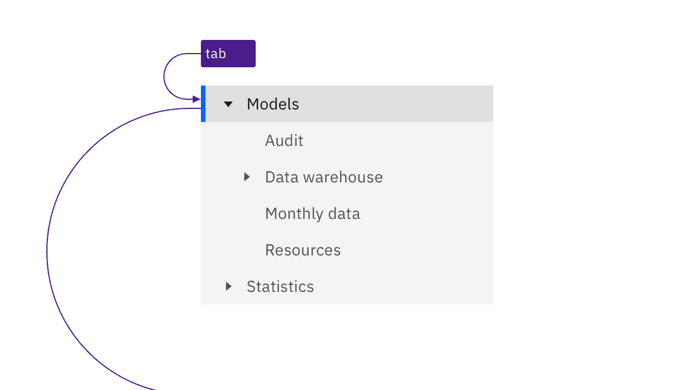
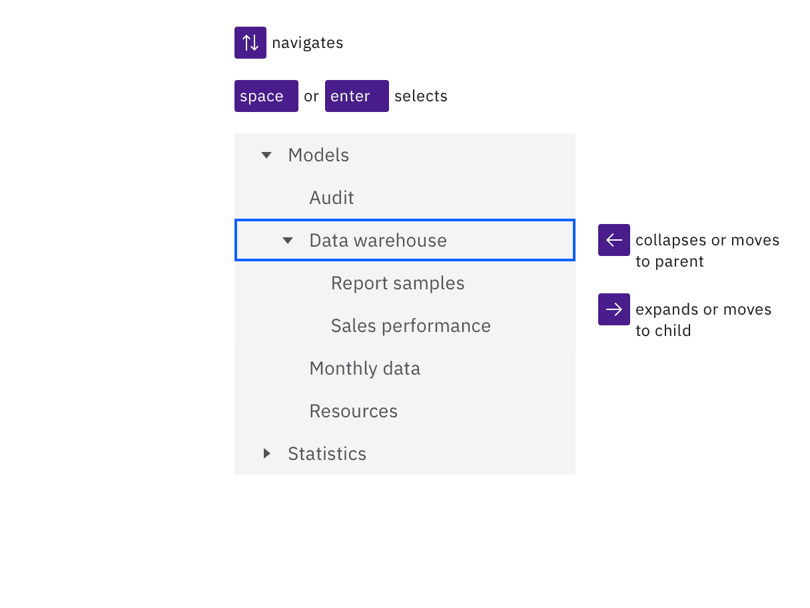

import A11yStatus from 'components/A11yStatus';

<PageDescription>

No accessibility annotations are needed for a tree view, but keep these
considerations in mind if you are modifying Carbon or creating a custom
component.

</PageDescription>

<AnchorLinks>
  <AnchorLink>What Carbon provides</AnchorLink>
  <AnchorLink>Development considerations</AnchorLink>
</AnchorLinks>

## What Carbon provides

Carbon bakes keyboard operation into its components, improving the experience of
blind users and others who operate via the keyboard. Carbon incorporates many
other accessibility considerations, some of which are described below.

### Keyboard interaction

The tree view takes a single tab stop, with focusing landing on the selected
node or the first node of an unselected tree. When trees have focus, arrow keys
provide navigation. The `Right arrow` key expands a closed branch node. If a
branch is open, the `Right arrow` moves into the first child node. Pressing the
`Left arrow` key on an open branch collapses it. Left arrowing on a child moves
the focus to the parent branch. `Up` and `Down arrow` keys move vertically
through open branches and their child nodes. A node or branch is selected by
`Space` or `Enter` keys.

<Row>
<Column colLg={8}>

<Caption>The tree view takes a single tab stop.</Caption>

</Column>
</Row>

<Row>
<Column colLg={8}>

<Caption>
  Arrow keys operate and move around in the nodes of a tree. Space or Enter
  selects the current node.
</Caption>

</Column>
</Row>

## Development considerations

Keep these considerations in mind if you are modifying Carbon or creating a
custom component.

- The component uses a `tree` role on a `ul` with all nodes in `li` given a role
  of `treeitem` with a `tabindex="-1"` and `aria-selected="false"` (except the
  currently selected node).
- All branch nodes contain an `aria-expanded` attribute.
- See the
  [ARIA authoring practice Tree View pattern](https://www.w3.org/WAI/ARIA/apg/patterns/treeview/)
  for more considerations.

<A11yStatus layout="table" components="Tree view" />
