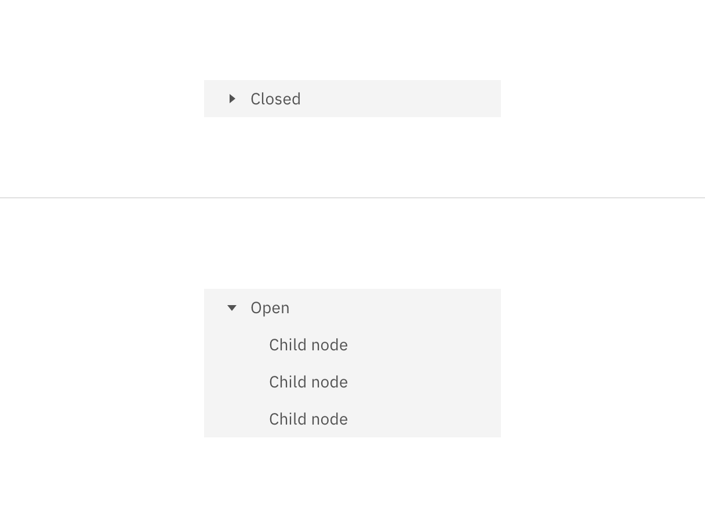
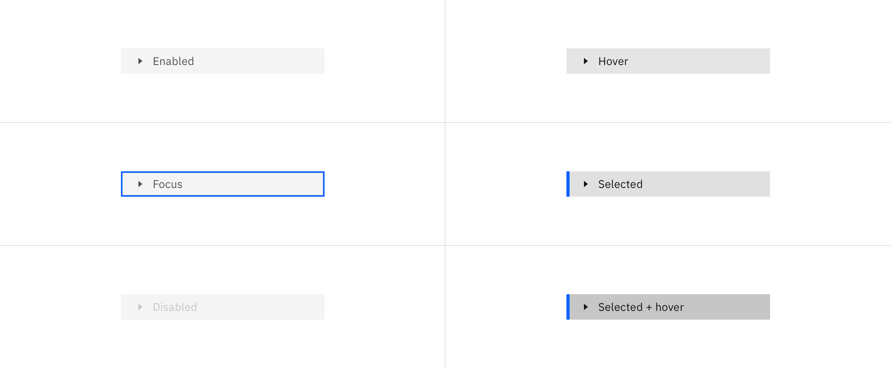
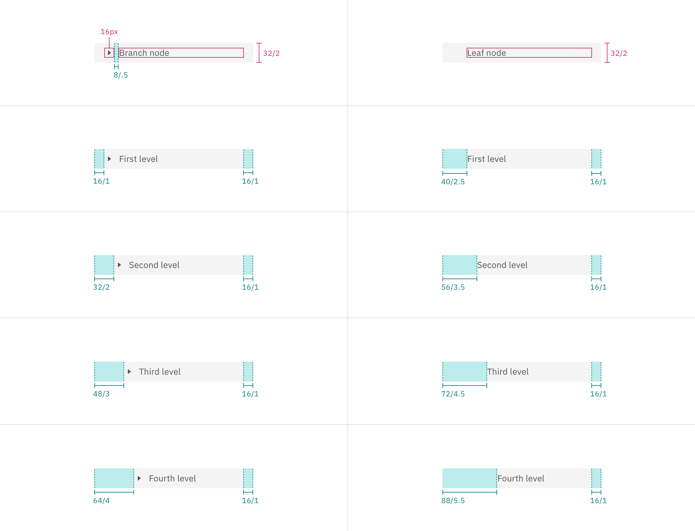
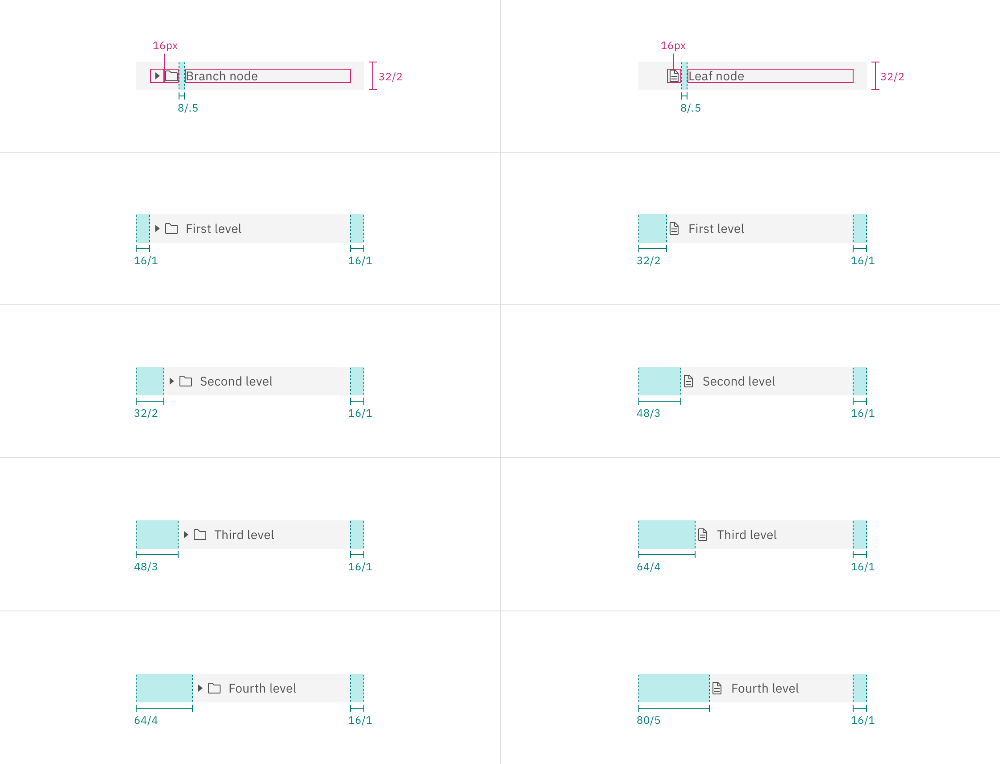

## Color

| Element    | Property         | Color token       |
| ---------- | ---------------- | ----------------- |
| Label      | text color       | `$text-secondary` |
| Caret icon | svg              | `$icon-secondary` |
| Node icon  | svg              | `$icon-secondary` |
| Node       | background-color | `$layer`\*        |

<Caption>
  * Denotes a contextual color token that will change values based on the layer
  it is placed on.
</Caption>

<Row>
<Column colLg={8}>

</Column>
</Row>

<Caption>Example of closed (top) and open (bottom) tree view states.</Caption>

### Interactive states

| State            | Element              | Property         | Color token               |
| ---------------- | -------------------- | ---------------- | ------------------------- |
| Hover            | Label                | text-color       | `$text-primary`           |
|                  | Caret icon           | svg              | `$icon-primary`           |
|                  | Node icon (optional) | svg              | `$icon-primary`           |
|                  | Node                 | background-color | `$layer-hover`\*          |
| Focus            | Node                 | border           | `$focus`                  |
| Selected         | Label                | text-color       | `$text-primary`           |
|                  | Caret icon           | svg              | `$icon-primary`           |
|                  | Node icon (optional) | svg              | `$icon-primary`           |
|                  | Node                 | background-color | `$layer-selected`\*       |
|                  |                      | border-left      | `$border-interactive`     |
| Selected + hover | Label                | text-color       | `$text-primary`           |
|                  | Caret icon           | svg              | `$icon-primary`           |
|                  | Node icon (optional) | svg              | `$icon-primary`           |
|                  | Node                 | background-color | `$layer-selected-hover`\* |
| Disabled         | Label                | text-color       | `$text-disabled`          |
|                  | Caret icon           | svg              | `$icon-disabled`          |
|                  | Node icon (optional) | svg              | `$icon-disabled`          |
|                  | Node                 | background-color | `$layer`\*                |

<Caption>
  * Denotes a contextual color token that will change values based on the layer
  it is placed on.
</Caption>

<Row>
<Column colLg={12}>

</Column>
</Row>

## Typography

| Element | Font-size (px/rem) | Font-weight   | Type token         |
| ------- | ------------------ | ------------- | ------------------ |
| Label   | 14 / 0.875         | Regular / 400 | `$body-compact-01` |

## Structure

The internal structure of each node varies depending on the node type and level.
The labels of nodes on the same level should always vertically align. Do not mix
text-only and icon nodes together as this will misalign labels.

| Element    | Property      | px / rem | Spacing token |
| ---------- | ------------- | -------- | ------------- |
| Node       | padding-right | 16 / 1   | `$spacing-05` |
| Caret icon | margin-right  | 8 / .5   | `$spacing-03` |

### Tree view (text only)

| Node type | Level  | Property     | px / rem | Spacing token |
| --------- | ------ | ------------ | -------- | ------------- |
| _Branch_  | First  | padding-left | 16 / 1   | `$spacing-05` |
|           | Second | padding-left | 32 / 2   | `$spacing-07` |
|           | Third  | padding-left | 48 / 3   | `$spacing-09` |
|           | Fourth | padding-left | 64 / 4   | `$spacing-10` |
| _Leaf_    | First  | padding-left | 40 / 2.5 | `$spacing-08` |
|           | Second | padding-left | 56 / 3.5 | –             |
|           | Third  | padding-left | 72 / 4.5 | –             |
|           | Fourth | padding-left | 88 / 5.5 | –             |

<Row>
<Column colLg={12}>

</Column>
</Row>

<Caption>
  Structure and spacing measurements for text only tree view | px / rem
</Caption>

### Tree view (with icons)

| Node type | Level  | Property     | px / rem | Spacing token |
| --------- | ------ | ------------ | -------- | ------------- |
| _Branch_  | First  | padding-left | 16 / 1   | `$spacing-05` |
|           | Second | padding-left | 40 / 2.5 | `$spacing-08` |
|           | Third  | padding-left | 64 / 4   | `$spacing-10` |
|           | Fourth | padding-left | 88 / 5.5 | –             |
| _Leaf_    | First  | padding-left | 40 / 2.5 | `$spacing-08` |
|           | Second | padding-left | 64 / 4   | `$spacing-10` |
|           | Third  | padding-left | 88 / 5.5 | –             |
|           | Fourth | padding-left | 112 / 7  | –             |

<Row>
<Column colLg={12}>

</Column>
</Row>

<Caption>
  Structure and spacing measurements for tree view with icons | px / rem
</Caption>
