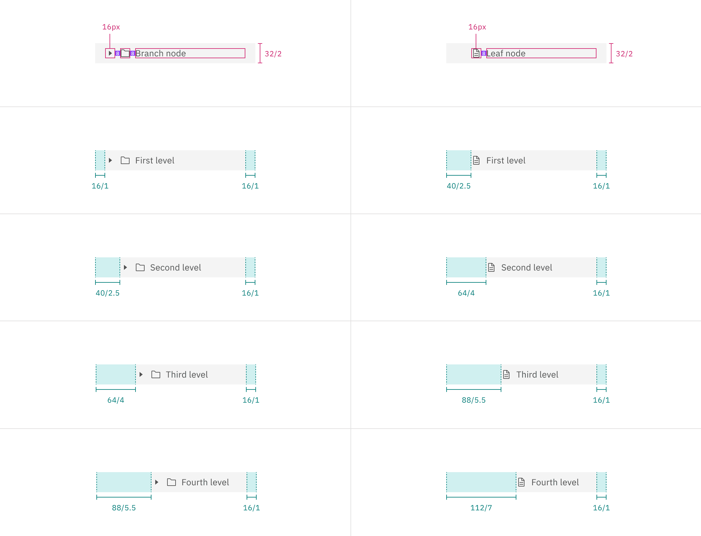

## Color

| Element    | Property         | Color token       |
| ---------- | ---------------- | ----------------- |
| Label      | text color       | `$text-secondary` |
| Caret icon | svg              | `$icon-secondary` |
| Node icon  | svg              | `$icon-secondary` |
| Node       | background-color | `$layer`\*        |

<Caption>
  * Denotes a contextual color token that will change values based on the layer
  it is placed on.
</Caption>

<Row>
<Column colLg={8}>

</Column>
</Row>

<Caption>Example of closed (top) and open (bottom) tree view states.</Caption>

### Interactive states

| State            | Element              | Property         | Color token               |
| ---------------- | -------------------- | ---------------- | ------------------------- |
| Hover            | Label                | text-color       | `$text-primary`           |
|                  | Caret icon           | svg              | `$icon-priimary`          |
|                  | Node icon (optional) | svg              | `$icon-primary`           |
|                  | Node                 | background-color | `$layer-hover`\*          |
| Focus            | Node                 | border           | `$focus`                  |
| Selected         | Label                | text-color       | `$text-primary`           |
|                  | Caret icon           | svg              | `$icon-priimary`          |
|                  | Node icon (optional) | svg              | `$icon-primary`           |
|                  | Node                 | background-color | `$layer-selected`\*       |
|                  |                      | border-left      | `$border-interactive`     |
| Selected + hover | Label                | text-color       | `$text-primary`           |
|                  | Caret icon           | svg              | `$icon-priimary`          |
|                  | Node icon (optional) | svg              | `$icon-primary`           |
|                  | Node                 | background-color | `$layer-selected-hover`\* |
| Disabled         | Label                | text-color       | `$text-disabled`          |
|                  | Caret icon           | svg              | `$icon-disabled`          |
|                  | Node icon (optional) | svg              | `$icon-disabled`          |
|                  | Node                 | background-color | `$layer`\*                |

<Caption>
  * Denotes a contextual color token that will change values based on the layer
  it is placed on.
</Caption>

<Row>
<Column colLg={8}>

</Column>
</Row>

## Typography

Tooltip labels and text should be set in sentence case.

| Element | Font-size (px/rem) | Font-weight   | Type token         |
| ------- | ------------------ | ------------- | ------------------ |
| Label   | 14 / 0.875         | Regular / 400 | `$body-compact-01` |

## Structure

The internal structure of each node varies depending on the node type and level.
The labels of nodes on the same level should always vertically align. Do not mix
text-only and icon nodes together as this will misalign labels.

| Element    | Property      | px / rem | Spacing token |
| ---------- | ------------- | -------- | ------------- |
| Node       | padding-right | 16 / 1   | `$spacing-05` |
| Caret icon | margin-right  | 8 / .5   | `$spacing-03` |

### Tree view (text only)

| Node type | Level | Property     | px / rem | Spacing token |
| --------- | ----- | ------------ | -------- | ------------- |
| Branch    | 1     | padding-left | 16 / 1   | `$spacing-05` |
|           | 2     | padding-left | 32 / 2   | `$spacing-07` |
|           | 3     | padding-left | 48 / 3   | `$spacing-09` |
|           | 4     | padding-left | 64 / 4   | `$spacing-10` |
| Leaf      | 1     | padding-left | 40 / 2.5 | `$spacing-08` |
|           | 2     | padding-left | 56 / 3.5 | –             |
|           | 3     | padding-left | 72 / 4.5 | –             |
|           | 4     | padding-left | 88 / 5.5 | –             |

<Row>
<Column colLg={8}>

</Column>
</Row>

### Tree view (with icons)

#### Branch node (with icons)

| Element      | Property      | px / rem | Spacing token |
| ------------ | ------------- | -------- | ------------- |
| Node         | padding-right | 16 / 1   | `$spacing-05` |
| Caret icon   | margin-right  | 8 / .5   | `$spacing-03` |
| First level  | padding-left  | 16 / 1   | `$spacing-05` |
| Second level | padding-left  | 32 / 2   | `$spacing-07` |
| Third level  | padding-left  | 48 / 3   | `$spacing-09` |
| Fourth level | padding-left  | 64 / 4   | `$spacing-10` |

#### Leaf node (with icon)

| Element      | Property      | px / rem | Spacing token |
| ------------ | ------------- | -------- | ------------- |
| Node         | padding-right | 16 / 1   | `$spacing-05` |
| First level  | padding-left  | 32 / 2   | `$spacing-07` |
| Second level | padding-left  | 48 / 3   | `$spacing-09` |
| Third level  | padding-left  | 64 / 4   | `$spacing-10` |
| Fourth level | padding-left  | 80 / 5   | `$spacing-11` |

<Row>
<Column colLg={12}>

</Column>
</Row>
