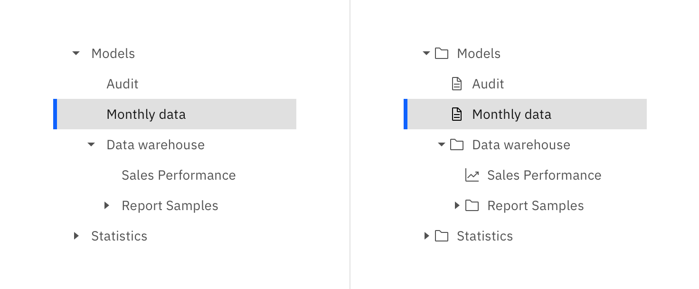

<PageDescription>

Tree views make displaying and navigating hierarchical data easier for your user. The parent and child nodes are purposely designed to nest and be used to organize a variety of complex data sets.

</PageDescription>

<AnchorLinks>

<AnchorLink>Overview</AnchorLink>
<AnchorLink>Formatting</AnchorLink>
<AnchorLink>Behavior</AnchorLink>
<AnchorLink>Content</AnchorLink>
<AnchorLink>Variations</AnchorLink>
<AnchorLink>Related</AnchorLink>

</AnchorLinks>

## Overview

Many products must display large sets of data that their users navigate to complete tasks. The tree view organizes this data in parent and child nodes that follow conventional behaviors of data trees and file browsers in operating systems.

### When to use

Use the tree view to visualize and users to navigate up and down tree data structures. Compared to similar components like accordion, left nav, or data table, the tree view is better suited for navigating deeper hierarchical levels.

<Row>
<Column colLg={8}>

</Column>
</Row>

Characteristic of the tree view make it suited for navigating data structures and should not be used as the primary navigation in a product's UI. Instead, use the UI Shell left panel for product navigation. A combination of the [UI shell left panel](/components/UI-shell-left-panel/code) and the [breadcrumb component](/components/breadcrumb/code) can support an information architecture several levels deep.

<DoDontRow>
<DoDont
type="do" colLg={6}
caption="Do use the UI shell left panel and breadcrumbs for product navigation.">

</DoDont>
<DoDont colLg={6}
type="dont"
caption="Do not use the tree view as the product's main navigation.">

</DoDont>
</DoDontRow>

Do not use the tree view as a way to show and hide other UI elements or content. The aesthetics and functions of the tree view are intended to organize large groups of nested nodes and make navigating up and down data structures more efficient. Other components, like the [accordion](/components/accordion/code), are better suited for displaying different types of content.

<DoDontRow>
<DoDont colLg={6}
type="do"
caption="Do place content in the accordion component.">

</DoDont>
<DoDont colLg={6}
type="dont"
caption="Do not place any element that is not a tree node in the tree view.">

</DoDont>
</DoDontRow>

### Tree view types

<Row>
<Column colLg={8}>

</Column>
</Row>

| Type           | Purpose                                                                                                                                                       |
| -------------- | ------------------------------------------------------------------------------------------------------------------------------------------------------------- |
| Text only      | Where the node type is unknown, not necessary to indicate, or the nodes are the same type.                                                                    |
| Text with icon | For indicating the node type. This is useful when the node type can be known in the data and if there could be different types of data displayed in the tree. |

## Formatting

### Anatomy

The tree view represents a data structure by the nesting of parent and end nodes.

<Row>
<Column colLg={8}>

</Column>
</Row>

1. Open parent node
2. End node
3. Selected node
4. File type icon
5. Closed parent node

#### Parent node

A parent node is a node that can be opened or closed to reveal the nested children nodes. These children nodes may be other parent nodes or end node. If the data requires it, a parent node could be selected independently of the click and expand behavior.

The parent node uses the caret icon to indicate its opened or closed state. Using the caret icon sets the tree view apart from the chevron used in the UI shell left nav and reduces the visual clutter when next to the file type icons. These differences aim to distinguish the tree view component from the UI shell left nav.

If the parent of a selected node is collapsed that parent should inherit the selected state so the user does not lose the context of what is selected.

<Row>
<Column colLg={8}>

</Column>
</Row>

<Caption>
  An example of the parent node inheriting the selected state when closed.
</Caption>

A folder is often used as a metaphor for the parent node and is represented with a folder icon. Make sure the folder is an appropriate metaphor for your data and to be consistent when picking an icon to represent all parent nodes in your tree view.

#### End node

An end node is any node that does not have nested children. These nodes can appear at any level of the hierarchy.

#### File type icon

This variant of the tree view can be used to indicate an extra level of information about the file or data type of the node. Do not mix the icon and non-icon nodes in a tree view. This can cause unexpected indentation of text and make the visual grouping of children nodes less obvious.

### Placement

The tree view relies on type alignment to visually group nodes. Icons and carets in 16px columns to make the most efficient use of horizontal space in order to achieve that type alignment and grouping.

<Row>
<Column colLg={8}>

</Column>
</Row>

<Caption>
  Type alignment is used to show grouping and nesting for tree views with or
  without icons.
</Caption>

## Behavior

### States

The parent and end nodes both share the same styles for the different states. The only difference being the addition of a caret for the parent node's open and closed state.

<Row>
<Column colLg={12}>

</Column>
</Row>

The hit area, background, and selected state of a node should extend to the full width of the tree view's container. This gives every node in the tree view same size hit area and visual weight when selected.

<DoDontRow>
<DoDont
type="do" colLg={6}
caption="Do use the UI shell left panel and breadcrumbs for product navigation.">

</DoDont>
<DoDont colLg={6}
type="dont"
caption="Do not use the tree view as the product's main navigation.">

</DoDont>
</DoDontRow>

## Modifiers

### Node height

There are two node sizes: default, and small. Both text-only and icon and text nodes can be used in either of these sizes.

| Node size | Height (px/rem) | Use case                                                                                                                                                                      |
| --------- | --------------- | ----------------------------------------------------------------------------------------------------------------------------------------------------------------------------- |
| Default   | 32 / 2          | For a tree view that uses a 32px row height and a similar geometry to the UI shell left nav.                                                                                  |
| Compact   | 24 / 1.5        | A more compact version of the tree view that uses a 24px row height. This gives a more condensed view of the data when it is more important to show more nodes on the screen. |

<Row>
<Column colLg={8}>

</Column>
</Row>

## Related

#### Components

- [Accordion](/components/accordion/code)
- [UI shell left panel](UI-shell-left-panel/code)
