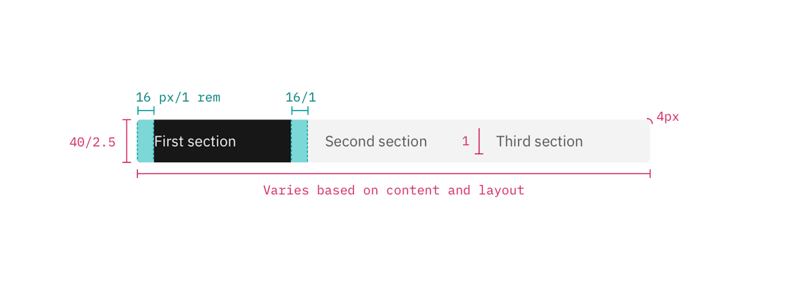

<PageDescription>

Component contributions can take several forms. Most are either component
enhancements or brand new assets.

</PageDescription>

<AnchorLinks>
  <AnchorLink>First steps to contributing</AnchorLink>
  <AnchorLink>Documentation templates</AnchorLink>
  <AnchorLink>Parts of a component contribution</AnchorLink>
</AnchorLinks>

## First steps to contributing

To contribute a component to Carbon, start by
[opening a Github issue](https://github.com/carbon-design-system/carbon/issues/new?assignees=&labels=type%3A+enhancement+%F0%9F%92%A1&template=feature-request-or-enhancement.md&title=).
Include a detailed description in which you:

- Explain the rationale
- Detail the intended behavior
- Clarify whether it's a variation of an existing component, or a new asset
- Include mockups of any fidelity (optional)
- Include any inspirations from other products (optional)

This issue will be the staging ground for the contribution and an opportunity
for the community to weigh in with any suggestions. We encourage you to surface
work in progress. Someone in the community may be working on the same component
and interested in collaborating with you.

## Documentation templates

Our component usage documentation typically contains three parts: usage
guidance, style guidance, and code guidance. Some components are more complex
than others but you should cover each topic included in these templates.

### Usage guidance for components with one type

Use this template for documenting components with only one type, that is, no
variants. You can see this template in use for
[Accordion](/components/accordion/usage) and
[Checkbox](/components/checkbox/usage).

```markdown
---
title: [Component name]
description: [Explains what the component is in one or two sentences.]
tabs: ['Usage', 'Style', 'Code', 'Accessibility']
---

<PageDescription>

<!-- Explains what the component is in one or two sentences. -->

</PageDescription>

<AnchorLinks>

<AnchorLink>Overview</AnchorLink> <AnchorLink>Live demo</AnchorLink>
<AnchorLink>Formatting</AnchorLink> <AnchorLink>Content</AnchorLink>
<AnchorLink>Behaviors</AnchorLink> <AnchorLink>Modifiers</AnchorLink>
<AnchorLink>Related</AnchorLink> <AnchorLink>References</AnchorLink>
<AnchorLink>Feedback</AnchorLink>

</AnchorLinks>

## Overview

<!--
Include a paragraph or two that describes the primary use cases for the component and details about how it helps the user achieve any tasks.

Example:

*The accordion component delivers large amounts of content in a small space through progressive disclosure. The header title give the user a high level overview of the content allowing the user to decide which sections to read.*
-->

### When to use

<!--
Include examples for when to use this component and how it addresses the use case / solves a problem for the user.

Example:

*Dropdowns can be used in forms on full pages, in modals, or on side panels. The dropdown component is used to filter or sort contents on a page. It is a stylized version of the select component, and can be styled as needed.*
-->

### When not to use (optional)

<!--
If there are two similar components that are used for different use cases, spell that out here and explain which component to use for each use case.

Example:

*It is best practice not to use a dropdown if there are two or fewer options to choose from. In this case, use a radio button group instead.*
-->

## Live demo

<!--Include component demo here.-->

## Formatting

### Anatomy

<!--The anatomy section has a set format and includes an example component with numbered callouts to each of the component elements. A list below provides the name of the element in bold and explains its purpose. Be sure to note if the element is optional.

See [Notification](https://www.carbondesignsystem.com/components/notification/usage#anatomy) for an example.-->

### Sizing (optional)

<!--List out any component sizes that are available and provide some guidance about how to choose the best size for the use case. Other topics that may be covered here include considerations around maximum heights, maximum widths, and responsive resizing.

Example:

*There are four responsive modal sizes: xs, small, default, large. Choose a size that works best for the amount of modal content you have. Modals with short messages should use a xs or small modal to avoid long single lines; for complex components, like data table the default or large modal will be more accommodating.*
-->

### Alignment (optional)

<!--
Consider the relationship with other items that are the same. How do they sit in groups? What is their juxtaposition. For example:

- Checkbox, radio button—what is their relationship horizontally and vertically?
- Notifications—how do they stack?
- Button—what happens when there's more than one?

We have some alignment content in the Structure section of the Style tab, so consider the relationship between the two tabs and include a cross-reference if necessary.

Example:

*Inside of a modal, body copy, including titles, have a 20% margin-right. However, form inputs and other components expand the full width of a modal window.*
-->

### Placement

<!--
Discuss placement of the component in a broader context, that is:

- alongside other components
- within the grid

You may want to include a link here to the Structure section of the Style tab.

Example:

*Accordions can be placed with main page content or placed inside of a container such as a side panel or tile. When placing an accordion on the 2x Grid the indented title aligns to the grid columns and the top and bottom borders hang in the gutter.*
-->

## Content

### Main elements

<!--
Identify the content elements within the component, for example, title, label, placeholder text, links. Use H4s for the element names and provide guidelines underneath for each element.

Briefly explain any particular rules such as phrase structure, word limits, and character limits. Where there's more than one rule, use bullets to list out the multiple rules for ease of reading. If necessary, refer out to main content guidelines for more detailed information, for example, capitalization, or recommended action labels.

See [Checkbox](https://www.carbondesignsystem.com/components/checkbox/usage#content) and [Modal](https://www.carbondesignsystem.com/components/modal/usage#content) for examples.
-->

### Overflow content

<!--
Explain how overflow content should be handled.

Example:

*When the accordion content is longer than the viewport the whole accordion should vertically scroll. Content should not scroll inside of an individual panel. Content should never scroll horizontally in an accordion.*
-->

### Further guidance

<!--
For further content guidance, see Carbon's [content guidelines]([https://www.carbondesignsystem.com/guidelines/content/general](https://www.carbondesignsystem.com/guidelines/content/general)).
-->

## Behaviors

<!--
Determine which component behaviors apply to your component, and include from the following sections as needed.
-->

### States

<!--
If including any information on this topic, include the following line:

For detailed visual information about the various states for this component, see the Style tab.

Example:

*The accordion component has two main states: collapsed and expanded. The chevron icon at the end of the accordion indicates which state the accordion is in. The chevron points down to indicate collapsed and up to indicate expanded.*
-->

### Interactions

<!--
Include all possible interactions with the component, including:

- Mouse
- Keyboard
- Screen readers

See [Accordion](https://www.carbondesignsystem.com/components/accordion/usage#interactions) for an example.
-->

### Validation

<!--
Include any guidelines for data validation and accompanying messaging. See [Form](https://www.carbondesignsystem.com/components/form/usage/#validation-and-errors) for an example.
-->

### Responsive behavior

<!--
Include details about how the component should behave in responsive situations.
-->

### Default selection

<!--
Cover guidance around default settings and provide rationale. See [Form](https://www.carbondesignsystem.com/components/form/usage/#default-values) and [Radio button](https://www.carbondesignsystem.com/components/radio-button/usage/#default-selection) for examples.
-->

### Clickable areas

<!--
Provide details about the clickable areas of the component.
-->

### Loading

<!--
If applicable, use this section to cross reference to the specific loading type in the [Loading component](https://www.carbondesignsystem.com/patterns/loading-pattern) and/or the [Loading pattern](https://www.carbondesignsystem.com/patterns/loading-pattern/).
-->

## Modifiers

<!--
The modifiers section shows different ways of styling the component. Here are some examples:

- adding an icon to a [button](https://www.carbondesignsystem.com/components/button/usage/#variations)
- adding a button to a [notification](https://www.carbondesignsystem.com/components/notification/usage/#anatomy)
- styling a dropdown to appear inline with other content
- using high and low contrast styles for [notifications](https://www.carbondesignsystem.com/components/notification/usage/#high-and-low-contrast)
- using a "light" variant in a [text input](https://www.carbondesignsystem.com/components/text-input/code)
-->

## Related

<!--
Did you reference other components or patterns? List them here.

If necessary, clarify any differences between this component and related components.
-->

## References

<!--
Include any research, citations, books or articles that you found helpful.
-->

## Feedback

<!--Include a request for feedback here.-->

Help us improve this component by providing feedback, asking questions, and
leaving any other comments on
[GitHub](https://github.com/carbon-design-system/carbon-website/issues/new?assignees=&labels=feedback&template=feedback.md).
```

### Usage guidance with multiple types

Use this template for documenting components that have multiple types or
variants. You can see this template in use for
[Dropdown](/components/dropdown/usage), [Modal](/components/modal/usage), and
[Notification](/components/notification/usage).

```markdown
---
title: [Component name]
description: [Explains what the component is in one or two sentences.]
tabs: ['Usage', 'Style', 'Code', 'Accessibility']
---

<PageDescription>

<!-- Explains what the component is in one or two sentences. -->

</PageDescription>

<AnchorLinks>

<AnchorLink>Overview</AnchorLink> <AnchorLink>Live demo</AnchorLink>
<AnchorLink>Formatting</AnchorLink> <AnchorLink>Content</AnchorLink>
<AnchorLink>Universal behaviors</AnchorLink> <AnchorLink>Component type
name</AnchorLink> <AnchorLink>Modifiers</AnchorLink>
<AnchorLink>Related</AnchorLink> <AnchorLink>References</AnchorLink>
<AnchorLink>Feedback</AnchorLink>

</AnchorLinks>

## Overview

<!--
Include a paragraph or two that describes the primary use cases for the component and details about how it helps the user achieve any tasks.
-->

### When to use

<!--
Include examples for when to use this component and how it addresses the use case / solves a problem for the user.

*Use a dialog to request information that is preventing the system from continuing a user-initiated process.*
-->

### When not to use (optional)

<!--
If there are two similar components that are used for different use cases, spell that out here and explain which component to use for each use case.

Example:

*Consider using a select dropdown if most of your experience is form based or frequently used on mobile platforms. The native select works more easily with a native form when submitting data and is also easier to use on a mobile platform.*
-->

### Types

<!--
Types are different variations of the component with significant visual or interaction differences, for example, primary button vs. secondary button vs. ghost button. Minor visual differences, such as button height, should be placed under modifiers.

Include a table with types of components and their purpose. Include links on the type names to the types sections below. See [Modal](https://www.carbondesignsystem.com/components/modal/usage#passive-modal) for an example.
-->

## Live demo

<!--
Include live demo here.
-->

## Formatting

<!--
### Anatomy

The anatomy section has a set format and includes an example component with numbered callouts to each of the component elements. A list below provides the name of the element in bold and explains its purpose. Be sure to note if the element is optional.

See [Notification](https://www.carbondesignsystem.com/components/notification/usage#anatomy) for an example.
-->

### Sizing (optional)

<!--
List out any component sizes that are available and provide some guidance about how to choose the best size for the use case. Other topics that may be covered here include considerations around maximum heights, maximum widths, and responsive resizing.

Example:

*There are four responsive modal sizes: xs, small, default, large. Choose a size that works best for the amount of modal content you have. Modals with short messages should use a xs or small modal to avoid long single lines; for complex components, like data table the default or large modal will be more accommodating.*
-->

### Alignment (optional)

<!--
Consider the relationship with other items that are the same. How do they sit in groups? What is their juxtaposition. For example:

- Checkbox, radio button—what is their relationship horizontally and vertically?
- Notifications—how do they stack?
- Button—what happens when there's more than one?

Alignment content is covered in the Structure section of the Style tab, so consider the relationship between the two tabs and include a cross-reference if necessary.

Example:

*Inside of a modal, body copy, including titles, have a 20% margin-right. However, form inputs and other components expand the full width of a modal window.*
-->

### Placement

<!--
Discuss placement of the component in a broader context, that is:

- alongside other components
- within the grid

You may want to include a link here to the Structure section of the Style tab.

Example:

*The checkbox component is often used in forms. Forms can be placed on a full page, in a modal or in a side panel. A checkbox can also be used for agreeing to terms and conditions or to filter information.*
-->

## Content

### Main elements

<!--
Identify the content elements within the component, for example, title, label, placeholder text, body copy, links. Use H4s for the element names and provide guidelines underneath for each element.

Briefly explain any particular rules such as phrase structure, word limits, and character limits. Where there's more than one rule, use bullets to list out the multiple rules for ease of reading. If necessary, refer out to main content guidelines for more detailed information, for example, capitalization, recommended action labels.

See [Checkbox](https://www.carbondesignsystem.com/components/checkbox/usage#content) and [Modal](https://www.carbondesignsystem.com/components/modal/usage#content) for examples.
-->

### Overflow content (optional)

<!--
Explain how overflow content should be handled.

Example:

*When the modal content is longer than the modal height then the body section should scroll vertically with the header and footer remaining fixed in place. The content should visibly fade at the end of the modal body area to indicate there is additional content out of view.*
-->

### Further guidance

For further content guidance, see Carbon's
[content guidelines](<[https://www.carbondesignsystem.com/guidelines/content/general](https://www.carbondesignsystem.com/guidelines/content/general)>).

## Universal behaviors

<!--
If there are any *universal* behaviors that apply to all types listed in the types table above, include them here. For example, the Modal component has a heading here for "Trap focus" as this applies to all modal types.

Where behaviors are *unique* to each type of component, include them in the next section which goes into detail about each type.

Include the following line to introduce the universal behaviors:

Example:

*The behaviors listed in this section are universal across all of the types. For behaviors that are unique to each type, see each of the component type sections below.*

Choose from this list of possible behaviors that are *universal* across all types, and include them here as H3 headings.
-->

### States

<!--
If including any information on this topic, include the following line:

For detailed visual information about the various states for this component, see the Style tab.

Example:

*The accordion component has two main states: collapsed and expanded. The chevron icon at the end of the accordion indicates which state the accordion is in. The chevron points down to indicate collapsed and up to indicate expanded.*
-->

### Interactions

<!--
Include all possible interactions with the component, including:

- Mouse
- Keyboard
- Screen readers

See [Accordion](https://www.carbondesignsystem.com/components/accordion/usage#interactions) for an example.
-->

### Validation

<!--
Include any guidelines for data validation and accompanying messaging. See [Form](https://www.carbondesignsystem.com/components/form/usage/#validation-and-errors) for an example.
-->

### Responsive behavior

<!--
Include details about how the component should behave in responsive situations.
-->

### Default selection

<!--
Cover guidance around default settings and provide rationale. See [Form](https://www.carbondesignsystem.com/components/form/usage/#default-values) and [Radio button](https://www.carbondesignsystem.com/components/radio-button/usage/#default-selection) for examples.
-->

### Clickable areas

<!--
Provide details about the clickable areas of the component.
-->

### Loading

<!--
If applicable, use this section to cross reference to the specific loading type in the [Loading component](https://www.carbondesignsystem.com/patterns/loading-pattern) and/or the [Loading pattern](https://www.carbondesignsystem.com/patterns/loading-pattern/).
-->

## Component type name

<!--
Rename this H2 heading with the first component type name, and include as many H2 sections as you have types.

This section describes each of the component types listed in the Types table in the Overview, and highlights any behavior that is *unique* to the component type. Cover the topics from Universal behaviors above, as needed.

And again, if any behavior is *universal* to the component, cover that in the "Universal behaviors" section above.

For examples of how to lay out this kind of information, see [Dropdown](https://www.carbondesignsystem.com/components/dropdown/usage) and [Modal](https://www.carbondesignsystem.com/components/modal/usage#variations).
-->

## Modifiers

<!--
The modifiers section shows different ways of styling the component. Here are some examples:

- adding an icon to a [button](https://www.carbondesignsystem.com/components/button/usage/#variations)
- adding a button to a [notification](https://www.carbondesignsystem.com/components/notification/usage/#anatomy)
- styling a dropdown to appear inline with other content
- using high and low contrast styles for [notifications](https://www.carbondesignsystem.com/components/notification/usage/#high-and-low-contrast)
- using a "light" variant in a [text input](https://www.carbondesignsystem.com/components/text-input/code)
-->

## Related

<!--
Did you reference other components or patterns? List them here.

If necessary, clarify any differences between this component and related components.
-->

## References

<!--
Include links to any research, citations, books or articles that you found helpful.
-->

## Feedback

Help us improve this component by providing feedback, asking questions, and
leaving any other comments on
[GitHub](https://github.com/carbon-design-system/carbon-website/issues/new?assignees=&labels=feedback&template=feedback.md).
```

### Style guidance

We're still working on this template. We'd love your
[help and feedback](https://github.com/carbon-design-system/carbon-website/issues/1246)!

```markdown
Help wanted!
```

### Code guidance

This page helps developers implement your component. Be specific, include code
snippets, and be sure to update as dependencies and versions change.

```markdown
---
title: [Component name (you won't need to write this)]
description: [Component description (you won't need to write this)]
tabs: ['Usage', 'Style', 'Code', 'Accessibility']
---

<PageDescription>

<!-- How to build a [component name] using React. For code usage with other
frameworks, please follow the links in the live demo on the usage tab. -->

</PageDescription>

<AnchorLinks>

<AnchorLink>Overview</AnchorLink> <AnchorLink>[Component use-case]</AnchorLink>
<AnchorLink>Component API</AnchorLink> <AnchorLink>References</AnchorLink>
<AnchorLink>Feedback</AnchorLink>

</AnchorLinks>

## Overview

<!--
This should include the default use-case(s) for a component, at most 2.
This should be the most common way the component is used.
It should summarize what this common is for and provide snippets for how
to accomplish these common use-cases.

Example: You can build a breadcrumb using a combination of the Breadcrumb and BreadcrumbItem components. The Breadcrumb component accepts a list of BreadcrumbItem components as children and each BreadcrumbItem is responsible for displaying the page links in the hierarchy.
-->

### Skeleton

<!--
Include which component/s to use for the skeleton state and why it might be useful.

Example:

*You can use the BreadcrumbSkeleton component to render a skeleton variant of an breadcrumb. This is useful to display while content in your breadcrumb is being fetched from an external resource like an API.*
-->

## [Use case, for example, Skeleton state or Sorting]

<!--
Each use-case of this component becomes its own section. For example,
if an accordion had a skeleton then you would name this section Skeleton.

If the component had a specific piece of functionality or behavior, like
how you can sort with a Data Table, then Sorting would be the name of this
section.

This section should include an explainer for the use-case and when to use it,
along with a code snippet that someone could bring into their project.
-->

## Component API

### [Component name] props

| Prop        | Type     | Required | Default | Description |
| ----------- | -------- | -------- | ------- | ----------- |
| `className` | `string` | –        | –       | –           |

<!--
* Only specific required as `true`, if it's false you don't need to indicate that
* Specify the default value if applicable
* Provide a description if applicable
* Annotate the type using TypeScript type annotations
* Empty cells should be filled with en dashes (–)
* Table should be sorted in alphabetical order
-->

#### [Component name][prop name]

<!--
Used to clarify prop usage, provide additional info or snippets
-->

## References

<!--
A place for references, links, or a way clarify points made earlier
in the documentation.
-->

## Feedback

Help us improve this component by providing feedback, asking questions, and
leaving any other comments on
[GitHub](https://github.com/carbon-design-system/carbon-website/issues/new?assignees=&labels=feedback&template=feedback.md).
```

## Parts of a component contribution

Component contributions ideally include all of the following parts.

#### 1. A rationale

Explain how your component will add value to the system. Carbon serves the
widest possible range of products, and contributions that increase the scope of
the system are more likely to be accepted. Be sure to include any user
experience and interaction descriptions.

#### 2. A design spec

Create sizing and styling annotations for all aspects of the component. This
spec should provide a developer with everything they need to create the design
in code. Check out our
[production guidelines](https://github.com/carbon-design-system/carbon-website/wiki/Production-guidelines#spec-guidelines)
to get started.

You should include color tokens and type tokens used.

<Row>
<Column colLg={8}>



<Caption>Example of a design spec</Caption>

</Column>
</Row>

#### 3. A Sketch symbol

Any new components or changes to existing components will also live in the
[Carbon Sketch kit](/designing/kits/sketch) and so we'll need a Sketch symbol.
Check out
[Sketch's guide](https://www.sketch.com/docs/symbols/creating-symbols/) for
creating a symbol.

This symbol can be contributed with the asset or enhancement, but must be added
to the kit by one of its
[maintainers](/how-to-contribute/overview/overview#maintainers). To contribute a
symbol, simply open an issue in the
[kit repo](https://github.com/carbon-design-system/carbon-design-kit/issues).

#### 4. Usage documentation

For guidance, see our
[production guidelines](https://github.com/carbon-design-system/carbon-website/wiki/Production-guidelines#spec-guidelines)
and [documentation templates](#documentation-templates) above. Reading through
existing component documentation on the site will help also. Color and type
tokens will live in the style tab.

#### 5. Working code

The component or enhancement must be built in one of our supported frameworks
(Vanilla, React, Vue, or Angular). See the contribution guidelines for the
specific repo you intend to contribute to.

<Row className="resource-card-group">
<Column colMd={4} colLg={4} noGutterSm>
    <ResourceCard
      subTitle="Contribute to Carbon Components React"
      href="https://github.com/carbon-design-system/carbon/blob/master/.github/CONTRIBUTING.md"
      >

<MdxIcon name="github" />

  </ResourceCard>
</Column>
<Column colLg={4} colMd={4} noGutterSm>
  <ResourceCard
    subTitle="Contribute to Carbon Components Angular"
    href="https://github.com/IBM/carbon-components-angular/blob/master/README.md#contributing"
    >

<MdxIcon name="github" />

  </ResourceCard>

</Column>

<Column colMd={4} colLg={4} noGutterSm>
    <ResourceCard
      subTitle="Contribute to Carbon Components Vue"
      href="https://github.com/carbon-design-system/carbon-components-vue/blob/master/.github/CONTRIBUTING.md"
      >

<MdxIcon name="github" />

  </ResourceCard>
</Column>
</Row>

#### 6. Code documentation

Start with our [Code guidance](#code-guidance) template. We recommend reading
through existing code documentation on this site for inspiration.
