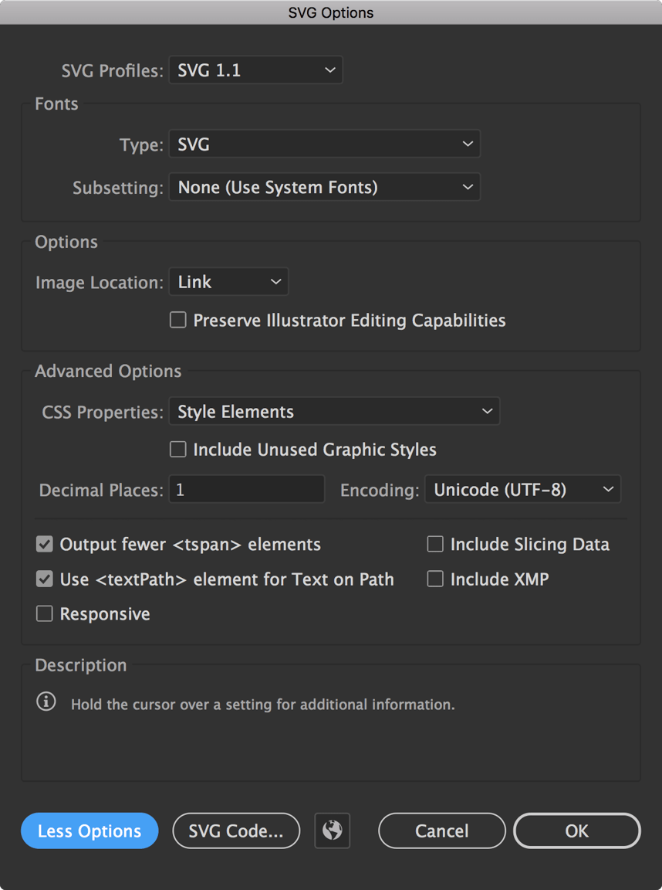

<AnchorLinks>

<AnchorLink>Design and production and guidelines</AnchorLink>
<AnchorLink>Making an icon</AnchorLink>
<AnchorLink>Exporting SVGs</AnchorLink>
<AnchorLink>Contribution process</AnchorLink>

</AnchorLinks>

## Design and production guidelines

Don't see the icon you need in the library? Make your own! Follow these
guidelines to ensure visual consistency and proper formatting.

- All icons should be unique and not redundant with any existing icons in the
  system. Search the [library](/guidelines/icons/library) for the keyword(s)
  associated with your proposed new icon to ensure that it is not already
  represented.
- All icons should adhere to the
  [IBM Design Language visual style](https://www.ibm.com/design/language/iconography/ui-icons/library).
- All icons should comply with IBM
  [accessibility standards](/guidelines/accessibility/overview).
- All icons should be usable across all supported platforms and devices.
- All icons should be understandable by a global audience of users, regardless
  of nationality or language.

## Making an icon

- Create a 16 x 16 or 32 x 32 px artboard for each icon.
- 16 px icons should have 1 px padding. 32 px icons should have 2 px padding.
- Set your workspace up from the start to snap to pixels and round values to
  whole pixels to avoid correcting shapes later.
- Never use center borders. Centering can cause half pixels.
- Avoid using the line tool; use the rectangle tool instead. The line tool will
  place the vector on half pixels.
- Be aware of automatic alignments which can place vectors on uneven or half
  pixels.
- Ungroup icon layers completely. The icon should be on the top-most layer in
  your artboard.
- Make sure to properly name layers and artboards _(these names will also be
  exported into the code)_.
- Review the
  [icon master file](https://github.com/carbon-design-system/carbon/tree/v10/packages/icons/master)
  to see these guidelines in practice.

### Production-ready

To be considered production-ready, all icon submissions must be delivered in SVG
format at 16 x 16 px (for integration with Carbon components) or 32 x 32 (for
service icons).

- Icons should be at whole pixels. No decimals are allowed in x and y
  coordinates or width and height fields.
- Each artboard and the artwork within it must be aligned to the pixel grid.
- All strokes must be expanded and at full pixel values.
- All possible shapes and paths should be combined.

## Exporting SVGs

### Export SVGs from Adobe Illustrator.

1. Draw a 16 x 16 or 32 x 32 px artboard. 16 px icons should have 1 px padding.
   32 px icons should have 2 px padding.
2. Place the icon squarely on the artboard, making sure it's aligned to the
   pixel grid.
3. Expand all strokes `Object` → `Expand`.
4. Select all overlapping shapes and click the "Unite" icon in the Pathfinder
   panel to merge all of the shapes together.
5. Make sure the icon is at `#000000` and has no additional styling.
6. Select `File` → `Save a Copy...` from the top navigation.
7. On the `Format` dropdown select "SVG".
8. Below `Format` select `Use Artboard`, then select either all or a range of
   artboards, depending on your need.
9. Click `Save`.
10. The `SVG Options` dialog will then open.
11. Make sure the preferences are the same as in the image below.

<Row>
<Column colMd={6} colLg={6}>

</Column>
</Row>

## Contribution process

Does your icon have potential for other products at IBM? If so, please consider
contributing to the design system. IBM welcomes icon contributions to our
iconography library. You’re welcome to submit a single icon or a batch of icons
for approval.

### Getting started

Before submitting artwork, first review our
[icons library](https://www.carbondesignsystem.com/guidelines/icons/library/) or
download the
[Carbon icon master .ai file](https://github.com/carbon-design-system/carbon/tree/v10/packages/icons/master)
to check your design for duplication against existing icons.

### Approval process

Icons for use within IBM must go through a design review process to ensure
consistency and proper representation of the IBM brand across all environments.
The process begins when you create a GitHub issue. Design review and approval
typically take 14–21 days from issue creation, depending on the number of icons
contributed.

If your submission is accepted, the team will assign someone to your issue. If
changes are needed, the team will note them in the issue and may return your
submission with recommendations or suggest reworking the icon based on feedback
from the Design System and Brand teams.

Once the submission is approved it will then go through our process to be
included into the Adobe Illustrator IBM Icon master file and be made available
in the IBM Design Language and Carbon libraries.

Submit icons for approval by creating a
[single](https://github.ibm.com/brand/ui-icons/issues/new?assignees=&labels=&template=single-ui-icon-approval.md&title=%5Bui-icon%5D)
or
[batch](https://github.ibm.com/brand/ui-icons/issues/new?assignees=&labels=&template=batch-ui-icon-approval-request.md&title=%5Bui-icon-batch%5D)
GitHub issue for your contribution.
