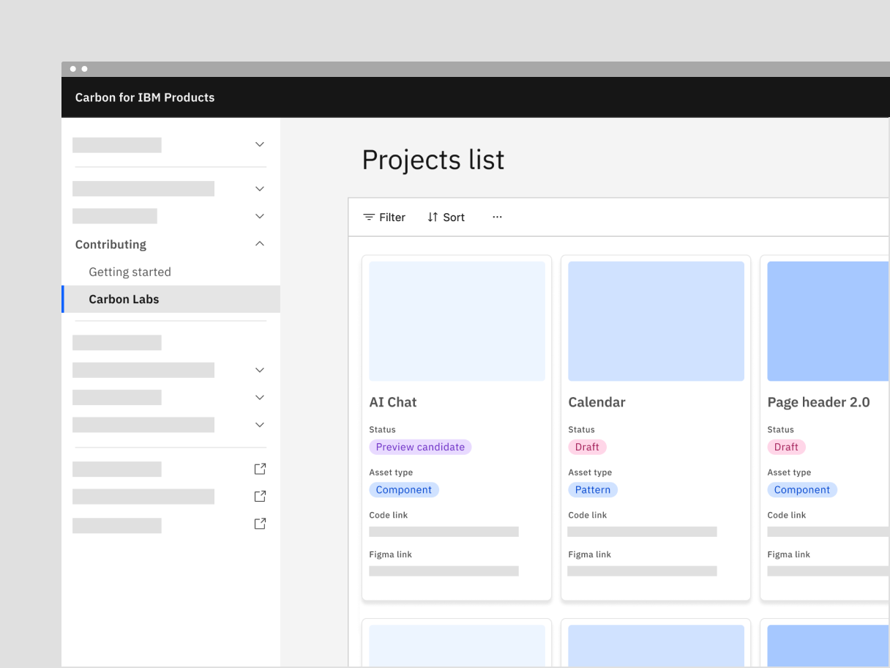

<PageDescription>

The Carbon Design System is made possible through a vibrant community of
designers and developers. Anyone can contribute code, design, and documentation.

</PageDescription>

<AnchorLinks>

<AnchorLink>Get started</AnchorLink>
<AnchorLink>Contribution gallery</AnchorLink>
<AnchorLink>Carbon champions</AnchorLink>
<AnchorLink>Carbon Labs</AnchorLink>
<AnchorLink>Types of contribution</AnchorLink>
<AnchorLink>The process</AnchorLink>

</AnchorLinks>

## Get started

If you're interested in getting involved but don't know where to start, welcome!
Designers and developers like you help to make Carbon great, and we're so glad
you're here.

To get started, subscribe to our [office hours](/whats-happening/meetups/) and
stop on by. We'll help you find an appropriate first contribution depending on
your skills and interests. Read on to learn about common types of contributions
and the process.

## Contribution gallery

In the past year, Carbon contributors have added features to components,
improved the React testing suite, created image production guidelines in Figma,
and so much more! Explore the gallery below to see a small sample of finished
projects.

<Row className="contribution-style">
<Column colMd={4} colLg={4} noGutterMdLeft>
<ArticleCard
      title="Carbon Tutorial"
      author="Adopter: Carbon Core"
      date="Date contributed: November 3rd 2023"
      readTime="Contributor: Jeremy Caine"
      href="https://carbondesignsystem.com/developing/react-tutorial/overview/">

</ArticleCard>
</Column>
<Column colMd={4} colLg={4} noGutterMdLeft>
<ArticleCard
      title="Two handle slider"
      author="Adopter: Carbon for IBM Cloud"
      date="Date contributed: October 24th 2023"
      readTime="Contributors: Kevin Camello, Matthew Oliveira"
      href="https://github.com/carbon-design-system/carbon/issues/6337">

</ArticleCard>
</Column>
<Column colMd={4} colLg={4} noGutterMdLeft>
<ArticleCard
      title="Sidenav delay on hover"
      author="Adopter: CDD Hub"
      date="Date contributed: May 31st 2023"
      readTime="Contributor: Shankar V."
      href="https://react.carbondesignsystem.com/?path=/story/components-ui-shell-sidenav--side-nav-rail-w-header">

</ArticleCard>
</Column>
<Column colMd={4} colLg={4} noGutterMdLeft>
<ArticleCard
      title="Read-only states"
      author="Adopter: Carbon for IBM Products"
      date="Date contributed: May 5th 2023"
      readTime="Contributors: Devin O’ Bryan, Mike Eaker, Lee Chase"
      href="https://carbondesignsystem.com/patterns/read-only-states-pattern/">

</ArticleCard>
</Column>
<Column colMd={4} colLg={4} noGutterMdLeft>
<ArticleCard
      title="Content Switcher: Icon only variant"
      author="Adopter: Carbon for Sustainability"
      date="Date contributed: May 1st 2023"
      readTime="Contributor: Diana Tran"
      href="https://react.carbondesignsystem.com/?path=/story/components-contentswitcher--icon-only">

</ArticleCard>
</Column>
<Column colMd={4} colLg={4} noGutterMdLeft>
<ArticleCard
      title="Combo Button"
      author="Adopter: Carbon for IBM Products"
      date="Date contributed: March 13th 2023"
      readTime="Contributor: Jan Hassel"
      href="https://react.carbondesignsystem.com/?path=/docs/components-combobutton--overview">

</ArticleCard>
</Column>
</Row>

## Carbon champions

Many thanks to our 2024 Carbon champions for making significant contributions to
the design system.

<Row className="mobile-columns">
<Column className="one" colSm={2} colMd={2} colLg={3}>

**Alan Greene**  Community support   **Daniel Karl
Weidele**  Carbon Labs   **Krista Starr** 
Accessibility   **Lily Peng**  Carbon Labs  
**Priyanshu Rai**  Carbon Labs   **Tom Waterton**  Content
enhancements   **Zak Crapo**  Tag enhancements

</Column>

<Column className="one" colSm={2} colMd={2} colLg={3}>

**Austin Viens-DeRuisseau**  Data spreadsheet and datagrid  
**Gentry Baird**  Login pattern and illustration   **Laura
Marshall**  Product gallery   **Manuel Ramos Gonzalez** 
Datagrid   **Robyn Johnson**  Acquisition migration  
**Twinkle Shah**  Tag enhancements

</Column>

<Column className="one" colSm={2} colMd={2} colLg={3}>

**Bridget Ndegee**  PLG onboarding   **Jeff Longshore** 
Carbon for IBM Products   **Laura Snider**  Content
enhancements   **Owen Cornec**  Carbon Labs   **Seonyu
Kim**  Datagrid   **Virginia Nicholson**  Tag enhancements

</Column>

<Column className="one" colSm={2} colMd={2} colLg={3}>

**Diana Sanborn**  Sustainability PAL   **John Stickley** 
Product handoff   **Lily Olive**   Product gallery and
tearsheet   **Paul Balchin**  Carbon for IBM Products  
**Stephanie Cree**  Tag enhancements   **Will Burroughs** 
App and UI icons

</Column>
</Row>

## Carbon Labs

While Carbon sets a high standard for asset stability, we do not want to stifle
innovation. Previously, we housed unfinished explorations alongside stable
components, which confused designers and developers about what was safe for use
in production. To address this, we created Carbon Labs as a dedicated
environment for explorations, separate from stable design system assets. It
includes a separate GitHub repo and Storybook for code assets and a dedicated
Figma space for design assets.

The purpose of Carbon Labs is to highlight innovation work that’s being done in
the ecosystem but has not yet met the
[definition of done](/contributing/product-development-lifecycle/#definition-of-done)
criteria. It is a community-organized incubation space for IBMers. The Carbon
community within IBM can add assets to Labs while in the
[Discovery phase](/contributing/product-development-lifecycle/#discovery). Types
of projects included in Labs should be design system related such as components,
patterns, shared utilities, or universal guidance.

_For IBMer only_: For more information and a list of projects currently in
Carbon Labs, go to
[Carbon Labs](https://pages.github.ibm.com/carbon/ibm-products/contributing/carbon-labs/)
under the contributing section on the Carbon for IBM Products website.

<Row>
<Column colLg={8}>

</Column>
</Row>

## Types of contribution

There are several ways you can contribute, depending on your interest and
bandwidth.

### Component enhancements

This work involves enhancing our components in code, like adding new features or
variants. Designers are often responsible for researching UX and visual
solutions and then creating a design spec for developers.
[Here are issues](https://github.com/carbon-design-system/carbon/issues?q=is%3Aopen+is%3Aissue+label%3A%22needs%3A+community+contribution%22+)
in our enhancement backlog that need design or development work.

### New components

New components are a large multidiscipline contribution and must be contributed
in phases to insure quality and business value. When making a net new component,
follow the [Product Development Lifecycle](/contributing/product-development-lifecycle/)
and complete all requirements in the
[component checklist](/contributing/component-checklist). All requirement
categories must be completed before a component can be considered done. We
recommend adding your component to
[Carbon Labs](/contributing/get-started/overview/#carbon-labs) in the discovery phases of
design and code development.

### Design kits

This work is all about creating and updating reusable components in Figma.
You'll get valuable Figma experience and will collaborate with the Figma Guild.
Check out the
[status of design kits](https://www.figma.com/file/CFMtqV5Nztdbm0mi2UiDLg/Library-%2B-Template-Planning?type=design&node-id=3713-26762&mode=design&t=HqvAYXUeccKNMstT-0)
and get involved by reaching out to the contacts listed.

### Website documentation

All components and patterns require usage, style, code, and accessibility
guidance on the Carbon website. You can learn how to contribute documentation
smoothly and utilize our markdown templates on the
[documentation](/contributing/documentation/) page. A list of components that
still need documentation help can be found
[here](https://github.com/carbon-design-system/carbon-website/issues/2085).

### Fixing issues and bugs

If you find a bug in the source code, you can help us by
[filling out a bug report](https://github.com/carbon-design-system/carbon/issues/new/choose)
and, ideally, submitting a pull request with a fix.

### Icons and pictograms

You can find instructions on how to create and contribute
[UI icons](https://www.ibm.com/design/language/iconography/ui-icons/contribute),
[app icons](https://www.ibm.com/design/language/iconography/app-icons/production),
and
[pictograms](https://www.ibm.com/design/language/iconography/pictograms/contribute)
on the IBM Design Language site.

## The process

Whether you’re contributing code, designs, or documentation, there’s a process
to follow.  For larger contributions like new components or patterns a more
rigorous process must be followed to insure production level quality and
business value. We have laid out the phases and criteria on the next page in
[contribution process](contributing/contribution-process).

For smaller contributions like small additions, enhancements, or bug fixes
follow the process below.

### 1. Find a project to work on

#### Volunteer for existing work

The best way to volunteer is to look through
[existing GitHub issues](https://github.com/carbon-design-system/carbon/issues?q=is%3Aopen+is%3Aissue+label%3A%22needs%3A+community+contribution%22+)
labeled with `needs: community contribution`. You can also filter by
[code](https://github.com/carbon-design-system/carbon/issues?q=is%3Aopen+is%3Aissue+label%3A%22needs%3A+community+contribution%22+label%3A%22needs%3A+code+contribution%22+)
or
[design](https://github.com/carbon-design-system/carbon/issues?q=is%3Aopen+is%3Aissue+label%3A%22needs%3A+community+contribution%22+label%3A%22needs%3A+design+contribution%22+)
work. Put a comment in the issue saying you'd like to help.

The Carbon team is also happy to help you find a good first issue. Just stop by
our [office hours](/whats-happening/meetups/) or send us a slack message.

#### Submit an idea

Have a new idea that you think would benefit Carbon? Or do you need to report a
bug? First, be sure to look through the
[issue backlog](https://github.com/carbon-design-system/carbon/issues) to make
sure it is a novel idea or bug. Then, file your proposal on GitHub using the
[issue templates](https://github.com/carbon-design-system/carbon/issues/new/choose).
If you're willing to work on this idea yourself, be sure to let is know in your
issue! Your idea will then go through a triage process by the Carbon team.

### 2. Iterate and get feedback

Most contributors work in groups of 2-3 and either set up weekly sessions or
join [meetups](/whats-happening/meetups/#carbon-office-hours) such as the Figma
Guild, Data Viz Guild, or office hours. In these sessions, it is common to share
work in progress and ask lots of questions. As you make progress, update your
GitHub issue.

### 3. Submit for review

#### Code deliverables

Work that results in code will be reviewed directly in a pull request.
Maintainers will be reviewing your work and making comments, asking questions
and suggesting changes before they merge your code. When you need to make a
change, commit and push to your branch normally. Once all revisions to your pull
request are complete, a maintainer will squash and merge your commits for you.

#### Contributor License Agreement

The Carbon core team is part of IBM. To accept contributions, we need a signed
Contributor License Agreement (CLA) from you before code contributions can be
reviewed and merged. You will be prompted to do this in your PR, but if you have
questions, please don't hesitate
to [reach out](/help/contact-us/#slack-channels).

#### Design deliverables

For work that does not have a code deliverable, such as revisions to Figma
libraries, ask the Carbon team how to finish your contribution.
