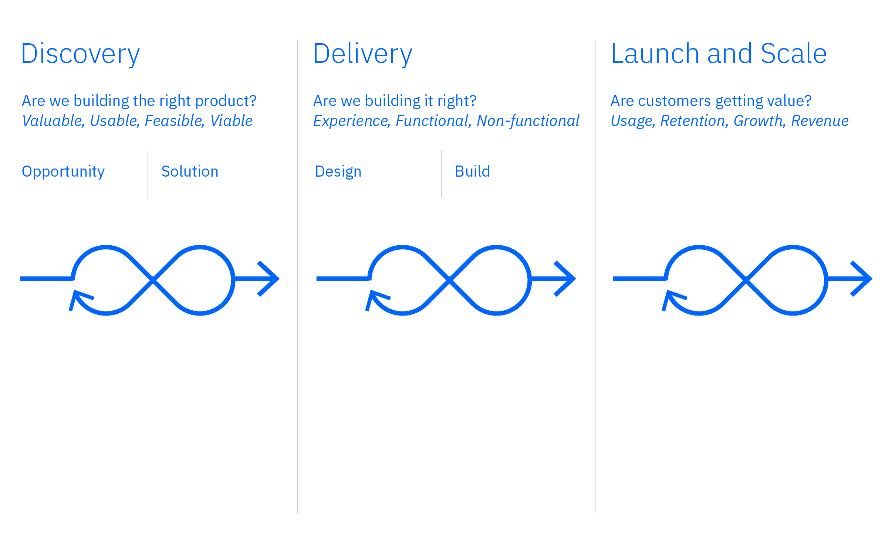

<PageDescription>

In order to contribute to the Carbon ecosystem, it’s essential that we explain
Carbon’s process, define milestones in each phase of contribution, and offer a
clear “definition of done” for our contributors.

</PageDescription>

<AnchorLinks>
<AnchorLink>Overview</AnchorLink>
<AnchorLink>Discovery</AnchorLink>
<AnchorLink>Delivery</AnchorLink>
<AnchorLink>Launch and scale</AnchorLink>
<AnchorLink>Definition of done</AnchorLink>

</AnchorLinks>

## Overview

IBM teams follow a process framework called the Product Development Lifecycle
(PDLC). IBM defines the PDLC as the process of taking a product capability from
an idea through its development and release to market and beyond. Since product
development takes place in a continuously evolving market, the framework creates
room for validation in every phase of the lifecycle.

The PDLC is organized into three phases: discovery, delivery, and launch &
scale. Once a product is in market, agile product teams do all these types of
work concurrently, in parallel work streams, with feedback from in-market
learnings shaping the priorities of both discovery and delivery.

#### PDLC applied to contribution

Carbon has applied the PDLC framework to how we expect new assets like
components, features, and patterns to be contributed to Carbon. We have broken
the contribution process up into the same three phases, each having their own
set of success criteria.

- **Discovery phase**: The purpose of the discovery phase is to address any
  major value, usability, feasibility, and viability risks ahead of delivering
  product-quality code in order to arrive at a successful product faster and at
  a lower cost.
- **Delivery phase**: The delivery phase emphasizes the disciplined execution of
  determining how we will realize user value and maximize the efficiency of
  building it. This includes the functional and non-functional requirements, and
  the user experience required for customers to adopt product features within a
  production setting.
- **Launch and scale phase**: Launch and scale of course, involves having
  clearly defined success criteria or learning objectives that are monitored
  after launch. In this phase, an asset will become stable and achieve Carbon’s
  “definition of done.”

_For IBMers only_: You can read more about the PDLC on the
[IBM Winning Products](https://w3.ibm.com/w3publisher/winning-products/how-we-work/product-development-lifecycle)
website.

<Row>
<Column colLg={12}>

</Column>
</Row>

## Discovery

The discovery phase is where research, exploration, and validation happen. This
is when innovations to the system are proposed and reviewed.

### Discovery criteria

For an enhancement or net new asset to warrant resourcing a discovery phase, we
need to determine the requirements for an asset to be considered as an
innovation. Proposals need to show that the component or pattern would be useful
to many teams and unique to the system.

#### Key considerations

- Does it replicate anything in the system already, or is there truly a gap?
- If the proposal does replicate an existing asset, is there evidence to show
  that the proposed solution is better?
- Is there already an existing issue or proposal in
  [Carbon](https://github.com/carbon-design-system/carbon/issues) or
  [Carbon for IBM Product's](https://github.com/carbon-design-system/ibm-products/issues)
  GitHub to address the gap?
- Is there evidence that the new asset or enhancement would be useful for many
  teams or services?
- What is the ratio of feasibility to impact to help prioritize (consult
  developers and accessibility SMEs)?

#### Discovery status

All assets in the discovery phase start as drafts. As the asset progresses in
its completeness and validation, it can graduate from `draft` to
`preview candidate`. This means it's ready to be reviewed and seriously
considered for inclusion as a maintained asset in the system. Carbon is not the
gatekeeper of the discovery phase; this phase is fully curated by the community
and innovators.

#### Add to Carbon Labs

Carbon Labs is a dedicated environment for discovery, separate from stable
design system assets. The purpose of Carbon Labs is to highlight innovation work
that’s being done in the ecosystem but has not yet met the definition of done
(stable) criteria. Both `draft` and `preview candidate` for design or code
assets are welcomed in Labs.

_For IBMer only_: Add your project to Labs to gain more visibility, buy-in, and
support from the Carbon community. For more information and a list of projects
currently in Carbon Labs, go to
[Carbon for IBM Products](https://pages.github.ibm.com/carbon/ibm-products/contributing/carbon-labs/).

#### Evaluation and next steps

The Carbon team and partners will review the proposals and determine next steps.
Only the Carbon team can move an asset from discovery to delivery in core Carbon
or Carbon for IBM Products.

Not all proposals in the discovery phase will move on in the lifecycle, some
explorations may not gain traction or may be deprioritized by other efforts.
This does not mean they are not valid or shouldn’t be used; it only means it
currently isn’t a priority to systematize at the core level.

It’s also important to note that Carbon does not take on ownership and
maintenance of certain types of assets like full applications, third party
tooling, and shared services. For example, although it is shared tooling, the
Carbon team does not include the Carbon for AI chat or IBM Assist Me in its
libraries.

## Delivery

In the delivery phase, the Carbon team usually collaborates with a workgroup or
discovery team to begin to codify and implement their asset for preview in the
Carbon library.

### Delivery criteria

As a component or pattern enters the delivery phase, we begin to complete the
requirements for an asset to reach `stable`. By aligning across the Carbon
ecosystem on our requirements for stability—or a
[definition of done](/contributing/product-development-lifecycle/#definition-of-done)—we
not only share our expectations with contributors, but we can more easily create
a backlog of work to prioritize and more clearly display the status of assets to
users.

#### Milestones

- Carbon team will collaborate with the subject matter experts and establish a
  feasible quarterly roadmap (3-in-a-box perspective)
- A strong source of truth has been established in Figma, including robust
  design specs and initial usage docs
- Identify 5–8 stakeholder teams for early usage and feedback
- Backlog work begins on kit, docs, code triumvirate per definition of done
- Any breaking changes are integrated into the Carbon library behind a
  [feature flag](/components/overview/feature-flags/)

#### Prioritization

Once a contribution enters the delivery phase, it must be prioritized against
the other contributions and work streams. The most important factor in
determining prioritization in the contribution pipeline is business impact. The
greater the case for reuse or support for a high-impact team, the more likely a
proposal is to move up in the pipeline and garner more Carbon resources.

#### Delivery status

All assets in the delivery phase are considered in `preview`. Carbon formerly
called this status “experimental” but we wanted to increase the confidence and
requirements of this status to be available for use in production. However, it
is not stable yet and breaking changes are still possible based on feedback from
use in products.

## Launch and scale

Launch and scale of course, involves having clearly defined success criteria or
learning objectives that are monitored after launch. In this phase, an asset
will become stable and achieve Carbon’s “definition of done” as defined below.

### Launch and scale criteria

In the delivery phase, the workgroups should begin to think about the
requirements for a component or pattern to become `stable`. In the launch and
scale phase, all of those requirements must be met.

#### Full, peer-review completed requirements

Along the way, you should be requesting peer on the various deliverables. It is
crucial to get reviews early and often to make sure all requirements are
accounted for. Reach out to the Carbon team if you are unsure who should review
your work.

#### Launch and scale status

All components in the launch and scale phase are `stable`. This means all
requirements in the assets
[definition of done](/contributing/product-development-lifecycle/#definition-of-done)
are complete and the asset is ready to use in production.

#### Final steps

- Once an asset is complete there should be a communication plan in place to
  raise awareness of the new work across multiple channels.
- PMs should also begin to track the usage (product insertions) of the new asset
  via Figma’s API and the IBM Telemetry service.

## Definition of done

By aligning on the requirements for what it means for an asset to be done, we
can create a backlog of work to be prioritized, better differentiate when an
asset is a component versus a pattern, share expectations with contributors, and
display the status of assets to users. With each phase, the component should
progress in its completeness. Once it has reached stable, then the asset will be
considered done.

| Status              | PDLC phase                                                                        | Description                                                                          |
| ------------------- | --------------------------------------------------------------------------------- | ------------------------------------------------------------------------------------ |
| `Draft`             | [Discovery](/contributing/product-development-lifecycle/#discovery)               | Partially complete, ready for validation.                                            |
| `Preview candidate` | [Discovery](/contributing/product-development-lifecycle/#discovery)               | Partially complete, with measurable results, stakeholders, and clear business value. |
| `Preview`           | [Delivery](/contributing/product-development-lifecycle/#delivery)                 | Mostly complete, changes possible based on feedback, available to use in production. |
| `Stable`            | [Launch and scale](/contributing/product-development-lifecycle/#launch-and-scale) | Complete across code, kit, docs, design, and ready for production use.               |

### Asset types

Defining and standardizing our terms across the ecosystem is crucial as we align
against the PDLC. In the past, teams operated under very different assumptions
about what is a “pattern” versus “component”. It has been difficult to move
towards stability without everyone being on the same page in this respect.

Eventually, all Carbon and Carbon for IBM Products resources (e.g. libraries,
assets, design kits) will follow a schema to standardize definitions and
documentation. However, for now, we’re just going to focus on defining the two
most important assets in our ecosystem. Each asset type has its own definition
of done that must be completed before an asset can be considered done.

| Asset type | Description                                                                                                                                                                                                                                                                                          |
| ---------- | ---------------------------------------------------------------------------------------------------------------------------------------------------------------------------------------------------------------------------------------------------------------------------------------------------- |
| Component  | An asset that has been designed and coded, that can be imported into a UI. See the [component checklist](/contributing/component-checklist/) for the definition of done.                                                                                                                             |
| Pattern    | Patterns are something that can be accomplished in multiple ways utilizing a combination of component(s) with additional design considerations. Because of the many ways patterns can be implemented, it is not possible to provide code for every scenario, but some patterns do have example code. |

### Review channels

As an asset moves through the phases, it needs to be reviewed to ensure all
requirements and criteria are being met. Below are the best ways to get a review
from the Carbon team. In order to not overwhelm these review channels the
community first needs to show significant interest in the discovery phase. The
community is the first approval gateway before the Carbon team engages with the
work.

| Review channel                                                                                                         | Description                                                                                                                                                                                                                                                                                       |
| ---------------------------------------------------------------------------------------------------------------------- | ------------------------------------------------------------------------------------------------------------------------------------------------------------------------------------------------------------------------------------------------------------------------------------------------- |
| [GitHub issue](https://github.com/carbon-design-system/carbon/issues/new?template=FEATURE_REQUEST_OR_ENHANCEMENT.yaml) | Open a feature request or enhancement issue in the Carbon GitHub outlining the gap that needs to be resolved. The issue should include all supporting materials and evidence you have gathered in the discovery phase. This can include competitive research, potential solutions, or prototypes. |
| [GitHub pull request](https://github.com/carbon-design-system)                                                         | Open a pull request in the appropriate Carbon GitHub repo for a final review of your completed contribution. If you are seeking feedback on a proof-of-concept, open a draft pull request instead.                                                                                                |
| [DSAG playback](https://ec.yourlearning.ibm.com/w3/meeting/10453549)                                                   | _For IBMers only_: Present your findings at a Design System Adoption Guild (DSAG) meeting. Sign up for a time slot when you are ready.                                                                                                                                                            |
| [Carbon office hours](https://ec.yourlearning.ibm.com/w3/series/10289694?layout=grid)                                  | _For IBMers only_: Carbon offers both a development and design specific sessions. Sign up for a time slot when you are ready.                                                                                                                                                                     |
