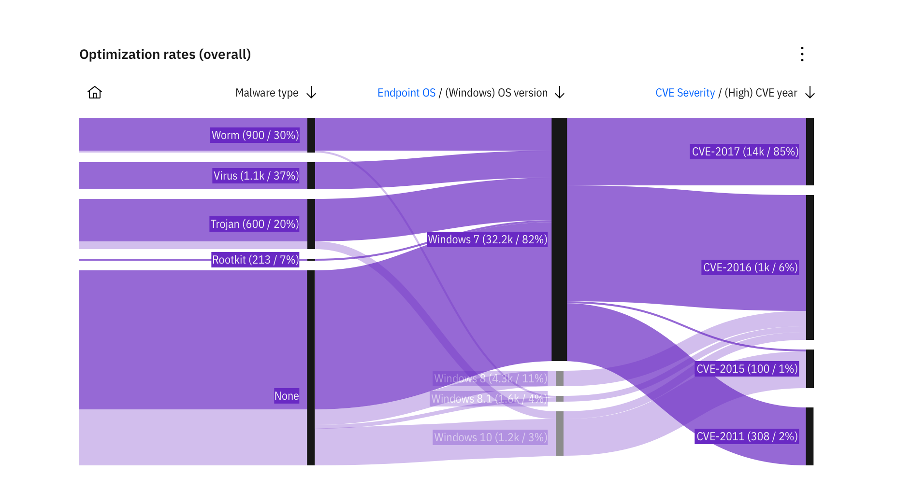
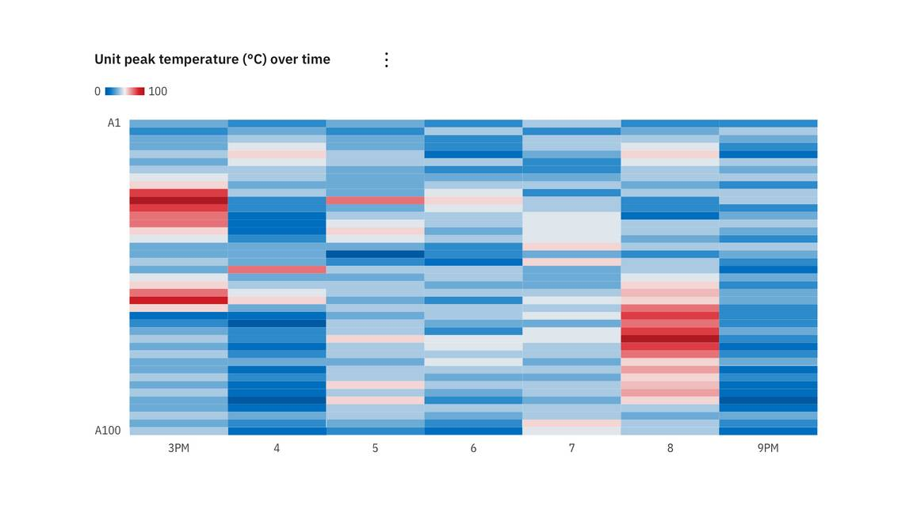
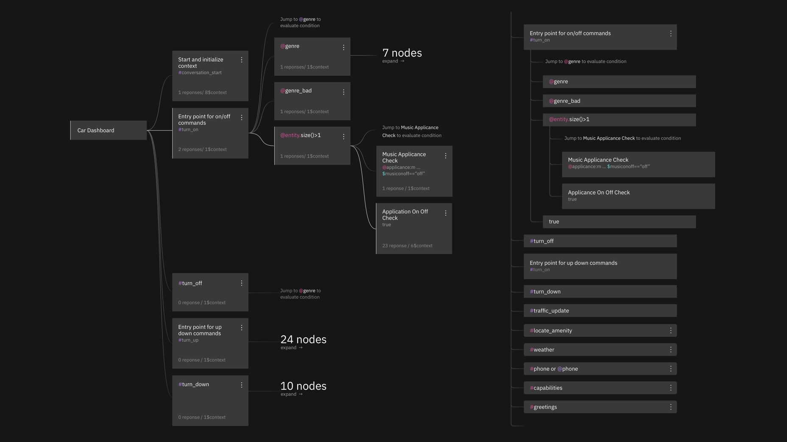
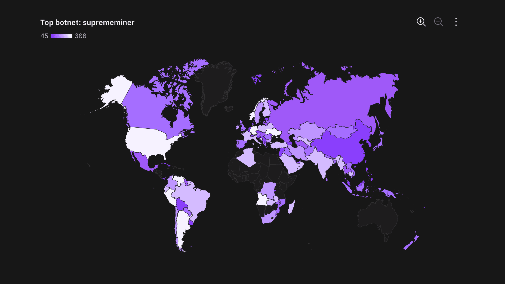

<PageDescription>

Advanced charts are a powerful way to display complex data sets. While less intuitive than basic charts, the visualizations should still tell a story the user can understand.

</PageDescription>

<InlineNotification>

**Note:** Advanced charts are not included in the Carbon Charts repostitory yet. To see our roadmap, make feature requests, or contribute, please go to the carbon-charts [GitHub repository](https://github.com/carbon-design-system/carbon-charts).

</InlineNotification>

<AnchorLinks>

<AnchorLink>Alluvial diagram</AnchorLink>
<AnchorLink>Heatmap</AnchorLink>
<AnchorLink>Tree diagram</AnchorLink>
<AnchorLink>Geography with overlays</AnchorLink>

</AnchorLinks>

## Alluvial diagram

Alluvial diagrams are a type of flow diagram that represents changes in network structure over time.

<Row>
<Column  colLg={8} colMd={6} colSm={4} >

<Caption>Example of an alluvial diagram</Caption>

</Column>
</Row>

## Heatmap

A heat map is a graphical representation of data where individual values contained in a matrix are represented as colors.

<Row>
<Column  colLg={8} colMd={6} colSm={4} >

</Column>
</Row>

## Tree diagram

A tree diagram visually represents hierarchy in a tree-like structure.

<Row>
<Column  colLg={8} colMd={6} colSm={4} >

<Caption>Tree diagram, node view vs. list view</Caption>

</Column>
</Row>

## Geography with overlays

### Choropleth map

A choropleth map uses differences in shading, coloring, or the placement of symbols within predefined areas to indicate the average values of a property or quantity in those areas.

<Row>
<Column  colLg={8} colMd={6} colSm={4} >

<Caption>Example of a choropleth map</Caption>

</Column>
</Row>

### Proportional symbol

Symobls driven by data are overlayed on geographical region. A common symbol used is bubble with the area of the circle proportional to its value in the dataset.

<Row>
<Column  colLg={8} colMd={6} colSm={4} >

<Caption>Example of a proportional symbol</Caption>

</Column>
</Row>

### Connecting lines

Connection maps display points on a map connected by straight or curved lines.

Connection maps are most useful when showing connections and relationships geographically. They can also be used to display map routes through a single chain of links.

Connection maps are particularly powerful when revealing spatial patterns through the distribution of connections or by how concentrated connections are on a map.

<Row>
<Column  colLg={8} colMd={6} colSm={4} >

<Caption>Example of a map with connecting lines</Caption>

</Column>
</Row>
