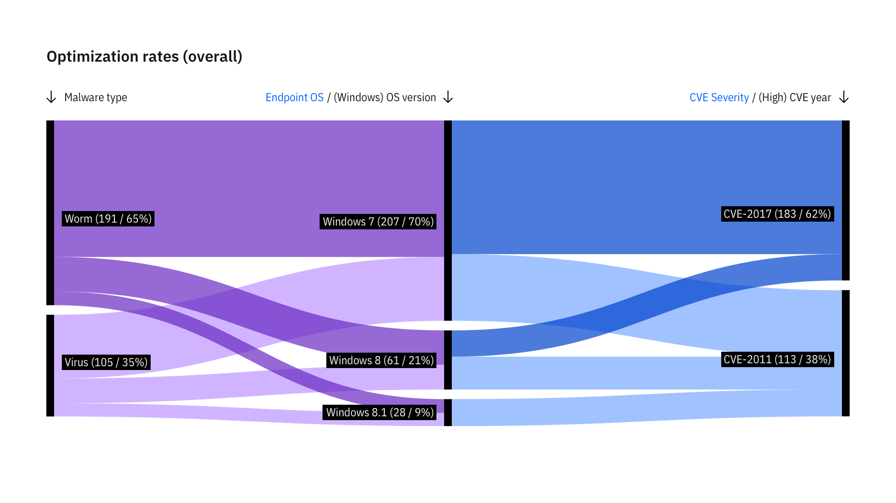
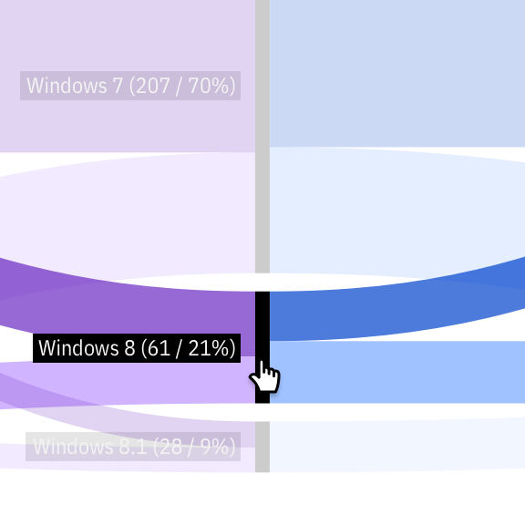
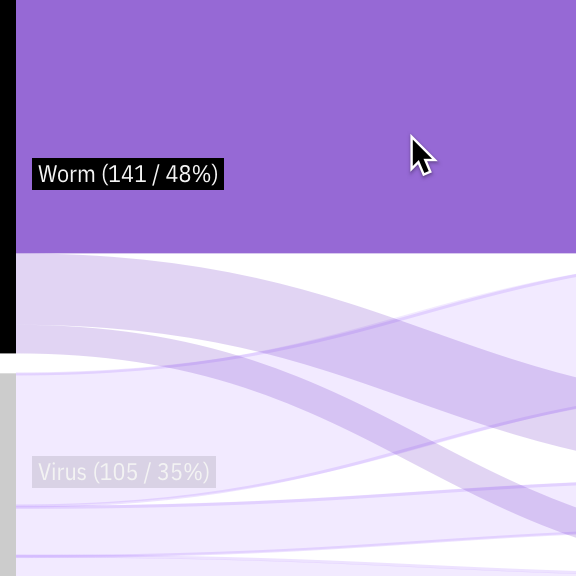
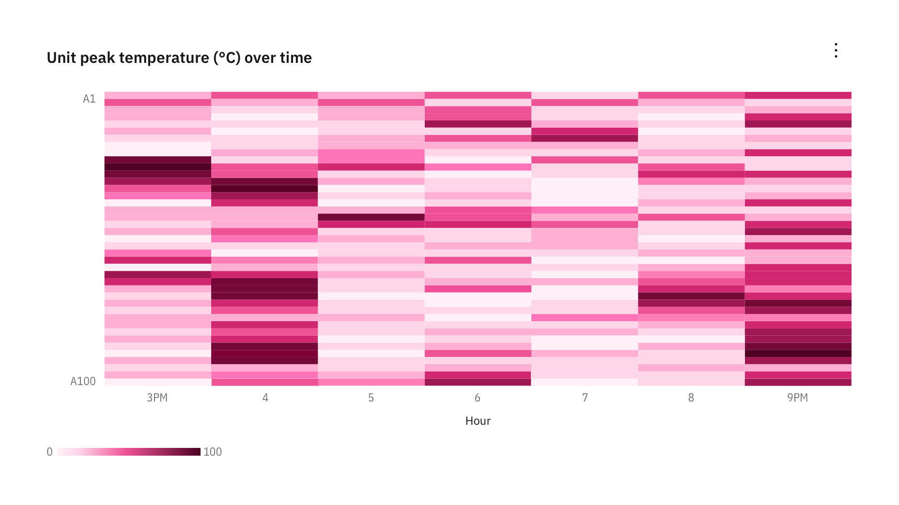
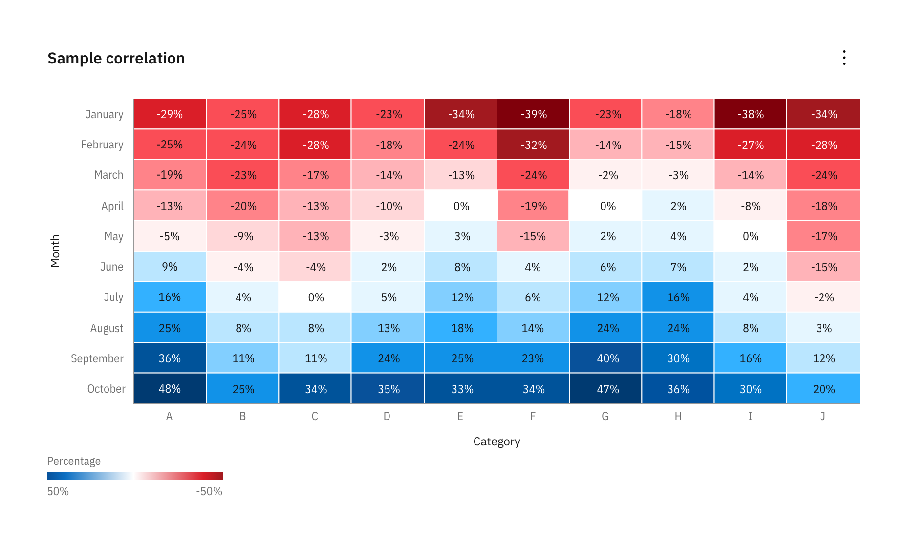
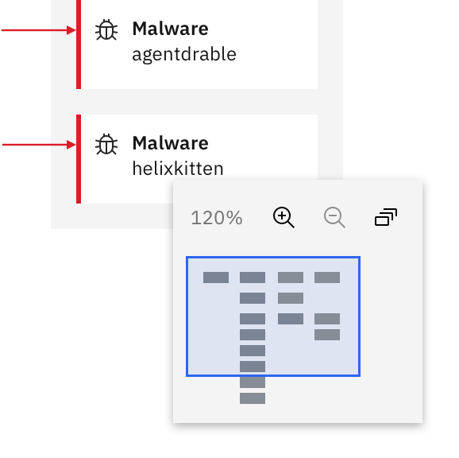
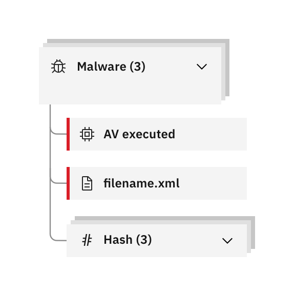
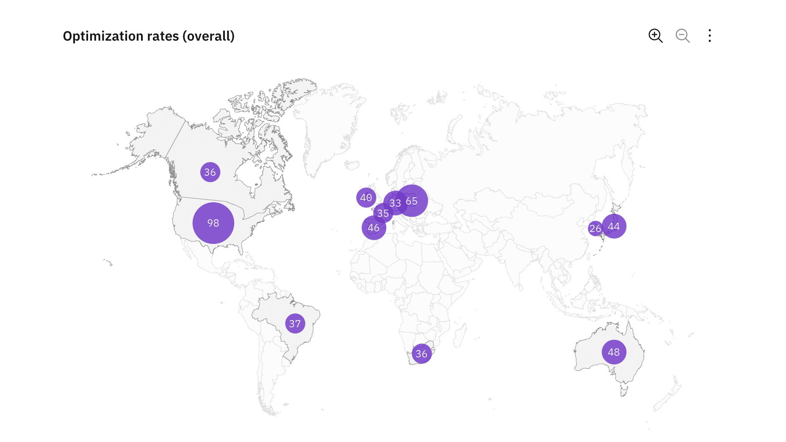
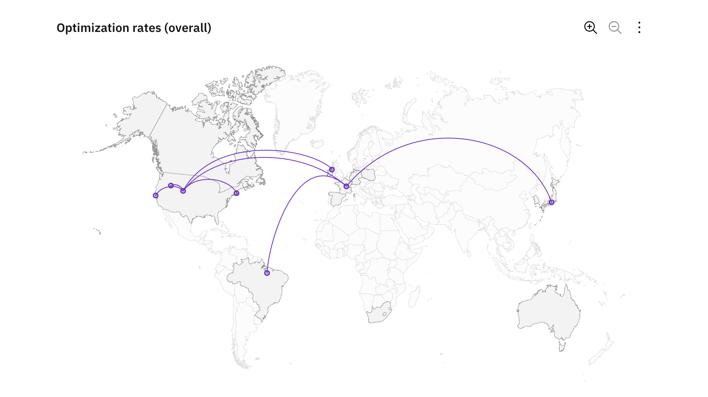

<PageDescription>

Advanced charts are a powerful way to display complex data sets. While less intuitive than basic charts, the visualizations should still tell a story the user can understand.

</PageDescription>

<InlineNotification>

**Note:** Advanced charts are not included in the Carbon Charts repository yet. To see our roadmap, make feature requests, or contribute, please go to the carbon-charts [GitHub repository](https://github.com/carbon-design-system/carbon-charts).

</InlineNotification>

<AnchorLinks>

<AnchorLink>Alluvial diagrams</AnchorLink>
<AnchorLink>Heatmaps</AnchorLink>
<AnchorLink>Network diagrams</AnchorLink>
<AnchorLink>Geospatial charts</AnchorLink>

</AnchorLinks>

## Alluvial diagram

Alluvial, or Sankey diagrams, are a type flow diagram designed to show two indicators of a dataset and how records distribute among them, highlighting correlations.

Multiple blocks of two indicators can be placed next to each other creating a wider alluvial diagram but it’s crucial to consider that this specific kind of chart does not show correlations between indicators that are not directly connected. This is usually emphasized using different set of colors for each block.

<Row>
<Column  colLg={12} colMd={8} colSm={4} >

<Caption>Example of alluvial diagram made with two blocks</Caption>

</Column>
</Row>

<Row>
<Column  colLg={4} colMd={4} colSm={4} >

<Caption>Detail of an alluvial diagram on node hover</Caption>

</Column>

<Column  colLg={4} colMd={4} colSm={4} >

<Caption>Detail of an alluvial diagram on link hover</Caption>

</Column>
</Row>

## Heat maps

A heat map is a graphical representation of data where the individual values contained in a matrix are represented as colors. When it comes to heat maps, the most common color ranges are expressed in either sequential and diverging color scales according to the typology of data represented.

#### Sequential scales

Sequential scales use a blended progression, typically of a single color, from the lightest to the darkest values, representing lows to highs. It’s best practice to use a sequential scale with values that are all positive or all negative. Sequential 
heat maps can leverage the full range of the palette (from 10-100) to maximize contrast. Please note that the 3:1 minimum contrast requirement does not apply to heat maps.

<Row>
<Column  colLg={12} colMd={8} colSm={4} >

<Caption>
  When cells get extremely small, a white boarder can hinder the intended
  affect.
</Caption>

</Column>
</Row>

#### Divergent scales

Diverging scales show color progression in two directions: dialing down the first value from one end to a neutral color at the inflection point (for example, a 0 value midway between -100 and +100), then increasing the opacity of the second value to the darker end of the scale.

[Divergent scales](../data-visualization/color-palettes#diverging-palettes) require 3 colors for their 3 correspondent values (min, max and inflection point) and they are referred to as “symmetrical” when the min/max values match and “assymetrical” otherwise. Although some examples use the stepped scale provided by the Carbon palette, divergent heat maps often leverage continous values to accomodate situations that require more than 10 values.

#### Inflection points

While min/max values can be automatically detected from data, inflection points can vary depending on data type. We default to zero in order to accomodate the most common cases and include a feature flag within the code to specify exceptions.

<Row>
<Column  colLg={12} colMd={8} colSm={4} >

<Caption>Example of a symmetrical divergent heat map with cell borders</Caption>

</Column>
</Row>

## Network diagrams

A network diagram is a way of visually representing network architecture. It maps out network structure with a variety of icons and connecting lines. It’s ideal for sharing the layout of a network because the visual presentation makes it easier for users to understand complex connections at a glance. These diagrams are especially useful for isolating problems or when designing a new system.

The example below illustrates a swimlane graph with expandable nodes developed by the Security team. In products like QRadar these diagrams are often paired with side and filter panels. However, a simplified version of the component is available in the Carbon Add-ons repo for IBM designers to adapt.

<InlineNotification>

**Note:** Some of the components below are available to consume in the Carbon Add-ons repo. Please check with the CLX team on Slack (#clx-framework) to verify before creating your own components [Carbon Add-ons repository](https://github.com/carbon-design-system/carbon-charts).

</InlineNotification>

<Row>
<Column  colLg={12} colMd={8} colSm={4} >

<Caption>Example of a network diagram in a swimlane graph from QRadar</Caption>

</Column>
</Row>

## Node types

This specific network diagram is comprised of parent and child nodes. In the QRadar example, parent nodes convey the story of what happened in an investigation and can be clustered based on relationship type. Child nodes appear under parent nodes and can also be clustered.

Network diagrams use the same scale controls that apply to the rest of the data visualization components, however they appear in a floating tile, enabling the user to zoom and pan simultaneously. It’s also helpful to include the expand and collapse all nodes feature, which gives users the ability to easily navigate between detailed and high-level views of the diagram.

<Row>
<Column  colLg={4} colMd={4} colSm={4} >

<Caption>Detail of floating zoom and pan functionality</Caption>

</Column>

<Column  colLg={4} colMd={4} colSm={4} >

<Caption>
  Detail of child nodes clustered underneath master parent cluster
</Caption>

</Column>
</Row>

## Geospatial charts

### Geographic overlays

#### Choropleth map

A map that uses differences in shading, coloring, or the placing of symbols within predefined areas to indicate the average values of a property or quantity in those areas.

<Row>
<Column  colLg={12} colMd={8} colSm={4} >

</Column>
</Row>

### Proportional symbol map

Symbols driven by data are overlayed in geographical regions. A common symbol used is a bubble with the area of the circle proportional to its value in the dataset.

<Row>
<Column  colLg={8} colMd={6} colSm={4} >

<Caption>Example of a proportional symbol</Caption>

</Column>
</Row>

### Connecting lines

Connection maps display points on a map connected by straight or curved lines.

Connection maps are most useful when showing connections and relationships geographically. They can also be used to display map routes through a single chain of links.

Connection maps are particularly powerful when revealing spatial patterns through the distribution of connections or by how concentrated connections are on a map.

<Row>
<Column  colLg={8} colMd={6} colSm={4} >

<Caption>Example of a map with connecting lines</Caption>

</Column>
</Row>
