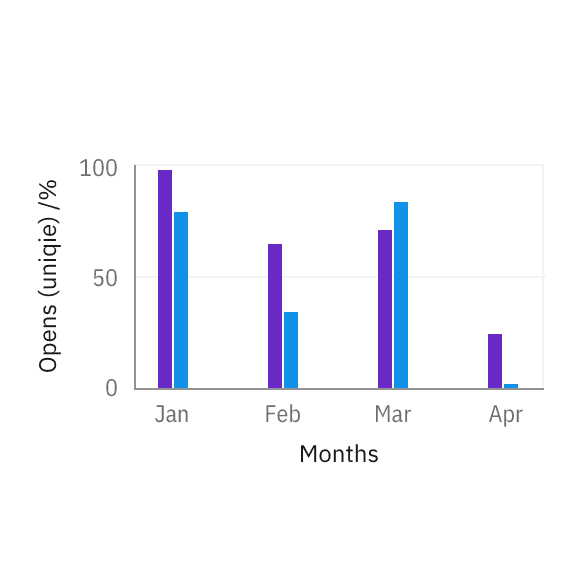
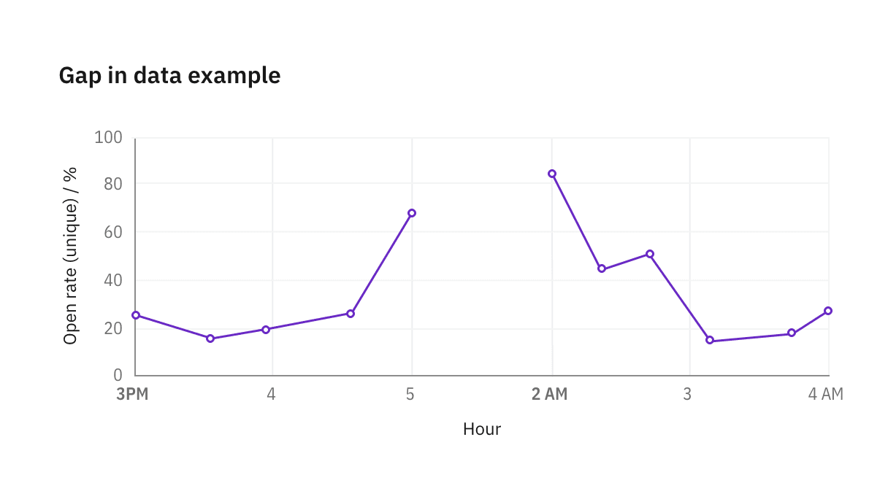
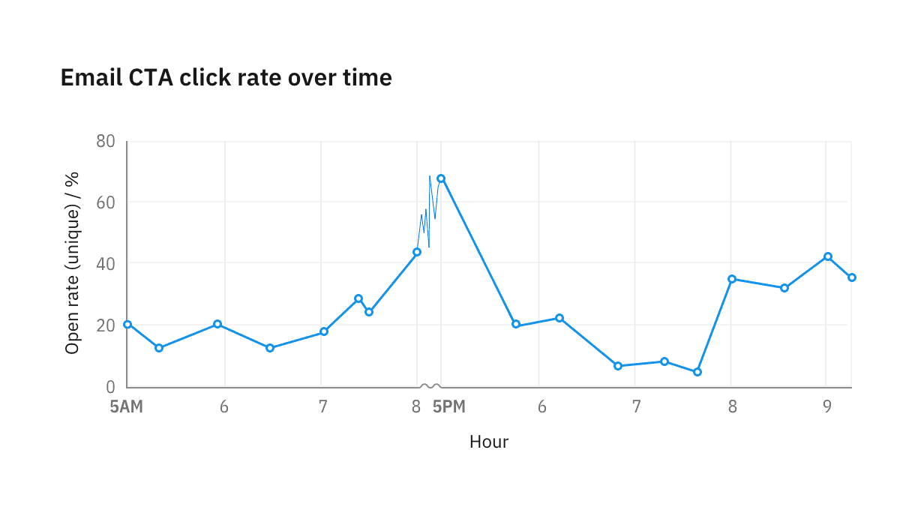
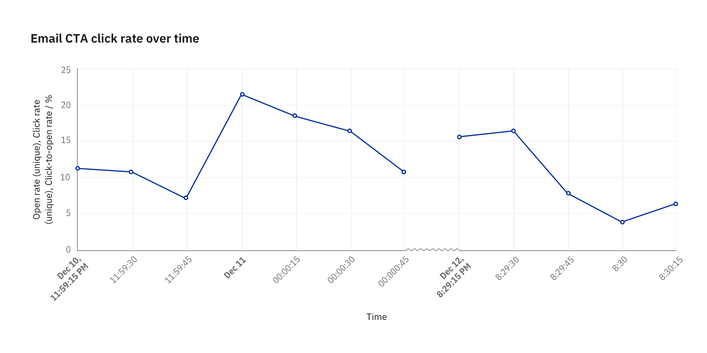

<PageDescription>

Axes and labels provide critical context for the information within a chart. Use
simple, easy-to-understand descriptors and metrics to label your chart and axes.

</PageDescription>

<InlineNotification>

**Note:** This guidance is a work in progress. To see our roadmap, make feature
requests, or contribute, please go to the carbon-charts
[GitHub repository](https://github.com/carbon-design-system/carbon-charts).

</InlineNotification>

<AnchorLinks>

<AnchorLink>Starting at zero</AnchorLink>
<AnchorLink>Gap in data</AnchorLink>
<AnchorLink>Breaks in axes</AnchorLink>
<AnchorLink>Time series</AnchorLink>

</AnchorLinks>

## Starting at zero

**Always start numerical axes at zero for part-to-whole and comparisons
charts.** For bar and area charts, a truncated Y-axis can distort the perceived
scale of a chart, making a small difference appear more significant than it is.

<DoDontRow>
<DoDont caption="For bar charts, the numerical axis should start at zero.">

</DoDont>
<DoDont type="dont" caption="When an axis starts at non-zero, percentage differences between bars are exaggerated.">

</DoDont>
</DoDontRow>

**It's acceptable to start line charts and scatter plots at a value higher than
zero.** These types of visualizations are less sensitive to distortion because
they communicate trends rather than difference in size or quantity. In these
cases, cropping the Y-axis helps users better identify the direction of change.

<Row>
<Column  colLg={8} colMd={4} colSm={4}>

<Caption>
  For line charts showing stock market activities, the existence of peaks and
  valleys in trends is more important than the true size of the change.
</Caption>

</Column>
</Row>

## Gaps in data

Use the designated texture to denote the range or period when data is not
available. Always label both start and end points where data is not available.

<Row>
<Column  colLg={8} colMd={4} colSm={4}>

</Column>
</Row>

## Breaks in axes

Sometimes it's useful to skip part of the axis to bring data on the extreme ends
into view without distortion. When axes contain a break, use a sinusoidal line
to replace the straight axis line.

On the X-axis, the break may be fluid with graph area size, with a minimum width
of 16px. On the Y-axis, we recommend fixing the distance break at 16px.

<Row>
<Column  colLg={8} colMd={4} colSm={4}>

</Column>
</Row>

If data is available during an axis break, restyle line segments to use 0.5px
stroke and hide circles representing data points.

<Row>
<Column  colLg={8} colMd={4} colSm={4}>

</Column>
</Row>

If data isn't available between break points, denote the data gap with a
texture.

<Row>
<Column  colLg={8} colMd={4} colSm={4}>

</Column>
</Row>

## Time series

#### Consistent increments

If any form of axis compression is required, use the provided
[axis break](#breaks-in-axes) styling to visually denote the compression.

#### Localization

In time series, X-axis labels reflect the time increment in the data. When
possible, use localized date and time format, or user preference. Otherwise, the
chart defaults to the format presented below.

#### Landmark labels

Whenever data cross into a new time cycle, such as a new day, month, or year,
semibold the label to emphasize the transition.

<Row>
<Column  colLg={12} colMd={4} colSm={4}>

<Caption>Example of a time series plotted at 15 seconds intervals</Caption>

</Column>
</Row>
