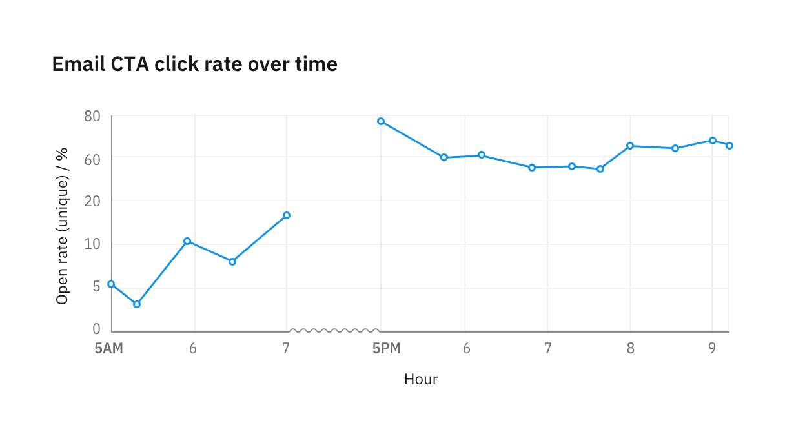

<PageDescription>

Axes and labels provide critical context for the information within a chart. Use
simple, easy-to-understand descriptors and metrics to label your chart and axes.

</PageDescription>

<InlineNotification>

**Note:** This guidance is a work in progress. To see our roadmap, make feature
requests, or contribute, please go to the carbon-charts
[GitHub repository](https://github.com/carbon-design-system/carbon-charts).

</InlineNotification>

<AnchorLinks>

<AnchorLink>Starting at zero</AnchorLink>
<AnchorLink>Gap in data</AnchorLink>
<AnchorLink>Breaks in axes</AnchorLink>
<AnchorLink>Time series</AnchorLink>

</AnchorLinks>

## Starting at zero

To start at zero, or not to start at zero. This is potentially history’s longest
debate. As a charting library, we would like to support both directions, with
the following recommendation.

#### When starting at non-zero is bad

Always start numerical axes at zero for part-to-whole and comparisons charts,
such as bar and area chart. Truncating the Y axis can distort the perception,
making a small difference look big and significant.

<DoDontRow>
<DoDont type="do" caption="For bar charts, the numerical axis should start at zero.">

</DoDont>
<DoDont type="dont" caption="When an axis starts at non-zero, percentage differences between bars are exaggerated.">

</DoDont>
</DoDontRow>

#### When starting at non-zero is good

Line charts and scatter plots are less sensitive to this distortion because they
are intended to communicate trends and not the relative size of the difference.
In these cases, cropping the Y axis helps users more easily identify the
direction of change.

<Row>
<Column colLg={8} colMd={8} colSm={4}>

<Caption>
  For line charts showing stock market activities, the existence of peaks and
  valleys in trends is more important than the true size of the change.
</Caption>

</Column>
</Row>

## Gaps in data

Never interpolate between periods when data is unavailable. Always label both
the start and end point during which data is not available.

<Row>
<Column colLg={8} colMd={8} colSm={4}>

</Column>
</Row>

## Breaks in axes

Sometimes it is useful to skip part of the axis to bring data on the extreme
ends into view without distortion. When the axis contains a break, use a
sinusoidal line to replace the straight axis line.

On the X axis, the break can be fluid with graph area size, with a minimum width
of 16px. On the Y axis, we recommend using a fixed distance of 16px for the
break.

If data is available during an axis break, re-style line segments to use 0.5px
stroke and hide circles representing data points.

<Row>
<Column colLg={8} colMd={8} colSm={4}>

</Column>
</Row>

If data isn’t available between axis breakpoints, leave the area empty.

<Row>
<Column colLg={8} colMd={8} colSm={4}>

</Column>
</Row>

## Time series

#### Consistent increments

Never change axis ticks increments to accommodate data availability. If any form
of axis compression is required, use the provided
[axis break styling](#breaks-in-axes) to visually denote the compression.

#### Localization

In time series, X-axis labels reflect the time increment in the data. When
possible, use localized date and time format, or user preference. Otherwise, the
chart defaults to the format presented below.

#### Landmark labels

Whenever data crosses into a new time cycle, such as a new day, month, or year,
semibold the label to make it a “landmark” label to provide additional context
for the labels following it.

<Row>
<Column colLg={12} colMd={8} colSm={4}>

<Caption>Example of a time series plotted at 15 seconds intervals</Caption>

</Column>
</Row>
