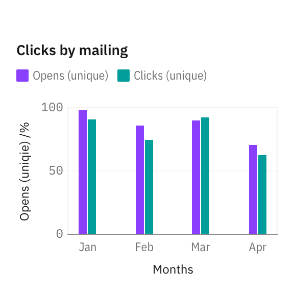
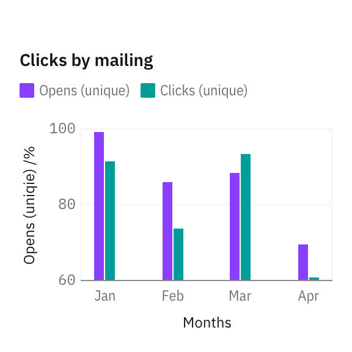
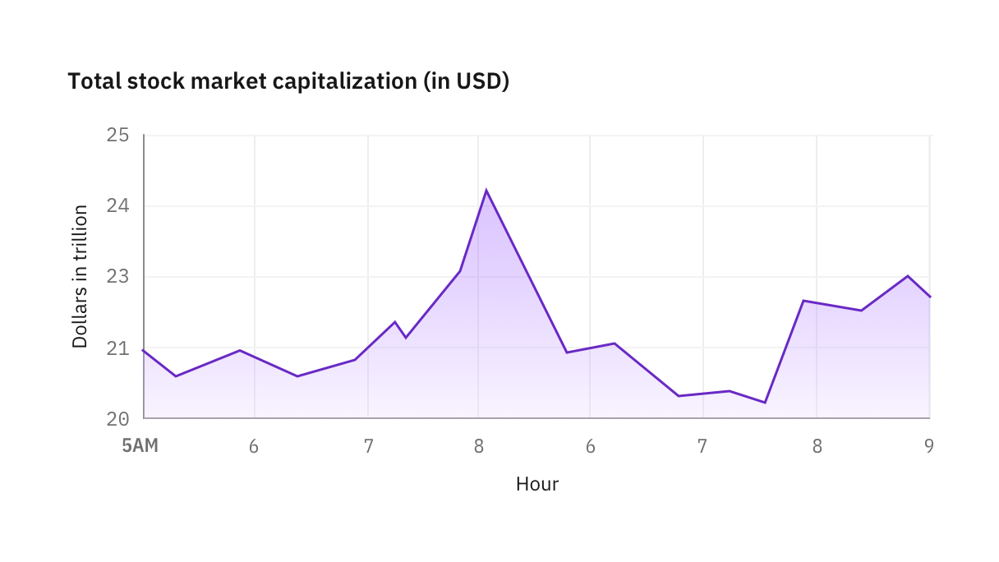
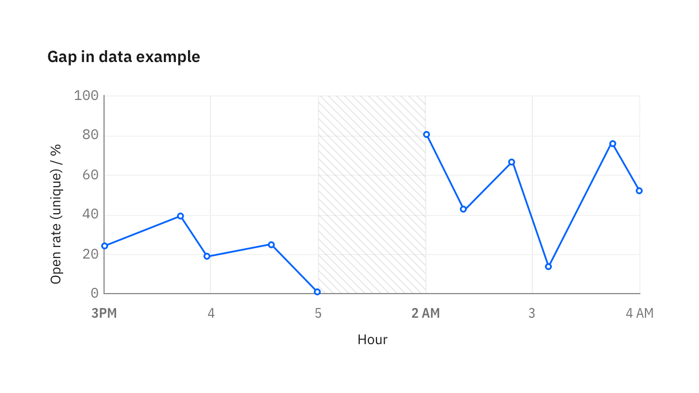
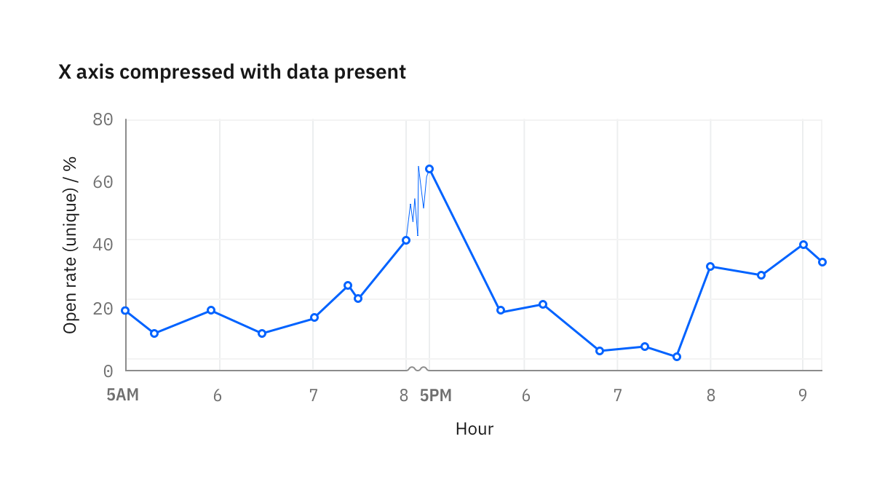
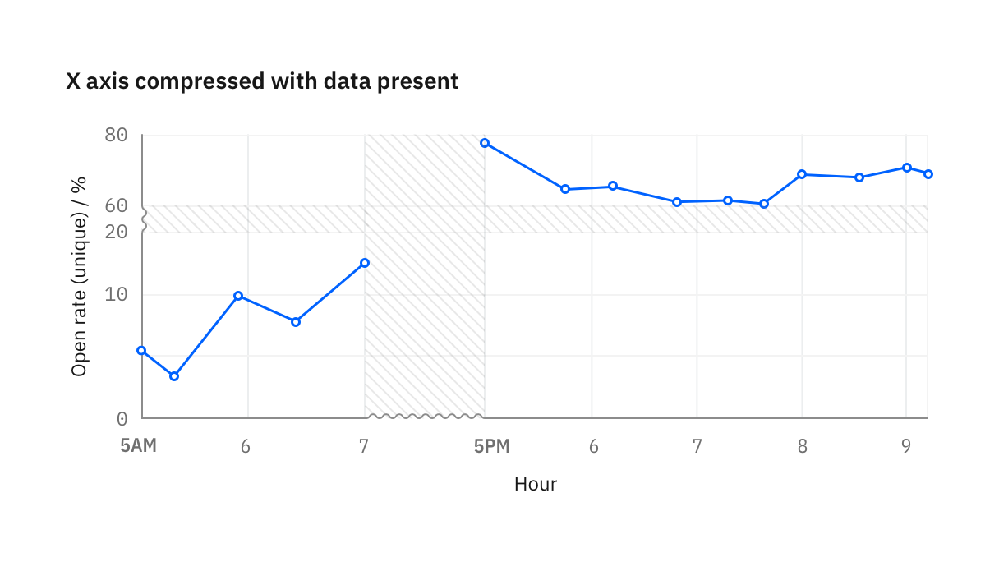

<PageDescription>

Legends summarize distinguishing visual properties such as colors or texture used in the visualization. A legend or key helps the user build the necessary associations to make sense of the chart.

</PageDescription>

<InlineNotification>

**Note:** This guidance is a work-in-progress. To see our roadmap, make feature requests, or contribute, please go to carbon-charts [GitHub repository](https://github.com/carbon-design-system/carbon-charts).

</InlineNotification>

<AnchorLinks>

<AnchorLink>Starting at zero</AnchorLink>
<AnchorLink>Gap in data</AnchorLink>
<AnchorLink>Breaks in axes</AnchorLink>
<AnchorLink>Time series</AnchorLink>

</AnchorLinks>

## Starting at zero

#### When starting at non-zero is bad

Always start numerical axis at zero for part-to-whole and comparisons charts, such as bar and area chart. Truncated Y axis can distortion the perception, making a small difference look big and significant.

<Row>
<Column  colLg={4} colMd={4} colSm={4}>
<DoDontExample type="do" caption="For bar charts, the numerical axis should start at zero.">

</DoDontExample>

</Column>
<Column  colLg={4} colMd={4} colSm={4}>

<DoDontExample type="dont" caption="When axis starts at non-zero, percentage differences between bars are exaggerated.">

</DoDontExample>

</Column>
</Row>

#### When starting at non-zero is good

Line charts and scatter plots are less sensitive to this distortion because they are intended to communicate trends and not relative size of the difference. In these cases, cropping the Y axis help users to better identify the direction of change.

<Row>
<Column  colLg={8} colMd={4} colSm={4}>

<Caption>
  For line charts showing stock market activities, the existence of peaks and
  valleys in trend is more important than the true size of the change.
</Caption>

</Column>
</Row>

## Gap in data

Use the designated texture to denote the range or period when data is not available. Always label both start and end point during which data is not available.

<Row>
<Column  colLg={8} colMd={4} colSm={4}>

</Column>
</Row>

## Breaks in axes

Sometimes it is useful to skip part of the axis to bring data on the extreme ends into view without distortion. When axis contain a break, use a sinusoidal line to replace the straight axis line.

On X axis, the break maybe fluid with graph area size, with a minimum width of 16px. On Y axis, we recommend fix the distance break to always be 16px.

If data is available during the break, restyle line segment to use 0.5px stroke and hide circles representing data points.

<Row>
<Column  colLg={8} colMd={4} colSm={4}>

</Column>
</Row>

If data is not available during the break, denote data gap with texutre.

<Row>
<Column  colLg={8} colMd={4} colSm={4}>

</Column>
</Row>

## Time series

In time series, X-axis labels reflect the time increment in the data. When possible, use localized date and time format, or user preference. Otherwise, the chart defaults to the format presented below.

Whenever data crosses into a new time cycle, such as a new day, month, or year, semibold the label to make it a “landmark” label to provide additional context for the labels following it.

<Row>
<Column  colLg={12} colMd={4} colSm={4}>

</Column>
</Row>
