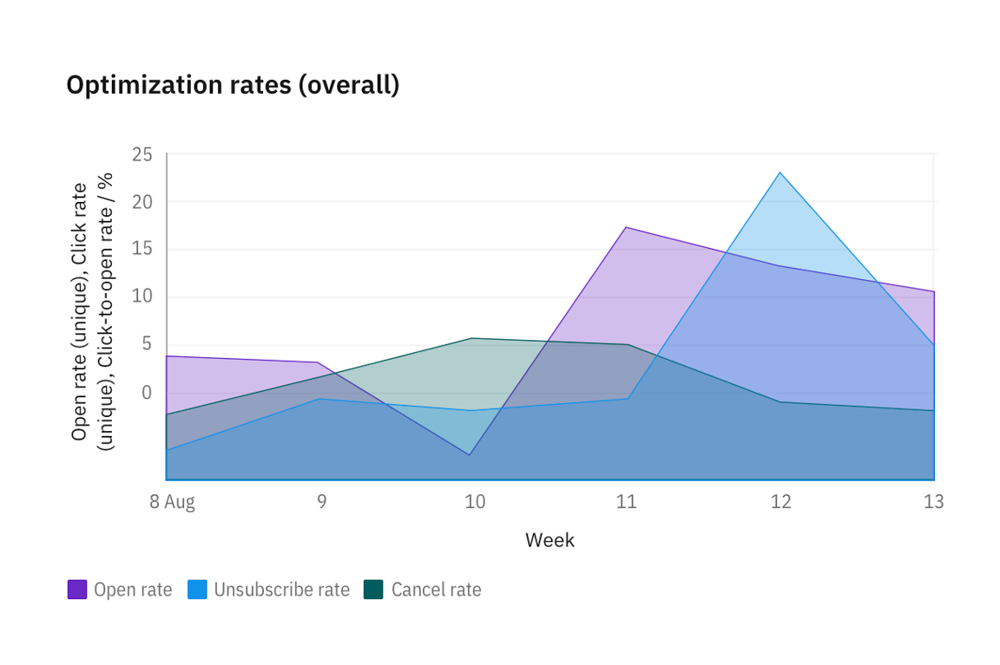
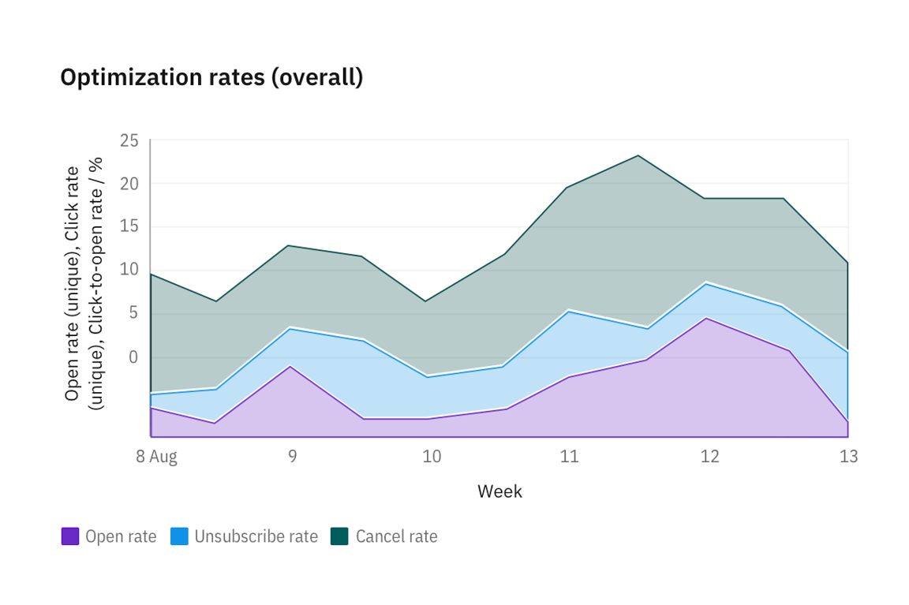
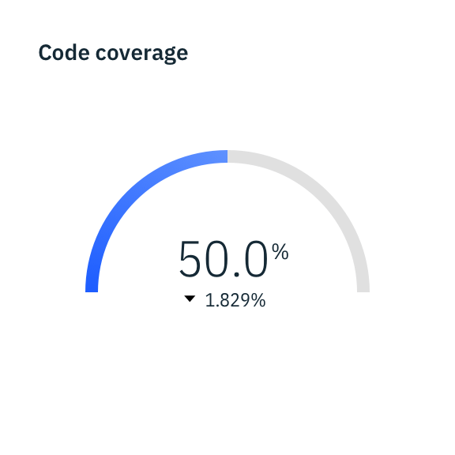

<PageDescription>

Basic charts offer a way to visualize data sets in an intuitive, easy to understand way. Every chart should tell a story and should reflect the content on the page where it is found.

</PageDescription>

import { CodeSnippet } from 'carbon-components-react';

import '@carbon/charts/styles.css';

import {
  SimpleBarChart,
  GroupedBarChart,
  StackedBarChart,
  PieChart,
  DonutChart,
  LineChart,
  ScatterChart,
} from '@carbon/charts-react';

import {
  addHeightToOptions,
  // Bar
  groupedBarOptions,
  groupedBarData,
  groupedHorizontalBarOptions,
  groupedHorizontalBarData,
  simpleBarOptions,
  simpleBarData,
  simpleHorizontalBarOptions,
  simpleHorizontalBarData,
  simpleBarTimeSeriesOptions,
  simpleBarTimeSeriesData,
  simpleHorizontalBarTimeSeriesOptions,
  simpleHorizontalBarTimeSeriesData,
  stackedBarOptions,
  stackedBarData,
  stackedHorizontalBarOptions,
  stackedHorizontalBarData,
  stackedBarTimeSeriesOptions,
  stackedBarTimeSeriesData,
  stackedHorizontalBarTimeSeriesOptions,
  stackedHorizontalBarTimeSeriesData,
  // Pie & donut
  pieOptions,
  pieData,
  donutOptions,
  donutData,
  // Line
  lineTimeSeriesOptions,
  lineTimeSeriesData,
  lineData,
  lineOptions,
  // Step
  stepOptions,
  stepData,
  stepTimeSeriesOptions,
  stepTimeSeriesData,
  // Scatter
  scatterTimeSeriesOptions,
  scatterTimeSeriesData,
  scatterOptions,
  scatterData,
} from '../../../data/charts/index';

import BasicChartsAnchorLinks from './anchorLinks';
import AllDemos from './allDemos';

<BasicChartsAnchorLinks />
<AllDemos />

## Design-only

<InlineNotification>

Note: These charts are currently a work-in-progress. To see our roadmap, request missing guidance, or contribute content, please go to the carbon-charts [GitHub repository](https://github.com/carbon-design-system/carbon-charts).

</InlineNotification>

### Area chart

Area charts are similar to line charts, but the areas below the lines are filled with colors or patterns. Stacked charts are useful for comparing proportional contributions within a category. They plot the relative value that each data series contributes to the total.

<Row>
<Column  colLg={8} colMd={6} colSm={4}>

</Column>
</Row>

### Stacked area chart

Stacked area charts are useful for comparing proportional contributions within a category. They plot the relative value that each data series contributes to the total.

<Row>
<Column  colLg={8} colMd={6} colSm={4}>

</Column>
</Row>

### Meter and gauge

<InlineNotification>

**Note:** Meter and gauge charts are not yet available in Carbon Charts. These explorations are subject to change.

</InlineNotification>

Meter and gauge charts are useful for showing values between a small number of variables either by using multiple markers on the same meter or gauge or by using multiples of the chart.

<Row>
<Column colMd={4} colLg={4}>

<Caption>
Meter charts can represent data with current value, minimum and maximum, and peaks or averages.
</Caption>
</Column>

<Column colMd={4} colLg={4}>

<Caption>
  Gauge animates to the current value when dashboard loads to create emphasis.
</Caption>

</Column>
</Row>
