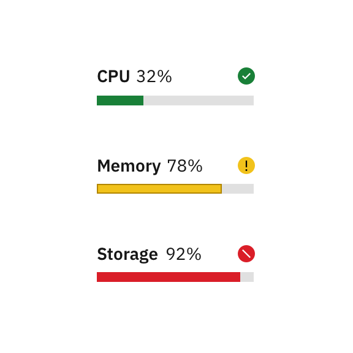

<PageDescription>

Basic charts offer a way to visualize data sets in an intuitive, easy to understand way. Every chart should tell a story and should reflect the content on the page where it is found.

</PageDescription>

import "@carbon/charts/styles.css";

import demoGroups from "../../../data/data-visualization";

import { AnchorLinks, AnchorLink } from "gatsby-theme-carbon";
import AllDemos from "../../../components/data-visualization/AllDemos.js";

## Resources

<Row className="resource-card-group">
  <Column colMd={4} colLg={4} noGutterSm>
    <ResourceCard
      subTitle="Carbon Charts demo site"
      href="https://carbon-design-system.github.io/carbon-charts/"
    >
      <MdxIcon name="codesandbox" />
    </ResourceCard>
  </Column>
</Row>

<AnchorLinks>
  {
    demoGroups.map(storybookDemoGroup => (
      <AnchorLink>{storybookDemoGroup.title}</AnchorLink>
    ))
  }

  <AnchorLink>Design-only</AnchorLink>
</AnchorLinks>

<AllDemos />

## Design-only

<InlineNotification>

Note: These charts are currently a work-in-progress. To see our roadmap, request missing guidance, or contribute content, please go to the carbon-charts [GitHub repository](https://github.com/carbon-design-system/carbon-charts).

</InlineNotification>

### Stacked area chart

Stacked area charts are useful for comparing proportional contributions within a category. They plot the relative value that each data series contributes to the total.

<Row>
<Column  colLg={8} colMd={6} colSm={4}>

</Column>
</Row>

### Meter and gauge

<InlineNotification>

**Note:** Meter and gauge charts are not yet available in Carbon Charts. These explorations are subject to change.

</InlineNotification>

Meter and gauge charts are useful for showing values between a small number of variables either by using multiple markers on the same meter or gauge or by using multiples of the chart.

<Row>
<Column colMd={4} colLg={4}>

<Caption>
Meter charts can represent data with current value, minimum and maximum, and peaks or averages.
</Caption>
</Column>

<Column colMd={4} colLg={4}>

<Caption>
  Gauge animates to the current value when dashboard loads to create emphasis.
</Caption>

</Column>
</Row>
