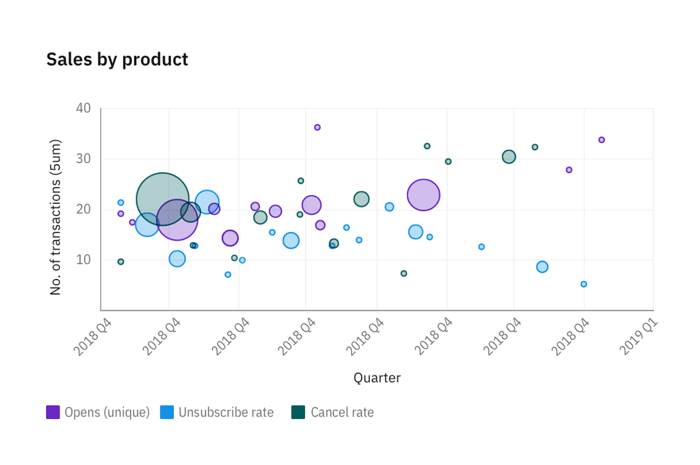

<PageDescription>

Basic charts offer a way to visualize data sets in an intuitive, easy to understand way. Every chart should tell a story and should reflect the content on the page where it is found.

</PageDescription>

import '@carbon/charts/styles.css';

import {
  SimpleBarChart,
  GroupedBarChart,
  StackedBarChart,
  PieChart,
  DonutChart,
  LineChart,
  ScatterChart,
} from '@carbon/charts-react';

import {
  // Bar
  groupedBarOptions,
  groupedBarData,
  simpleBarOptions,
  simpleBarData,
  simpleBarTimeSeriesOptions,
  simpleBarTimeSeriesData,
  stackedBarData,
  stackedBarOptions,
  stackedBarTimeSeriesOptions,
  stackedBarTimeSeriesData,
  // Line
  lineTimeSeriesOptions,
  lineTimeSeriesData,
  lineData,
  lineOptions,
  // Step
  stepOptions,
  stepData,
  stepTimeSeriesOptions,
  stepTimeSeriesData,
  // Scatter
  scatterTimeSeriesOptions,
  scatterTimeSeriesData,
  scatterOptions,
  scatterData,
  // Pie & donut
  pieOptions,
  pieData,
  donutOptions,
  donutData,
} from '../../../data/charts/index';

<AnchorLinks>

<AnchorLink>Bar chart</AnchorLink>
<AnchorLink>Line chart</AnchorLink>
<AnchorLink>Area chart</AnchorLink>
<AnchorLink>Polar charts</AnchorLink>
<AnchorLink>Scatter plots</AnchorLink>
<AnchorLink>Meter and gauge</AnchorLink>

</AnchorLinks>

## Bar chart

### Default

Bar charts use vertical or horizontal data markers to compare individual values. You can use them to compare discrete data or show trends over time.

<SimpleBarChart
  data={simpleBarData}
  options={simpleBarOptions}
  width="100%"
  height={400}
/>

<SimpleBarChart
  data={simpleBarTimeSeriesData}
  options={simpleBarTimeSeriesOptions}
  width="100%"
  height={400}
/>

### Grouped bar chart

A grouped bar chart, also known as a clustered bar graph, multi-set bar chart, or grouped column chart, is a type of bar graph that is used to compare values across multiple categories.

<GroupedBarChart
  data={groupedBarData}
  options={groupedBarOptions}
  width="100%"
  height={400}
/>

### Stacked bar

Stacked bar charts are useful for comparing proportional contributions within a category. They plot the relative value that each data series contributes to the total.

<StackedBarChart
  data={stackedBarData}
  options={stackedBarOptions}
  width="100%"
  height={400}
/>

<StackedBarChart
  data={stackedBarTimeSeriesData}
  options={stackedBarTimeSeriesOptions}
  width="100%"
  height={400}
/>

### Horizontal bar

The horizontal bar chart follows the same principles as a vertical column chart, only the x- and y-axis are switched.

<InlineNotification>

**Note:** This chart is currently a concept and not included in the Carbon Charts repository yet. For more information, please go to the carbon-charts [GitHub repository](https://github.com/carbon-design-system/carbon-charts).

</InlineNotification>

<Row>
<Column  colLg={8} colMd={6} colSm={4}>

</Column>
</Row>

## Line chart

### Default

Line charts plot data at regular intervals connected by lines. You can use line visualizations to show trends over time and compare several data sets.

<LineChart data={lineData} options={lineOptions} width="100%" height={400} />

<LineChart
  data={lineTimeSeriesData}
  options={lineTimeSeriesOptions}
  width="100%"
  height={400}
/>

### Stepped line chart

Stepped line charts plot data at regular intervals, forming a series of steps between data points. You can use line visualizations to show trends over time and compare several data sets.

<LineChart data={stepData} options={stepOptions} width="100%" height={400} />

### Curved line chart

<LineChart
  data={lineTimeSeriesData}
  options={lineTimeSeriesOptions}
  width="100%"
  height={400}
/>

## Area chart

### Default

Area charts are similar to line charts, but the areas below the lines are filled with colors or patterns. Stacked charts are useful for comparing proportional contributions within a category. They plot the relative value that each data series contributes to the total.

<Row>
<Column  colLg={8} colMd={6} colSm={4}>

</Column>
</Row>

### Stacked area chart

Stacked area charts are useful for comparing proportional contributions within a category. They plot the relative value that each data series contributes to the total.

<InlineNotification>

Note: This chart is currently a work-in-progress. To see our roadmap, request missing guidance, or contribute content, please go to the carbon-charts [GitHub repository](https://github.com/carbon-design-system/carbon-charts).

</InlineNotification>

<Row>
<Column  colLg={8} colMd={6} colSm={4}>

</Column>
</Row>

## Polar charts

### Pie

<PieChart data={pieData} options={pieOptions} width="100%" height={400} />

### Donut

<DonutChart data={donutData} options={donutOptions} width="100%" height={400} />

## Scatter plots

### Default

Scatter plot visualizations use data points to plot two measures anywhere along a scale, not only at regular tick marks. You can use scatter plots to explore correlations between different measures.

<ScatterChart
  data={scatterData}
  options={scatterOptions}
  width="100%"
  height={400}
/>

<ScatterChart
  data={scatterTimeSeriesData}
  options={scatterTimeSeriesOptions}
  width="100%"
  height={400}
/>

### Bubble chart

Bubble charts use data points and bubbles to plot measures anywhere along a scale. One measure is plotted along each axis. The size of the bubble represents the third measure. You can use bubble charts to represent financial data or any data where measured values are related.

<Row>
<Column  colLg={8} colMd={6} colSm={4}>

</Column>
</Row>

## Meter and gauge

<InlineNotification>

**Note:** Meter and gauge charts are not yet available in Carbon Charts. These explorations are subject to change.

</InlineNotification>

Meter and gauge charts are useful for showing values between a small number of variables either by using multiple markers on the same meter or gauge or by using multiples of the chart.

<Row>
<Column colMd={4} colLg={4}>

<Caption>
Meter charts can represent data with current value, minimum and maximum, and peaks or averages.
</Caption>
</Column>

<Column colMd={4} colLg={4}>

<Caption>
  Gauge animates to the current value when dashboard loads to create emphasis.
</Caption>

</Column>
</Row>
