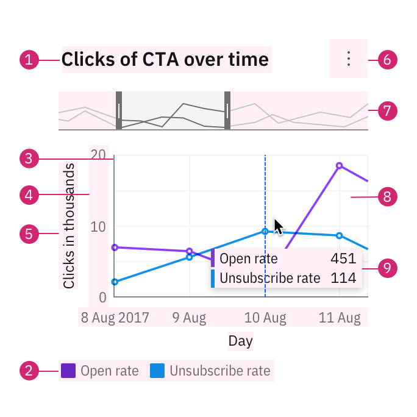
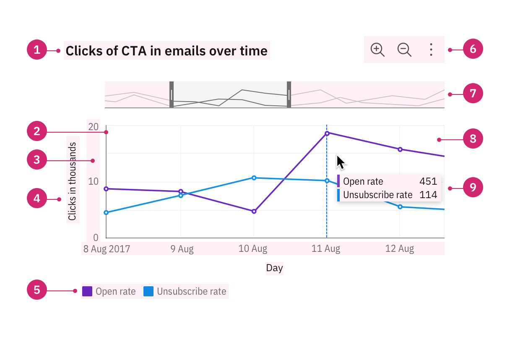
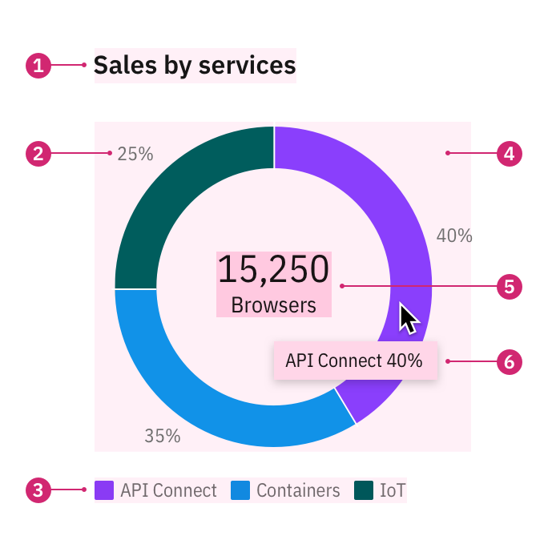
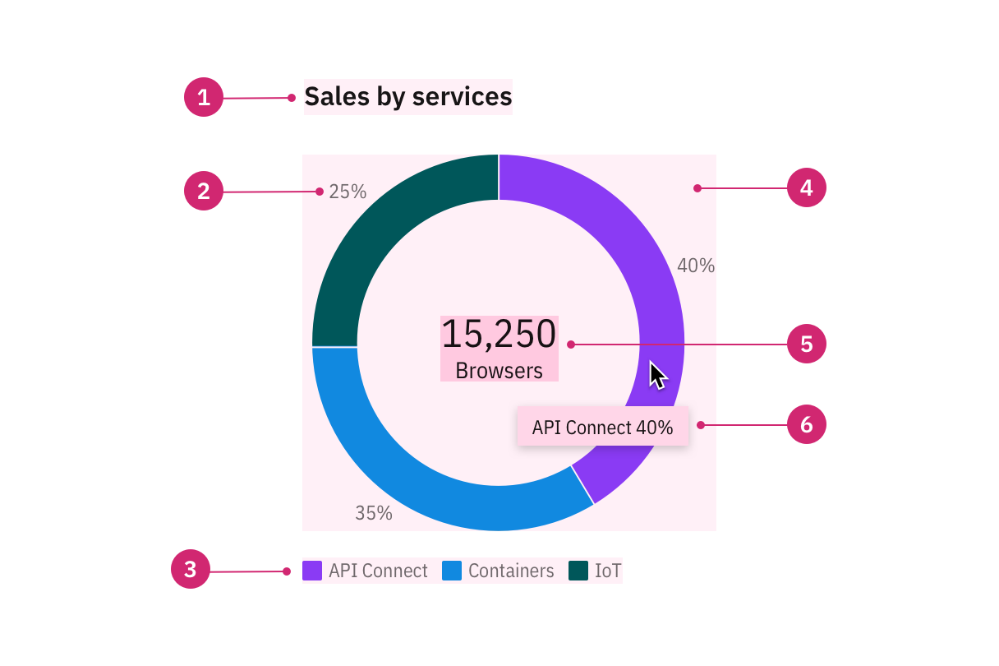

<PageDescription>

The elements constructing each chart are designed to work in harmony. Each piece
plays an important role in data communication.

</PageDescription>

<InlineNotification>

**Note:** This guidance is a work in progress. To see our roadmap, make feature
requests, or contribute, please go to carbon-charts
[GitHub repository](https://github.com/carbon-design-system/carbon-charts).

</InlineNotification>

<AnchorLinks>

<AnchorLink>Rectangular charts</AnchorLink>
<AnchorLink>Circular charts</AnchorLink>

</AnchorLinks>

## Rectangular charts

Most data visualizations are rectangular charts, with two dimensions represented
on a vertical and a horizontal axis. Rectangular charts are typically
constructed with a set of common elements including a legend, axis titles, and
navigation tools like a zoom bar and tooltip.

<Row>
<Column colLg={8} colMd={8} colSm={4}>
<ArtDirection>

</ArtDirection>

<Caption></Caption>
</Column>

<Column colLg={2} colMd={2} colSm={2} offsetLg={1}>
  <Aside>
    1. Chart title 
    2. Axes 
    3. Ticks 
    4. Axis title 
    5. Legends 
    6. Toolbar 
    7. Zoom bar 
    8. Graph frame 
    9. Tooltip 
  </Aside>
</Column>
</Row>

#### Titles, labels, and legends

The title of a piece of visualization should be descriptive and qualitative. It
should also reflect the main insight the data reveals. The legend should explain
the chart’s meaning by defining the association of each visual property, such as
color, shape, and size, to the corresponding data. When possible, use labels
directly on the chart to avoid long legends. All the text should be concise and
easy to understand. [Read more on legend usage.](/data-visualization/legends)

#### Tooltips

A tooltip is a message that appears when a cursor is positioned over an element,
such as a data point, icon button, or truncated text. By default, tooltips show
on hover to reveal more detailed information or context for specific chart
elements. A tooltip should repeat the corresponding values of the data point on
both axes and any other relevant details.

#### Graph frames, axes, and ticks

The graph frame is the area where the data will be visualized as graphics or
numbers. Axes, ticks, and the grid should help the reader understand the
proportions and scale of the data, the indicators involved, and their unit of
measure. Avoid filling the chart frame with too many elements, as it impacts the
user’s ability to interpret the data.
[Read more on axes usage.](/data-visualization/axes-and-labels)

## Circular charts

Circular charts are primarily pie and donut charts. Other circular layout charts
include radar and solar charts.

<Row>
<Column colLg={8} colMd={8} colSm={4}>
<ArtDirection>

</ArtDirection>
<Caption></Caption>
</Column>

<Column colLg={2} colMd={2} colSm={2} offsetLg={1}>
  <Aside>
    1. Chart title 
    2. Label 
    3. Tooltip 
    4. Legend 
    5. Graph frame 
    6. Big number 
  </Aside>
</Column>
</Row>

#### Labels

In a circular chart, labels offer the percentage value of the whole for an
individual category. When the graphic translation of the data is less than 3
degrees, a callout is used to clearly associate the label with the slice. If the
data translates as less than 1 degree, a slice will not be rendered on the
chart, the data would not be keyboard accessible or available in a tooltip
either. The only way to see the data in this scenario would be via a data table,
a feature that we'd like to implement for all charts to enhance accessibility.

#### Big number or KPI

A key performance indicator (KPI) consists of a number with a single word
description. Examples include “15,250 browsers”, “$1.3M revenue”, or “Total
450”. A big number inside the donut chart may be used to display a total sum or
the individual count of a slice upon interaction. This element can also be used
independently on a dashboard (though please note this component is still a WIP
and not available outside the donut chart).
