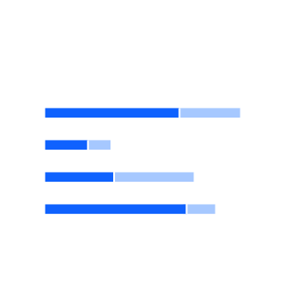
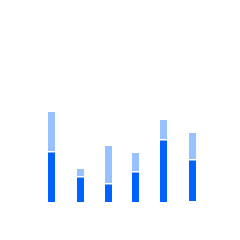
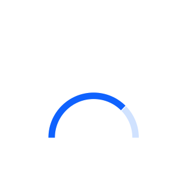
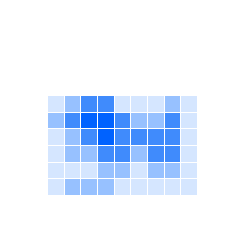

import OverviewCard from 'components/OverviewCard';

<PageDescription>

Start by identifying the purpose of the visualization and then choose the
appropriate chart type.

</PageDescription>

## Comparisons

<Row className="overview-card-group">
<Column  colMax={3} colXl={3} colLg={4} colMd={4} colSm={2} noGutterSm >
 <OverviewCard
    title="Simple bar (vertical)"
    href="/data-visualization/basic-charts#simple-bar-(discrete)"
    >

</OverviewCard>
</Column>
<Column  colMax={3} colXl={3} colLg={4} colMd={4} colSm={2} noGutterSm >
 <OverviewCard
    title="Grouped bar (vertical)"
    href="/data-visualization/basic-charts#grouped-bar-(discrete)"
    >

</OverviewCard>
</Column>
<Column  colMax={3} colXl={3} colLg={4} colMd={4} colSm={2} noGutterSm >
 <OverviewCard
    title="Bubble"
    href="/data-visualization/basic-charts#bubble"
    >

</OverviewCard>
</Column>
<Column  colMax={3} colXl={3} colLg={4} colMd={4} colSm={2} noGutterSm >
 <OverviewCard
    title="Radar"
	href="/data-visualization/basic-charts#radar"
    >

</OverviewCard>
</Column>
<Column  colMax={3} colXl={3} colLg={4} colMd={4} colSm={2} noGutterSm >
 <OverviewCard
    title="Simple bar (horizontal)"
    href="/data-visualization/basic-charts#simple-horizontal-bar-(discrete)"
    >

</OverviewCard>
</Column>
<Column  colMax={3} colXl={3} colLg={4} colMd={4} colSm={2} noGutterSm >
 <OverviewCard
    title="Grouped bar (horizontal)"
    href="/data-visualization/basic-charts#grouped-horizontal-bar-(discrete)"
    >

</OverviewCard>
</Column>
</Row>

## Trends

<Row className="overview-card-group">
<Column  colMax={3} colXl={3} colLg={4} colMd={4} colSm={2} noGutterSm >
 <OverviewCard
    title="Line"
    href="/data-visualization/basic-charts#line"
    >

</OverviewCard>
</Column>
<Column  colMax={3} colXl={3} colLg={4} colMd={4} colSm={2} noGutterSm >
 <OverviewCard
    title="Area"
    href="/data-visualization/basic-charts#area"
    >

</OverviewCard>
</Column>
<Column  colMax={3} colXl={3} colLg={4} colMd={4} colSm={2} noGutterSm >
 <OverviewCard
    title="Histogram"
	disabled
    >

</OverviewCard>
</Column>
<Column  colMax={3} colXl={3} colLg={4} colMd={4} colSm={2} noGutterSm >
 <OverviewCard
    title="Stream"
	disabled
    >

</OverviewCard>
</Column>
</Row>

## Part-to-whole

<Row className="overview-card-group">
<Column  colMax={3} colXl={3} colLg={4} colMd={4} colSm={2} noGutterSm >
 <OverviewCard
    title="Donut"
    href="/data-visualization/basic-charts#donut"
    >

</OverviewCard>
</Column>
<Column  colMax={3} colXl={3} colLg={4} colMd={4} colSm={2} noGutterSm >
 <OverviewCard
    title="Pie"
    href="/data-visualization/basic-charts#pie"
    >

</OverviewCard>
</Column>

<Column  colMax={3} colXl={3} colLg={4} colMd={4} colSm={2} noGutterSm >
 <OverviewCard
    title="Stacked bar (horizontal)"
    href="/data-visualization/basic-charts/#stacked-horizontal-bar-(discrete)"
    >

</OverviewCard>
</Column>
<Column  colMax={3} colXl={3} colLg={4} colMd={4} colSm={2} noGutterSm >
 <OverviewCard
    title="Stacked bar (vertical)"
    href="/data-visualization/basic-charts/#stacked-bar-(discrete)"
    >

</OverviewCard>
</Column>
<Column  colMax={3} colXl={3} colLg={4} colMd={4} colSm={2} noGutterSm >
 <OverviewCard
    title="Stacked area"
    href="/data-visualization/basic-charts/#stacked-area-chart"
    >

</OverviewCard>
</Column>
<Column  colMax={3} colXl={3} colLg={4} colMd={4} colSm={2} noGutterSm >
<OverviewCard
   title="Meter"
   href="/data-visualization/basic-charts/#meter"
   >

</OverviewCard>
</Column>

<Column  colMax={3} colXl={3} colLg={4} colMd={4} colSm={2} noGutterSm >
<OverviewCard
   title="Gauge"
   href="/data-visualization/basic-charts/#gauge"
   >

</OverviewCard>
</Column>

<Column  colMax={3} colXl={3} colLg={4} colMd={4} colSm={2} noGutterSm>
 <OverviewCard
    title="Tree map"
    href="/data-visualization/advanced-charts#tree-maps"
	tag="Design only"
    >

</OverviewCard>
</Column>
</Row>

## Correlations

<Row className="overview-card-group">
<Column  colMax={3} colXl={3} colLg={4} colMd={4} colSm={2} noGutterSm>
 <OverviewCard
    title="Scatter"
    href="/data-visualization/basic-charts#scatter"
    >

</OverviewCard>
</Column>
<Column  colMax={3} colXl={3} colLg={4} colMd={4} colSm={2} noGutterSm >
 <OverviewCard
    title="Heat map"
    href="/data-visualization/advanced-charts#heat-maps"	       
    tag="Design only"
    >

</OverviewCard>
</Column>
<Column  colMax={3} colXl={3} colLg={4} colMd={4} colSm={2} noGutterSm >
 <OverviewCard
    title="Parallel coordinates"
    href="/data-visualization/advanced-charts#parallel-coordinates"	       
    tag="Design only"
    >

</OverviewCard>
</Column>
</Row>

## Connections

<Row className="overview-card-group">
<Column  colMax={3} colXl={3} colLg={4} colMd={4} colSm={2} noGutterSm >
 <OverviewCard
    title="Alluvial diagram"
    href="/data-visualization/advanced-charts#alluvialsankey-diagrams"
    tag="Design only"
    >

</OverviewCard>
</Column>
<Column  colMax={3} colXl={3} colLg={4} colMd={4} colSm={2} noGutterSm >
 <OverviewCard
    title="Network diagram"
    href="/data-visualization/advanced-charts#network-diagrams"
    tag="Design only"
    >

</OverviewCard>
</Column>
</Row>

## Geospatial: overlays

<Row className="overview-card-group">
<Column  colMax={3} colXl={3} colLg={4} colMd={4} colSm={2} noGutterSm >
 <OverviewCard
    title="Choropleth map"
    href="/data-visualization/advanced-charts#geographic-overlays"
    tag="Design only"
    >

</OverviewCard>
</Column>
<Column  colMax={3} colXl={3} colLg={4} colMd={4} colSm={2} noGutterSm >
 <OverviewCard
    title="Proportional symbol"
    href="/data-visualization/advanced-charts#proportional-symbol-map"
    tag="Design only"
    >

</OverviewCard>
</Column>
<Column  colMax={3} colXl={3} colLg={4} colMd={4} colSm={2} noGutterSm >
 <OverviewCard
    title="Connecting lines"
    href="/data-visualization/advanced-charts#connection-map"
    tag="Design only"
    >

</OverviewCard>
</Column>
</Row>
