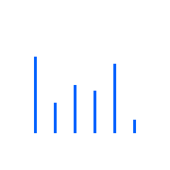
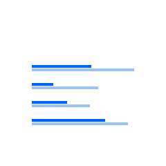
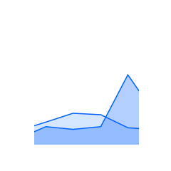
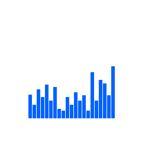
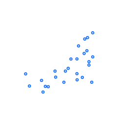

import OverviewCard from "components/OverviewCard";

<PageDescription>

Start by identifying the purpose of the visualization and then choose the appropriate chart type.

</PageDescription>

## Comparisons

<Row className="overview-card-group">
<Column  colMax={3} colXl={3} colLg={4} colMd={4} colSm={2} noGutterSm >
 <OverviewCard
    title="Simple bar (vertical)"
    href="/data-visualization/basic-charts#bar-chart"
    >

</OverviewCard>
</Column>
<Column  colMax={3} colXl={3} colLg={4} colMd={4} colSm={2} noGutterSm >
 <OverviewCard
    title="Grouped bar (vertical)"
    href="/data-visualization/basic-charts#grouped-bar-chart"
    >

</OverviewCard>
</Column>
<Column  colMax={3} colXl={3} colLg={4} colMd={4} colSm={2} noGutterSm >
 <OverviewCard
    title="Bubble chart"
    href="/data-visualization/basic-charts#bubble-chart"
    >

</OverviewCard>
</Column>
<Column  colMax={3} colXl={3} colLg={4} colMd={4} colSm={2} noGutterSm >
 <OverviewCard
    title="Radar chart"
    disabled
    >

</OverviewCard>
</Column>
<Column  colMax={3} colXl={3} colLg={4} colMd={4} colSm={2} noGutterSm >
 <OverviewCard
    title="Simple bar (horizontal)"
    href="/data-visualization/basic-charts#horizontal-bar"
    >

</OverviewCard>
</Column>
<Column  colMax={3} colXl={3} colLg={4} colMd={4} colSm={2} noGutterSm >
 <OverviewCard
    title="Grouped bar (horizontal)"
    href="/data-visualization/basic-charts#grouped-bar"
    >

</OverviewCard>
</Column>
</Row>

## Trends

<Row className="overview-card-group">
<Column  colMax={3} colXl={3} colLg={4} colMd={4} colSm={2} noGutterSm >
 <OverviewCard
    title="Line chart"
    href="/data-visualization/basic-charts#line-chart"
    >

</OverviewCard>
</Column>
<Column  colMax={3} colXl={3} colLg={4} colMd={4} colSm={2} noGutterSm >
 <OverviewCard
    title="Area chart"
    href="/data-visualization/basic-charts#area-chart"
    >

</OverviewCard>
</Column>
<Column  colMax={3} colXl={3} colLg={4} colMd={4} colSm={2} noGutterSm >
 <OverviewCard
    title="Histogram"
    href="/data-visualization/basic-charts#bar-chart"
    tag="Design only"
    >

</OverviewCard>
</Column>
<Column  colMax={3} colXl={3} colLg={4} colMd={4} colSm={2} noGutterSm >
 <OverviewCard
    title="Stream chart"
    disabled
    >

</OverviewCard>
</Column>
</Row>

## Part-to-whole

<Row className="overview-card-group">
<Column  colMax={3} colXl={3} colLg={4} colMd={4} colSm={2} noGutterSm >
 <OverviewCard
    title="Donut"
    href="/data-visualization/basic-charts#donut"
    >

</OverviewCard>
</Column>
<Column  colMax={3} colXl={3} colLg={4} colMd={4} colSm={2} noGutterSm >
 <OverviewCard
    title="Pie"
    href="/data-visualization/basic-charts#pie"
    >

</OverviewCard>
</Column>
<Column  colMax={3} colXl={3} colLg={4} colMd={4} colSm={2} noGutterSm >
 <OverviewCard
    title="Stacked bar"
    href="/data-visualization/basic-charts/#stacked-bar"
    >

</OverviewCard>
</Column>
<Column  colMax={3} colXl={3} colLg={4} colMd={4} colSm={2} noGutterSm >
 <OverviewCard
    title="Stacked bar (horizontal)"
    href="/data-visualization/basic-charts/#stacked-bar"
    >

</OverviewCard>
</Column>
<Column  colMax={3} colXl={3} colLg={4} colMd={4} colSm={2} noGutterSm >
 <OverviewCard
    title="Stacked area"
    href="/data-visualization/basic-charts/#stacked-area-chart"
    tag="Design only"
    >

</OverviewCard>
</Column>
<Column  colMax={3} colXl={3} colLg={4} colMd={4} colSm={2} noGutterSm>
 <OverviewCard
    title="Tree map"
    disabled
    >

</OverviewCard>
</Column>
<Column  colMax={3} colXl={3} colLg={4} colMd={4} colSm={2} noGutterSm >
<OverviewCard
   title="Meter / gauge"
   href="/data-visualization/basic-charts/#meter-and-gauge"
   tag="Design only"
   >

</OverviewCard>
</Column>
</Row>

## Correlations

<Row className="overview-card-group">
<Column  colMax={3} colXl={3} colLg={4} colMd={4} colSm={2} noGutterSm>
 <OverviewCard
    title="Scatter plot"
    href="/data-visualization/basic-charts#scatter-plot"
    >

</OverviewCard>
</Column>
<Column  colMax={3} colXl={3} colLg={4} colMd={4} colSm={2} noGutterSm >
 <OverviewCard
    title="Heat map"
    disabled
    >

</OverviewCard>
</Column>
<Column  colMax={3} colXl={3} colLg={4} colMd={4} colSm={2} noGutterSm >
 <OverviewCard
    title="Parallel coordinates"
    disabled
    >

</OverviewCard>
</Column>
</Row>

## Connections

<Row className="overview-card-group">
<Column  colMax={3} colXl={3} colLg={4} colMd={4} colSm={2} noGutterSm >
 <OverviewCard
    title="Alluvial diagram"
    href="/data-visualization/advanced-charts#alluvial-diagram"
    tag="Design only"
    >

</OverviewCard>
</Column>
<Column  colMax={3} colXl={3} colLg={4} colMd={4} colSm={2} noGutterSm >
 <OverviewCard
    title="Tree diagram"
    href="/data-visualization/advanced-charts#tree-diagram"
    tag="Design only"
    >

</OverviewCard>
</Column>
</Row>

## Geospatial: overlays

<Row className="overview-card-group">
<Column  colMax={3} colXl={3} colLg={4} colMd={4} colSm={2} noGutterSm >
 <OverviewCard
    title="Choropleth map"
    href="/data-visualization/advanced-charts#choropleth-map"
    tag="Design only"
    >

</OverviewCard>
</Column>
<Column  colMax={3} colXl={3} colLg={4} colMd={4} colSm={2} noGutterSm >
 <OverviewCard
    title="Proportional symbol"
    href="/data-visualization/advanced-charts#proportional-symbol"
    tag="Design only"
    >

</OverviewCard>
</Column>
<Column  colMax={3} colXl={3} colLg={4} colMd={4} colSm={2} noGutterSm >
 <OverviewCard
    title="Connecting lines"
    href="/data-visualization/advanced-charts#connecting-lines"
    tag="Design only"
    >

</OverviewCard>
</Column>
</Row>
