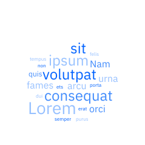
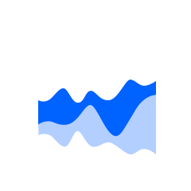
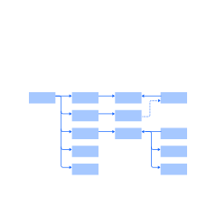

import OverviewCard from 'components/OverviewCard';

<PageDescription>

Start by identifying the purpose of the visualization and then choose the
appropriate chart type.

</PageDescription>

## Comparisons

<Row className="overview-card-group">
<Column colMax={3} colXl={3} colLg={4} colMd={4} colSm={2} noGutterSm>
 <OverviewCard
    title="Simple bar"
    href="/data-visualization/simple-charts#bar-(simple)"
    >

</OverviewCard>
</Column>
<Column colMax={3} colXl={3} colLg={4} colMd={4} colSm={2} noGutterSm>
 <OverviewCard
    title="Grouped bar"
    href="/data-visualization/simple-charts#bar-(grouped)"
    >

</OverviewCard>
</Column>

<Column colMax={3} colXl={3} colLg={4} colMd={4} colSm={2} noGutterSm>
 <OverviewCard
    title="Floating bar"
    href="/data-visualization/simple-charts#bar-(floating)"
    >

</OverviewCard>
</Column>

<Column colMax={3} colXl={3} colLg={4} colMd={4} colSm={2} noGutterSm>
 <OverviewCard
    title="Lollipop"
    href="/data-visualization/simple-charts#lollipop"
    >

</OverviewCard>
</Column>

<Column colMax={3} colXl={3} colLg={4} colMd={4} colSm={2} noGutterSm>
 <OverviewCard
    title="Bubble"
    href="/data-visualization/simple-charts#bubble"
    >

</OverviewCard>
</Column>
<Column colMax={3} colXl={3} colLg={4} colMd={4} colSm={2} noGutterSm>
 <OverviewCard
    title="Radar"
	href="/data-visualization/simple-charts#radar"
    >

</OverviewCard>
</Column>

<Column colMax={3} colXl={3} colLg={4} colMd={4} colSm={2} noGutterSm>
 <OverviewCard
    title="Wordcloud"
    href="/data-visualization/simple-charts#word-cloud"
    >

</OverviewCard>
</Column>

</Row>

## Trends

<Row className="overview-card-group">
<Column colMax={3} colXl={3} colLg={4} colMd={4} colSm={2} noGutterSm>
 <OverviewCard
    title="Line"
    href="/data-visualization/simple-charts#line"
    >

</OverviewCard>
</Column>
<Column colMax={3} colXl={3} colLg={4} colMd={4} colSm={2} noGutterSm>
 <OverviewCard
    title="Area"
    href="/data-visualization/simple-charts#area-(simple)"
    >

</OverviewCard>
</Column>

<Column colMax={3} colXl={3} colLg={4} colMd={4} colSm={2} noGutterSm>
 <OverviewCard
    title="Boxplot"
    href="/data-visualization/simple-charts#boxplot"
    >

</OverviewCard>
</Column>

<Column colMax={3} colXl={3} colLg={4} colMd={4} colSm={2} noGutterSm>
 <OverviewCard
    title="Histogram"
	href="/data-visualization/simple-charts#histogram"
    >

</OverviewCard>
</Column>
<Column colMax={3} colXl={3} colLg={4} colMd={4} colSm={2} noGutterSm>
 <OverviewCard
    title="Stream"
	disabled
    >

</OverviewCard>
</Column>
</Row>

## Part-to-whole

<Row className="overview-card-group">
<Column colMax={3} colXl={3} colLg={4} colMd={4} colSm={2} noGutterSm>
 <OverviewCard
    title="Donut"
    href="/data-visualization/simple-charts#donut"
    >

</OverviewCard>
</Column>
<Column colMax={3} colXl={3} colLg={4} colMd={4} colSm={2} noGutterSm>
 <OverviewCard
    title="Pie"
    href="/data-visualization/simple-charts#pie"
    >

</OverviewCard>
</Column>

<Column colMax={3} colXl={3} colLg={4} colMd={4} colSm={2} noGutterSm>
 <OverviewCard
    title="Stacked bar"
    href="/data-visualization/simple-charts/#bar-(stacked)"
    >

</OverviewCard>
</Column>

<Column colMax={3} colXl={3} colLg={4} colMd={4} colSm={2} noGutterSm>
 <OverviewCard
    title="Bullet"
    href="/data-visualization/simple-charts/#bullet"
    >

</OverviewCard>
</Column>

<Column colMax={3} colXl={3} colLg={4} colMd={4} colSm={2} noGutterSm>
 <OverviewCard
    title="Stacked area"
    href="/data-visualization/simple-charts/#area-(stacked)"
    >

</OverviewCard>
</Column>
<Column colMax={3} colXl={3} colLg={4} colMd={4} colSm={2} noGutterSm>
<OverviewCard
   title="Meter"
   href="/data-visualization/simple-charts/#meter"
   >

</OverviewCard>
</Column>

<Column colMax={3} colXl={3} colLg={4} colMd={4} colSm={2} noGutterSm>
<OverviewCard
   title="Gauge"
   href="/data-visualization/simple-charts/#gauge"
   >

</OverviewCard>
</Column>

<Column colMax={3} colXl={3} colLg={4} colMd={4} colSm={2} noGutterSm>
 <OverviewCard
    title="Tree map"
    href="/data-visualization/spatial-charts/#tree-maps"
    >

</OverviewCard>
</Column>

<Column colMax={3} colXl={3} colLg={4} colMd={4} colSm={2} noGutterSm>
 <OverviewCard
    title="Circle pack"
    href="/data-visualization/spatial-charts/#circle-packs"
    >

</OverviewCard>
</Column>

</Row>

## Correlations

<Row className="overview-card-group">
<Column colMax={3} colXl={3} colLg={4} colMd={4} colSm={2} noGutterSm>
 <OverviewCard
    title="Scatter"
    href="/data-visualization/simple-charts#scatter"
    >

</OverviewCard>
</Column>
<Column colMax={3} colXl={3} colLg={4} colMd={4} colSm={2} noGutterSm>
 <OverviewCard
    title="Heat map"
    href="/data-visualization/spatial-charts/#heat-maps"	       
    >

</OverviewCard>
</Column>
<Column colMax={3} colXl={3} colLg={4} colMd={4} colSm={2} noGutterSm>
 <OverviewCard
    title="Parallel coordinates"
    href="/data-visualization/flow-charts/#parallel-coordinates"	       
    tag="Design only"
    >

</OverviewCard>
</Column>
</Row>

## Connections

<Row className="overview-card-group">
<Column colMax={3} colXl={3} colLg={4} colMd={4} colSm={2} noGutterSm>
 <OverviewCard
    title="Alluvial diagram"
    href="/data-visualization/flow-charts/#alluvialsankey-diagrams"
    >

</OverviewCard>
</Column>

<Column colMax={3} colXl={3} colLg={4} colMd={4} colSm={2} noGutterSm>
 <OverviewCard
    title="Network diagram"
    href="/data-visualization/flow-charts/#network-diagrams"
    >

</OverviewCard>
</Column>

<Column colMax={3} colXl={3} colLg={4} colMd={4} colSm={2} noGutterSm>
 <OverviewCard
    title="Tree diagram"
    href="/data-visualization/flow-charts/#tree-diagrams"
    >

</OverviewCard>
</Column>
</Row>

## Geospatial: overlays

<Row className="overview-card-group">
<Column colMax={3} colXl={3} colLg={4} colMd={4} colSm={2} noGutterSm>
 <OverviewCard
    title="Choropleth map"
    href="/data-visualization/spatial-charts/#geospatial-charts"
    tag="Design only"
    >

</OverviewCard>
</Column>
<Column colMax={3} colXl={3} colLg={4} colMd={4} colSm={2} noGutterSm>
 <OverviewCard
    title="Proportional symbol"
    href="/data-visualization/spatial-charts/#proportional-symbol-map"
    tag="Design only"
    >

</OverviewCard>
</Column>
<Column colMax={3} colXl={3} colLg={4} colMd={4} colSm={2} noGutterSm>
 <OverviewCard
    title="Connection map"
    href="/data-visualization/spatial-charts/#connection-map"
    tag="Design only"
    >

</OverviewCard>
</Column>
</Row>
