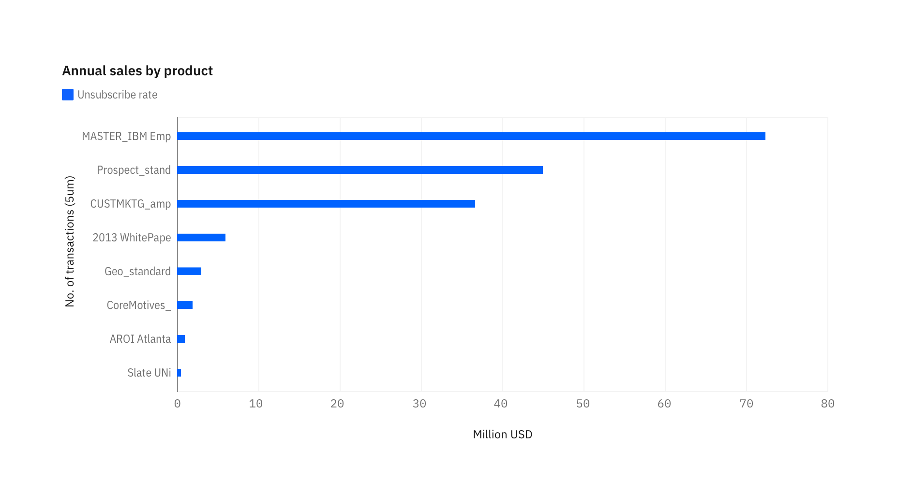
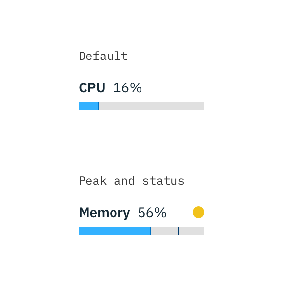
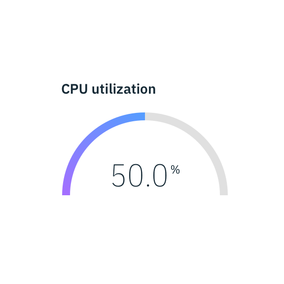

import '@carbon/charts/style.css';

import {
  BarChart,
  PieChart,
  DonutChart,
  LineChart,
} from '@carbon/charts-react';

import {
  groupedBarData,
  groupedBarOptions,
  simpleBarData,
  simpleBarOptions,
  stackedBarData,
  stackedBarOptions,
  curvedLineData,
  curvedLineOptions,
  lineData,
  lineOptions,
  demoPieData,
  demoPieOptions,
  demoDonutOptions,
} from '../../../data/charts/demo-chart-data';

<AnchorLinks>

<AnchorLink>Bar charts</AnchorLink>
<AnchorLink>Line chart</AnchorLink>
<AnchorLink>Area chart</AnchorLink>
<AnchorLink>Pie and donut chart</AnchorLink>
<AnchorLink>Scatter plot</AnchorLink>
<AnchorLink>Meter & gauge</AnchorLink>

</AnchorLinks>

## Bar charts

### Default

Bar charts use vertical or horizontal data markers to compare individual values; You can use it to compare discrete data or show trends over time.

<BarChart
  data={simpleBarData}
  options={simpleBarOptions}
  width="100%"
  height={400}
/>

### Grouped bar

A grouped bar chart, also known as clustered bar graph, multi-set bar chart, or grouped column chart, is a type of bar graph that is used to compare values across multiple categories.

<BarChart
  data={groupedBarData}
  options={groupedBarOptions}
  width="100%"
  height={400}
/>

### Stacked bar

Stacked bar charts are useful for comparing proportional contributions within a category. They plot the relative value that each data series contributes to the total.

<BarChart
  data={stackedBarData}
  options={stackedBarOptions}
  width="100%"
  height={400}
/>

### Horizontal bar

The horizontal bar chart is the same as a vertical column chart only the x- and y-axis are switched.

<InlineNotificaton>

**Note:** this chart is currently a concept and not included in the Carbon Charts repository yet. For more information, please go to the [Carbon-charts GitHub](https://github.com/carbon-design-system/carbon-charts) repository.

</InlineNotificaton>

<Row>
<Column  colLg={8} colMd={2} colSm={2} noGutterSm>

<Caption></Caption>
</Column></Row>

## Line Chart

### Default

Line charts plot data at regular points connected by lines. You can use line visualizations to show trends over time and compare many data series.

<LineChart data={lineData} options={lineOptions} width="100%" height={400} />

### Step line chart

Step line chart plot data at regular points, forming a series of steps between data points. You can use line visualizations to show trends over time and compare many data series.

#### Middle

<LineChart
  data={lineData}
  options={Object.assign({}, lineOptions, { curve: 'curveStep' })}
  width="100%"
  height={400}
/>

#### Before

<LineChart
  data={lineData}
  options={Object.assign({}, lineOptions, { curve: 'curveStepBefore' })}
  width="100%"
  height={400}
/>

#### After (regular)

<LineChart
  data={lineData}
  options={Object.assign({}, lineOptions, { curve: 'curveStepAfter' })}
  width="100%"
  height={400}
/>

### Curved line chart

#### Natural curve

<LineChart
  data={curvedLineData}
  options={curvedLineOptions}
  width="100%"
  height={400}
/>

#### Bundle curve

<LineChart
  data={curvedLineData}
  options={Object.assign({}, curvedLineOptions, { curve: 'curveBundle' })}
  width="100%"
  height={400}
/>

#### Monotone Y Curve

<LineChart
  data={curvedLineData}
  options={Object.assign({}, curvedLineOptions, { curve: 'curveMonotoneY' })}
  width="100%"
  height={400}
/>

#### Monotone X Curve

<LineChart
  data={curvedLineData}
  options={Object.assign({}, curvedLineOptions, { curve: 'curveMonotoneX' })}
  width="100%"
  height={400}
/>

## Area chart

#### Defautl

Area charts are like line charts, but the areas below the lines are filled with colors or patterns. Stacked charts are useful for comparing proportional contributions within a category. They plot the relative value that each data series contributes to the total.

#### Stacked area chart

Stacked are charts are useful for comparing proportional contributions within a category. They plot the relative value that each data series contributes to the total.

<InlineNotificaton>

Note: this chart is currently a Work In Progress. To see our roadmap, request missing guidance, or contribute your own content, please go to [Carbon-charts GitHub repository](https://github.com/carbon-design-system/carbon-charts).

</InlineNotificaton>

## Polar charts

### Pie

<PieChart
  data={demoPieData}
  options={demoPieOptions}
  width="100%"
  height={400}
/>

### Donut

<DonutChart
  data={demoPieData}
  options={demoDonutOptions}
  width="100%"
  height={400}
/>

## Scatterplot

#### Default

Scatter visualizations use data points to plot two measures anywhere along a scale, not only at regular tick marks. You can use scatter visualizations to explore correlations between different measures.

#### Bubble chart

Bubble charts use data points and bubbles to plot measures anywhere along a scale. One measure is plotted along each axis. The size of the bubble represents a third measure. You can use bubble charts to represent financial data or any data where measure values are related.

### Meter and gauge

Meter and gauge are useful for showing values between a small number of variables either by using multiple markers on the same meter or gauge, or by using multiples of the chart.

<Row>
<Column colMd={4} colLg={4}>

<Caption>
  Meter can represent data with a current value, min and maximum, and peak or averages.
</Caption>
</Column>
<Column colMd={4} colLg={4}>

<Caption>
Gauge animates to the current value when dashboard loads to create emphasis.
</Caption>
</Column>
</Row>
