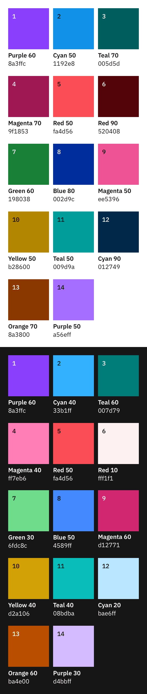
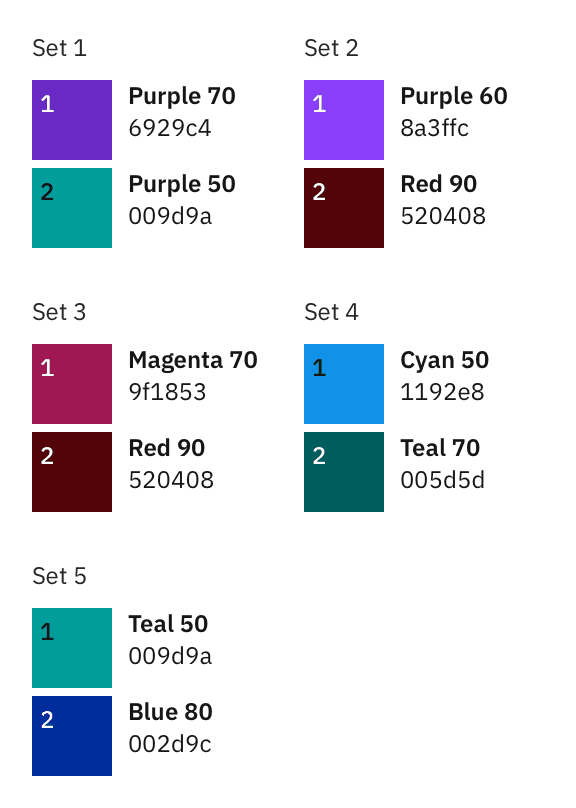
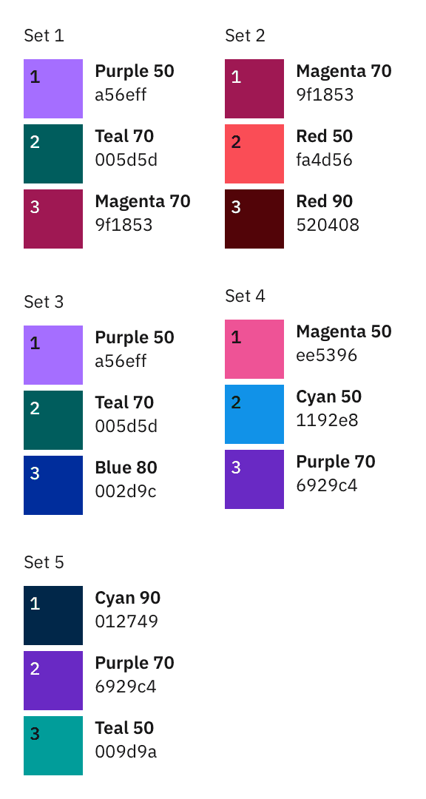
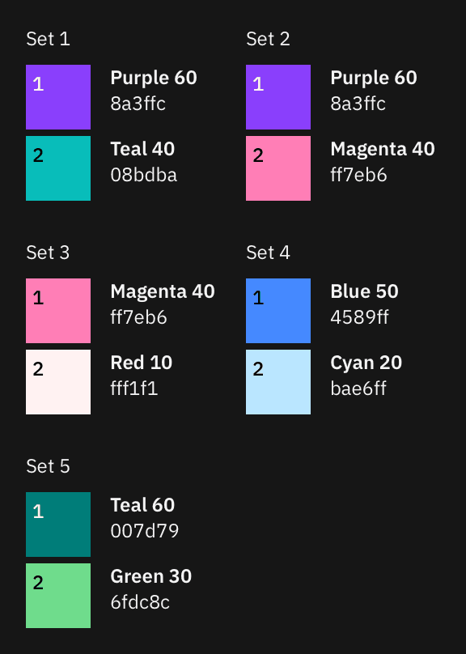
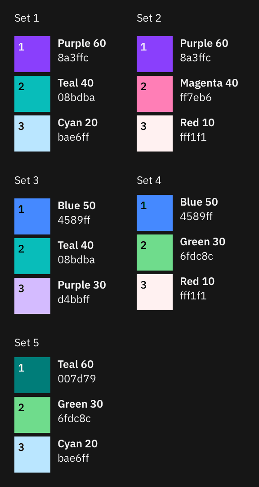
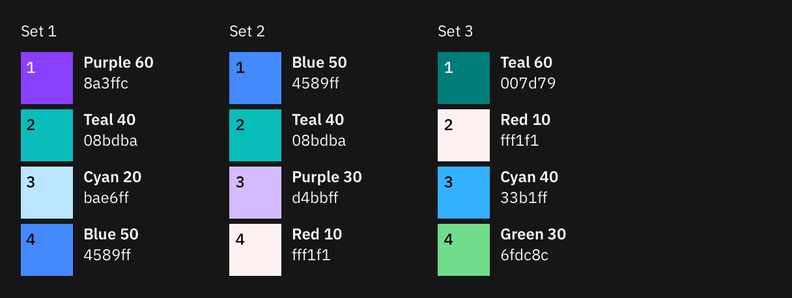
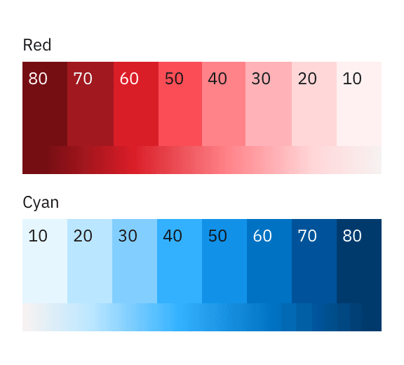
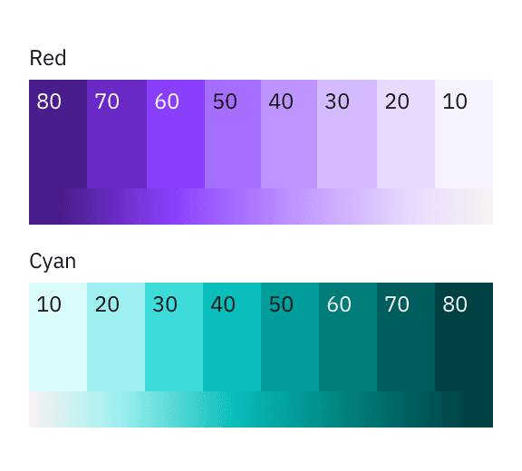
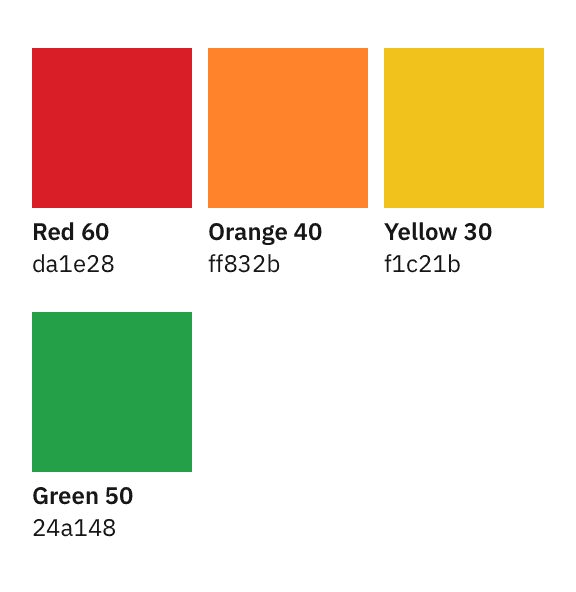

<PageDescription>

The color palette for data visualizations is a select subset of the IBM Design Language color palette. It is designed to maximize accessibility and harmony within a page.

</PageDescription>

<InlineNotification>

**Note:** This guidance is a work in progress. To see our roadmap, make feature requests, or contribute, please go to carbon-charts [GitHub repository](https://github.com/carbon-design-system/carbon-charts).

</InlineNotification>

<AnchorLinks>

<AnchorLink>Categorical palettes</AnchorLink>
<AnchorLink>Sequential palettes</AnchorLink>
<AnchorLink>Alert palette</AnchorLink>
<AnchorLink>Gradient use</AnchorLink>

</AnchorLinks>

<ColorPalette type="categorical" />

<ColorPalette type="sequential" />

## Resources

<Row className="resource-card-group">
  <Column colLg={4} colMd={4} noGutterSm>
    <ResourceCard
      subTitle="Data visualization color palettes (IBM internal link)"
      href="https://ibm.box.com/s/1rvfetsgovxoj4660suz5sa2tgqizlvy"
      actionIcon="download"
    >
      <MdxIcon name="sketch" />
    </ResourceCard>
  </Column>
</Row>

## Categorical palettes

Categorical (or qualitative) palettes are best when you want to distinguish discrete categories of data that do not have an inherent correlation.

The colors of this palette should be applied in sequence strictly as described below. The sequence is carefully curated to maximize contrast between neighboring colors to help with visual differentiation.

<Row>
<Column  colLg={8} colMd={6} colSm={4}>
<ArtDirection>

</ArtDirection>
<Caption>

Complete default categorical palette in light and dark themes

</Caption>

</Column>
</Row>

You can override the categorical sequence with one of the following palettes if the exact number of data categories is predictable.

### Light theme alternatives

<Title>1-Color</Title>

<Row>
<Column  colLg={8} colMd={6} colSm={4}>
<ArtDirection>

</ArtDirection>
</Column>
</Row>

<Title>2-Color</Title>

<Row>
<Column  colLg={12} colMd={8} colSm={4}>
<ArtDirection>

</ArtDirection>
</Column>
</Row>

<Title>3-Color</Title>

<Row>
<Column  colLg={12} colMd={8} colSm={4}>
<ArtDirection>

</ArtDirection>
</Column>
</Row>

<Title>4-Color</Title>

<Row>
<Column  colLg={8} colMd={6} colSm={4}>
<ArtDirection>

</ArtDirection>
</Column>
</Row>

<Title>5-Color</Title>

<Row>
<Column  colLg={8} colMd={6} colSm={4}>
<ArtDirection>

</ArtDirection>
</Column>
</Row>

### Dark theme alternatives

<Title>1-Color</Title>

<Row>
<Column  colLg={8} colMd={6} colSm={4}>
<ArtDirection>

</ArtDirection>
</Column>
</Row>

<Title>2-Color</Title>

<Row>
<Column  colLg={12} colMd={8} colSm={4}>
<ArtDirection>

</ArtDirection>
</Column>
</Row>

<Title>3-Color</Title>

<Row>
<Column  colLg={12} colMd={8} colSm={4}>
<ArtDirection>

</ArtDirection>
</Column>
</Row>

<Title>4-Color</Title>

<Row>
<Column  colLg={8} colMd={6} colSm={4}>
<ArtDirection>

</ArtDirection>
</Column>
</Row>

<Title>5-Color</Title>

<Row>
<Column  colLg={8} colMd={6} colSm={4}>
<ArtDirection>

</ArtDirection>
</Column>
</Row>

## Sequential palettes

### Monochromatic

The monochromatic palettes are good for relationship charts and trend charts. In light themes, the darkest color denotes the largest values. In dark themes, the lightest color denotes the largest values.

<Title>Palette 1</Title>

<Row>
<Column  colLg={8} colMd={6} colSm={4}>
<ArtDirection>

</ArtDirection>
</Column>
</Row>

<Title>Palette 2</Title>

<Row>
<Column  colLg={8} colMd={6} colSm={4}>
<ArtDirection>

</ArtDirection>
</Column>
</Row>

### Diverging palettes

Please note that diverging palettes do not differentiate between light and dark themes.

#### Palette 1

The red-cyan palette has a natural association with temperature. Use this palette for data representing hot-vs-cold.

<Row>
<Column colLg={12} colMd={6} colSm={4}>
<ArtDirection>

</ArtDirection>
</Column>
</Row>

#### Palette 2

The purple-teal palette is good for data with no temperature associations, such as performance, sales, and rates of change.

<Row>
<Column colLg={12} colMd={6} colSm={4}>
<ArtDirection>

</ArtDirection>
</Column>
</Row>

## Alert palette

Alert colors are used to reflect status. Typically, red represents danger or error; orange represents a serious warning; yellow represents a regular warning, and green represents normal or success.

<Row>
<Column colLg={8} colMd={6} colSm={4}>
<ArtDirection>

</ArtDirection>
</Column>
</Row>

## Gradient use

<InlineNotification>

**Note:** Gradients are not yet supported in Carbon Charts. This exploration is subject to change.

</InlineNotification>

Gradients are good for highlighting extremes in a range of values. Use a gradient on single category visualizations only if needed. Multiple gradients are often inaccessible and are discouraged in our system. Gradients should not be used to represent any meaningful progression or divergence. Never use a gradient in place of a sequential palette.

For the full list of approved gradient options, see the IBM Design Language [Color page](https://www.ibm.com/design/language/elements/color#gradients).

<Row>
<Column colLg={8} colMd={6} colSm={4}>

</Column>
</Row>
