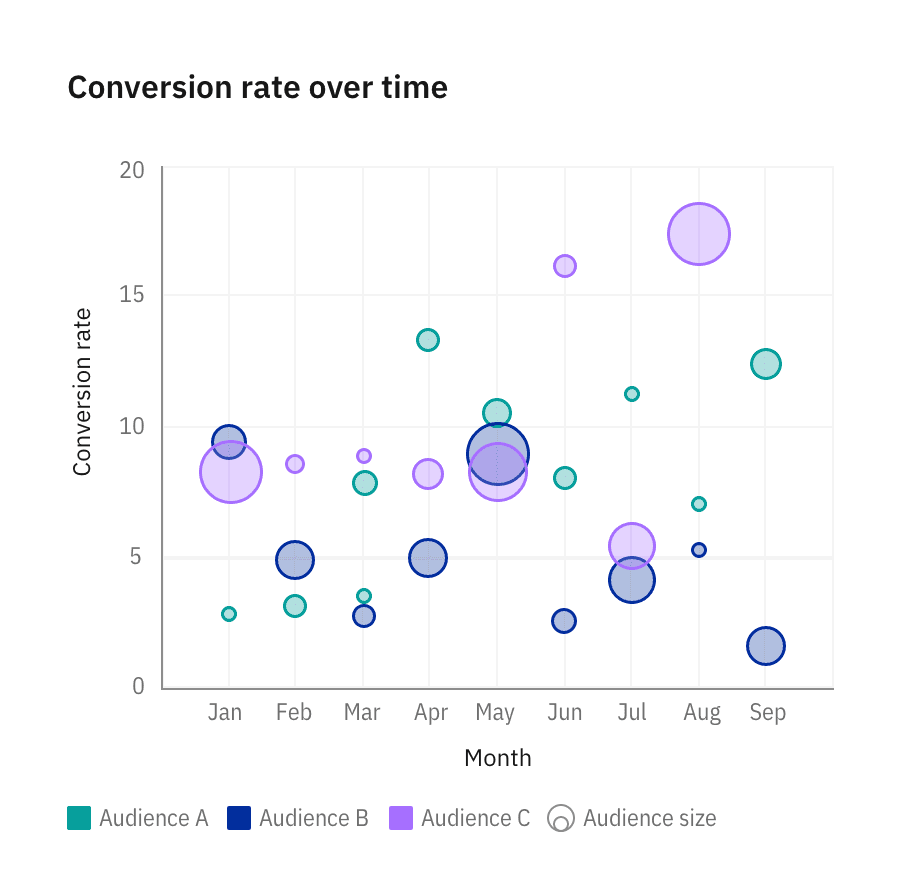
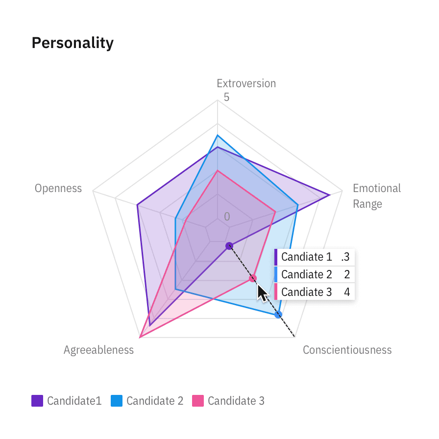
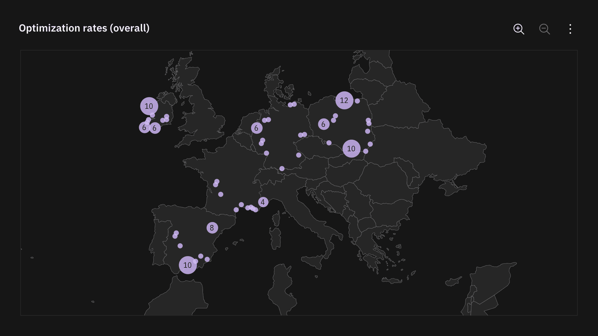

<PageDescription>

The color palette for data visualizations is a select subset of the IBM Design
Language color palette. It is designed to maximize accessibility and harmony
within a page.

</PageDescription>

<InlineNotification>

**Note:** This guidance is a work in progress. To see our roadmap, make feature
requests, or contribute, please go to carbon-charts
[GitHub repository](https://github.com/carbon-design-system/carbon-charts).

</InlineNotification>

<AnchorLinks>

<AnchorLink>Categorical palettes</AnchorLink>
<AnchorLink>Sequential palettes</AnchorLink>
<AnchorLink>Alert palette</AnchorLink>
<AnchorLink>Gradient use</AnchorLink>
<AnchorLink>Color in action</AnchorLink>

</AnchorLinks>

## Categorical palettes

Categorical (or qualitative) palettes are best when you want to distinguish
discrete categories of data that do not have an inherent correlation.

The colors of this palette should be applied in sequence strictly as described
below. The sequence is carefully curated to maximize contrast between
neighboring colors to help with visual differentiation.

<ColorPalette type="categorical" />

You can override the categorical sequence with one of the following palettes if
the exact number of data categories is predictable.

<ColorPalette type="grouped" />

## Sequential palettes

### Monochromatic

The monochromatic palettes are good for relationship charts and trend charts. In
light themes, the darkest color denotes the largest values. In dark themes, the
lightest color denotes the largest values.

<ColorPalette type="sequential" isMono />

### Diverging palettes

Please note that diverging palettes do not differentiate between light and dark
themes.

#### Palette 1

The red-cyan palette has a natural association with temperature. Use this
palette for data representing hot-vs-cold.

#### Palette 2

The purple-teal palette is good for data with no temperature associations, such
as performance, sales, and rates of change.

<ColorPalette type="sequential" isDiverging />

## Alert palette

Alert colors are used to reflect status. Typically, red represents danger or
error; orange represents a serious warning; yellow represents a regular warning,
and green represents normal or success.

<ColorPalette twoColumn type="alert" />

## Gradient use

<InlineNotification>

**Note:** Gradients are not yet supported in Carbon Charts. This exploration is
subject to change.

</InlineNotification>

Gradients are good for highlighting extremes in a range of values. Use a
gradient on single category visualizations only if needed. Multiple gradients
are often inaccessible and are discouraged in our system. Gradients should not
be used to represent any meaningful progression or divergence. Never use a
gradient in place of a sequential palette.

For the full list of approved gradient options, see the IBM Design Language
[Color page](https://www.ibm.com/design/language/color#gradients).

<Row>
<Column colLg={8} colMd={6} colSm={4}>

</Column>
</Row>

## Color in action

See the IBM Design color palette in action across multiple business units and
applications. Deliberate hits of color are composed with rich neutrals for a
well-balanced cohesive experience.

<ImageGallery>
<ImageGalleryImage col={6} title="Bubble chart in action" alt="example of a bubble chart">

</ImageGalleryImage>

<ImageGalleryImage col={6} title="Radar chart in action" alt="example of a radar chart">

</ImageGalleryImage>

<ImageGalleryImage col={6} title="Donut chart in action" alt="example of a donut chart">

</ImageGalleryImage>

<ImageGalleryImage col={6} title="Stream chart in action" alt="example of a stream chart">

</ImageGalleryImage>

<ImageGalleryImage col={12} title="Heat map in action" alt="example of a heat map">

</ImageGalleryImage>

<ImageGalleryImage col={12} title="Proportional diagram in action" alt="example of a proportional diagram">

</ImageGalleryImage>

<ImageGalleryImage col={12} title="Alluvial diagram in action" alt="example of an alluvial diagram">

</ImageGalleryImage>
</ImageGallery>
