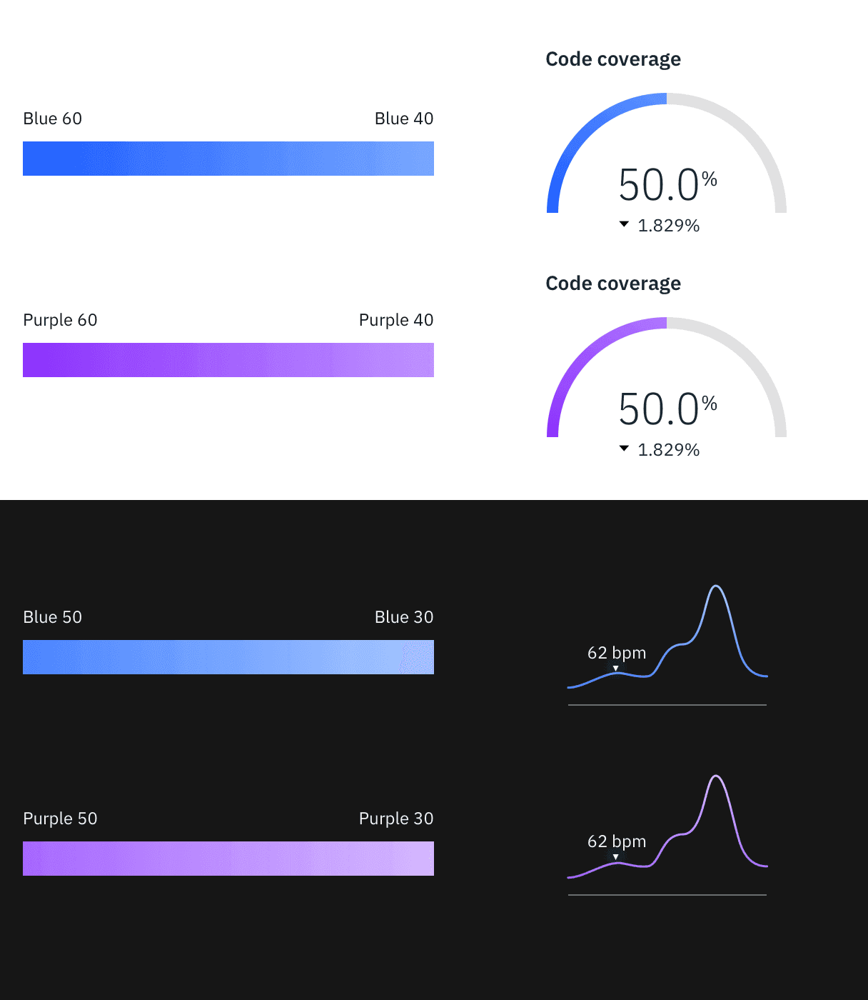

<PageDescription>

The color palette for data visualization is a selected subset of IBM Design Language color palette. It is designed to maximize accessibility and harmony.

</PageDescription>

<AnchorLinks>

<AnchorLink>Categorical palette </AnchorLink>
<AnchorLink>Sequential palette </AnchorLink>
<AnchorLink>Alert palette </AnchorLink>
<AnchorLink>Gradient usage </AnchorLink>

</AnchorLinks>

## Categorical palette

Categorical (or qualitative) palettes are best when you want to distinguish discrete categories of data that do not have an inherent correlation.

The colors of this palette should be applied in sequence strictly as described below. The sequence is careful curated to maximize contrast between neighboring colors to help with visual differentiation.

### 1 category

When only one color is needed to highlight the data, consider one of the following options.

<Row>
<Column colLg={4} colMd={2} colSm={2} >

#### Option 1

</Column>
<Column colLg={4} colMd={2} colSm={2} >

#### Option 2

</Column>
<Column colLg={4} colMd={2} colSm={2} >

#### Option 3

</Column>
</Row>

### 2–7 categories

#### Option 1

<Row>
<Column  colLg={12} colMd={6} colSm={4}>

</Column>
</Row>

#### Option 2

<Row>
<Column  colLg={12} colMd={6} colSm={4}>

</Column>
</Row>

### 8-14 categories

<Row>
<Column  colLg={12} colMd={6} colSm={4}>

<Caption>
  Categorical palette in light and dark themes, presented here as to be used for
  8–14 categories.
</Caption>

</Column>
</Row>

## Sequential palette

### Monochromatic

Monochromatic palette is good for relationship and trend charts.

#### Option 1

<Row>
<Column  colLg={12} colMd={6} colSm={4}>

</Column>
</Row>

#### Option 2

<Row>
<Column  colLg={12} colMd={6} colSm={4}>

</Column>
</Row>

### Diverging

#### Option 1

The red-cyan palette has the natural association with temperature. Use this palette for data representing hot-vs-cold.

<Row>
<Column  colLg={12} colMd={6} colSm={4}>

</Column>
</Row>

#### Option 2

The purple-teal palette is good for data with no temperature associations, such as performance, sales, and rates of change.

<Row>
<Column  colLg={12} colMd={6} colSm={4}>

</Column>
</Row>

## Alert palette

<Row>
<Column  colLg={8} colMd={6} colSm={4}>

</Column>
</Row>

## Gradient usage

Graident is good for highlighting extremes of a range of values. Use gradient on single category visualizations only if needed. Gradient should not be used to represent any meaningful progression or divergence, so it should never be used in place of a sequential palette.

For the full list of approved gradient options, please see [IBM Design Language Color page](https://www.ibm.com/design/language/elements/color#gradients).

<Row>
<Column  colLg={8} colMd={6} colSm={4}>

</Column>
</Row>
