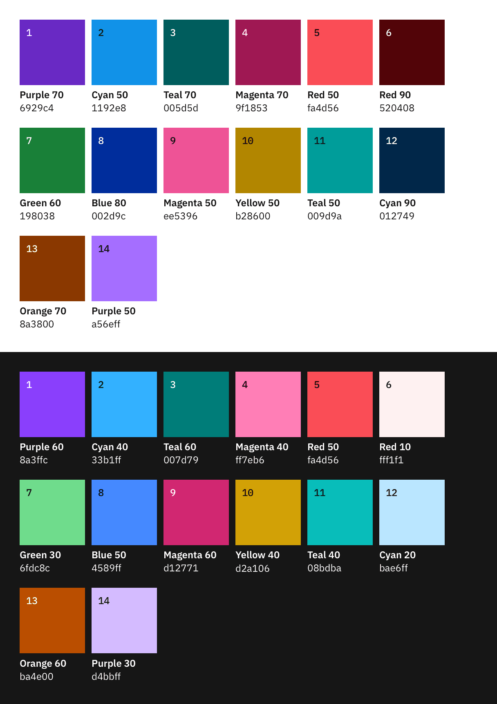

<PageDescription>

The color palette for data visualization is a select subset of the IBM Design Language color palette. It is designed to maximize accessibility and harmony within a page.

</PageDescription>

<AnchorLinks>

<AnchorLink>Categorical palettes</AnchorLink>
<AnchorLink>Sequential palettes</AnchorLink>
<AnchorLink>Alert palette</AnchorLink>
<AnchorLink>Gradient use</AnchorLink>

</AnchorLinks>

## Categorical palettes

Categorical (or qualitative) palettes are best when you want to distinguish discrete categories of data that do not have an inherent correlation.

The colors of this palette should be applied in sequence strictly as described below. The sequence is careful curated to maximize contrast between neighboring colors to help with visual differentiation.

### One category

When only one color is needed to highlight the data, consider these colors or [approved gradients](#gradient-use).

<Row>
<Column colLg={3} colMd={2} colSm={2}>

</Column>
<Column colLg={3} colMd={2} colSm={2}>

</Column>
<Column colLg={3} colMd={2} colSm={2}>

</Column>
<Column colLg={3} colMd={2} colSm={2}>

</Column>
</Row>

### Two to five categories

**Palette 1**

<Row>
<Column  colLg={8} colMd={6} colSm={4}>

</Column>
</Row>

**Palette 2**

<Row>
<Column  colLg={8} colMd={6} colSm={4}>

</Column>
</Row>

### 6–14 categories

When more than five categories of data is present, use the master categorical palette according to the sequence provided.

<Row>
<Column  colLg={8} colMd={6} colSm={4}>

<Caption>

Complete default categorical palette in light and dark themes.

</Caption>

</Column>
</Row>

## Sequential palettes

### Monochromatic

The monochromatic palettes are good for relationship and trend charts.

**Palette 1**

<Row>
<Column  colLg={8} colMd={6} colSm={4}>

</Column>
</Row>

**Palette 2**

<Row>
<Column  colLg={8} colMd={6} colSm={4}>

</Column>
</Row>

### Diverging palettes

#### Palette 1

The red-cyan palette has the natural association with temperature. Use this palette for data representing hot-vs-cold.

<Row>
<Column colLg={12} colMd={6} colSm={4}>

</Column>
</Row>

#### Palette 2

The purple-teal palette is good for data with no temperature associations, such as performance, sales, and rates of change.

<Row>
<Column colLg={12} colMd={6} colSm={4}>

</Column>
</Row>

## Alert palette

<Row>
<Column colLg={8} colMd={6} colSm={4}>

</Column>
</Row>

## Gradient use

Graidents are good for highlighting extremes in a range of values. Use gradient on single category visualizations only if needed. Gradients should not be used to represent any meaningful progression or divergence, so it should never be used in place of a sequential palette.

For the full list of approved gradient options, please see [IBM Design Language Color page](https://www.ibm.com/design/language/elements/color#gradients).

<Row>
<Column colLg={8} colMd={6} colSm={4}>

</Column>
</Row>
