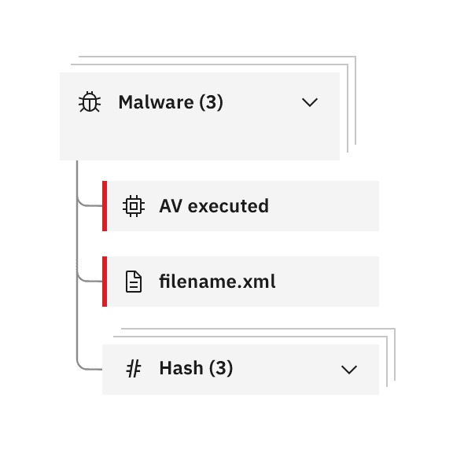
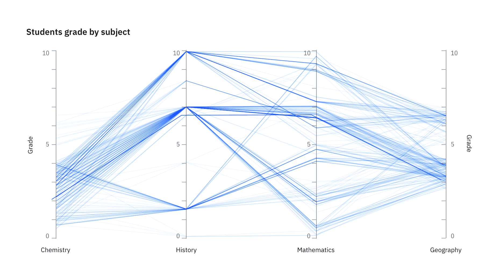

import {
  complexChartDemoGroups,
  getDemoGroupByTitle,
} from '../../../data/data-visualization';

import { AnchorLinks, AnchorLink } from 'gatsby-theme-carbon';
import ChartDemoGroup from '../../../components/data-visualization/ChartDemoGroup.js';

<PageDescription>

Uncover intricate data relationships and flows, providing valuable insights into
complex data sets.

</PageDescription>

<InlineNotification>

**Note:** Some of the charts below are not included in the carbon-charts
repository yet. To see our roadmap, make feature requests, or contribute, please
go to the
[carbon-charts repository](https://github.com/carbon-design-system/carbon-charts).

</InlineNotification>

<AnchorLinks>
  <AnchorLink>Alluvial/sankey diagrams</AnchorLink>
  <AnchorLink>Network diagrams</AnchorLink>
  <AnchorLink>Parallel coordinates</AnchorLink>
  <AnchorLink>Tree diagrams</AnchorLink>
</AnchorLinks>

## Alluvial/sankey diagrams

Alluvial, or Sankey diagrams, are a type flow diagram designed to show two
indicators of a dataset and how records distribute among them, highlighting
correlations.

Multiple blocks of two indicators can be placed next to each other creating a
wider alluvial diagram but it’s crucial to consider that this specific kind of
chart does not show correlations between indicators that are not directly
connected. This is usually emphasized using a different set of colors for each
block.

  <ChartDemoGroup demoGroup={getDemoGroupByTitle('alluvial')} light={true} />

## Network diagrams

A network diagram is a way of visually representing network architecture. It
maps out network structure with a variety of icons and connecting lines. It’s
ideal for sharing the layout of a network because the visual presentation makes
it easier for users to understand complex connections at a glance. These
diagrams are especially useful for isolating problems or when designing a new
system.

### Building blocks

Carbon Charts offers building blocks for network diagrams in the form of
**React** & **Angular** components.

Note that Carbon Charts does not provide layouts for diagrams. You can utilize
these components alongside graphing libraries (such as elkjs), or by composing
your own layouts.

**Getting started guides:**

- [React](https://carbon-design-system.github.io/carbon-charts/react/?path=/story/diagrams--start-here)
- [Angular](https://carbon-design-system.github.io/carbon-charts/angular/?path=/story/diagrams--start-here)

Here's an
[example using elkjs in react](https://codesandbox.io/p/sandbox/carbon-charts-react-elkjs-diagram-b9xyp?file=%2Fsrc%2Findex.js&from-embed).

<Row>
<Column colLg={12} colMd={8} colSm={4}>

<Caption>Example of a network diagram in a swimlane graph from QRadar</Caption>

</Column>
</Row>

### Node types

This specific network diagram is comprised of parent and child nodes. In the
QRadar example, parent nodes convey the story of what happened in an
investigation and can be clustered based on relationship type. Child nodes
appear under parent nodes and can also be clustered.

Network diagrams use the same scale controls that apply to the rest of the data
visualization components, however they appear in a floating tile, enabling the
user to zoom and pan simultaneously. It’s also helpful to include the expand and
collapse all nodes feature, which gives users the ability to easily navigate
between detailed and high-level views of the diagram.

<Row>
<Column colLg={4} colMd={4} colSm={4}>

<Caption>Detail of floating zoom and pan functionality</Caption>

</Column>

<Column colLg={4} colMd={4} colSm={4}>

<Caption>
  Detail of child nodes clustered underneath master parent cluster
</Caption>

</Column>
</Row>

## Parallel coordinates

Parallel coordinate charts visualize individual data elements across multiple
variables. Each variable corresponds to a vertical axis and each data element is
displayed as a series of connected points along the axes.

The parallel coordinate chart is the equivalent of a radar chart with axes —
making it preferable for many use cases. Its strength is that each variable can
be completely different and even have its own scale (the units can even be
different).

<Row>
<Column colLg={12} colMd={8} colSm={4}>

</Column>
</Row>

### Parallel coordinate behaviors

Hover effects that highlight a specific group or axis can be added to enhance
basic parallel coordinate charts. These charts can also include interactive
features like the brush component. By clicking and dragging along any axis, you
can specify a filter for that dimension. The brush component is also used in the
updated scatterplot matrix example. See the detail below.

<Row>
<Column colLg={4} colMd={4} colSm={4}>

<Caption>Detail of brush component behavior</Caption>

</Column>

<Column colLg={4} colMd={4} colSm={4}>

<Caption>Detail of a comparative tooltip interaction on hover</Caption>

</Column>
</Row>

## Tree diagrams

Carbon Charts supports both tree diagrams and dendrograms. Although the two are
very similar, dendrograms tend to offer a more responsive layout for varying
screen sizes.

  <ChartDemoGroup demoGroup={getDemoGroupByTitle('tree')} light={true} />

