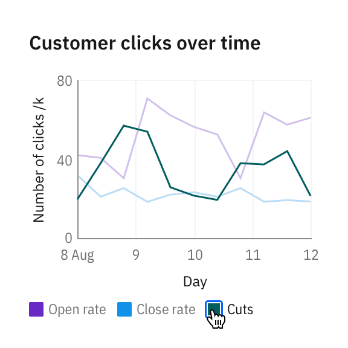
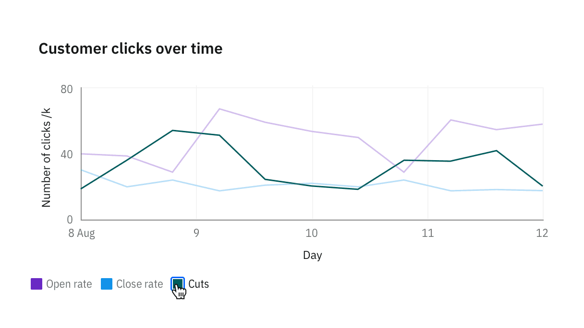
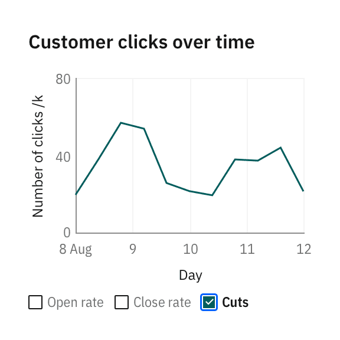

<PageDescription>

Legends summarize the distinguishing visual properties such as colors or texture used in the visualization. A legend or key helps the user build the necessary associations to make sense of the chart.

</PageDescription>

## Behaviors

### Interactions

<Row>
<Column  colLg={4} colMd={8} colSm={4}>

#### Hover to highlight

Hovering over legend of one category lowers the opacity of all other categories charts to 30%.

</Column>
<Column  colLg={8} colMd={8} colSm={4}>

<ArtDirection>

</ArtDirection>

</Column>
</Row>

<Row>
<Column  colLg={4} colMd={8} colSm={4}>

#### Click to solo

Clicking on the legend of one category solos the chart of it, hiding all other categories. Legend gets a checkmark on click, turning into selected state.

</Column>
<Column  colLg={8} colMd={8} colSm={4}>

<ArtDirection>

</ArtDirection>
</Column>
</Row>

<Row>
<Column  colLg={4} colMd={8} colSm={4}>

</Column>
<Column  colLg={8} colMd={8} colSm={4}>

<ArtDirection>

</ArtDirection>
</Column>
</Row>

<Row>
<Column  colLg={4} colMd={8} colSm={4}>

When all categories are selected, checkmarks in legends disappears, and legend resets to default state.

</Column>
<Column  colLg={8} colMd={8} colSm={4}>

<ArtDirection>

</ArtDirection>

</Column>
</Row>
