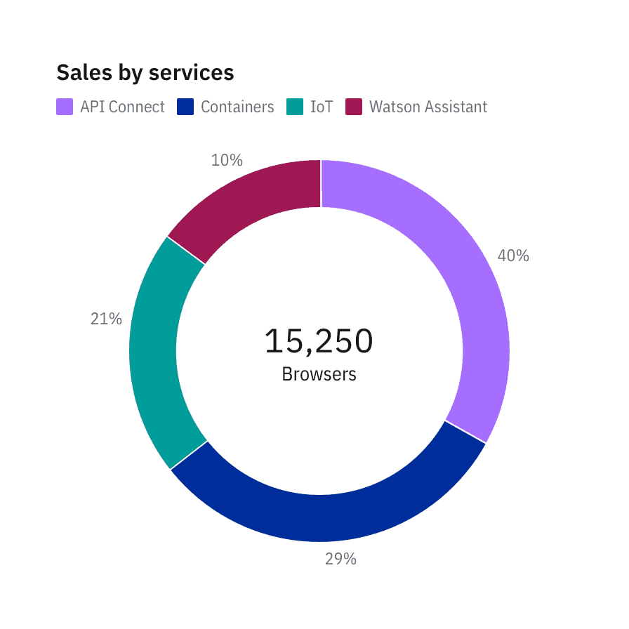
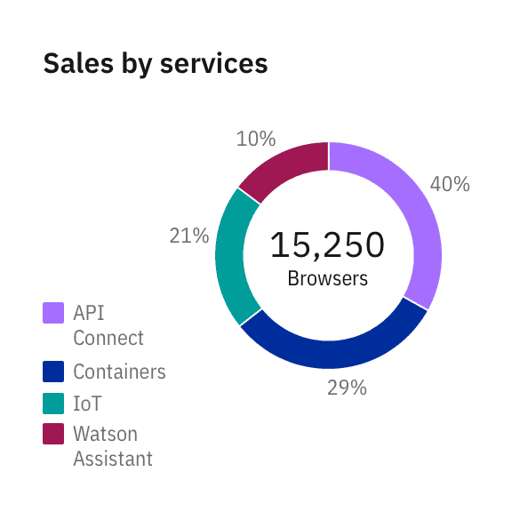
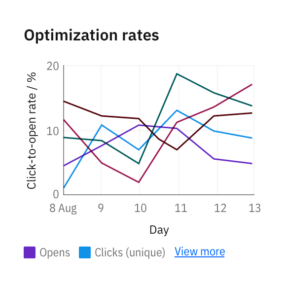
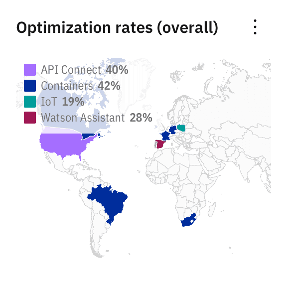
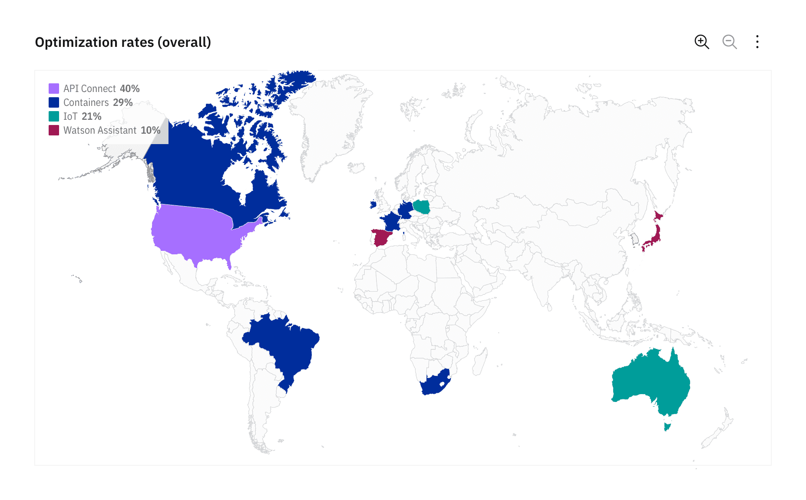
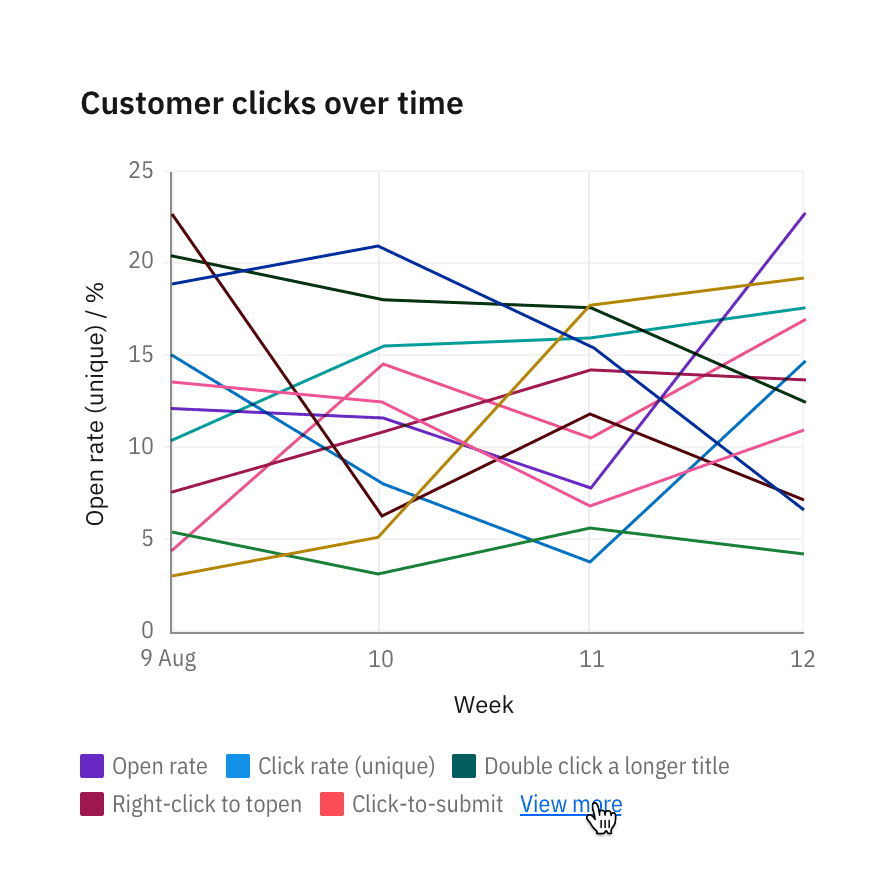
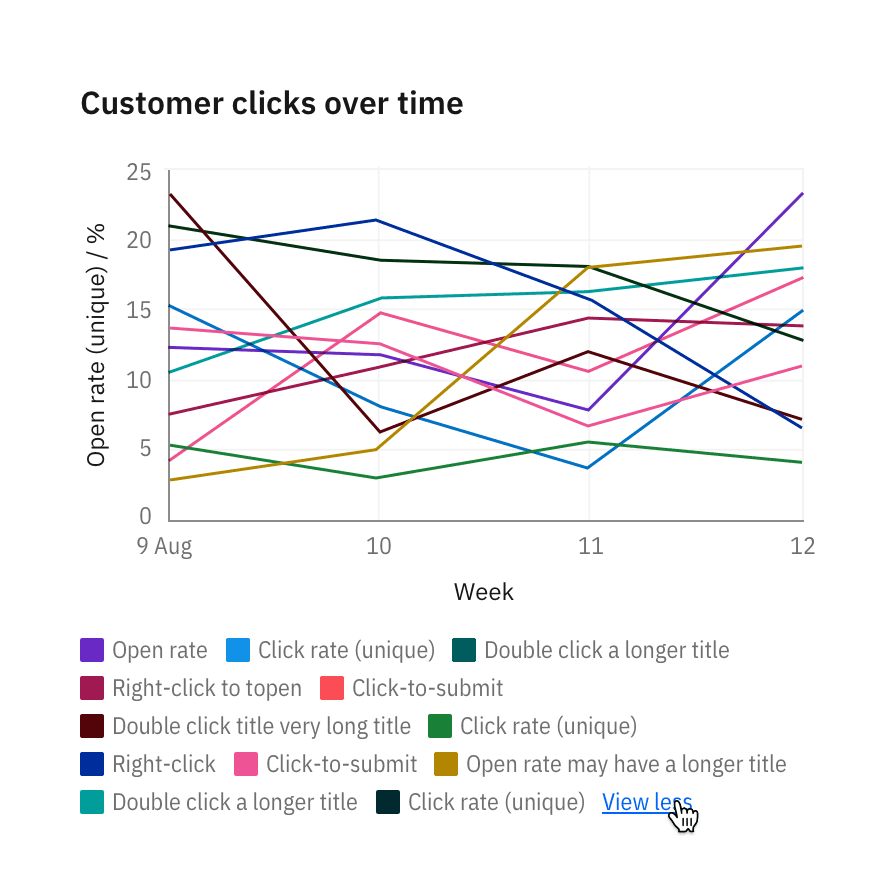
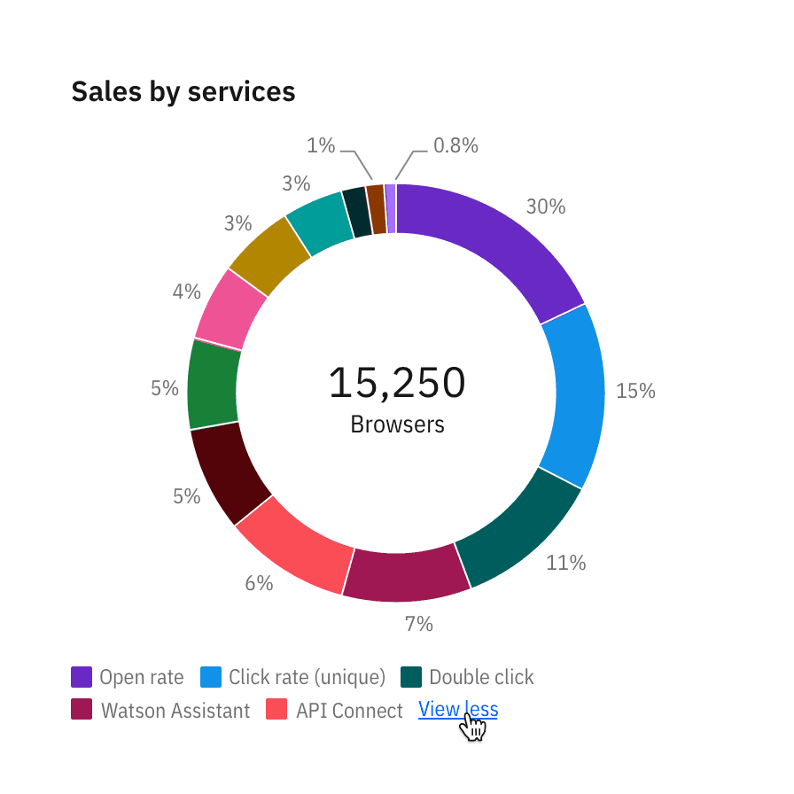
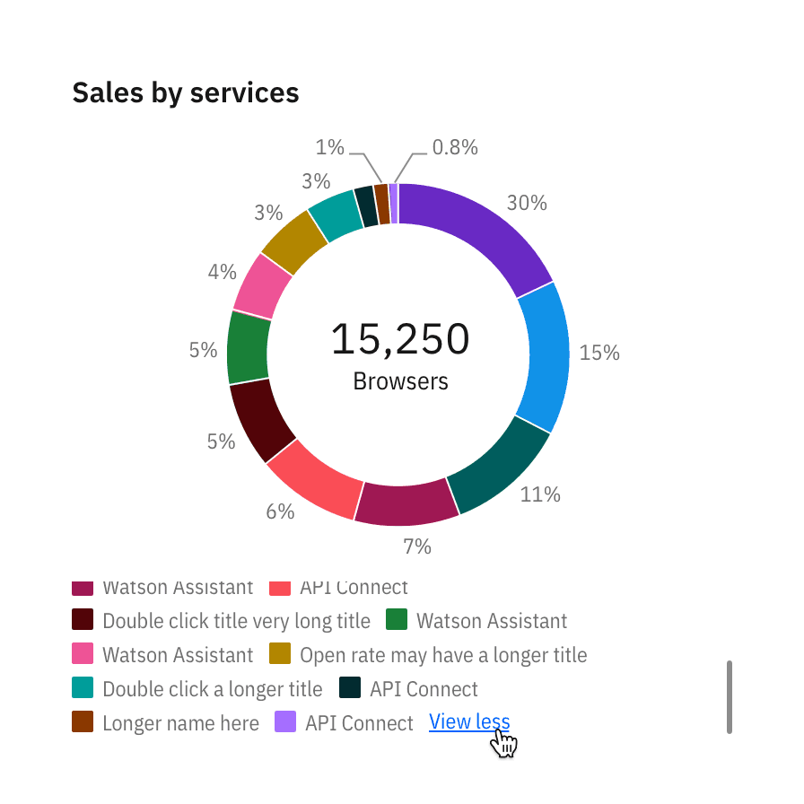

<PageDescription>

Legends summarize the distinguishing visual properties such as colors or texture
used in the visualization. A legend or key helps the user build the necessary
associations to make sense of the chart.

</PageDescription>

<InlineNotification>

**Note:** This guidance is a work in progress. To see our roadmap, make feature
requests, or contribute, please go to carbon-charts
[GitHub repository](https://github.com/carbon-design-system/carbon-charts).

</InlineNotification>

<AnchorLinks>

<AnchorLink>Usage</AnchorLink>
<AnchorLink>Position</AnchorLink>
<AnchorLink>Interactions</AnchorLink>

</AnchorLinks>

## Usage

**When possible, avoid using a legend and label data representations directly.**
Legends rely on visual association, which can make a chart more difficult to
understand.

**Your chart doesn't need a legend if it only presents one data category.** Only
use a legend if you can't safely assume there will be enough space to apply
labels directly.

**Use clear language and avoid acronyms in legends.** This also applies to
titles and axis labels.

<Row>
<Column colLg={6} colMd={4} colSm={4}>

<Caption>
  Remove legends to simplify the chart when only one data category is needed or
  only one color is used.
</Caption>

</Column>
<Column colLg={6} colMd={4} colSm={4}>

<Caption>
  In-chart labels are ideal for charts with predictable data and ample empty
  space.
</Caption>

</Column>

</Row>

#### Color and texture

Chart legends use color as the default distinguishing property for data sets and
values. Texture can be used instead of, or in addition to, color to make your
chart accessible for users with visual impairment.

<Row>
<Column colLg={6} colMd={4} colSm={4}>

<Caption>
  Texture can improve accessibility. See the accessibility page for all approved
  textures.
</Caption>

</Column>
</Row>

## Position

The legends are positioned at the `bottom` of a chart by default. Depending on
the page’s layout and context, you may choose to position the legends at the
`top`, under the chart title, `left` or `right` of a chart with respect to the
[graph frame](./chart-anatomy).

#### Bottom (default) and top

Position the legend at the bottom or top of a chart in situations where space is
scarce, such as a dashboard.

<Row>
<Column colLg={6} colMd={4} colSm={4}>

</Column>
<Column colLg={6} colMd={4} colSm={4}>

</Column>
</Row>

#### Left

Position the legend to the left of the chart when better type alignment is
needed. Be sure the surrounding elements of the chart are not too closely
clustered.

<Row>
<Column colLg={8} colMd={6} colSm={4}>
<ArtDirection>

</ArtDirection>
</Column>
</Row>

#### Right

Position the legend to the right of the chart when space is plentiful, or when
you would like to provide the maximum context. In mobile, the legend could
revert to a stack.

<Row>
<Column colLg={8} colMd={6} colSm={4}>

<ArtDirection>

</ArtDirection>

</Column>
</Row>

#### Overlay (geospatial only)

In geospatial charts, legends can be overlaid on top of a graph frame as long as
the legend has a background opacity of 80% of the chart’s background color.
Since geospatial charts can vary drastically in appearance, the legend can be
placed on either side of the chart, top- or bottom-aligned, whatever best
accommodates the content.

To demonstrate the legend’s background opacity, we chose to place the legend at
the top left in the chart below. See the Master data visualization design file
for more detail about geospatial legends.

<Row>
<Column colLg={12} colMd={6} colSm={4}>
<ArtDirection>

</ArtDirection>
</Column>
</Row>

## Interactions

#### Hover to highlight

Hovering over the legend of one category lowers the opacity of all other
categories in the chart to 30 percent.

<Row>
<Column colLg={8} colMd={6} colSm={4}>

<ArtDirection>

</ArtDirection>

</Column>
</Row>

#### Click to isolate

Clicking on the legend of one category isolates the information, hiding all
other categories. The legend gets a checkmark on click, switching to a selected
state.

<Row>
<Column colLg={8} colMd={6} colSm={4}>
<ArtDirection>

</ArtDirection>
</Column>
</Row>

<Row>
<Column colLg={8} colMd={6} colSm={4}>
<ArtDirection>

</ArtDirection>
</Column>
</Row>

When all categories are selected, checkmarks in legends disappear and the legend
resets to its default state.

<Row>
<Column colLg={8} colMd={6} colSm={4}>
<ArtDirection>

</ArtDirection>
</Column>
</Row>

### Hidden legends

Please note that hiding legends is discouraged in data visualizations unless
only one category of data is displayed. This design is for mobile displays where
offering legends at a glance is less essential. In general, hiding legends
reduces the clarity of the visualization and is inaccessible.

<Row>
<Column colLg={6} colMd={4} colSm={4}>

<Caption>
  When legends are hidden, a “View legends” button is added so users can surface
  the legend on tap.
</Caption>

</Column>
<Column colLg={6} colMd={4} colSm={4}>

<Caption>
  When clicking on “View legends”, a modal with a list of legends appears with
  options to toggle each data category on and off.
</Caption>

</Column>
</Row>

### Legend overflow

Up to two lines of legends are displayed by default. Clicking on **View more**
expands the legend area to show all legends. A legend should not be taller than
30 percent of the chart's height.

<Row>
<Column colLg={6} colMd={4} colSm={4}>

</Column>
<Column colLg={6} colMd={4} colSm={4}>

</Column>
</Row>

When legends exceed 30 percent of the chart, overflow the content and scroll
vertically.

<Row>
<Column colLg={6} colMd={4} colSm={4}>

</Column>
<Column colLg={6} colMd={4} colSm={4}>

</Column>
</Row>
