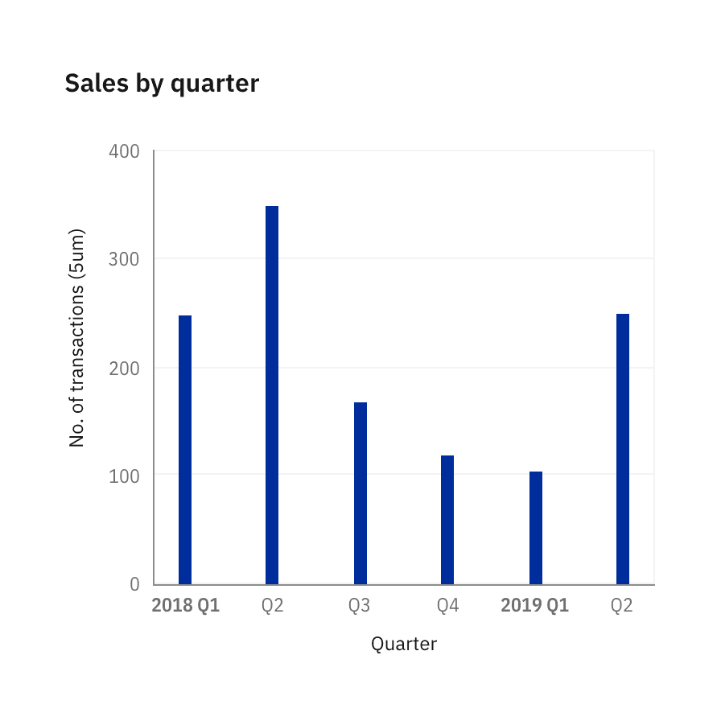
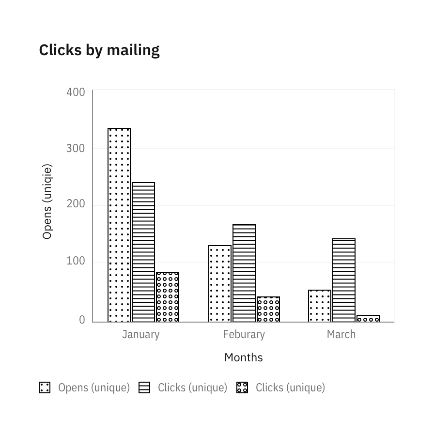
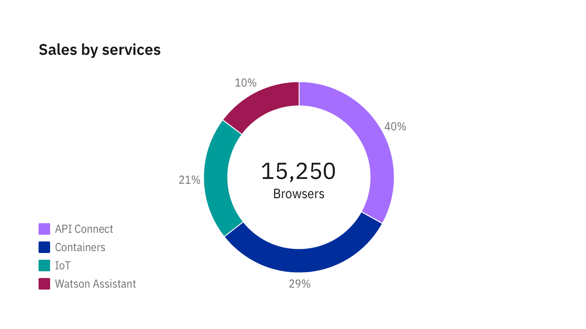
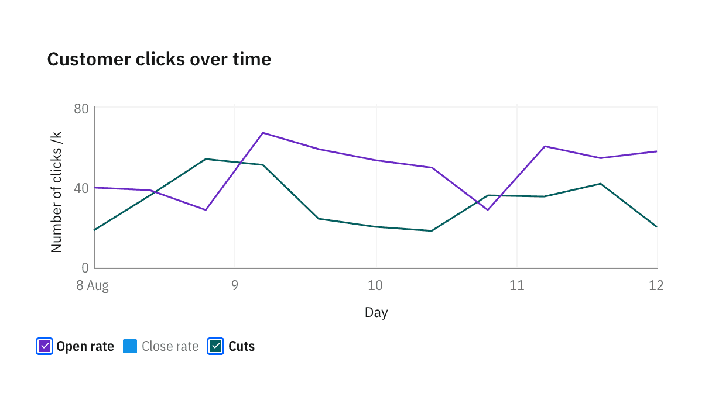

<PageDescription>

Legends summarize the distinguishing visual properties such as colors or texture used in the visualization. A legend or key helps the user build the necessary associations to make sense of the chart.

</PageDescription>

<AnchorLinks>

<AnchorLink>Usage</AnchorLink>
<AnchorLink>Position</AnchorLink>
<AnchorLink>Behaviors</AnchorLink>

</AnchorLinks>

## Usage

<!-- #### Avoid if possible -->

When possible, label data representations directly. Legends rely on visual association, which can make a chart more difficult to understand.

- Only one data category
- Predictable space available so labels can be legibly applied to chart

<Row>
<Column  colLg={6} colMd={4} colSm={4}>

<Caption>
  When only 1 data category is needed, or only 1 color is used, remove legends
  to simplify the chart.
</Caption>

</Column>

<Column  colLg={6} colMd={4} colSm={4}>

<Caption>
  Label in chart is encouraged for charts with preditable data and has a luxury
  of space.
</Caption>

</Column>
</Row>

#### Clarity in writing

Use clear language and avoid acronyms in legends. This applies to titles and axes labels as well.

#### Color and texture

Our legends use color as the default distinguishing property for data sets and values. Texture can be used instead, or in addition, to create a visualization accessible for users with vision deficiencies.

<Row>
<Column  colLg={6} colMd={4} colSm={4}>

<Caption>
  Texture can be used to improve accessibility. See accessibility page for all
  approved texture options.
</Caption>

</Column>
</Row>

## Position

Legends is by default positioned `top`, under Chart title. Depending on the rest of the page’s layout and context, you may choose to position the legends `bottom`, `left` or `right` with respect to the [graph frame](./chart-anatomy).

#### Top (default) and bottom

These legend positions are ideal situations where space is a scarce, such as a dashboard.

<Row>
<Column  colLg={6} colMd={4} colSm={4}>

</Column>
<Column  colLg={6} colMd={4} colSm={4}>

</Column>
</Row>

#### Right

Position the legend right of the chart when space is plentiful, or when you would like to provide the maximum context.

<Row>
<Column  colLg={8} colMd={4} colSm={4}>

</Column>
</Row>

#### Left

Position legend on the left of chart when better type alignment is needed. This is an unusual layout so make sure the surrounding elements of the chart are not too close to create confusion.

<Row>
<Column  colLg={8} colMd={4} colSm={4}>

</Column>
</Row>

#### Overlay–geospatial only

In geospatial charts, we allow legends to be overlayed on top of graph frame.

<Row>
<Column  colLg={12} colMd={6} colSm={4}>

</Column>
</Row>

## Behaviors

### Interactions

<Row>
<Column  colLg={4} colMd={8} colSm={4}>

#### Hover to highlight

Hovering over legend of one category lowers the opacity of all other categories charts to 30%.

</Column>
<Column  colLg={8} colMd={8} colSm={4}>

<ArtDirection>

</ArtDirection>

</Column>
</Row>

<Row>
<Column  colLg={4} colMd={8} colSm={4}>

#### Click to solo

Clicking on the legend of one category solos the chart of it, hiding all other categories. Legend gets a checkmark on click, turning into selected state.

</Column>
<Column  colLg={8} colMd={8} colSm={4}>

<ArtDirection>

</ArtDirection>
</Column>
</Row>

<Row>
<Column  colLg={4} colMd={8} colSm={4}>

</Column>
<Column  colLg={8} colMd={8} colSm={4}>

<ArtDirection>

</ArtDirection>
</Column>
</Row>

<Row>
<Column  colLg={4} colMd={8} colSm={4}>

When all categories are selected, checkmarks in legends disappears, and legend resets to default state.

</Column>
<Column  colLg={8} colMd={8} colSm={4}>

<ArtDirection>

</ArtDirection>

</Column>
</Row>

### Hidden legends

### Legend overflow
