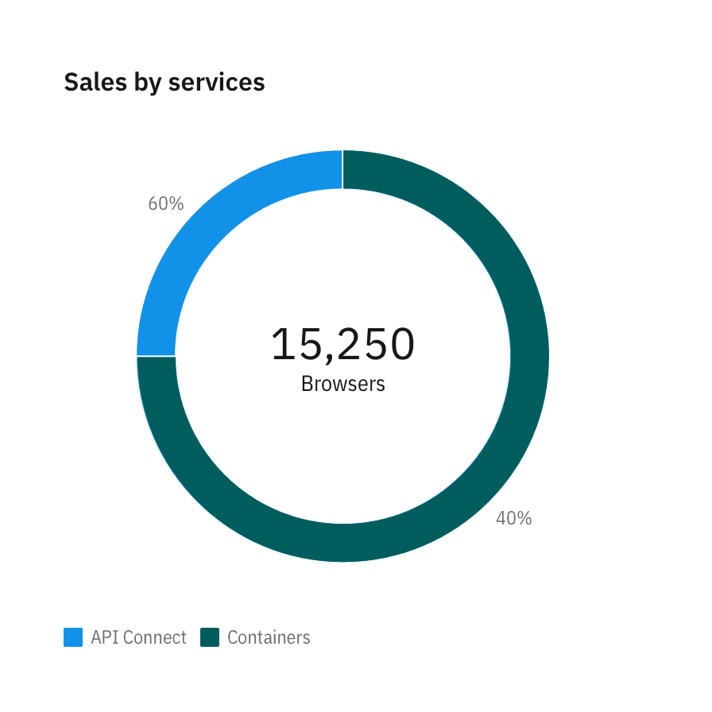
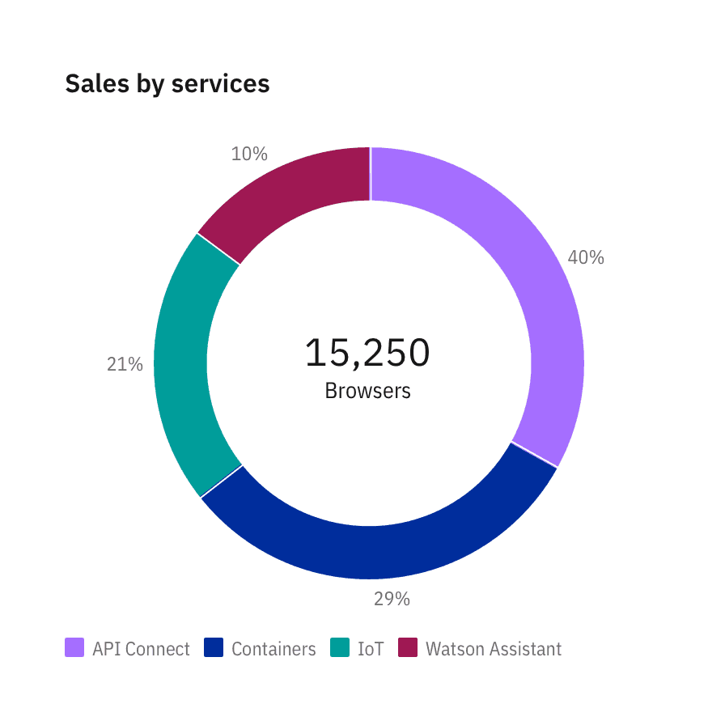
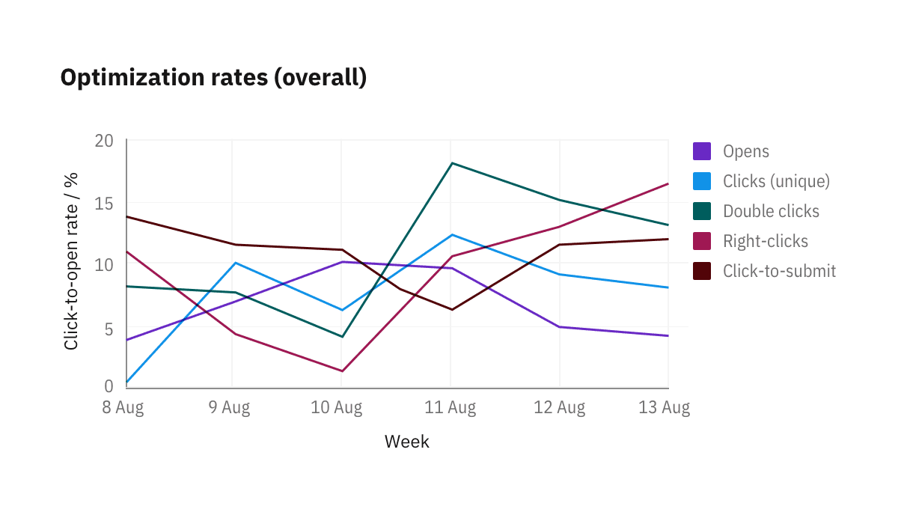
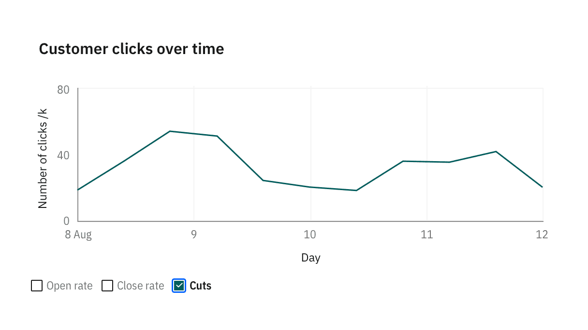
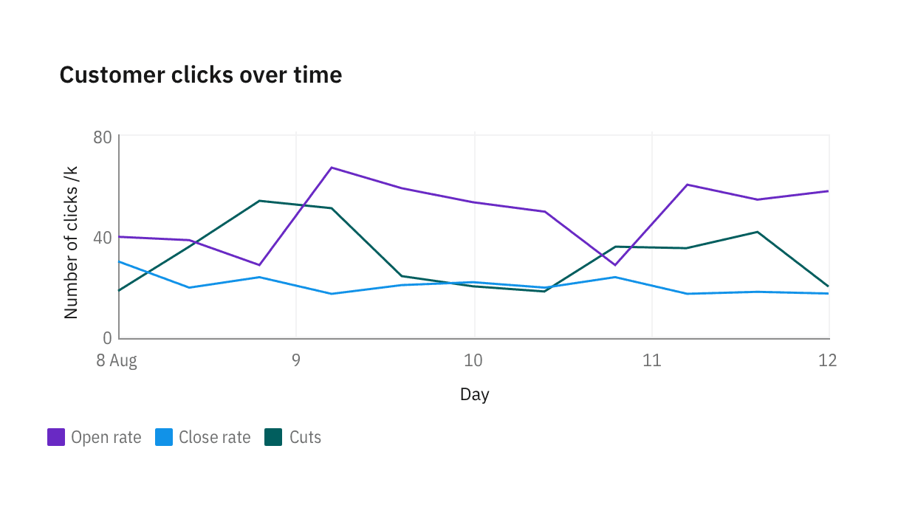
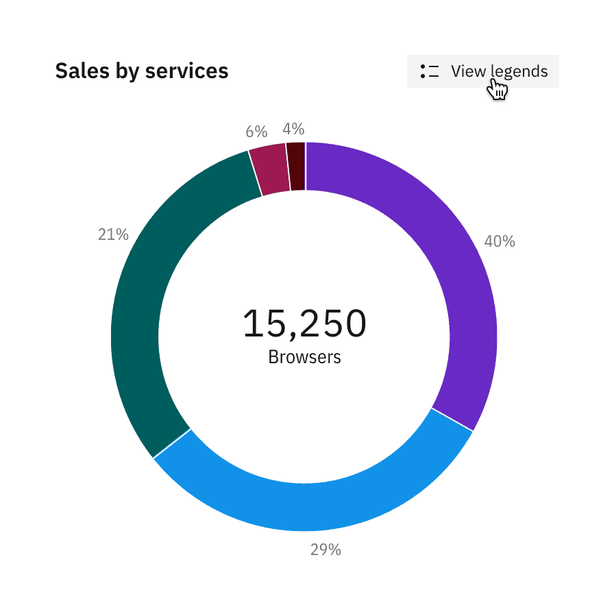
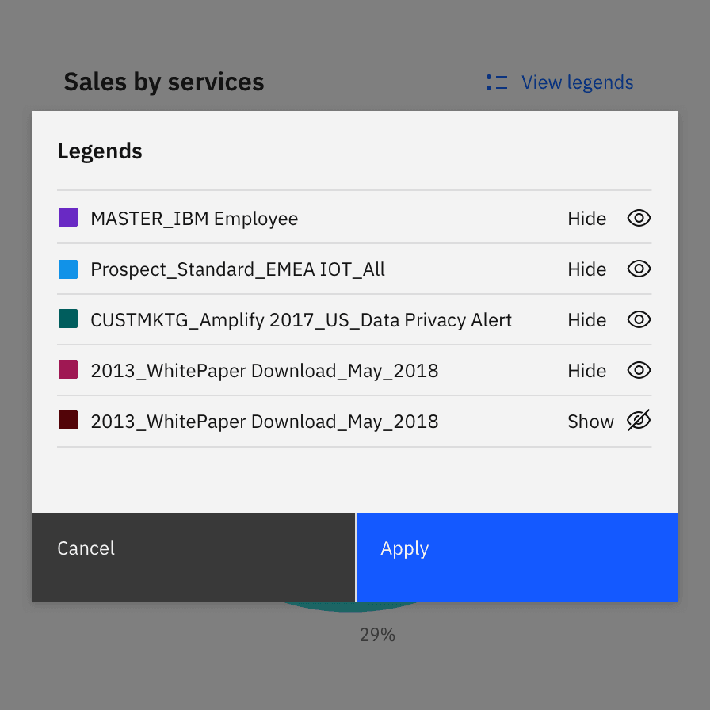

<PageDescription>

Legends summarize the distinguishing visual properties such as colors or texture used in the visualization. A legend or key helps the user build the necessary associations to make sense of the chart.

</PageDescription>

<AnchorLinks>

<AnchorLink>Usage</AnchorLink>
<AnchorLink>Position</AnchorLink>
<AnchorLink>Interactions</AnchorLink>

</AnchorLinks>

## Usage

**When possible, avoid using a legend and label data representations directly.** Legends rely on visual association, which can make a chart more difficult to understand.

**Your chart doesn't need a legend if it only presents one data category.** Only use a legend if you can't safely assume there will be enough space to apply labels directly.

**Use clear language and avoid acronyms in legends.** This applies to titles and axes labels as well.

<Row>
<Column  colLg={6} colMd={4} colSm={4}>

<Caption>
  Remove legends to simplify the chart when only one data category is needed or
  only one color is used.
</Caption>

</Column>

<Column  colLg={6} colMd={4} colSm={4}>

<Caption>
  In-chart labels are ideal for charts with preditable data and ample empty
  space.
</Caption>

</Column>
</Row>

#### Color and texture

Chart legends use color as the default distinguishing property for data sets and values. Texture can be used instead of, or in addition to, color to make your chart accessible for users with visual impairment.

<Row>
<Column  colLg={6} colMd={4} colSm={4}>

<Caption>
  Texture can improve accessibility. See the accessibility page for all approved
  textures.
</Caption>

</Column>
</Row>

## Position

The legends are positioned at the `top` of a chart by default, under the chart's title. Depending on the page’s layout and context, you may choose to position the legends at the `bottom`, `left` or `right` of a chart with respect to the [graph frame](./chart-anatomy).

#### Top (default) and bottom

Position the legend at the top or bottom of a chart in situations where space is a scarce, such as a dashboard.

<Row>
<Column  colLg={6} colMd={4} colSm={4}>

</Column>
<Column  colLg={6} colMd={4} colSm={4}>

</Column>
</Row>

#### Right

Position the legend right of the chart when space is plentiful, or when you would like to provide the maximum context.

<Row>
<Column  colLg={8} colMd={4} colSm={4}>

</Column>
</Row>

#### Left

Position legend on the left of chart when better type alignment is needed. This is an unusual layout so make sure the surrounding elements of the chart are not too close to create confusion.

<Row>
<Column  colLg={8} colMd={4} colSm={4}>

</Column>
</Row>

#### Overlay–geospatial only

In geospatial charts, we allow legends to be overlayed on top of graph frame.

<Row>
<Column  colLg={12} colMd={6} colSm={4}>

</Column>
</Row>

## Interactions

#### Hover to highlight

Hovering over legend of one category lowers the opacity of all other categories charts to 30%.

<Row>
<Column  colLg={8} colMd={8} colSm={4}>

<ArtDirection>

</ArtDirection>

</Column>
</Row>

#### Click to solo

Clicking on the legend of one category solos the chart of it, hiding all other categories. Legend gets a checkmark on click, turning into selected state.

<Row>
<Column  colLg={8} colMd={8} colSm={4}>
<ArtDirection>

</ArtDirection>
</Column>
</Row>

<Row>
<Column  colLg={8} colMd={8} colSm={4}>
<ArtDirection>

</ArtDirection>
</Column>
</Row>

When all categories are selected, checkmarks in legends disappears, and legend resets to default state.

<Row>
<Column  colLg={8} colMd={8} colSm={4}>
<ArtDirection>

</ArtDirection>
</Column>
</Row>

### Hidden legends

Please note that hiding legends is discouraged in data visualization (unless only 1 category of data is displayed). This design is for mobile situations where having legends at a glance is less essential. In general, hiding legends reduces the clarity of the visualization and is inaccessibility.

<Row>
<Column  colLg={4} colMd={8} colSm={4}>

<Caption>
  When legends are hidden, a “View legends” button is added so users may click
  on it to access the legends.
</Caption>

</Column>
<Column  colLg={4} colMd={8} colSm={4}>

<Caption>
  When clicking on “View legends”, a modal with a list of legends appears, with
  options to turn each data category on and off.
</Caption>

</Column>
</Row>

### Legend overflow

Up to two lines of legends are displayed by default. Clicking on `View more` expands legends area to show all legends. Max height of legends area is 30% of parent.

<Row>
<Column  colLg={8} colMd={8} colSm={4}>

</Column>
</Row>

When legends exceed 30% of parent, overflow content and scroll vertically.

<Row>
<Column  colLg={8} colMd={8} colSm={4}>

</Column>
</Row>
