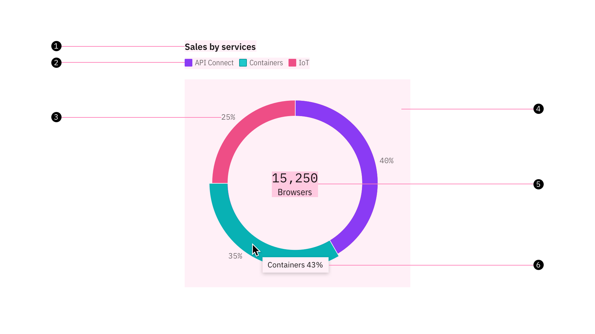

<PageDescription>

Elements constructing the charts are designed to work together, each playing a different role in data communication.

</PageDescription>

<InlineNotification>

**Note:** this guidance is currently a work in progress. To see our roadmap, request missing guidance, or contribute your own content, please go to the [Carbon-charts GitHub](https://github.com/carbon-design-system/carbon-charts) repository.

</InlineNotification>

## Anatomy of charts

### Rectangular charts

Most charts fall into this category, with two dimensions represented on a vertical and a horizontal axis. Rectangular charts typically are constructed with these common elements.

<Row>
<Column  colLg={8} colMd={2} colSm={2} noGutterSm>

<Caption></Caption>
</Column>

<Column colMd={2} colLg={3} offsetMd={1} offsetLg={1}>
  <Aside>
    1. Chart title  
    2. Legends  
    3. Axes  
    4. Ticks  
    5. Axis title  
    6. Toolbar  
    7. Zoom bar  
    8. Graph frame  
    9. Tooltip  
  </Aside>
</Column>
</Row>

#### Chart title

The title of a piece of visualization should be concise and descriptive, when possible, communicate the insight revealed by the data below it.

#### Legend


Many charts will use different visual properties such as colours, texture or shapes to represent different categories, or dimensions of data. A legend or key tells you what these associations mean and therefore helps you to read the meaning from the chart. [Read more on legend usage.](../legends)

#### Axes

The X axis is horizontal and Y axis vertical. Axes should be 3:1 accessible when present to provide an anchor for ticks and axes labels. [Read more on axes usage.](../axis-and-labels)

#### Tooltip

A message which appears when a cursor is positioned over a element, such as a data point, icon button, or truncated text, to provide more detailed information or context. By default, tooltip shows on hover to any data to reveal it in a more easily readable format. Content on the tooltip should repeat the corresponding values of the data point on both axes, and more details if available. [Read more about tooltip usage.](../tooltips)

#### Graph frame

This is the area where the data will be visualized as graphics or numbers. Grid lines, when strategically used, could help with visually estimate the data value, but this is not required. In fact, too much grid lines makes the graph frame busy, and worsen the data interpretation experience.

### Circular charts

Charts using this layout and elements are primarily the pie and donut charts. Other circular layout charts include Radar and Solar charts.

<Row>
<Column  colLg={8} colMd={2} colSm={2} noGutterSm>

<Caption></Caption>
</Column>

<Column colMd={2} colLg={3} offsetMd={1} offsetLg={1}>
  <Aside>
    1. Chart title  
    2. Legends  
    3. Label  
    4. Graph frame  
    5. Big number  
    6. Tooltip  
  </Aside>
</Column>
</Row>

#### Label

A percentage value of the individual category count over the total.

#### Big number

A number with a single word description. Examples include “15,250 Browsers”, “\$1.3M Revenue”, or “Total 450”. A big number here may be used to display total sum or individual count of the slice upon interaction. This is component also can be used independently on a dashboard, see [Big number]().
