import { getDemoGroupByTitle } from '../../../data/data-visualization';

import { AnchorLinks, AnchorLink } from 'gatsby-theme-carbon';
import ChartDemoGroup from '../../../components/data-visualization/ChartDemoGroup.js';

<PageDescription>

Discover spatial patterns and hierarchies, showcasing tree maps, circle packs,
and geospatial charts. Explore the interplay of data elements through tree maps,
circle packs, and geospatial charts, revealing spatial relationships and
hierarchical structures within your data.

</PageDescription>

<InlineNotification>

**Note:** Some of the charts below are not included in the carbon-charts
repository yet. To see our roadmap, make feature requests, or contribute, please
go to the
[carbon-charts repository](https://github.com/carbon-design-system/carbon-charts).

</InlineNotification>

<AnchorLinks>
  <AnchorLink>Heat maps</AnchorLink>
  <AnchorLink>Tree maps</AnchorLink>
  <AnchorLink>Circle packs</AnchorLink>
  <AnchorLink>Geospatial charts</AnchorLink>
</AnchorLinks>

## Heat maps

A heat map is a two-dimensional visualization in which individual values
contained in a matrix are represented as colors. This technique makes it easy to
visualize complex data at a glance. When it comes to heat maps, the most common
color ranges are expressed in either sequential and diverging color scales
according to the type of data represented.

#### Sequential scales

Sequential scales use a blended progression, typically of a single color, from
the lowest contrast to the highest contrast values, representing lows to highs.
It’s best practice to use a sequential scale with values that are all positive
or all negative. Sequential heat maps can leverage the full range of the palette
(from 10–100) to maximize contrast. Please note that the 3:1 minimum contrast
requirement does not apply to heat maps.

<ChartDemoGroup demoGroup={getDemoGroupByTitle('heatmap')} light={true} />

<Caption>
  When cells get extremely small, a white border can hinder the intended effect.
</Caption>

#### Heat map behaviors

Axis ticks and legend can be used to leverage the chart potential giving the
users additional information and dedicated kinds of interaction.

<Row>
<Column  colLg={4} colMd={4} colSm={4} >

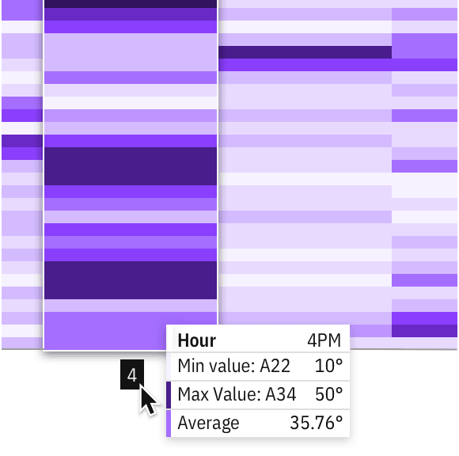

<Caption>Exploration of a domain axis hover behavior</Caption>

</Column>
</Row>

#### Divergent scales

Diverging scales show color progression in two directions: dialing down the
contrast of the first hue from one end to a neutral color at the midpoint, then
increasing the contrast of the second hue to the other end of the scale. The
neutral midpoint is often referred to as the "inflection point" (for example, a
0 value midway between -100 and +100).

[Divergent scales](/data-visualization/color-palettes#diverging-palettes)
require three colors for their correspondent values (min, max, and inflection
point) and Carbon has provided two approved palettes for divergent
visualizations. Although the examples here use the "discrete" (stepped scale)
provided by the Carbon palette, divergent heat maps often leverage "continuous"
values (gradients) to accommodate situations that require more than 10 values.

#### Inflection points

While min/max values can be automatically detected from data, inflection points
can vary depending on data type. We default to zero in order to accommodate the
most common cases and include a feature flag within the code to specify
exceptions. The data for a divergent heat map does not need to be symmetrical on
either side of the inflection point. For example, the data set could have a zero
value between -20 and +100 as well.

## Tree maps

Tree maps can work for visualizing a part-to-whole relationship among a large
number of categories—as long as the data is hierarchical and exact comparisons
between the categories is not a primary concern.

When dealing with large amounts of data in a constrained space, tree structured
nodelink diagrams (like the network diagram shown above), grow too complex to be
useful. Tree maps provide an attractive alternative by maintaining a
hierarchical structure while displaying rectangular quantities for each category
and subcategory via area size.

<div>
  <ChartDemoGroup demoGroup={getDemoGroupByTitle('treemap')} light={true} />
</div>

#### Divergent tree maps

Divergent tree maps combine Carbon's divergent color palette with the
hierarchical structure of a tree map. Each rectangle has an area proportional to
a specified dimension of the data, but the rectangles can also be colored
independently according to an additional indicator.

As with [heat maps](#heat-maps), the diverging palette shows color progression
in either direction from an inflection point (for example, a 0 value midway
between -10 and +10). In the example below, the inflection point is simply an
average. Tourism can be mapped by the number of visitors to a certain country,
but the visualization can also compare this data to a yearly average. For
instance, even though one country may have a lot of visitors compared to another
country, tourism for that country may fall below its annual average.

<Row>
<Column  colLg={12} colMd={8} colSm={4} >

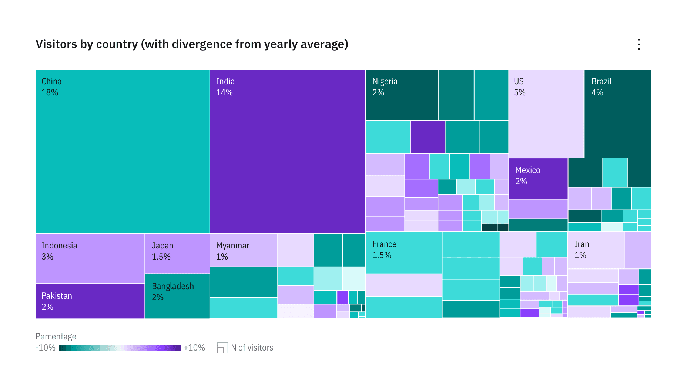

<Caption>
  Example of a divergent tree map adding color as a second variable to a basic
  tree map structure
</Caption>

</Column>
</Row>

<Row>
<Column  colLg={4} colMd={4} colSm={4} >

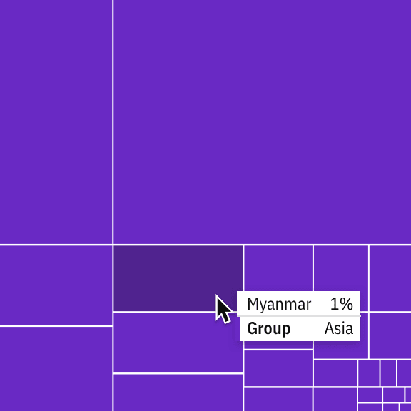

<Caption>Detail of a tooltip on a basic treemap</Caption>

</Column>

<Column  colLg={4} colMd={4} colSm={4} >

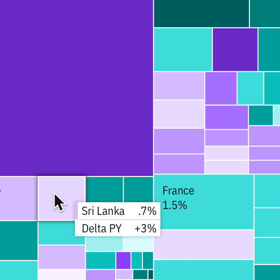

<Caption>Detail of a comparative tooltip on a divergent tree map</Caption>

</Column>
</Row>

## Circle packs

A circle pack is a hierarchical visualization of data. It’s equivalent to a
Treemap or a Dendrogram—where each node of the tree is represented as a circle
and sub-nodes are represented as circles within a parent. The size of each
circle can also be used to represent an additional arbitrary value, such as
population or file size. Color may also be used to assign categories or to
represent an additional variable. Although they’re not as space efficient,
Circle Packs reveal hierarchical structure better than Treemaps.

For Circle Packs with more than two levels of hierarchy, zoom functionality
allows users to explore the data without compromising the contrast accessibility
of the chart. We advise against disabling the zoom functionality except in cases
such as preview charts, cards that expand to full view with the chart, etc.

<div>
  <ChartDemoGroup demoGroup={getDemoGroupByTitle('circlepack')} light={true} />
</div>

## Geospatial charts

### Geographic overlays

#### Choropleth map

A map that uses differences in shading, coloring, or the placing of symbols
within predefined areas to indicate the average values of a property or quantity
in those areas.

<Row>
<Column  colLg={12} colMd={8} colSm={4} >

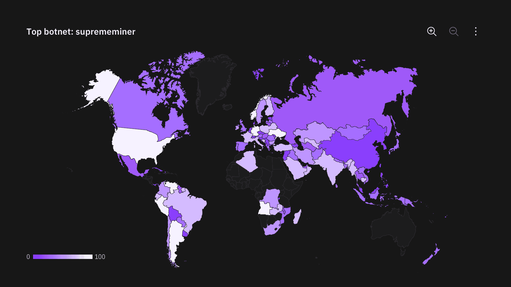

</Column>
</Row>

### Proportional symbol map

Symbols driven by data are overlaid in geographical regions. A bubble is the
symbol most commonly used in this instance—with the area of the circle
proportional to its value in the dataset.

<Row>
<Column  colLg={12} colMd={8} colSm={4} >

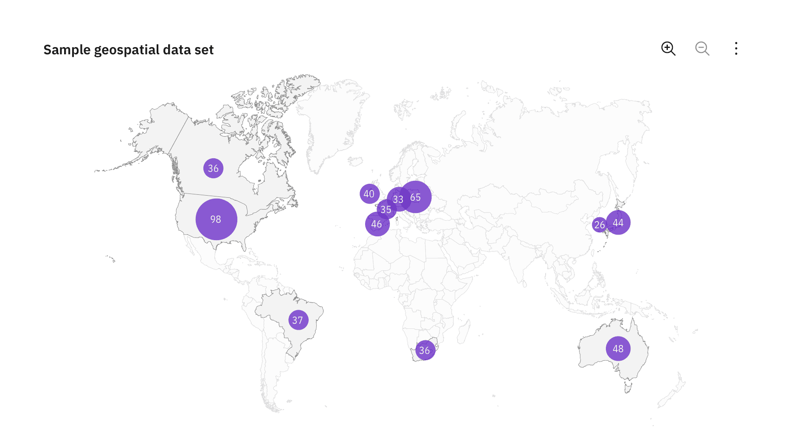

</Column>
</Row>

### Connection map

Connection Maps are drawn by connecting points placed on a map by straight or
curved lines.

While Connection Maps are great for showing connections and relationships
geographically, they can also be used to display map routes through a single
chain of links. Connection Maps can also be useful in revealing spatial patterns
through the distribution of connections or by how concentrated connections are
on a map.

<Row>
<Column  colLg={12} colMd={8} colSm={4} >

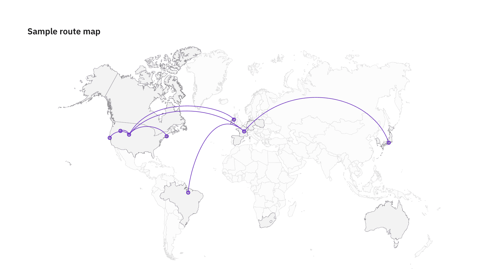

</Column>
</Row>

### Geospatial distortions

#### Density-equalizing cartograms

Density-equalizing cartograms are the most common type of cartogram. In this
situation the mapping variable takes the place of the land area or distance in
the map, causing the map to become distorted in proportion to the substitute
variable.

Cartograms are useful for visualizing populations through different lenses — for
instance, ethnicities, political parties, or religious affiliation. Carbon does
not have a coded component for cartograms but online generators like
[go-cart.io](https://go-cart.io/) allow you to upload your own data sets and
download an .svg file.

<Row>
<Column  colLg={6} colMd={4} colSm={4} >

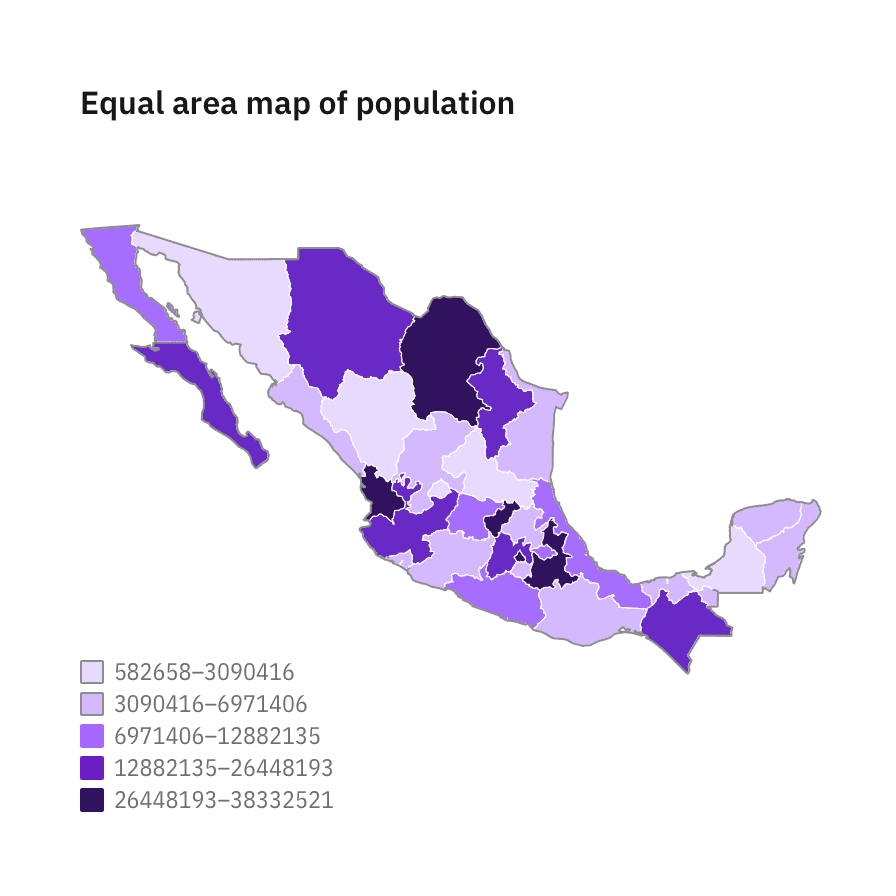

</Column>

<Column  colLg={6} colMd={4} colSm={4} >

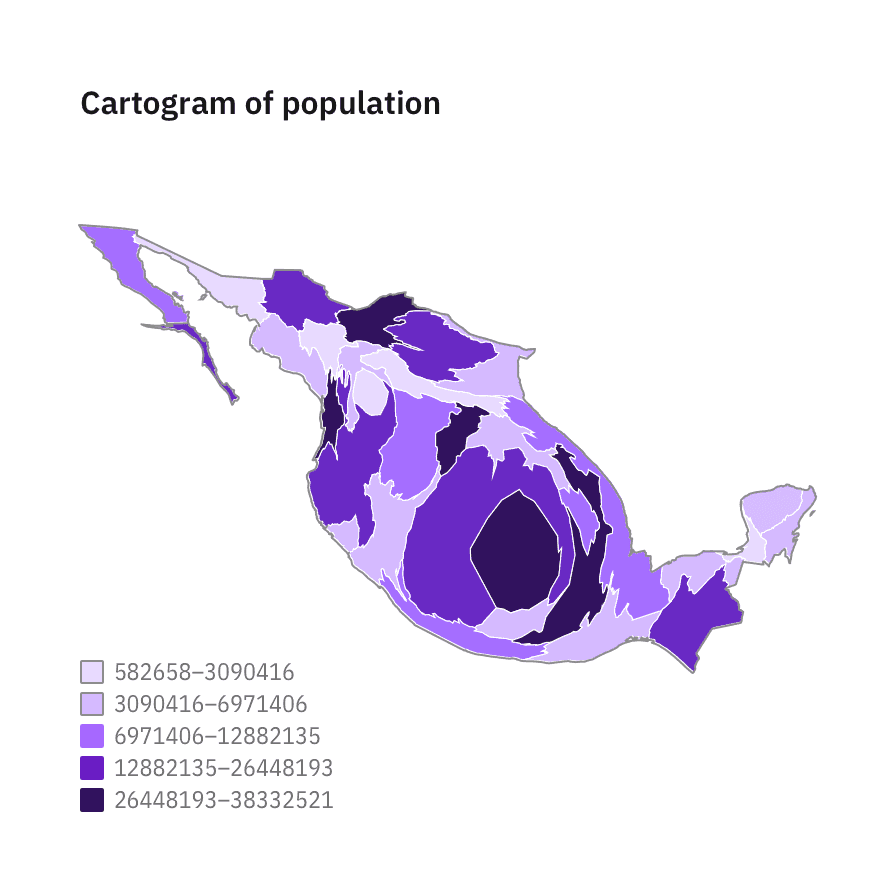

</Column>
</Row>

#### Dorling cartograms

The Dorling Cartogram is a technique for representing data for areas that avoids
geography in favor of (normally) a geometric shape that represents the unit
areas. Circles are usually chosen since they can be neatly positioned.

As with the density-equalizing cartogram above, the larger the total population,
the larger the representation of the country.

<Row>
<Column  colLg={6} colMd={4} colSm={4} >

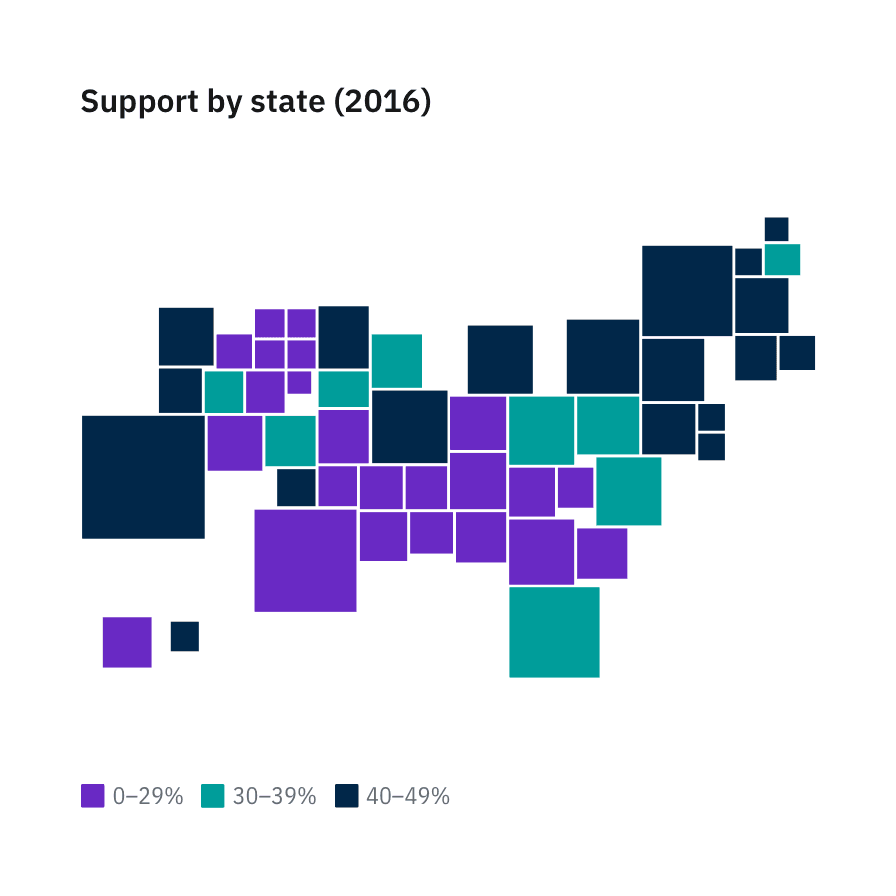

</Column>

<Column  colLg={6} colMd={4} colSm={4} >

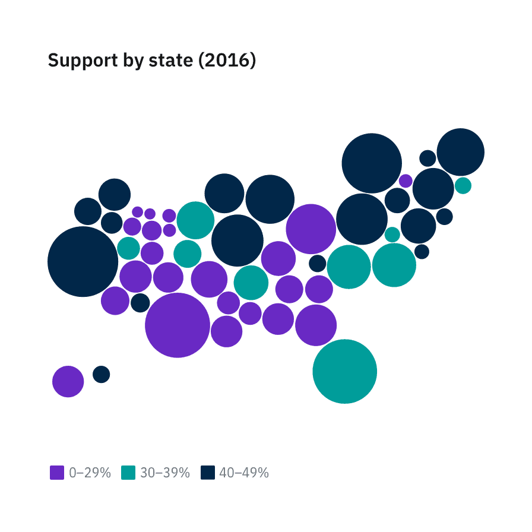

</Column>
</Row>

### Mapbox

For more dynamic, real-time mapping, Carbon has created four themes using
[Mapbox](https://www.mapbox.com/). Mapbox is a developer platform used across
industries to create custom maps that can be easily integrated into websites and
apps. These themes can be used as is, or in conjunction with Carbon-styled data
points.

These styles can be used as is, or as a backdrop for other geospatial data sets.
For more complex data sets that require the full breadth of the Carbon charts
palette, we suggest using either the White or the Gray 100 style for the most
accessible results.

<Row>
<Column  colLg={12} colMd={8} colSm={4} >

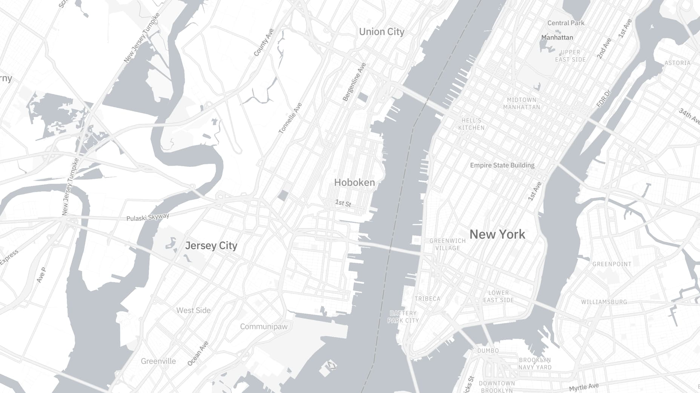

<Caption>Example of a Carbon’s White theme style in Mapbox</Caption>

</Column>
</Row>

<Row>
<Column  colLg={4} colMd={4} colSm={4} >

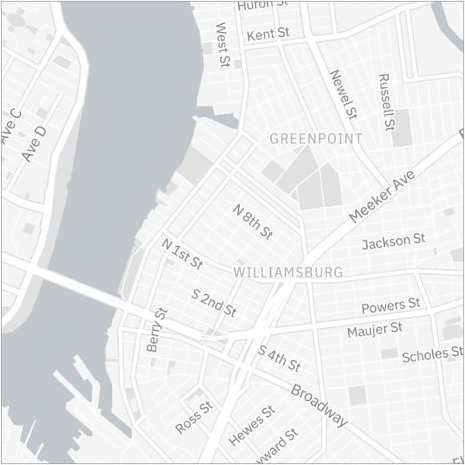

<Caption>Example of a Carbon’s Gray 10 theme style in Mapbox</Caption>

</Column>

<Column  colLg={4} colMd={4} colSm={4} >

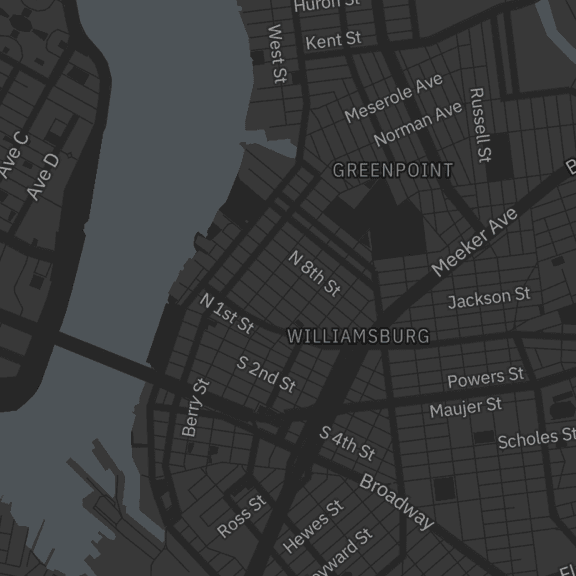

<Caption>Example of a Carbon’s Gray 90 theme style in Mapbox</Caption>

</Column>

<Column  colLg={4} colMd={4} colSm={4} >

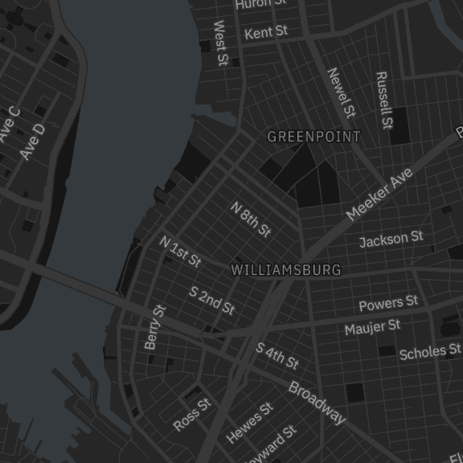

<Caption>Example of a Carbon’s Gray 100 theme style in Mapbox</Caption>

</Column>
</Row>

#### Applying the Carbon Mapbox themes

For instructions on how to use Mapbox GL JS please read this
[Mapbox quickstart documentation](https://docs.mapbox.com/mapbox-gl-js/api/#quickstart).

In addition to the instructions above, when initializing a new map you can apply
any of the 4 Carbon themes by providing the stylesheet location to the library.

| Theme      | Style sheet location                                           |
| ---------- | -------------------------------------------------------------- |
| _White_    | `mapbox://styles/carbondesignsystem/ck7c8cfpp08h61irrudv7f1xg` |
| _Gray 10_  | `mapbox://styles/carbondesignsystem/ck7c8ce1y05h61ipb2fixfe76` |
| _Gray 90_  | `mapbox://styles/carbondesignsystem/ck7c8ccac08jj1imhvd2g4qfb` |
| _Gray 100_ | `mapbox://styles/carbondesignsystem/ck7c89g8708gy1imlz9g5o6h9` |

<Title>Example</Title>

```html
<script>
  mapboxgl.accessToken = 'YOUR_MAPBOX_ACCESS_TOKEN';
  var map = new mapboxgl.Map({
    // Applying the G100 theme below
    style: 'mapbox://styles/carbondesignsystem/ck7c89g8708gy1imlz9g5o6h9',
    // Include existing options below
    // ...
    // ...
    // ...
  });
</script>
```
