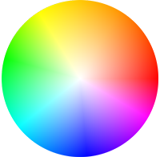

<PageDescription>

Everything you need to work with Carbon, including Figma libraries and
templates, color palettes, GitHub repos, and design tools.

</PageDescription>

<AnchorLinks>
  <AnchorLink>Introduction</AnchorLink>
  <AnchorLink>Elements</AnchorLink>
  <AnchorLink>Fonts</AnchorLink>
  <AnchorLink>Data visualization</AnchorLink>
  <AnchorLink>Gatsby theme</AnchorLink>
  <AnchorLink>GitHub repos</AnchorLink>
   <AnchorLink>Native mobile</AnchorLink>
  <AnchorLink>Accessibility</AnchorLink>
  <AnchorLink>Prototyping tools</AnchorLink>

</AnchorLinks>

## Introduction

This page includes Figma kits, tools, templates, and plugins that have been
created to help you get up and running. For a comprehensive list of kits,
explore the
[design kit catalog](https://next.carbondesignsystem.com/design-kits).

To use the Figma libraries you'll find here, you need a Figma license. IBMers
can follow instructions in the
[Design Toolbox](https://w3.ibm.com/design/toolbox/?_ga=2.66930222.1444443535.1682545160-2098201107.1682093352#/ui-design-tools/figma/README)
to get a license. To get started with Figma, visit the
[Design kits](/designing/kits/figma) page.

## Elements

<Row className="resource-card-group">
<Column colLg={4} colMd={4} noGutterSm>
  <ResourceCard
    subTitle="IBM Icons"
    href="https://www.figma.com/file/J5c0d85dSJn9JnBhSYYLmD/Icons---IBM-Design-Language?node-id=129%3A2"
    actionIcon="launch">
    <MdxIcon name="figma" />
  </ResourceCard>
</Column>
<Column colLg={4} colMd={4} noGutterSm>
  <ResourceCard
    subTitle="IBM Pictograms"
    href="https://www.figma.com/file/PkUl9UBuvA41GPpyl84NBc/Pictograms---IBM-Design-Language"
    actionIcon="launch">
    <MdxIcon name="figma" />
  </ResourceCard>
</Column>
<Column colLg={4} colMd={4} noGutterSm>
  <ResourceCard
    subTitle="IBM Design Language Color Palette"
    href="https://www.figma.com/file/Gvwx2RnAZzDKTjVuC5xOlO/Color-Styles---IBM-Design-Language?node-id=129%3A2"
    actionIcon="launch">
    <MdxIcon name="figma" />
  </ResourceCard>
</Column>
<Column colLg={4} colMd={4} noGutterSm>
  <ResourceCard
    subTitle="Carbon v11 Text Styles"
    href="https://www.figma.com/file/rK06GY6bvEfokuzrFGdtWB/(v11)-Text-Styles---IBM-Design-Language?node-id=129%3A2"
    actionIcon="launch">
    <MdxIcon name="figma" />
  </ResourceCard>
</Column>
<Column colLg={4} colMd={4} noGutterSm>
  <ResourceCard
    subTitle="RGB color palettes (.ase and .clr)"
    href="https://github.com/carbon-design-system/carbon/raw/v10/packages/colors/artifacts/IBM_Colors.zip"
    actionIcon="download">

  </ResourceCard>
</Column>
<Column colLg={4} colMd={4} noGutterSm>
  <ResourceCard
    subTitle="Color contrast checker"
    href="https://marijohannessen.github.io/color-contrast-checker/"
    >

  </ResourceCard>
</Column>
</Row>

## Fonts

Carbon uses the open-source typeface [IBM Plex](https://github.com/ibm/plex) –
carefully designed to meet IBM's needs as a global technology company and
reflect IBM's spirit, beliefs, and design principles.

## Data visualization

The Data visualization kit includes basic and complex chart assets, along with
usage guidance, theming guidance, palettes, and sample layouts.

<Row className="resource-card-group">

<Column colLg={4} colMd={4} noGutterSm>
  <ResourceCard
    subTitle="Figma kit coming soon"
    href=""
    disabled
    actionIcon="launch">
    <MdxIcon name="figma" />
  </ResourceCard>
</Column>
</Row>

## Gatsby theme

The Gatsby Figma kit has all the components, patterns, and sample layouts that
have been developed by teams within the IBM ecosystem. The Gatsby theme site
includes the components, guidelines, and everything you need to create and
contribute to Carbon sites.

### Image production guidelines

For anyone interested in contributing to the Carbon Design System website, or
making images for their own Pattern Asset Library (PAL), we follow a set of
guidelines to ensure consistency across the content in the Gatsby ecosystem. The
image production guidelines Figma kit includes guidance, symbols and templates
to help designers with every aspect of image creation and component specs.

<Row className="resource-card-group">

<Column colLg={4} colMd={4} noGutterSm>
  <ResourceCard
    subTitle="Gatsby theme kit"
    href="https://www.figma.com/file/9arERt9v8YZVMDn7AYdmZt/Gatsby-Design-Kit"
    actionIcon="launch">
   <MdxIcon name="figma" />
  </ResourceCard>
</Column>
  
<Column colLg={4} colMd={4} noGutterSm>
  <ResourceCard
    subTitle="Gatsby theme Carbon site"
    href="https://gatsby.carbondesignsystem.com/"
    actionIcon="launch">

  </ResourceCard>
</Column>

<Column colLg={4} colMd={4} noGutterSm>
  <ResourceCard
    subTitle="Image production guideline kit"
    href="https://www.figma.com/file/XQqHxu38CiY3Vx1iHdafIa/Image-production-guidelines?t=1KJWmXlChFC7BoKT-6"
    actionIcon="launch">
    <MdxIcon name="figma" />
  </ResourceCard>
</Column>
  
</Row>

## GitHub repos

<Row className="resource-card-group">
<Column colLg={4} colMd={4} noGutterSm>
  <ResourceCard
    subTitle="Carbon design kit"
    href="https://github.com/carbon-design-system/carbon-design-kit"
    >

<MdxIcon name="github" />

  </ResourceCard>
</Column>
<Column colLg={4} colMd={4} noGutterSm>
  <ResourceCard
    subTitle="IBM Design Language and Icon Kits"
    href="https://github.com/IBM/design-kit"
    >

<MdxIcon name="github" />

  </ResourceCard>
</Column>
</Row>

## Native mobile

The native mobile kits include everything you need to get your iOS or Android
project underway.

<Row className="resource-card-group">

<Column colLg={4} colMd={4} noGutterSm>
  <ResourceCard
    subTitle="Figma kit coming soon"
    disabled
    href=""
    actionIcon="launch">
    <MdxIcon name="figma" />
  </ResourceCard>
</Column>
</Row>

## Accessibility

The IBM Accessibility kit includes checklists, bite-sized guidance, and handoff
assets to make sure your designs are accessible for implementation.

<Row className="resource-card-group">

<Column colLg={4} colMd={4} noGutterSm>
  <ResourceCard
    subTitle="IBM Accessibility kit"
    href="https://www.figma.com/file/zJlvN4TRbslRtyjFuxIDom/IBM-Accessibility-Design-Kit?node-id=0%3A1"
    actionIcon="launch">

  </ResourceCard>
</Column>
<Column colLg={4} colMd={4} noGutterSm>
  <ResourceCard
    subTitle="Stark accessibility checker"
    href="https://www.figma.com/community/plugin/732603254453395948/Stark"
    actionIcon="launch">
    <MdxIcon name="figma" />
  </ResourceCard>
</Column>
</Row>

## Prototyping tools

### Carbon Mid-Fi kit

This kit provides designers with a way to visualize concepts and test them out
before committing to high-fidelity designs.

<Row className="resource-card-group">

<Column colLg={4} colMd={4} noGutterSm>
  <ResourceCard
    subTitle="Figma kit coming soon"
    disabled
    href=""
    actionIcon="launch">
    <MdxIcon name="figma" />
  </ResourceCard>
</Column>
</Row>

### Invision Freehand kit

A Carbon wireframe kit for Invision Freehand is available for teams to create
low fidelity wireframes. This kit is maintained by the Cloud PAL community.

<Row className="resource-card-group">
<Column colMd={4} colLg={4} noGutterSm>
  <ResourceCard
    subTitle="Invision Freehand kit"
    href="https://pages.github.ibm.com/cdai-design/cloud-pal/resources/resources/#invision-freehand-kit"
    actionIcon="launch">

  </ResourceCard>
</Column>
</Row>

### Carbon UI Builder

Carbon UI Builder is a visual tool that allows users to assemble product pages
and layout modules using Carbon Components in a fraction of the time it usually
takes.

Pages can be exported as:

- Images for presentations
- Live demo apps for user testing
- Production-quality code that can be easily incorporated in an existing
  product's frontend

<Row className="resource-card-group">
<Column colMd={4} colLg={4} noGutterSm>
  <ResourceCard
    subTitle="Carbon UI Builder"
    href="https://builder.carbondesignsystem.com/"
    actionIcon="launch">

  </ResourceCard>
</Column>
</Row>
