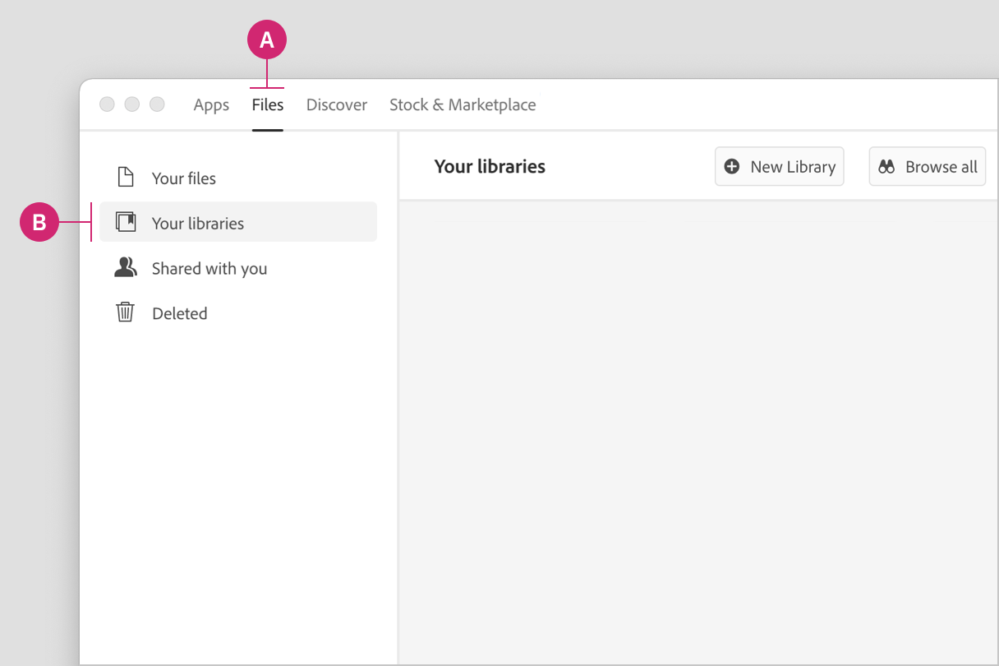
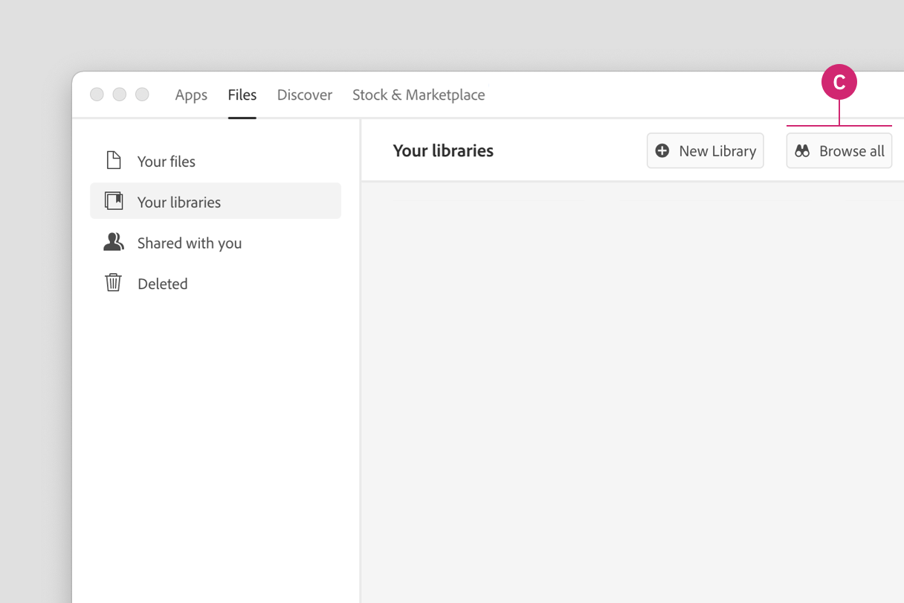
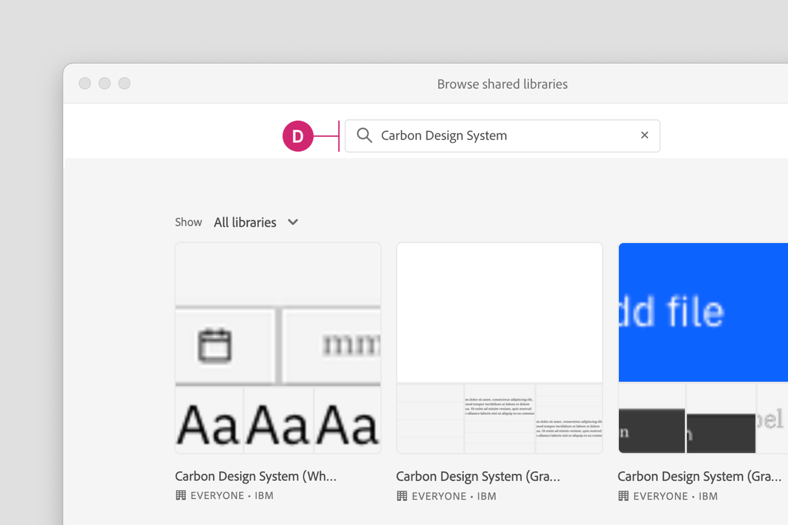
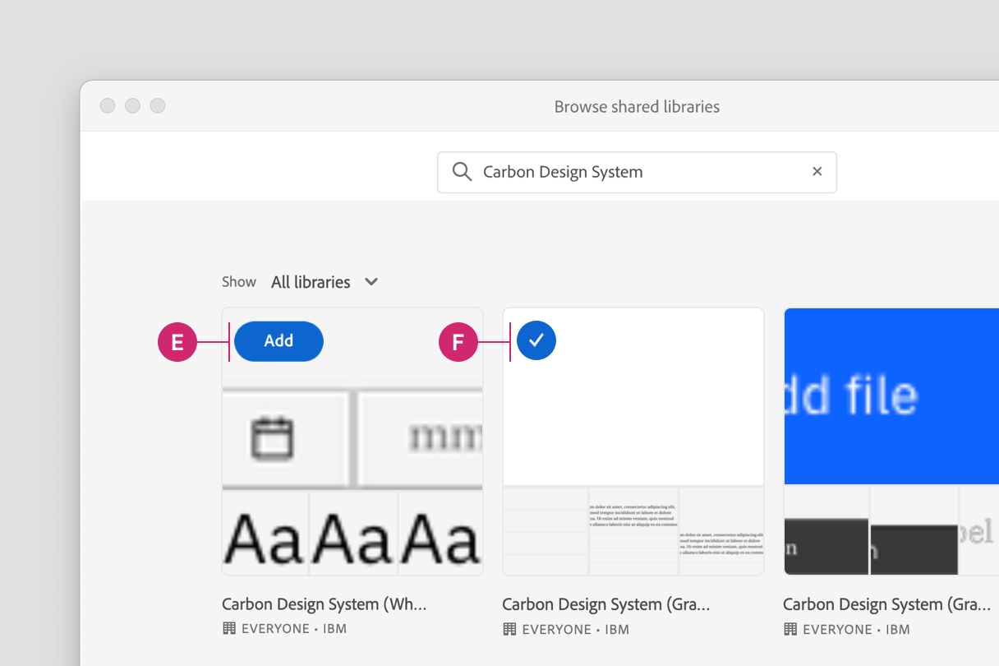
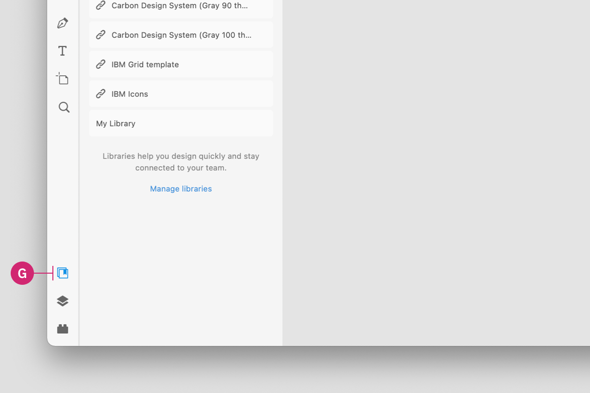
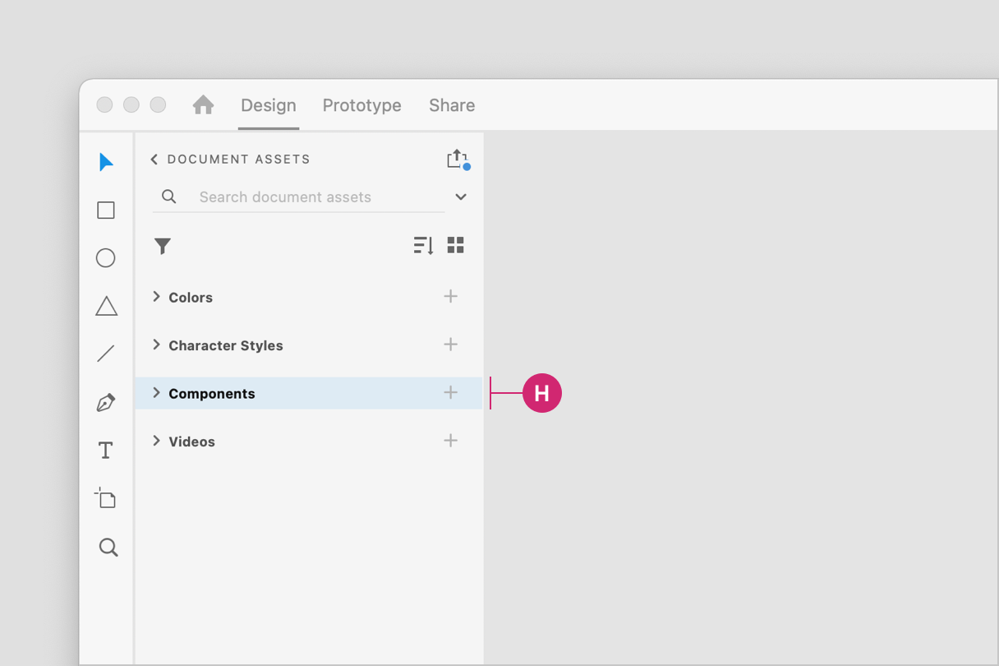

<PageDescription>

Rapidly build beautiful and accessible experiences. The Carbon kit for Adobe XD
contains all resources you need to get started.

</PageDescription>

<InlineNotification>

The Adobe XD kit is maintained by members of the Carbon community. For support,
contact the
[kit's maintainers](https://github.com/IBM/design-kit/issues/new?assignees=&labels=kit%3A+adobe+xd&template=-adobe-xd--carbon-kit.md&title=%5Bcomponent%5D+description+of+issue).

</InlineNotification>

<AnchorLinks>

<AnchorLink>Get the libraries</AnchorLink>
<AnchorLink>Start designing</AnchorLink>
<AnchorLink>Feedback</AnchorLink>

</AnchorLinks>

## Get the libraries

#### Install Adobe XD

To design with Carbon you must have the most recent version of
[Adobe XD](https://www.adobe.com/products/xd.html) installed.

#### Get the Adobe XD Creative Cloud libraries

1. Open the Creative Cloud Library App.
2. Navigate to the **Files** tab in the header (A). Select the **Your
   libraries** page in the left hand navigation (B).

<Row>
<Column colLg={8}>

</Column>
</Row>

3. Select the **Browse all** button to browse all libraries (C).

<Row>
<Column colLg={8}>

</Column>
</Row>

4. In the search bar, search for "Carbon Design System" (D).

<Row>
<Column colLg={8}>

</Column>
</Row>

5. You will see the four Carbon theme libraries that are available to **Add**
   (E) by hovering over the library previews. Once you add a library, the
   library will be marked with a checkmark (F).

<Row>
<Column colLg={8}>

</Column>
</Row>

To view the four Carbon theme libraries on the web, visit these web links.

<Row className="resource-card-group">
<Column colMd={4} colLg={4} noGutterSm>
  <ResourceCard
    onClick={() => fathom.trackGoal('P0OEN9TS', 0)}
    subTitle="White theme"
    href="https://assets.adobe.com/libraries/urn:aaid:sc:VA7:35c94afd-9cc4-4703-a4b0-49acb165d28d?libraryVersion=8&org=973430F0543801CA0A4C98C6%40AdobeOrg"
    actionIcon="launch">

  </ResourceCard>
</Column>
<Column colMd={4} colLg={4} noGutterSm>
  <ResourceCard
    onClick={() => fathom.trackGoal('T7D1HJ3L', 0)}
    subTitle="Gray 10 theme"
    href="https://assets.adobe.com/libraries/urn:aaid:sc:VA7:92418e29-f824-4cfc-9be2-866a5230cbb1?libraryVersion=5&org=973430F0543801CA0A4C98C6%40AdobeOrg"
    actionIcon="launch">

  </ResourceCard>
</Column>
<Column colMd={4} colLg={4} noGutterSm>
  <ResourceCard
    onClick={() => fathom.trackGoal('LYFJTPDE', 0)}
    subTitle="Gray 90 theme"
    href="https://assets.adobe.com/libraries/urn:aaid:sc:VA7:fc4859fd-beea-4407-b41c-34170a4e8203?libraryVersion=9&org=973430F0543801CA0A4C98C6%40AdobeOrg"
    actionIcon="launch">

  </ResourceCard>
</Column>
<Column colMd={4} colLg={4} noGutterSm>
  <ResourceCard
    onClick={() => fathom.trackGoal('3XH0SIBJ', 0)}
    subTitle="Gray 100 theme"
    href="https://assets.adobe.com/libraries/urn:aaid:sc:VA7:4f44b97f-34a1-413b-b188-fc15337df1b6?libraryVersion=14&org=973430F0543801CA0A4C98C6%40AdobeOrg"
    actionIcon="launch">

  </ResourceCard>
</Column>
</Row>

 

## Start designing 

### Components

Included in the library are all 32 of the Carbon components and their variants.
To insert a component, select the **Document assets** icon in the left side rail
(G).

<Row>
<Column colLg={8}>

</Column>
</Row>

Find the component you would like to use under the **Components** section (H) in
the document assets panel. Drag the component from the panel onto the canvas.

<Row>
<Column colLg={8}>

</Column>
</Row>

View the name of the component in the right sidebar. If the component has
variants, you’ll see the variants under the **Component (instance)** section to
configure the properties and values of that component set.

For more help on how to use Adobe XD components, see the
[Adobe XD docs](https://helpx.adobe.com/xd/user-guide.html).

### Grids

Grid templates are included in each Carbon themed library. These grid templates
are on a canvas that can be configured at the five 2x grid breakpoints and also
includes the 16 column grid.

### Colors

The Carbon color tokens are added as colors in the component assets panel in
Adobe XD. To apply a color, select an object then in the **Colors** section of
the component asset menu you can select a color from the Carbon theme library.
In addition to applying colors to objects, you can also apply colors to text
layers.

To learn more about applying colors in Adobe XD, see the
[Adobe XD docs](https://helpx.adobe.com/xd/help/work-with-assets-and-libraries-xd.html).

### Character styles

To apply a character style, select a text layer. Then in the component assets
panel, select the character style from the Carbon theme library. Use color to
change the color of a character style.

To learn more about applying character styles in Adobe XD, see the
[Adobe XD docs](https://helpx.adobe.com/xd/help/work-with-assets-and-libraries-xd.html).

### Support

If you’re brand new to Adobe XD, they offer some great
[tutorials](https://helpx.adobe.com/xd/tutorials.html).

### Releases

Enhancements to the kit will be rolling out in the future. When a new version of
the library is available, you will need to download the new file to replace the
old one. Releases will be posted to the
[GitHub repo](https://github.com/IBM/design-kit).

## Feedback

Help us improve this component by providing feedback, asking questions, and
leaving any other comments on
[GitHub](https://github.com/carbon-design-system/carbon-design-kit/issues).
