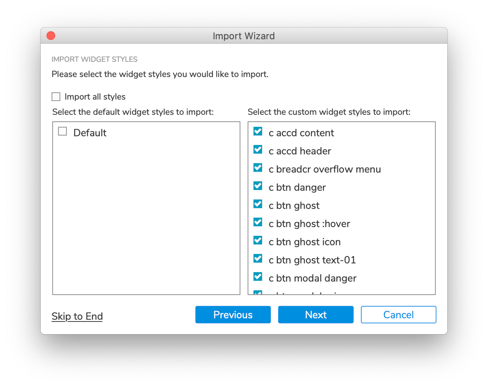

<PageDescription>

Rapidly create wireframes, interactive prototypes, and documentation in Axure
RP. The Carbon Axure kit contains the resources you need to get started.

</PageDescription>

<InlineNotification>

The Axure kit is maintained by members of the Carbon community. For support,
contact the
[kit's maintainers](https://github.com/IBM/design-kit/issues/new?assignees=csabasipos&labels=kit%3A+axure&template=-axure--carbon-kit.md&title=%5Bcomponent%5D+description+of+issue).

</InlineNotification>

<AnchorLinks>

<AnchorLink>Get the kit</AnchorLink>
<AnchorLink>Start designing</AnchorLink>
<AnchorLink>Support</AnchorLink>

</AnchorLinks>

## Get the kit

#### 1. Install Axure RP.

To design with the Carbon Axure Kit you must have the latest version of
[Axure RP](https://www.axure.com/download) installed.

#### 2. Get the widget library.

The library contains the widgets for Carbon components, design elements, and
other common shapes.

Download the `.rplib` file to your computer. Open Axure and click the Add
Library `+` icon at the top of the Libraries pane. Locate and select the
`IBM Carbon 10.rplib` file.

<Row className="resource-card-group">
<Column colMd={4} colLg={4} noGutterSm>
  <ResourceCard
    subTitle="Get the Axure widget library"
    href="https://github.com/IBM/design-kit/blob/master/Axure/IBM%20Carbon%2010.rplib?raw=true"
    actionIcon="download">

  </ResourceCard>
</Column>
</Row>

 

#### 3. Download the template.

This Axure file has the settings that are required for the proper display of
elements.

<Row className="resource-card-group">
<Column colMd={4} colLg={4} noGutterSm>
  <ResourceCard
    subTitle="Get the Axure template"
    href="https://github.com/IBM/design-kit/blob/master/Axure/ibm-carbon-template.rp?raw=true"
    actionIcon="download">

  </ResourceCard>
</Column>
</Row>

 

## Start designing

To get started, familiarize yourself with the contents of the template and
widget library.

### Start with the template

Create a new project document with the template by opening
`ibm-carbon-template.rp` and saving a copy.

In the template, IBM Plex Sans and IBM Plex Mono are included as web fonts in
the Generate HTML settings and will be displayed properly on any computer, even
without these fonts being installed locally.

The Default, Paragraph, and Text Link styles are pre-configured, which allows
text to be pasted from the clipboard or text link inserted in a paragraph to
match the typography and color guidelines by default.

### Using widgets

Use the widgets from the IBM Carbon 10 Axure library installed in step two to
start designing. You’ll find the widgets located in the Libraries pane in the
left side panel. To add a widget to the canvas, click and drag it from the
Libraries pane.

All widgets come with styles and interactions already built into them. To edit
the widgets, follow the guide in the
[Carbon Axure Kit documentation](https://ibm.github.io/design-kit/axure/) that
will help you to maintain the designed behavior of the elements.

## Support

If you are brand new to Axure, they
offer [tutorials](https://docs.axure.com/tutorials/basics/getting-started/) to
get you started.

### Releases

We make small adjustments and bug fixes to the kit on a regular basis. When a
new version of the library is available, you need to download the new file to
replace the old one. Releases will be posted to the
[GitHub repo](https://github.com/IBM/design-kit).

If you're an IBMer, join the #carbon-axure-kit Slack channel to get notified
about changes.

### Updating existing documents

In an Axure RP document, styles already in use in the document prevail when
adding widgets from a library. The existing style in the document will be
applied to a library widget when the widget is dragged onto the document canvas.

Replacing the library won’t update the widget styles in your existing project
files automatically. Follow the manual process below to update the styles.

Import the styles from the library file into project documents using the Import
Wizard.

1. Open your project in Axure RP.
2. Go to `File` → `Import from RP file...` and select the .rplib library file.
3. In the wizard, go to the Import Widget Styles step, and select all custom
   styles. "Default" should **not** be selected.

<Row>
<Column colLg={8}>

</Column>
</Row>

4. Skip to the end of the wizard and click Finish to import the styles.

### Help

Can’t find an answer to your question? Open an issue on
[GitHub](https://github.com/IBM/design-kit/issues/new?assignees=csabasipos&labels=kit%3A+axure&template=-axure--carbon-kit.md&title=%5Bcomponent%5D+description+of+issue).
