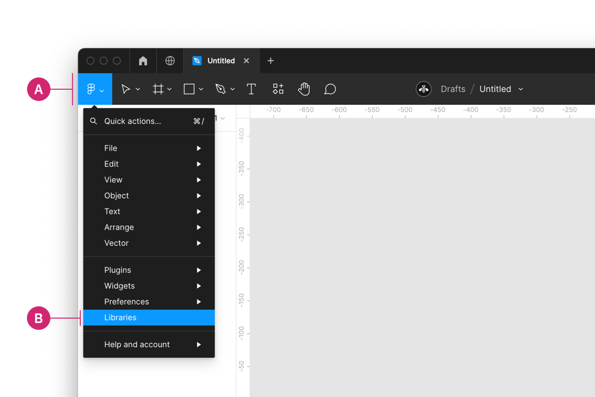
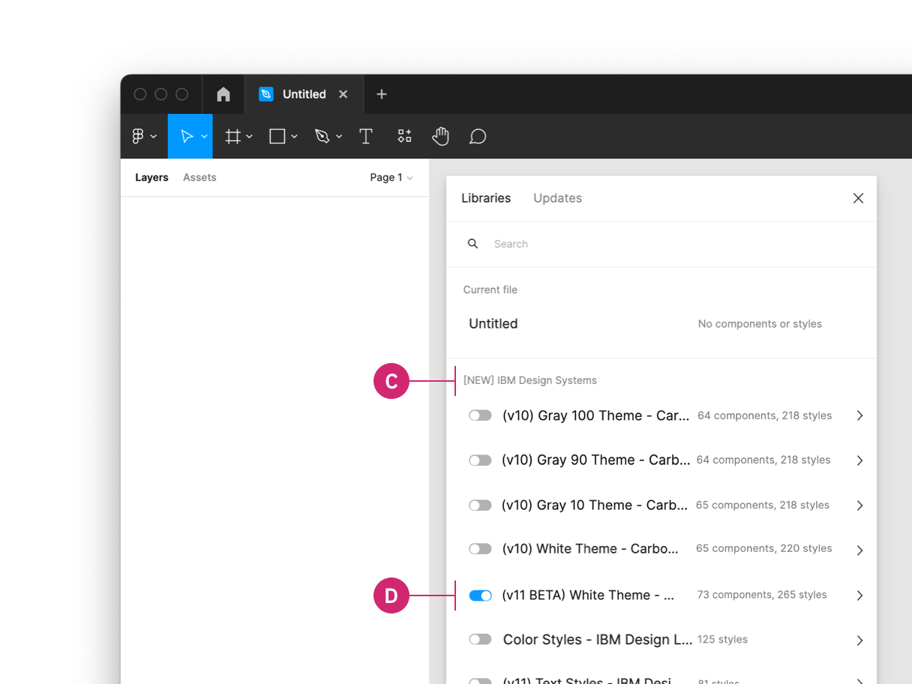
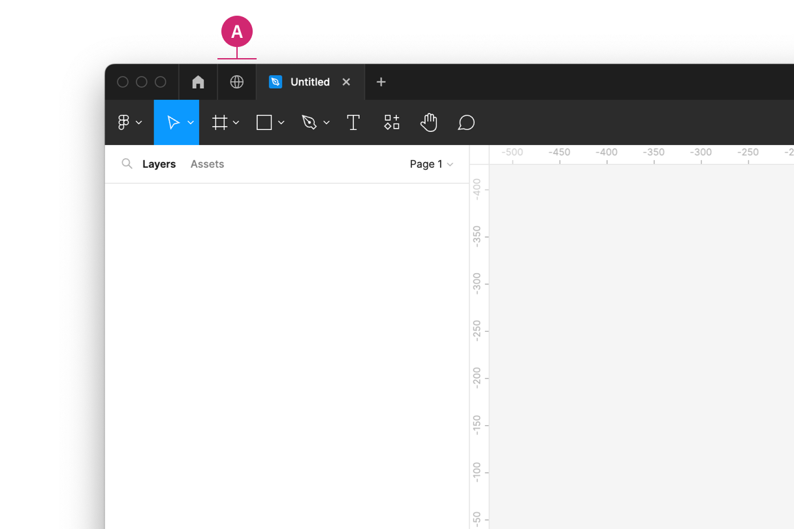
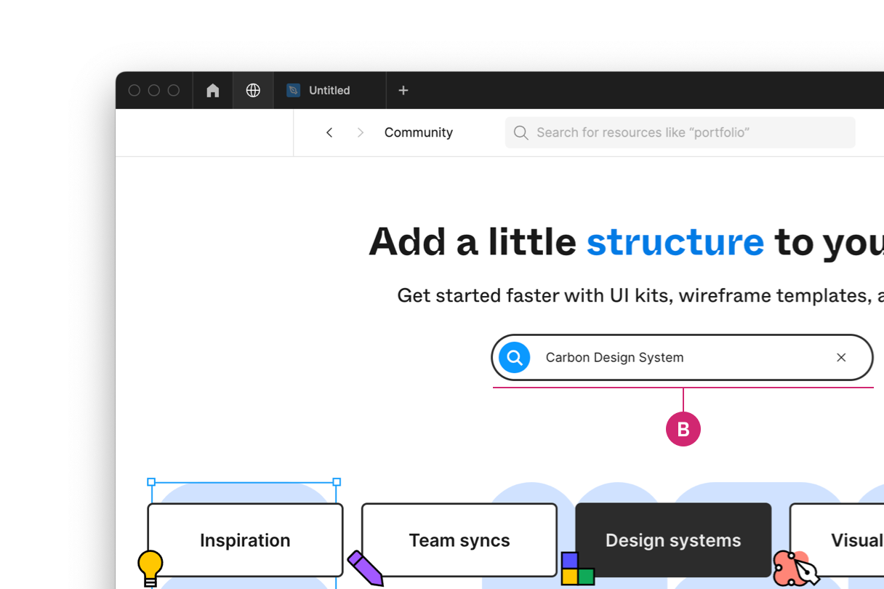
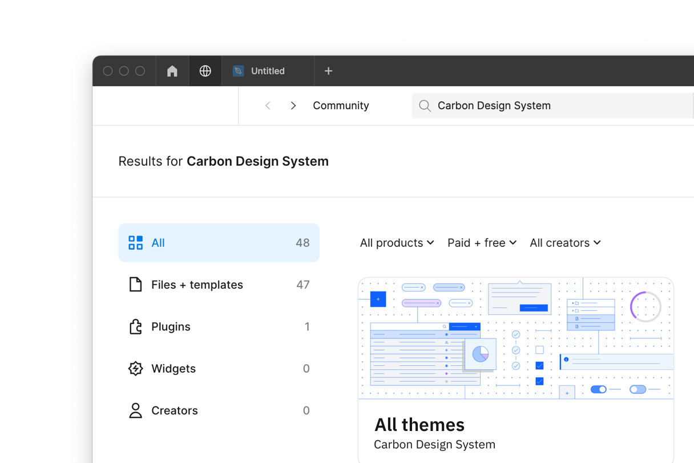

<PageDescription>

Rapidly build beautiful and accessible experiences. The Carbon kit for Figma
contains all resources you need to get started.

</PageDescription>

<InlineNotification>

**v11 themes are now available!** All themes for the v11 libraries are available
to IBM's internal users and the public community. We have leveraged Figmas
latest features in this release which may result in breaking changes to some of
our components.

</InlineNotification>

<AnchorLinks>

<AnchorLink>Internal users</AnchorLink>
<AnchorLink>External users</AnchorLink>
<AnchorLink>Start designing</AnchorLink>
<AnchorLink>Feedback</AnchorLink>

</AnchorLinks>

## Internal users

### Get the libraries

#### 1. Sign into Figma using IBM SSO

You should be added to the IBM Figma organization automatically once you sign
in. You do not need to join or request to join any specific team to access the
libraries.

#### 2. Turn on the v11 theme libraries

There are four Carbon v11 theme libraries, two light (White and Gray 10) and two
dark (Gray 90 and Gray 100). Each theme lives in its own Figma library. You can
turn on as many libraries as you’d like. The v11 theme libraries are now
available to IBM’s internal users and the public community. We have leveraged
Figmas latest features in this release which may result in breaking changes to
some of our components.

Inside of a design file, navigate to the **Main menu** panel in the top left of
the toolbar (A). Open the menu and select **Libraries** from the list (B).

<Row>
<Column colLg={8}>

</Column>
</Row>

Then in the Libraries modal that appears, find the team called
`IBM Design Systems` (C) and switch the toggle beside a themed library, for
example the `(v11) White Theme - Carbon Design System` to on (D).

<Row>
<Column colLg={8}>

</Column>
</Row>

 

To preview the four v11 Carbon theme libraries, visit the following view-only
links. To access the v10 Figma libraries, see
[v10 Design Kits](https://v10.carbondesignsystem.com/designing/kits/figma).

<Row className="resource-card-group">
<Column colMd={4} colLg={4} noGutterSm>
  <ResourceCard
    onClick={() => fathom.trackGoal('P0OEN9TS', 0)}
    subTitle="v11 White theme"
    href="https://www.figma.com/file/YAnB1jKx0yCUL29j6uSLpg/(v11)-White-Theme---Carbon-Design-System"
    actionIcon="launch">

  </ResourceCard>
</Column>
<Column colMd={4} colLg={4} noGutterSm>
  <ResourceCard
    onClick={() => fathom.trackGoal('T7D1HJ3L', 0)}
    subTitle="v11 Gray 10 theme"
    href="https://www.figma.com/file/0sd447WTcazDI6Dq9tjXOe/(v11)-Gray-10-Theme---Carbon-Design-System"
    actionIcon="launch">

  </ResourceCard>
</Column>
<Column colMd={4} colLg={4} noGutterSm>
  <ResourceCard
    onClick={() => fathom.trackGoal('LYFJTPDE', 0)}
    subTitle="v11 Gray 90 theme"
    href="https://www.figma.com/file/fH8rkv1VUTw5pvFDvO1kPO/(v11)-Gray-90-Theme---Carbon-Design-System"
    actionIcon="launch">

  </ResourceCard>
</Column>
<Column colMd={4} colLg={4} noGutterSm>
  <ResourceCard
    onClick={() => fathom.trackGoal('3XH0SIBJ', 0)}
    subTitle="v11 Gray 100 theme"
    href="https://www.figma.com/file/XhRIHF6qGiJQaJ5eOSSBRm/(v11)-Gray-100-Theme---Carbon-Design-System"
    actionIcon="launch">

  </ResourceCard>
</Column>
</Row>

 

#### 3. Turn on IBM Design Language libraries 

Under the same team `IBM Design Systems` you can also turn on the following IBM
Design Language libraries or visit these view-only links.

- Color styles - IBM Design Language
- Hover color styles - IBM Design Language
- Text styles - IBM Design Language
- Icons - IBM Design Language
- Pictograms - IBM Design Language

<Row className="resource-card-group">
<Column colMd={4} colLg={4} noGutterSm>
  <ResourceCard
    onClick={() => fathom.trackGoal('P0OEN9TS', 0)}
    subTitle="Color styles"
    href="https://www.figma.com/file/Gvwx2RnAZzDKTjVuC5xOlO/Color-Styles---IBM-Design-Language?node-id=129%3A2"
    actionIcon="launch">

  </ResourceCard>
</Column>
<Column colMd={4} colLg={4} noGutterSm>
  <ResourceCard
    onClick={() => fathom.trackGoal('P0OEN9TS', 0)}
    subTitle="v11 Hover color styles"
    href="https://www.figma.com/file/hWnMvyDNQ5r4pyACeKNf39/(v11)-Hover-Color-Styles---IBM-Design-Language"
    actionIcon="launch">

  </ResourceCard>
</Column>
<Column colMd={4} colLg={4} noGutterSm>
  <ResourceCard
    onClick={() => fathom.trackGoal('T7D1HJ3L', 0)}
    subTitle="v11 Text styles"
    href="https://www.figma.com/file/rK06GY6bvEfokuzrFGdtWB/(v11)-Text-Styles---IBM-Design-Language?node-id=129%3A2"
    actionIcon="launch">

  </ResourceCard>
</Column>
<Column colMd={4} colLg={4} noGutterSm>
  <ResourceCard
    onClick={() => fathom.trackGoal('LYFJTPDE', 0)}
    subTitle="Icons"
    href="https://www.figma.com/file/J5c0d85dSJn9JnBhSYYLmD/Icons---IBM-Design-Language?node-id=129%3A2"
    actionIcon="launch">

  </ResourceCard>
</Column>
<Column colMd={4} colLg={4} noGutterSm>
  <ResourceCard
    onClick={() => fathom.trackGoal('3XH0SIBJ', 0)}
    subTitle="Pictograms"
    href="https://www.figma.com/file/PkUl9UBuvA41GPpyl84NBc/Pictograms---IBM-Design-Language?node-id=0%3A1"
    actionIcon="launch">

  </ResourceCard>
</Column>
</Row>

## External users

### Get the libraries

#### 1. Sign into Figma

#### 2. Get the theme libraries

There are four Carbon v11 theme libraries, two light (White and Gray 10) and two
dark (Gray 90 and Gray 100). Each theme lives in its own Figma library. You can
turn on as many libraries as you’d like. The v11 theme libraries are now
available to IBM’s internal users and the public community. We have leveraged
Figmas latest features in this release which may result in breaking changes to
some of our components.

Navigate to the **Community** tab in the left side panel (A).

<Row>
<Column colLg={8}>

</Column>
</Row>

Select the **Design Systems** category (B) and search for **Carbon Design
System** (C).

<Row>
<Column colLg={8}>

</Column>
</Row>

See the Carbon Design System libraries that are available.

<Row>
<Column colLg={8}>

</Column>
</Row>

#### 3. Duplicate the file of your choice to your workspace

#### 4. Publish as a library to your workspace

To preview the four Carbon v11 theme libraries, visit these view-only links.

<Row className="resource-card-group">
<Column colMd={4} colLg={4} noGutterSm>
  <ResourceCard
    onClick={() => fathom.trackGoal('P0OEN9TS', 0)}
    subTitle="v11 White theme"
    href="https://www.figma.com/community/file/1157761560874207208"
    actionIcon="launch">

  </ResourceCard>
</Column>
<Column colMd={4} colLg={4} noGutterSm>
  <ResourceCard
    onClick={() => fathom.trackGoal('T7D1HJ3L', 0)}
    subTitle="v11 Gray 10 theme"
    href="https://www.figma.com/community/file/1157763433354586090"
    actionIcon="launch">

  </ResourceCard>
</Column>
<Column colMd={4} colLg={4} noGutterSm>
  <ResourceCard
    onClick={() => fathom.trackGoal('LYFJTPDE', 0)}
    subTitle="v11 Gray 90 theme"
    href="https://www.figma.com/community/file/1157763622355802091"
    actionIcon="launch">

  </ResourceCard>
</Column>
<Column colMd={4} colLg={4} noGutterSm>
  <ResourceCard
    onClick={() => fathom.trackGoal('3XH0SIBJ', 0)}
    subTitle="v11 Gray 100 theme"
    href="https://www.figma.com/community/file/1157763881353486317"
    actionIcon="launch">

  </ResourceCard>
</Column>
</Row>

#### 3. Bring in additional colors and icons

Use these additional IBM Design Language libraries to have access to color
styles, hover color styles, text styles, icons, and pictograms.

<Row className="resource-card-group">
<Column colMd={4} colLg={4} noGutterSm>
  <ResourceCard
    onClick={() => fathom.trackGoal('P0OEN9TS', 0)}
    subTitle="Color styles"
    href="https://www.figma.com/community/file/1089055766693968230"
    actionIcon="launch">

  </ResourceCard>
</Column>
<Column colMd={4} colLg={4} noGutterSm>
  <ResourceCard
    onClick={() => fathom.trackGoal('P0OEN9TS', 0)}
    subTitle="v11 Hover color styles"
    href="https://www.figma.com/community/file/1157767268366811122"
    actionIcon="launch">

  </ResourceCard>
</Column>
<Column colMd={4} colLg={4} noGutterSm>
  <ResourceCard
    onClick={() => fathom.trackGoal('T7D1HJ3L', 0)}
    subTitle="v11 Text styles"
    href="https://www.figma.com/community/file/1127113732861637625"
    actionIcon="launch">

  </ResourceCard>
</Column>
<Column colMd={4} colLg={4} noGutterSm>
  <ResourceCard
    onClick={() => fathom.trackGoal('LYFJTPDE', 0)}
    subTitle="Icons"
    href="https://www.figma.com/community/file/1089055340263947620"
    actionIcon="launch">

  </ResourceCard>
</Column>
<Column colMd={4} colLg={4} noGutterSm>
  <ResourceCard
    onClick={() => fathom.trackGoal('3XH0SIBJ', 0)}
    subTitle="Pictograms"
    href="https://www.figma.com/community/file/1089047716352012639"
    actionIcon="launch">

  </ResourceCard>
</Column>
</Row>

## Start designing

### Components

Included in the library are all 40 of the Carbon components and their variants.
To insert a component, go to the **Asset** panel and find the component you
would like to use. Drag it from the asset panel onto the canvas.

View the name of the component in the right sidebar. If the component has
variants, you'll see fields underneath the component name to configure the
properties and values of that component set.

For more help on how to use Figma components, see the
[Figma docs](https://help.figma.com/hc/en-us/articles/360056440594-Create-and-use-variants#Use_variants).

### Grids and Screens

Included in the library is an asset called `Screens`. These screens provide a
canvas that can be configured at the five 2x grid breakpoints. It also includes
the 16 column grid both with and without a left panel grid influencer.

### Color styles

The Carbon color tokens are surfaced in Figma using styles. To apply a color
style, select an object then in the **Styles** menu you can select a style from
the Carbon theme libraries or the IBM Design Language libraries. In addition to
applying color styles to objects, you can also apply Color styles to Text
layers. In addition to the Color style library, we have created a Hover color
styles library to incorporate specific hover colors per color grade.

To learn more about applying color styles in Figma, see the
[Figma docs](https://help.figma.com/hc/en-us/articles/360040316193).

### Text styles

To apply a text style, select a text layer, then in the properties panel, choose
a text style from the '(v11) Text styles - IBM Design Language' library
depending on which version you are on. Use color styles to change the color of a
text style.

To learn more about applying text styles in Figma, see the
[Figma docs](https://help.figma.com/hc/en-us/articles/360039957034-Create-and-Apply-Text-Styles#apply).

## Feedback

Help us improve this component by providing feedback, asking questions, and
leaving any other comments on
[GitHub](https://github.com/carbon-design-system/carbon-design-kit/issues).
